# PactFive PRD — 유동우

**project-management + engagement**

| | |
|---|---|
| 팀명 · 서비스명 | **PactFive** `CONFIRMED` (2026-08-20 팀 확정) |
| 버전 | **v6.6** (파일명은 v6.4 유지 — 내용은 개정됨) |
| 작성일 | 2026-08-20 (v6.5 개정: 2026-09-04, v6.6 개정: 2026-09-04, 팀장) |
| 작성 | **유동우** (PRD 작성 + project-management · engagement 구현) |
| 상태 | **전 항목 확정.** 미확정 0건 · 공란 0건 |
| 구현 단계 | **전 항목 Step 1** — §0.3 |
| 상위 근거 | `assignment_overview(1).md` (과제/RFP 정본) |
| 스키마 정본 | **ERD v1.6** (김락원 · 2026-08-25 확정, 2026-09-04 v1.6 개정). PRD와의 경계는 §6.11 · 매핑은 §6.12 |

### 버전 이력

| 버전 | 변경 |
|---|---|
| v1.0 | 5개 문서를 1개로 통합. 미확정 13건 |
| v1.1 | 정책 8건 확정. 수정 잠금 규칙·취소 범위·마감 정책 재작성 |
| v2.0 | 잔여 미확정 8건 전부 확정. 화면 목록 · 공통 코드 · 시드 데이터 · RFP 추적 매트릭스 신설 |
| v2.1 | 구현 3단계(Step 1/2/3) 매핑 신설. ERD 작성 주체 확정(김락원) |
| v3.0 | API 스키마 · 문구 정본 · 정합성 감사 · 시연 시나리오 신설. 담당자 실명 전환 |
| v3.1 | 도메인 경계 결정 반영. 일정·부하 서술 축소 |
| v4.0 | 문서 전반 서술 정리. 담당 표기 통일 · 외부 문서 참조 제거 |
| v4.1 | ERD v1.1 반영. 필드 5종 추가 · DB 제약 정본 신설(§6.11) · 잠금 판정 카운트 분리 · 정합성 감사 후속 5건 |
| v4.2 | 공란 0건. 미결정 항목 전부 `권장안 확정` · 계약 함수 7종으로 확대 · 부분 실패 경로 명문화 |
| v5.0 | 구조 개편. 팀명·서비스명 분리 · 계약 식별을 함수명 기준으로 전환 · ERD 결합 격리 |
| v5.1 | 외부 검토 반영. 금액합의 2차(재제안) · 오민혁 검토의견 P0 · 불변식 강제 분류 정정 · 네이밍 컨벤션 v1.3 준수 |
| v5.2 | ERD v1.2 · 금액합의 흐름도 · 네이밍 컨벤션 v1.3 대조 반영. §6.12 매핑표 정정 · 재모집 확인 화면 SCR-B10 신설 |
| v6.0 | ERD v1.3 반영 — 요청 컬럼 4종 전부 반영 확인 · 서비스명 `PactFive` 확정 · 열린 항목 4건 종결 |
| v6.1 | 느슨한 결합 자체 감사. §6.12 정정 · 본문 SQL 원문 제거 · 컬럼명 누출 13종 정리 · 상태값 3건 권장안 확정 |
| v6.2 | 레드팀 감사 반영. 재모집 API `A-13` 신설 · §15 감사 5개 절 재실행 · SCR-B10 문구·동선 전파 완료 |
| v6.3 | 구현 초안 확정. ERD v1.4 · 네이밍 컨벤션 v1.4 대조 · TypeScript 확정 · 알림 enum 13값 통일 · 재모집 마감 기준 보정 |
| **v6.4** | **v6.3 검토 3건 반영.** A-13에 `recruitmentStartAt` 갱신 규칙·응답 필드 추가 · I-28 결정 번호 D-85 통일 · API 13종 표기 정리 |
| **v6.5** | **D-91.** 카테고리 6종 값 정정(§8.1·§14.3) — `APP_DEVELOPMENT`→`MOBILE_APP`, `ETC`→`DATA_AI`. 실제 구현 대조 중 발견한 드리프트를 문서에 반영(2026-09-04, 팀장) |
| **v6.6** | **D-92·D-93.** ai-pricing Step 2 CR 6건 중 5건 채택 — `pricing_analyses` nullable화·실패 스냅샷·멱등키 범위·fingerprint 버전 정정, 기존 프로젝트 적용의 교차 도메인 원자성을 단일 DB 트랜잭션으로 확정(2026-09-04, 팀장) |

---

## 문서 범위

| 정한다 | 정하지 않는다 |
|---|---|
| 사용자가 무엇을 할 수 있는가 | 코드 구조 · 폴더 · 레이어 |
| 데이터가 무슨 뜻인가 | DB 컬럼 타입 · 인덱스 전략 |
| 어떤 규칙과 제약이 있는가 | 트랜잭션 격리 · 락 · 재시도 방식 |
| 누가 무엇을 할 권한이 있는가 | 라이브러리 · ORM · 테스트 프레임워크 |
| 실패했을 때 사용자가 무엇을 겪는가 | 브랜치 · 커밋 · PR · CI 규칙 |
| 무엇이 되면 완료인가 (AC) | **어떤 방식으로 그 결과를 만들 것인가** |
| **도메인 사이의 경계와 계약** | |

> 구현 방식은 이 문서에서 정하지 않는다. 각 담당자가 판단한다.

## 명칭 규칙 `CONFIRMED` (2026-08-20 팀 확정 · D-75)

**팀명과 서비스명이 같은 값으로 확정됐습니다.**

| 구분 | 값 |
|---|---|
| 팀명 | **PactFive** |
| 서비스명 | **PactFive** |

이전 개정(v5.0~v5.2)은 두 개를 구분해 서비스명을 `PactFive`로 임시 표기했습니다. **팀 회의에서 `PactFive`로 확정돼 일괄 치환했습니다.**

| 쓰는 곳 | 표기 |
|---|---|
| 제출물 파일명 | `PactFive_[산출물명]_[버전].[확장자]` |
| 화면 문구 · 도메인 용어 | `PactFive` |
| 코드 · 패키지 | `pactfive` |

> **구분해서 관리했던 이유**는 팀명을 서비스명 자리에 쓰면 되돌리기 어렵기 때문이었습니다.
> 팀이 두 개를 같은 값으로 쓰기로 정했으므로 그 판단을 따릅니다. **T12 · D-66은 종결됐습니다.**

## 표기 태그

| 태그 | 의미 |
|---|---|
| `CONFIRMED` | 과제/RFP 또는 팀 확정 |
| `DECIDED` | 이 문서에서 확정. 근거는 부록 E 결정 이력 |
| `ASSUMPTION` | RFP가 정하지 않아 MVP 동작을 위해 정한 최소 가정 |
| `RECOMMENDATION` | 권장. 제품 의미는 바뀌지 않음 |
| **`권장안 확정`** | **PRD 범위 밖이거나 다른 담당자 판단이 필요한 항목을, 진행이 막히지 않도록 권장안으로 채워둔 것.** 임의로 변경 가능 |
| **⬜** | 아직 착수하지 않은 것 (제출물 등) |

> **`권장안 확정`이 붙은 항목의 취급**
>
> 값이 비어 있으면 그 자리에서 작업이 멈추므로, 일단 권장안으로 정해두었습니다.
> **각 담당자가 판단해 임의로 변경해도 됩니다.** 변경할 경우 **바꾼 항목과 사유를 부록 E에 기록하고 진행**하면 됩니다.
> 되돌리기 위한 합의나 회신을 기다릴 필요가 없습니다.

## 근거 등급

| 등급 | 의미 |
|---|---|
| `RFP-DIRECT` | 과제/RFP가 직접 규정 |
| `OBSERVED` | 위시켓 실제 화면에서 확인된 패턴을 참고 |
| `PACTFIVE DESIGN` | 레퍼런스에 없거나 확인 불가라 우리가 설계 |
| `BLOCKED + RFP-DIRECT` | 위시켓에서 확인 못 했고 RFP 규정만으로 설계 |

---

## 목차

| 장 | 내용 | 주 독자 |
|---|---|---|
| **§0** | **결정 현황 · 도메인 경계 · 구현 단계** | **전원** |
| §1 | 개요 · 담당 배정 · 근거 등급 | 전원 |
| **§2** | **상태 정본** | **전원** |
| §3 | project-management 요구사항 | 유동우 |
| §4 | engagement 요구사항 | 유동우 |
| **§5** | **도메인 통합 계약** | **전원** |
| §6 | 데이터 모델 (ERD 재료) | 김락원 · 전원 |
| §7 | 화면 목록 | 유동우 · 프론트 |
| **§8** | **공통 코드 (카테고리·기술·오류)** | **전원** |
| §9 | 시드 데이터 설계 | 유동우 · 김락원 |
| §10 | Acceptance Criteria 81개 | QA |
| §11 | RFP 요구사항 추적 매트릭스 | 김락원 · 발표 |
| §13 | **API 스키마 13종** | **프론트 · 백엔드** |
| §14 | 문구 정본 163개 | 프론트 |
| §15 | 문서 정합성 감사 | QA |
| §16 | E2E 시연 시나리오 | 김락원 · 발표 |
| §17 | 미확정 항목 | 전원 |
| 부록 A~E | 용어 · 범위 · 잔여 · 원본 · **결정 이력** | 전원 |

---

# 0. 결정 현황

## 0.1 확정된 정책 16건

### v1.1에서 확정 (8건)

| ID | 물어본 것 | **확정** |
|---|---|---|
| D-01 | 마감 알림을 누가 촉발하나 | **마감일 필수.** 기본 30일 · 최대 365일. 마감 후 알림 지연 10분 이내 |
| D-02 | 지원자 수를 어떻게 아나 | **PRD 질문이 아님.** 규칙 = "대기 중인 지원 1건 이상이면 예산·일정 잠금" |
| D-03 | 프로필 입력 후 복귀 방식 | **PRD 질문이 아님.** 규칙 = "돌아온다" + 검사는 진입 시 1회 |
| D-04 | 계약 대기 중 취소 가능한가 | **가능.** 경계는 결제(PAID). 취소 후 상대 서명 시 "취소되었습니다" 안내 |
| D-05 | 추천 몇 건 | **4건 고정** |
| D-06 | ERD를 누가 만드나 | **김락원 단독 초안 + 전원 리뷰** (§6.10) |
| D-07 | 재모집 시 예산 조정 | **가능.** D-02 규칙으로 자동 해결 |
| D-08 | 목록에 마감 프로젝트 표시 | **기본 미노출.** 필터 명시 선택 시에만 |

### v2.0에서 확정 (8건)

| ID | 물어본 것 | **확정** | 근거 |
|---|---|---|---|
| D-09 | 최소 모집 기간 | **최소 1일.** UI에서 "7일 이상 권장" 안내 | 강제하지 않되 유도. 시연 데이터 제작 가능 |
| D-10 | 프로젝트 취소 알림 | **필수 알림 6번째로 추가** | 취소를 허용한 이상 선정 프리랜서에게 알려야 함 |
| D-11 | 취소 시 합의·계약 무효화 | 계약 `CANCELED` · 합의 `REJECTED` 재사용 · **서명 기록은 보존** | 새 상태값을 만들지 않음. 서명은 감사 기록 |
| D-12 | 카테고리 · 기술 스택 목록 | **카테고리 6종 · 기술 32종 제안** — §8.1 · §8.2 | RFP §3.1.3 "유사 기술 통합" 지침 적용 |
| D-13 | 알림 보관 기간 | **MVP에서 삭제하지 않음.** 목록은 최근 100건까지 조회 | 22일 시연에서 문제되지 않음. 정책만 명시 |
| D-14 | 수수료 1원 미만 처리 | **버림** (프리랜서에게 유리) | 플랫폼이 손해를 감수하는 방향 |
| D-15 | 납품 반려 | **MVP 제외** | RFP §3.6.3은 "검토 후 완료 승인"만 요구 |
| D-16 | `REFUNDED` 상태 | **enum에 유지, 흐름은 미구현** | RFP §3.6.4가 "결제 상태에 환불을 두되 실제 처리는 단순화" 허용 |

### v3.0에서 확정 (11건)

| ID | 확정 | 어디서 |
|---|---|---|
| D-17 | 목록 응답 껍데기 `{ items, page, pageSize, totalCount, totalPages }` | §13.1 |
| D-18 | `pageSize` 1~50 · `page` 1~1000 상한 | §13.1 |
| D-19 | `title` 5~100 · `description` 20~5000 · `skillIds` 최대 10 | §13.3 |
| **D-20** | **`editableFields` · `availableActions` · `canApply`를 서버가 계산해 응답에 포함** | §13.2 |
| D-21 | 북마크 추가·해제는 `200` + 상태 본문 | §13.4 |
| D-22 | 추천은 `{ items }`만 (페이지 메타 없음) | §13.4 |
| D-23 | 삭제 반복 호출은 `204` | §13.3 |
| D-24 | 확인 다이얼로그 닫기 버튼은 `그만두기` | §14.7 |
| D-25~27 | 문구 세부 규칙 | §14 |
| **D-28** | **삭제 조건에 "대기 중 지원 0건" 추가** | §15.2 발견 #1 |
| D-29~34 | 정합성 감사 결과 6건 | §15.2 |

## 0.2 도메인 경계에 대한 결정 사항

두 개 이상의 도메인에 걸치는 항목이다. 정해두지 않으면 각자 다른 전제로 구현하게 되므로 아래 값으로 확정한다.
근거는 각 행에 표기된 절에 있다.

구현 방식에 대한 판단은 PRD 범위를 벗어나므로 각 담당자가 독자적으로 판단하는 것을 권장한다.
결정 값을 바꿔야 하면 **바꾼 항목과 사유를 부록 E 결정 이력에 기록하고 진행한다.**

> **#22의 세 컬럼**은 파생값이며 원본이 아니다. 원본과 어긋나면 원본이 옳다.
> 이 예외를 명시하지 않으면 #21과 충돌하는 것처럼 읽히고, 구현 시점에 서로 다르게 해석된다.

### 오민혁 — user-management · ai-pricing

| # | 항목 | **결정** | 근거 |
|---|---|---|---|
| 1 | 인증 컨텍스트 형태 | `Authorization: Bearer <token>` → 서버 미들웨어가 `req.user = { userId, role }` 주입 | §13.1 |
| 2 | 개발용 임시 토큰 | **시드 계정 6개에 고정 토큰 발급.** 개발 환경에서만 유효 | §9.2 |
| 3 | 프로필 게이트 복귀 | **쿼리 파라미터** `?returnTo=/projects/new`. 검사는 등록 화면 진입 시 1회 | §3.2 · D-03 |
| 4 | AI 예산 반영 잠금 | **적용.** 대기 중 지원이 있으면 `409` | §5.4 C-05 · N-2 |
| 5 | 카테고리 · 기술 목록 | **카테고리 6종 · 기술 32종 채택** | §8.1 · §8.2 · D-12 |

### 최윤석 — applications · notifications

| # | 항목 | **결정** | 근거 |
|---|---|---|---|
| 6 | 수락 호출 순서 | **① `acceptProjectApplication` 성공 → ② 나머지 지원 거절 → ③ 알림** | §5.4 C-01 |
| 7 | 대기 중 지원 여부 전달 | **수정·삭제 요청 시점에 직접 조회.** 캐시·중복 저장 안 함 | §5.5 · D-02 |
| 8 | 마감·취소 후처리 호출 | **동기 호출.** 후처리가 실패해도 마감·취소는 되돌리지 않음 | §5.5 · §5.8 |
| 9 | 마감 알림 지연 | **10분 이내.** 방식은 최윤석 판단 | §2.3 · D-01 |
| 10 | 취소 알림 신설 | **필수 알림 6번째로 추가** | §5.6 · D-10 |
| 11 | 수락 시 `409` 응답 처리 | "다른 지원자가 먼저 수락되었습니다" 안내 + 지원자 목록 새로고침 | §5.4 C-01 |
| **25** | **지원 생성 직전 모집 상태 `OPEN` 확인** | **필수.** 마감된 프로젝트에 `PENDING` 지원이 남으면 안 된다 | §5.5 · D-46 |
| **26** | **후처리 요청의 `closureEventId`를 알림 중복 방지 키에 반영** | **필수** | §5.5 · D-39 |

### 조준영 — contracts-payments · reviews

| # | 항목 | **결정** | 근거 |
|---|---|---|---|
| 12 | `startProjectTransaction` 호출 조건 | 계약 `SIGNED` **그리고** 결제 `PAID` — 둘 다 될 때 1회 | §5.4 C-02 |
| 13 | 그 호출이 `409`를 받는 경우 | **의뢰인이 취소함.** 계약 화면에 "프로젝트가 취소되었습니다" 표시 후 중단 | §5.4 C-02 · §14.9 |
| 14 | `completeProjectTransaction` 호출 조건 | 납품 `APPROVED` **그리고** 정산 `RELEASED` | §5.4 C-03 |
| 15 | `complete`가 `409`를 받는 경우 | 현재 상태 재조회 → 이미 `COMPLETED`면 성공 처리, 아니면 오류 보고 | §5.4 C-03 |
| 16 | 재개 여부 응답 활용 | `restorePreContractProject` 응답의 재개 여부로 **프리랜서 안내 문구를 분기** | §5.4 C-04 |
| 17 | 취소 시 무효화 처리 | 계약 `CANCELED` · 합의 `REJECTED` · **서명 기록은 보존** | §5.4 C-06 · D-11 |
| 18 | 리뷰 가능 판정 | `transactionStatus == COMPLETED` 하나로 통일 | §5.4 |
| 19 | 수수료 1원 미만 | **버림** | §6.4 · D-14 |
| **23** | **PG 결제 요청 직전 `markPaymentPending` 호출** | **필수.** 없으면 결제 후 취소 구간이 열린다 ✅ **수용됨** (2026-08-20) | §5.4 C-07 · D-40 |
| **24** | **C-02·C-03 호출 전 프로젝트 상태 조회** | **호출자 의무** | §5.4 C-02 · D-44 |

### 전원

| # | 항목 | **결정** | 근거 |
|---|---|---|---|
| 20 | 목록 응답 형식 | `{ items, page, pageSize, totalCount, totalPages }` **팀 공통** | §13.1 · D-17 |
| 21 | 데이터 쓰기 경계 | **어떤 도메인도 다른 도메인의 테이블을 직접 UPDATE하지 않는다.** 담당 도메인이 제공하는 함수를 호출한다 | §5.1 |
| **22** | **집계 캐시 컬럼의 예외** | **다른 도메인이 담당하는 사실의 집계 캐시는 그 사실의 담당 도메인이 직접 갱신한다.** 대상은 **누적 지원 수 · 대기 중 지원 수** 2개로 한정 (컬럼 대응은 §6.12) | §6.12 · ERD E-06 |

## 0.3 구현 단계 `CONFIRMED` (팀 결정 · 2026-08-17)

| Step | 무엇 | RFP 대응 |
|---|---|---|
| **Step 1** | 필수 기능 | **기본 필수** (RFP §8.1) |
| **Step 2** | 심화 기능 | **고급 필수** (RFP §8.2) |
| **Step 3** | 비교우위 기능 | 도전 과제 + 자체 차별화 |

우선순위는 Step 1 > Step 2 > Step 3이고, 일정이 밀리면 3 → 2 → 1 순으로 자른다.

**이 문서의 요구사항은 전부 Step 1이다.** project-management(RFP §3.2) · engagement(RFP §3.4) 모두 기본 필수이며 Step 2로 미룰 항목이 없다.

### 계약 함수의 구현 시점

§5의 계약 함수 7개 중 5개는 Step 2 기능이 호출한다. 호출자가 Step 2에 오더라도 **함수는 전부 Step 1에 만든다.**

| 계약 | 누가 언제 호출 | 언제 만드나 |
|---|---|---|
| `acceptProjectApplication` (C-01) | 최윤석 · Step 1 | **Step 1** |
| `startProjectTransaction` (C-02) | 조준영 · Step 2 | **Step 1** ← 미리 |
| `completeProjectTransaction` (C-03) | 조준영 · Step 2 | **Step 1** ← 미리 |
| `restorePreContractProject` (C-04) | 조준영 · Step 2 | **Step 1** ← 미리 |
| `applyPricingAnalysisBudget` (C-05) | 오민혁 · Step 2 | **Step 1** ← 미리 |
| `cancelProject` (C-06) | 의뢰인 직접 · Step 1 | **Step 1** |
| **`markPaymentPending`** (C-07) | 조준영 · Step 2 | **Step 1** ← 미리 |

> 조준영·오민혁이 Step 2를 시작하는 시점에 이 함수들이 이미 동작해야 mock 없이 바로 붙일 수 있다.
> 팀이 채택한 Contract-first의 실행 방식이다.

### 담당자별 구현 단계

| 담당자 | Step 1 | Step 2 |
|---|---|---|
| **유동우** — project-management · engagement | ● | — |
| 최윤석 — applications · notifications | ● | — |
| 오민혁 — user-management · ai-pricing | ● (user) | ● (ai-pricing) |
| 조준영 — contracts-payments · reviews | — | ● |

Step 1은 지원까지의 흐름, Step 2는 계약 이후의 흐름이다.

## 0.4 Step 3 후보 `RECOMMENDATION`

Step 3의 조건은 두 가지다. **틈틈이 붙일 수 있어야 하고, 잘리더라도 Step 1·2에 영향이 없어야 한다.**
따라서 다른 담당자 의존이 적은 것이 적합하다.

| # | 아이디어 | 비용 | 다른 담당자 의존 | 차별화 근거 |
|---|---|---|---|---|
| **B3-1** | **유사 프로젝트 예산 분포 표시** — 등록 2단계에서 "같은 카테고리 프로젝트의 예산 중간값은 OOO원입니다" | **낮음** (집계 쿼리 1개) | **없음** | RFP 핵심 차별점이 "예산 책정 부담 완화"인데, AI 추정과 **실제 플랫폼 데이터**는 다른 종류의 근거다. 나란히 보여주면 신뢰도가 올라간다 |
| B3-2 | **북마크 마감 임박 알림** — 저장한 프로젝트가 마감 임박이면 알림 | 낮음 | 최윤석 (알림) | 지금 북마크는 "저장만 하고 끝"이다. 알림이 붙어야 실제로 쓸모가 생긴다 |
| B3-3 | **검색 조건 저장** — 자주 쓰는 필터 조합을 저장하고 재적용 | 중간 (테이블 1개) | 없음 | 위시켓에 "필터 저장"이 실재한다 (`OBSERVED` · `WISH-PROJECT-LIST-01`) |
| B3-4 | **프로젝트 조회수** — 의뢰인에게 "N명이 봤습니다" 표시 | 낮음 (카운터) | 없음 | 지원이 없을 때 "노출이 문제인가 조건이 문제인가"를 의뢰인이 판단할 수 있다 |
| B3-5 | **최근 본 프로젝트** | 낮음 | 없음 | 탐색 편의 |

**1순위: B3-1**

```text
비용이 가장 낮다              집계 쿼리 하나
다른 담당자 의존이 없다        project-management 데이터만 사용
RFP 핵심 차별점에 직접 붙는다   "AI 단가 분석"의 신뢰도를 보강
잘려도 아무것도 안 깨진다      표시 하나 빠질 뿐
시연에서 눈에 띈다            AI 추천액 옆에 실제 시장 데이터가 나란히
```

> ⚠️ **Step 3는 Step 1이 끝난 뒤에만 착수한다.** 병행하지 않는다.
> 비즈니스 오너의 경쟁사 분석이 나오면 그 결과를 우선한다. 위 목록은 그 전까지의 임시 후보다.

## 0.5 팀 운영 항목 `권장안 확정`

PRD 범위를 벗어나는 항목이다. 공란으로 두면 그 자리에서 작업이 멈추므로 **권장안으로 채워두었다.**
**각 항목은 담당 라인에서 임의로 변경해도 된다.** 변경 시 바꾼 항목과 사유를 부록 E에 기록하고 진행한다.

| ID | 항목 | **권장안** |
|---|---|---|
| T1 | 네 담당자 실명 배정 | ✅ **확정** — §1.3 (유동우 · 최윤석 · 오민혁 · 조준영 · 김락원) |
| T2 | PRD 작성자와 QA 담당자 분리 | **분리한다.** PRD 작성자가 자기 문서를 검증하면 같은 사각지대를 두 번 지나간다. QA는 김락원 |
| T3 | 저장소 구조 | **단일 저장소(monorepo) + 도메인별 디렉터리.** 4인 22일에 저장소를 나누면 통합 비용이 개발 비용을 넘는다 |
| T4 | 통합 브랜치 · 통합 주기 | **`develop` 통합 브랜치 · 담당자별 `feat/<도메인>` 브랜치 · 매일 1회 통합.** 통합 시각은 팀 생활 패턴에 맞춰 정한다 |
| T5 | **GitHub 저장소 생성과 URL** | **김락원이 생성하고 URL을 공유한다.** 제출물에 원본 링크가 들어가므로 계정이 수료 후에도 유지돼야 한다 |
| T6 | 마일스톤 현실성 재검토 | **Step 1 완료 시점 하나만 공동 기한으로 두고, 나머지는 담당자별 자율.** M0는 이미 지났으므로 되살리지 않는다 |
| T7 | 도전 과제 포함 여부 | **Step 1·2가 끝난 뒤에만 착수.** 후보는 §0.4 |
| T8 | 기술 환경 | ✅ **확정 (D-87).** **TypeScript · npm · Node LTS · Prisma + PostgreSQL.** 네이밍 컨벤션 v1.4의 `.ts` · `.tsx` · `@typescript-eslint` 전제와 맞춘다. PG사는 조준영 판단 |
| ~~T9~~ | ~~ERD 작성 주체 재검토~~ | ✅ **김락원이 작성하기로 확정 (8/17)** |
| **T10** | **스키마 변경 PR에 ERD 원본(DBML) 수정과 `CHECK` 제약 반영을 포함** (§6.12) | **채택.** 이것이 없으면 제출 체크리스트의 "ERD와 코드 일치"를 만족할 수 없다 |
| **T11** | 취소 불가 경계를 계약 진입 시점으로 앞당길지 | ✅ **확정.** 앞당기지 않는다. 결제(PAID) 경계를 유지하고 §5.4의 `markPaymentPending`으로 구간을 닫는다 (2026-08-20 조준영 수용) |
| ~~**T12**~~ | ~~서비스명 확정~~ | ✅ **`PactFive`로 확정 (2026-08-20 팀 회의).** 문서 전체 일괄 치환 완료 (D-75) |

> T8은 v6.3에서 **TypeScript로 확정됐다** (D-87). 네이밍 컨벤션 v1.4가 이미 `.ts` · `.tsx` · `@typescript-eslint`를 전제로 쓰여 있어, JavaScript를 유지하면 파일 확장자와 린트 기준부터 갈린다.

## 0.6 RFP 미규정 구간의 추가 결정

RFP가 규정하지 않아 MVP 동작을 위해 정한 항목이다. 문서 본문에서 `N-n` 태그로 참조한다.

| # | 결정 | 근거 |
|---|---|---|
| N-1 | 프로젝트 취소 API 신설 | RFP §2.3에 취소가 있는데 엔드포인트가 없었음 |
| N-2 | AI 예산 반영도 같은 잠금 규칙 적용 | 안 걸면 예산 잠금이 AI 경유로 뚫림 |
| N-3 | 등록 중 서버 임시 저장을 하지 않음 | RFP 미요구 + 상태 모델 오염 |
| N-4 | 모집 예정 상태에서도 수동 마감 허용 | 별도 상태를 만들지 않고 `CLOSED`로 흡수 |
| N-5 | ERD에 `freelancer_skills` 관계 추가 | 기존 ERD 그림에서 누락돼 있었음 |
| N-6 | 모집 마감일 최대 365일 상한 | 상한이 없으면 무기한 열린 프로젝트가 생김 |
| N-7 | 결제 완료(PAID)를 취소 불가 경계로 | RFP "계약 체결 이후 환불 흐름"의 실질적 경계 |
| **N-8** | **카테고리 6종 · 기술 32종 목록** | RFP §3.1.3 통합 지침. 세분화 억제 |
| **N-9** | **시드 데이터 12건 설계** | RFP §7.2 "시연 가능한 시드 데이터 확보" 필수 요구 |

---

# 1. 개요

## 1.1 무엇을 만드는가

의뢰인이 외주 프로젝트를 등록하고 관리할 수 있게 하고, 모든 사용자가 프로젝트를 찾을 수 있게 합니다.
프리랜서는 관심 프로젝트를 저장해두고, 비슷한 프로젝트를 발견할 수 있습니다.

| 사용자 | 이 기능으로 할 수 있는 것 |
|---|---|
| 의뢰인 | 프로젝트를 3단계로 나눠 등록하고, 지원이 들어오는 동안 상태를 관리한다 |
| 프리랜서 | 조건에 맞는 프로젝트를 검색·필터로 좁혀 찾고, 저장해둔다 |
| 비로그인 방문자 | 가입 전에 어떤 프로젝트가 있는지 둘러본다 |

## 1.2 담당 범위

| project-management (난이도 4) | engagement (난이도 2) |
|---|---|
| 3단계 등록 | 북마크 토글 |
| 조회 (공개/내부 응답 분리) | 내 북마크 목록 |
| 수정 (조건부 잠금) | 추천 프로젝트 (저장 안 함) |
| 소프트 삭제 | |
| 검색·필터·정렬·페이지네이션 | |
| 모집 상태 · 거래 상태 관리 | |
| 시간 기반 보정 · 수동 마감 · **취소** | |

**변경 권한을 가진 데이터**

```text
Project 데이터 전부
RecruitmentStatus
ProjectTransactionStatus
budgetAmount
Bookmark
```

다른 어떤 도메인도 위 값을 직접 바꾸지 않습니다. 반드시 §5의 계약 함수를 통합니다.

## 1.3 담당 배정 `CONFIRMED` (2026-08-17)

| 담당자 | 기능 | 난이도 | 구현 단계 |
|---|---|---|---|
| **유동우** | `project-management` + `engagement` | 6 | **Step 1** |
| 최윤석 | `applications` + `notifications` | 6 | Step 1 |
| 오민혁 | `user-management` + `ai-pricing` | 6 | Step 1 + Step 2 |
| 조준영 | `contracts-payments` + `reviews` | 7 | Step 2 |
| **김락원** (팀장) | 설계 · QA · 오케스트레이터 · **ERD** | — | 전 구간 |

이 문서는 `project-management` + `engagement` 범위를 다룹니다.

## 1.4 도메인 간 연결 구조

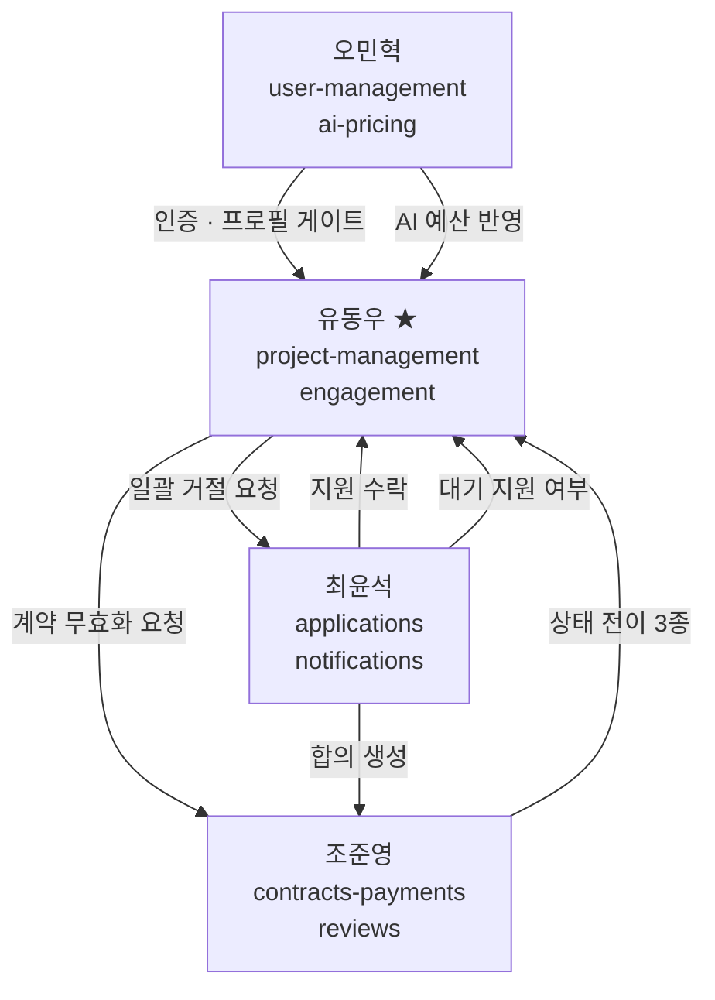

**화살표는 전부 "요청"입니다.** 들어오는 것은 프로젝트 상태를 바꿔달라는 요청이고,
나가는 것은 후처리를 해달라는 요청입니다.

### 데이터 담당 구분

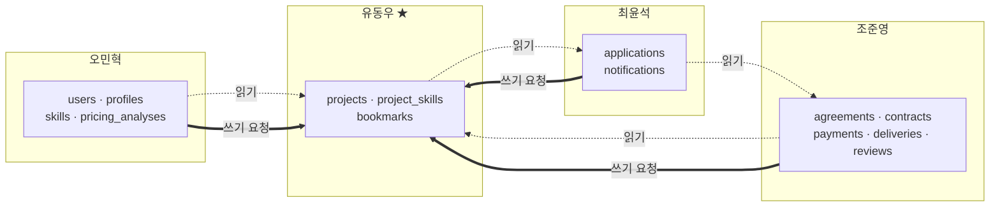

**점선은 읽기, 굵은 실선은 쓰기 요청입니다.** 쓰기는 반드시 담당 도메인이 제공하는 함수를 통합니다.

## 1.5 근거 등급표

| 영역 | 근거 | 비고 |
|---|---|---|
| 3단계 등록 | `RFP-DIRECT` | 위시켓은 7단계지만 RFP가 3단계 명시 |
| **모집 기간 기본값·상한** | `PACTFIVE DESIGN` | RFP 미규정. v1.1에서 신설 (D-01) |
| 등록 중 임시 저장 | `PACTFIVE DESIGN` | 위시켓은 임시 저장을 함. **우리는 반대로 결정** (N-3) |
| 프로필 게이트 | `RFP-DIRECT` | RFP §3.1.3 |
| 상세 화면 구성 | `OBSERVED` + `RFP-DIRECT` | 위시켓 상세 정보 밀도 참고 |
| 검색·필터·정렬·페이지네이션 | `OBSERVED` + `RFP-DIRECT` | 위시켓 필터 구조 참고 |
| **목록 기본 노출 정책** | `PACTFIVE DESIGN` | 위시켓과 다른 선택 (D-08) |
| **카테고리 6종 · 기술 32종** | `RFP-DIRECT` + `PACTFIVE DESIGN` | RFP §3.1.3 통합 지침 + 우리가 실제 목록 작성 (D-12) |
| **시드 데이터 설계** | `RFP-DIRECT` | RFP §7.2 "시연 가능한 시드 데이터 확보" (N-9) |
| 이중 상태 | `RFP-DIRECT` | RFP §3.2.3 |
| 수정 잠금 | `RFP-DIRECT` | RFP §3.2.1 |
| 소프트 삭제 | `RFP-DIRECT` | RFP §3.2.1 |
| **프로젝트 취소 범위** | `BLOCKED + RFP-DIRECT` | 위시켓 계약 화면은 인증 게이트로 확인 불가 |
| 반복 호출 안전성 | `PACTFIVE DESIGN` | 레퍼런스 없음 |
| **북마크 동작 전부** | `PACTFIVE DESIGN` | 위시켓 리서치가 `NOT VERIFIED`로 남김 |
| **추천 규칙 전부** | `PACTFIVE DESIGN` | 위시켓 "유사사례 AI"는 성격이 다름 |

> ⚠️ **engagement(§4)는 위시켓 근거가 가장 약한 영역입니다.** 대부분 RFP + 우리 설계입니다.

**위시켓과 의도적으로 다르게 간 것 3가지**

| 항목 | 위시켓 | PactFive | 이유 |
|---|---|---|---|
| 등록 단계 수 | 7단계 | **3단계** | RFP §3.2.1 |
| 등록 중 임시 저장 | 있음 | **없음** | RFP 미요구 + 상태 오염 + 의도치 않은 데이터 생성 |
| 목록 기본 노출 | 전부 + "마감 제외" 토글 | **모집 가능한 것만** | 프리랜서가 지원 못 하는 것부터 보게 되는 걸 피함 (D-08) |

---

---

# 2. 상태 정본

여기 없는 상태값을 만들지 않습니다. 상태값 정의는 이 장이 정본입니다.

## 2.1 상태 10종

| # | 상태 | 값 | 담당 |
|---|---|---|---|
| 1 | `UserRole` | `CLIENT` · `FREELANCER` | 오민혁 |
| 2 | `RecruitmentStatus` | `SCHEDULED` · `OPEN` · `CLOSED` | **유동우** |
| 3 | `ProjectTransactionStatus` | `NONE` · `CONTRACT_PENDING` · `IN_PROGRESS` · `COMPLETED` · `CANCELED` | **유동우** |
| 4 | `ApplicationStatus` | `PENDING` · `ACCEPTED` · `REJECTED` | 최윤석 |
| 5 | `AgreementStatus` | `PROPOSED` · `ACCEPTED` · `REJECTED` `권장안 확정` | 조준영 |
| 6 | `ContractStatus` | `DRAFT` · `SIGNING` · `SIGNED` · `CANCELED` | 조준영 |
| 7 | `PaymentStatus` | `READY` · `PENDING` · `PAID` · `FAILED` · `RELEASED` · `REFUNDED` | 조준영 |
| 8 | `DeliveryStatus` | `IN_PROGRESS` · `DELIVERY_REQUESTED` · `APPROVED` | 조준영 |
| 9 | `PricingAnalysisReviewStatus` | `PENDING` · `APPROVED` · `REJECTED` | 오민혁 |
| **10** | **`NegotiationStatus`** | `NOT_STARTED` · `NEGOTIATING` · `AGREED` · `REJECTED` — **API 파생값** (D-88) | 조준영 |

### 5번·10번 `CONFIRMED` (D-81 · D-88)

**v6.3에서 확정됐습니다** (D-88). 저장 enum의 정본은 ERD v1.4입니다.

| 문서 | `AgreementStatus` |
|---|---|
| 이 문서 (v6.0까지) | `PENDING` · `ACCEPTED` · `REJECTED` · `SUPERSEDED` · `CANCELED` (5값) |
| **ERD v1.4** | **`PROPOSED` · `ACCEPTED` · `REJECTED` (3값)** |
| **네이밍 컨벤션 v1.4 §9** | **`PROPOSED` · `ACCEPTED` · `REJECTED` (3값)** |

**둘이 같고 하나가 다르므로 다수 쪽으로 맞췄습니다.** 재제안으로 밀려난 제안은 별도 상태값 없이
`negotiation_offer`의 라운드 번호로 판정할 수 있습니다 — **최신 라운드가 아닌 것이 곧 밀려난 것**입니다.
제안 철회(`CANCELED`)는 2차 설계서에 흐름이 없어 MVP 범위에서 뺐습니다.

`NegotiationStatus`는 **DB에 저장하지 않습니다** `CONFIRMED` (D-88). `negotiation_offer`의 최신 라운드와
최종 합의 상태에서 **계산해 내려주는 API 파생값**입니다. 저장 enum을 따로 두면 원본과 사본이 어긋납니다.

> 값 목록은 API 응답에 실리는 이름이고, 저장 enum의 정본은 ERD v1.4입니다.

**이 도메인은 어느 쪽으로 정해져도 깨지지 않습니다.**

| 값 | 프로젝트에 미치는 영향 |
|---|---|
| 최신 활성 제안 | 없음 — `CONTRACT_PENDING` 유지 |
| 재제안으로 밀려남 | **없음** |
| 금액 확정 | 없음 — 계약 서명 단계로 |
| **최종 거절** | **`restorePreContractProject` 호출** |

> 🔑 **재제안이 몇 번 오가든 프로젝트 상태는 바뀌지 않습니다.**
> 프로젝트가 움직이는 것은 **최종 거절 한 지점뿐**이고, 그 지점은 상태값을 무엇이라 부르든 같습니다.
> **이 도메인이 필요로 하는 것은 "최종 거절이 언제인가" 하나뿐입니다.**

`CONFIRMED` — 유사 동의어(`SUCCESS`, `DONE`, `NORMAL`, `ACTIVE`)를 만들지 않습니다.

### 상태값의 정본은 어디인가 `CONFIRMED` (D-52)

같은 상태 목록이 PRD · 네이밍 컨벤션 · ERD 세 곳에 각각 적혀 있어, 어느 쪽이 정본인지 불분명한 상태였습니다.
**역할로 나눕니다.**

| 무엇 | 정본 | 이유 |
|---|---|---|
| **어떤 상태가 존재하고, 무엇에서 무엇으로 갈 수 있는가** | **PRD §2** | 제품 요구사항이다. "계약 대기에서 모집 중으로 돌아갈 수 있다"는 스키마가 아니라 제품이 정한다 |
| 타입명·값 문자열의 표기 규칙 | 네이밍 컨벤션 | `PascalCase` / `UPPER_SNAKE_CASE` · 동의어 금지 · 미국식 철자 |
| 실제 enum 선언 | `schema.prisma` · ERD | 구현체 |

> 위 표의 값 목록은 **PRD가 요구하는 상태의 이름**입니다. 코드에 어떻게 선언할지는 구현이 정하고,
> 값이 추가·변경되면 세 곳이 함께 갱신됩니다. **셋이 어긋나면 §2의 전이 규칙이 기준입니다.**

## 2.2 모집 상태 — `RecruitmentStatus` ★ 유동우 담당

프리랜서가 **지원할 수 있는지 없는지**를 나타냅니다. **외부 목록·상세에 노출되는 유일한 프로젝트 상태**입니다.

| 값 | 사용자에게 | 의미 |
|---|---|---|
| `SCHEDULED` | 모집 예정 | 모집 시작일 전. 목록에는 보이지만 지원 버튼 비활성 |
| `OPEN` | 모집 중 | 지원할 수 있다 |
| `CLOSED` | 모집 마감 | 더 이상 지원할 수 없다. 마감 원인은 사용자에게 구분해 보여주지 않는다 |

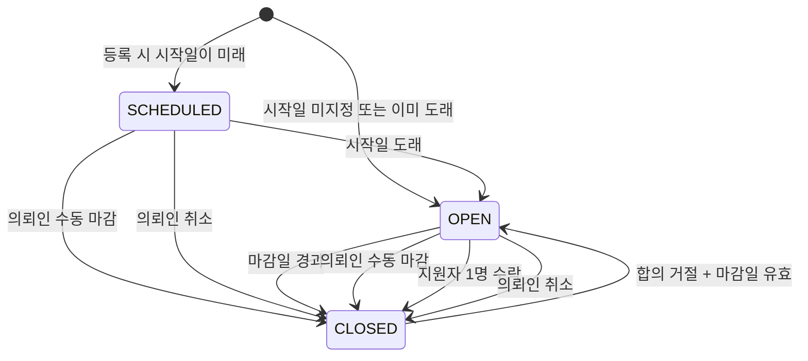

| # | From | To | 트리거 | 주체 | 태그 |
|---|---|---|---|---|---|
| R1 | — | `SCHEDULED` | 등록 시 시작일이 미래 | 의뢰인 | `CONFIRMED` |
| R2 | — | `OPEN` | 등록 시 시작일 미지정 또는 이미 도래 | 의뢰인 | `CONFIRMED` |
| R3 | `SCHEDULED` | `OPEN` | 시작일 도래 (서버 시간 기준) | 시스템 | `CONFIRMED` |
| R4 | `OPEN` | `CLOSED` | 마감일 경과 | 시스템 | `CONFIRMED` |
| R5 | `OPEN` | `CLOSED` | 모집 마감 요청 | 등록 의뢰인 | `CONFIRMED` |
| R6 | `OPEN` | `CLOSED` | 지원 수락 | 최윤석 | `CONFIRMED` |
| R7 | `SCHEDULED` | `CLOSED` | 모집 마감 요청 | 등록 의뢰인 | `ASSUMPTION` (N-4) |
| R8 | `SCHEDULED`·`OPEN` | `CLOSED` | 프로젝트 취소 | 등록 의뢰인 | `DECIDED` (D-04) |
| R9 | `CLOSED` | `OPEN` | 합의 거절 + 마감일 유효 | 조준영 | `CONFIRMED` |

## 2.3 모집 기간 정책 `DECIDED` (D-01)

마감일을 필수로 받고 범위를 제한합니다. 마감 시각이 느슨하면 "마감일이 지났는데 아무도 조회하지 않아 마감 알림이 가지 않는" 상태가 생깁니다.

### 규칙

```text
recruitmentDeadlineAt 은 필수다.

기본값   등록 시점 + 30일
최소     등록 시점 + 1일             DECIDED (D-09)
최대     등록 시점 + 365일
관계     recruitmentStartAt (있으면) < recruitmentDeadlineAt
```

`DECIDED`

| 항목 | 값 | 근거 |
|---|---|---|
| 필수 여부 | **필수** | 마감 없는 프로젝트가 생기면 영원히 목록에 남고 지원자가 계속 쌓임 |
| 기본값 | **30일** | 외주 모집의 통상 주기. 의뢰인이 아무것도 안 정해도 합리적인 값이 잡힘 |
| 상한 | **365일** | 상한이 없으면 10년짜리 프로젝트가 생기고, 마감 감시 대상에 영구히 남음 (N-6) |
| 하한 | **1일** | 너무 짧으면 프리랜서가 발견할 시간이 없다. 강제는 1일까지만 하고, UI에서 **"7일 이상 권장"**을 안내한다 (D-09) |

> **왜 7일을 강제하지 않았나**: 급한 건을 올리는 의뢰인을 막게 됩니다. 그리고 시연에서 "마감 임박" 상태를 만들려면 짧은 기간이 필요합니다.
> 시드 데이터는 직접 주입하므로 이 제약을 우회합니다 (§9.4).

> 상한을 365일로 잡으면 **감시해야 할 마감 시각이 유한한 구간 안에 갇힙니다.**
> 이건 구현 방식을 강제하는 게 아니라, 어떤 방식을 쓰든 작업량이 폭발하지 않게 하는 제품 제약입니다.

### 마감 알림 요구사항

**PRD가 정하는 것**

```text
마감 시각이 지나면, 그 프로젝트에 대기 중이던 지원자 전원이
마감 알림을 받는다.

마감 시각과 알림 발송 사이의 지연은 최대 10분을 넘지 않는다.   RECOMMENDATION
```

**PRD가 정하지 않는 것**: 주기 실행, 큐, 배치 중 무엇을 쓸지 — 구현자 판단

**PRD가 추가로 정하는 것** `DECIDED` (D-35)

```text
마감 전이는 능동 주체가 수행한다.
조회 시점 계산(lazy)은 화면 표시 보정에만 쓰고, 알림 트리거로 쓰지 않는다.
```

이 조건이 없으면 §3.7이 허용한 조회 시점 계산만으로 구현했을 때,
**아무도 조회하지 않은 프로젝트는 상태 전이가 일어나지 않아 알림이 영영 가지 않습니다.**
반대로 마감 직후 여러 명이 동시에 조회하면 각 요청이 각자 후처리를 요청해 **같은 알림이 여러 번** 갑니다.

**발송 사실은 기록합니다** `DECIDED` (D-36) — 개념명 `deadlineNotifiedAt` · 컬럼 대응은 §6.12

| 쓰임 | 판정 |
|---|---|
| 중복 방지 | 값이 있으면 재발송하지 않는다 |
| 미발송 추적 | `recruitmentStatus == CLOSED` **그리고** `deadlineNotifiedAt`이 비어 있으면 미발송 |
| 지연 검증 | `deadlineNotifiedAt − recruitmentDeadlineAt ≤ 10분` |

> 세 번째가 이 컬럼을 두는 주된 이유입니다. 없으면 "10분 이내"는 **확인할 방법이 없는 약속**으로 남습니다.
> 방식(배치·큐·스케줄)은 여전히 구현자가 고릅니다.

### 시간 판단 원칙

```text
판단 기준은 언제나 서버 시간이다.
클라이언트가 보낸 시각을 상태 판단에 쓰지 않는다.
```

- `SCHEDULED`이고 시작일이 지났으면 → 사용자에게 `모집 중`으로 보인다
- `OPEN`이고 마감일이 지났으면 → 사용자에게 `모집 마감`으로 보인다

## 2.4 거래 상태 — `ProjectTransactionStatus` ★ 유동우 담당

계약·결제·납품이 **어디까지 진행됐는지**를 나타냅니다. **비로그인 사용자와 공개 목록에는 노출하지 않습니다.**

| 값 | 사용자에게 | 의미 |
|---|---|---|
| `NONE` | (표시 안 함) | 아직 거래가 시작되지 않음 |
| `CONTRACT_PENDING` | 계약 대기 | 지원자는 정해졌고 금액 합의·계약 서명 진행 중 |
| `IN_PROGRESS` | 작업 중 | 계약 서명과 결제가 모두 끝나 프리랜서가 작업 중 |
| `COMPLETED` | 완료 | 납품 승인과 정산이 모두 끝남 |
| `CANCELED` | 취소 | 결제 전에 의뢰인이 중단함 |

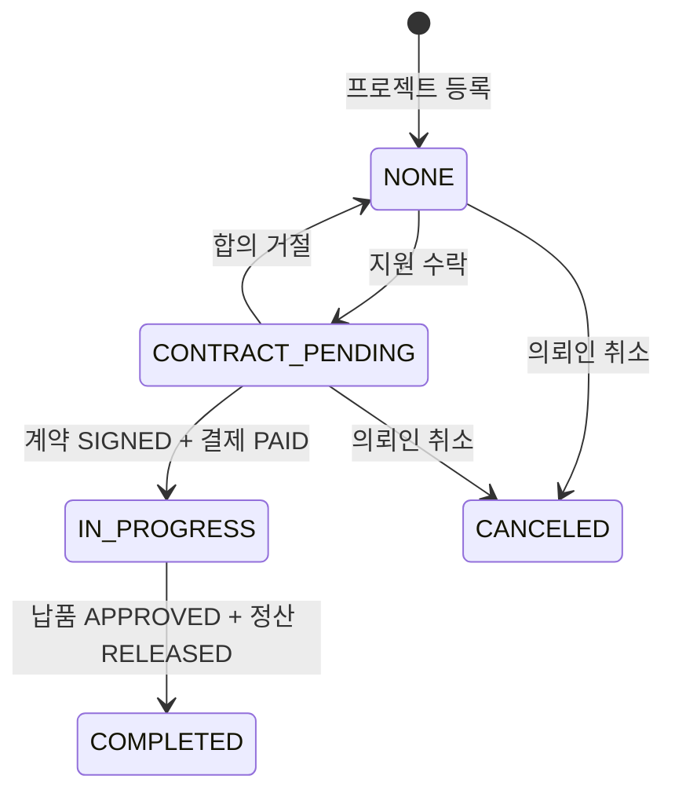

| # | From | To | 트리거 | 계약 함수 | 태그 |
|---|---|---|---|---|---|
| T1 | — | `NONE` | 프로젝트 등록 | — | `CONFIRMED` |
| T2 | `NONE` | `CONTRACT_PENDING` | 지원자 1명 수락 | `acceptProjectApplication()` | `CONFIRMED` |
| T3 | `CONTRACT_PENDING` | `NONE` | 합의 금액 거절 | `restorePreContractProject()` | `CONFIRMED` |
| T4 | `CONTRACT_PENDING` | `IN_PROGRESS` | 계약 `SIGNED` **그리고** 결제 `PAID` | `startProjectTransaction()` | `CONFIRMED` |
| T5 | `IN_PROGRESS` | `COMPLETED` | 납품 `APPROVED` **그리고** 정산 `RELEASED` | `completeProjectTransaction()` | `CONFIRMED` |
| T6 | `NONE` | `CANCELED` | 의뢰인 취소 | `cancelProject()` | `DECIDED` (D-04) |
| **T7** | `CONTRACT_PENDING` | `CANCELED` | 의뢰인 취소 | `cancelProject()` | **`DECIDED` (D-04) — v1.1 신설** |

### T4·T5의 AND 조건이 핵심입니다

```text
계약이 SIGNED가 되었다   →  그것만으로는 IN_PROGRESS가 아니다
결제가 PAID가 되었다      →  그것만으로는 IN_PROGRESS가 아니다
둘 다 되어야 IN_PROGRESS다

납품이 APPROVED가 되었다  →  그것만으로는 COMPLETED가 아니다
정산이 RELEASED가 되었다  →  그것만으로는 COMPLETED가 아니다
둘 다 되어야 COMPLETED다
```

### 취소 가능 경계 `DECIDED` (D-04)

RFP §2.3: *"계약 체결 이전 단계에서만 취소가 가능하며, 계약 체결 이후 단계에서는 정상 완료 또는 환불 흐름을 거쳐야 한다."*

**v1.0은 이를 "지원자 수락 전"으로 좁게 해석했습니다. v1.1은 "결제 전"으로 확정합니다.**

| 현재 상태 | 취소 | 이유 |
|---|---|---|
| `NONE` | ✅ | 아무것도 진행되지 않음 |
| `CONTRACT_PENDING` | ✅ **신설** | 계약서를 쓰는 중이라도 **돈이 오가지 않았다** |
| `IN_PROGRESS` | ❌ | **결제가 완료됨.** 되돌리려면 환불이 필요 → 범위 밖 |
| `COMPLETED` | ❌ | 이미 끝남 |
| `CANCELED` | — | 이미 취소됨. 반복 요청은 성공 처리 |

> 🔑 **경계는 "결제(PAID)"입니다** (N-7).
> 돈이 안 들어갔으면 취소해도 되돌릴 게 없습니다. 돈이 들어갔으면 환불 절차가 필요하고, 그건 RFP가 도전 과제로 분류한 영역입니다.
> `IN_PROGRESS`는 정의상 "결제 완료 + 계약 체결"이므로, `IN_PROGRESS` 진입 = 취소 불가 시점입니다.

## 2.5 두 상태의 조합 규칙

### 허용

| 모집 | 거래 | 상황 |
|---|---|---|
| `SCHEDULED` | `NONE` | 모집 시작 전 |
| `OPEN` | `NONE` | 모집 중 |
| `CLOSED` | `NONE` | 모집만 끝남 (지원자 없음 / 수동 마감 / 합의 거절 후 마감 경과) |
| `CLOSED` | `CONTRACT_PENDING` | 지원자 선정, 계약 진행 중 |
| `CLOSED` | `IN_PROGRESS` | 작업 중 |
| `CLOSED` | `COMPLETED` | 완료 |
| `CLOSED` | `CANCELED` | 취소됨 |

### 금지

```text
OPEN      + CONTRACT_PENDING / IN_PROGRESS / COMPLETED / CANCELED
SCHEDULED + NONE 이외 전부
```

### 조합 매트릭스

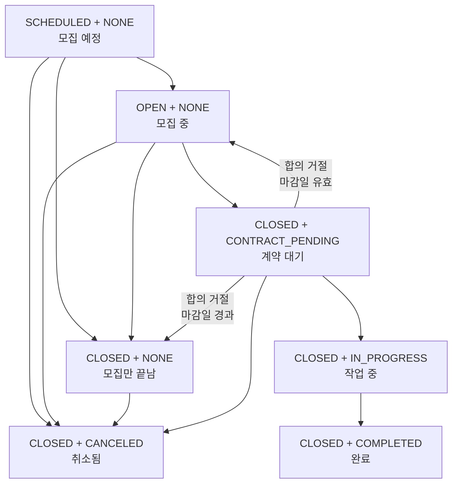

**허용되는 7가지 조합과 그 사이의 이동입니다.** 여기 없는 조합은 만들어지면 안 됩니다.

> 🔑 **`계약 대기 → 모집 중`(S4 → S2)은 합의가 거절됐을 때의 복귀 경로입니다.** (R9 · §5.4 C-04 · RFP §2.3)
> 마감일이 아직 유효하면 모집을 재개하고, 이미 지났으면 `CLOSED`를 유지합니다(S4 → S3).
> **이 두 간선은 하나의 계약 함수가 조건에 따라 갈라지는 것**이지 서로 다른 사건이 아닙니다.

### 한 줄 불변식

```text
transactionStatus != NONE  ⇒  recruitmentStatus == CLOSED
```

`CONFIRMED` — 거래가 시작되면 모집은 반드시 닫혀 있습니다.

## 2.6 혼동 금지 3쌍

### 결제 · 정산 · 완료

| 값 | 무슨 뜻 | 누구 관점 |
|---|---|---|
| `Payment.PAID` | 의뢰인이 플랫폼에 돈을 넣었다 | 의뢰인 |
| `Payment.RELEASED` | 플랫폼이 수수료를 떼고 프리랜서에게 지급 처리했다 | 프리랜서 |
| `Project.COMPLETED` | 이 프로젝트 거래가 끝났다 | 프로젝트 |

```text
PAID ≠ RELEASED ≠ COMPLETED
```

### 세 가지 금액

| 값 | 무슨 뜻 | 정하는 사람 |
|---|---|---|
| `recommendedAmount` | AI가 분석해서 추천한 금액 | AI |
| `budgetAmount` | 의뢰인이 책정한 예산 | 의뢰인 |
| `agreedAmount` | 실제로 합의한 금액 | 양측 |

```text
recommendedAmount ≠ budgetAmount ≠ agreedAmount
```

계약서와 결제에 들어가는 건 `agreedAmount`입니다.

### 모집과 거래

```text
RecruitmentStatus.CLOSED  =  더 이상 지원을 받지 않는다
ProjectTransactionStatus.COMPLETED  =  거래가 끝났다

CLOSED ≠ COMPLETED
```

## 2.7 상태별 변경 담당

**원칙: 어떤 도메인도 다른 도메인의 상태를 직접 UPDATE하지 않는다.**

| 상태 | 변경 담당 | 읽기 |
|---|---|---|
| `UserRole` | 오민혁 | 전원 |
| **`RecruitmentStatus`** | **유동우** | 전원 (공개) |
| **`ProjectTransactionStatus`** | **유동우** | 조준영·최윤석 (내부만) |
| **`budgetAmount`** | **유동우** | 전원 |
| **`bookmarks`** | **유동우** | 유동우 |
| `ApplicationStatus` | 최윤석 | 조준영·유동우 |
| Notification 읽음 | 최윤석 | 최윤석 |
| `AgreementStatus` · `ContractStatus` · `PaymentStatus` · `DeliveryStatus` | 조준영 | — |
| `PricingAnalysisReviewStatus` | 오민혁 | 유동우 (적용 가부) |

## 2.8 상태 노출 규칙

| 화면 | 모집 상태 | 거래 상태 |
|---|---|---|
| 프로젝트 목록 (공개) | ✅ | ❌ 응답에 포함하지 않음 |
| 프로젝트 상세 (공개) | ✅ | ❌ 응답에 포함하지 않음 |
| 추천 프로젝트 섹션 | ✅ | ❌ 응답에 포함하지 않음 |
| 내 프로젝트 (의뢰인 본인) | ✅ | ✅ |
| 내 지원 현황 (해당 프리랜서) | ✅ | ✅ |
| 계약서 상세 (당사자) | ✅ | ✅ |

`CONFIRMED` — RFP §3.2.3

> `transactionStatus`를 **응답 필드에서 빼는 것**이지, 값을 `null`로 채워 보내는 게 아닙니다.

---

---

# 3. project-management

## 3.1 Project 필드 사전

| 필드 | 의미 | 필수 | 등록 후 변경 |
|---|---|---|---|
| `projectId` | 프로젝트 식별자 | 시스템 | 불가 |
| `clientId` | 등록한 의뢰인 | 시스템 | 불가 |
| `title` | 프로젝트 제목 | ✅ | 조건부 |
| `description` | 상세 설명 | ✅ | 조건부 |
| `category` | 활동 분야 (선택형) | ✅ | 조건부 |
| `recruitmentStartAt` | 모집 시작 시각 | ⬜ | 조건부 |
| **`recruitmentDeadlineAt`** | 모집 마감 시각 | **✅ 필수** | 조건부 |
| `budgetAmount` | 의뢰인 책정 예산 (원 단위 정수) | ✅ | 조건부 |
| `skills` | 필요 기술 스택 (다중) | ✅ | 조건부 |
| `recruitmentStatus` | 모집 상태 | 시스템 | 규칙에 따라 |
| `transactionStatus` | 거래 상태 | 시스템 | 규칙에 따라 |
| `createdAt` · `updatedAt` | 생성·수정 시각 | 시스템 | — |
| `deletedAt` | 삭제 시각 | 시스템 | — |

**집계·이력 필드** `DECIDED` (D-37) — ERD v1.1에서 확정

| 필드 | 의미 | 갱신 주체 | 쓰임 |
|---|---|---|---|
| `applicationCount` | **누적** 지원 수 | 최윤석 | **표시용.** 목록 카드·상세의 "지원자 수" |
| **`pendingApplicationCount`** | **대기 중(`PENDING`)** 지원 수 | 최윤석 | **잠금 판정용** (§3.4) |
| `recruitmentClosedAt` | 모집이 닫힌 시각 | 유동우 | 마감 이력 |
| `canceledAt` | 취소된 시각 | 유동우 | 취소 이력 · I-29 판정 |
| `deadlineNotifiedAt` | 마감 알림 발송 시각 | 유동우 | 중복 방지 · 미발송 추적 · 지연 검증 (§2.3) |
| **`acceptedApplicationId`** | 수락된 지원 식별자 | 유동우 | C-01 멱등 판정 (D-41) · I-10 |
| **`paymentPendingAt`** | 결제 시작 통보 시각 | 유동우 | 결제 진행 중 취소 차단 (D-40) `CONFIRMED` |
| **`projectVersion`** | 상태 변경 횟수 (정수, 시작 1) | 유동우 | **낙관적 잠금** (D-53) |

**`projectVersion`이 필요한 이유** `DECIDED` (D-53)

금액합의 2차 설계에서 **재제안·수락·최종 거절·프로젝트 취소가 동시에 일어날 수 있게** 됐습니다.
호출자가 "내가 본 시점의 프로젝트"를 지정할 수단이 없으면, 늦게 도착한 요청이 이미 바뀐 상태 위에서 성공합니다.

| | |
|---|---|
| 증가 시점 | `recruitmentStatus` 또는 `transactionStatus`가 **바뀔 때만** +1 |
| 증가하지 않는 것 | **제목·설명·예산 등 일반 필드 수정** |
| 사용법 | 요청에 `expectedProjectVersion`을 넣으면 불일치 시 `409 PROJECT_VERSION_CONFLICT` |

> 일반 필드 수정으로 증가시키면, 협상 중 의뢰인이 설명 한 줄 고쳤다는 이유로
> 조준영 쪽 수락 요청이 409로 튕깁니다. **상태 전이만 센다는 것이 이 필드의 정의입니다.**

> ⚠️ **`applicationCount`와 `pendingApplicationCount`는 서로 다른 숫자입니다.**
> 지원 3건이 들어왔다가 전부 거절되면 누적은 `3`, 대기 중은 `0`입니다.
> **화면에 보이는 것은 누적이고, 잠금을 판정하는 것은 대기 중입니다.** 섞으면 §3.4가 깨집니다.
> 두 컬럼 모두 §0.2 #22의 집계 캐시 예외 대상입니다.

> `projects`에 `status`라는 단일 필드는 **존재하지 않습니다.** `CONFIRMED`
> `description`은 AI 단가 분석의 입력이기도 합니다. 너무 짧으면 분석 품질이 떨어집니다.

### 마감 시각 제약 `DECIDED` (D-01)

```text
필수
기본값   등록 시점 + 30일
최대     등록 시점 + 365일
최소     등록 시점 + 1일
UI 안내  "모집 기간은 7일 이상을 권장합니다"
```

### 금액 · 시각 표현

```text
통화: KRW 고정 (MVP)          단위: 원 단위 정수. 소수점 없음
저장·판단: UTC 기준            API 표현: ISO 8601
사용자 표시: 한국 시간
```

## 3.2 등록 — 3단계 퍼널

RFP §3.2.1이 3단계를 명시합니다. 한 번에 다 받지 않는 이유는 **의뢰인이 예산 단계에서 막히는 경우가 많고, 그때 AI 단가 분석으로 빠질 수 있어야 하기 때문**입니다.

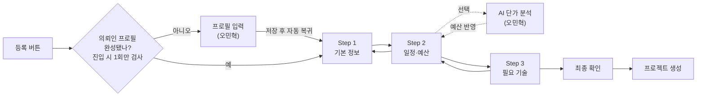

### 진입 조건 — 프로필 게이트 `DECIDED` (D-03)

**이게 무슨 뜻인지 — 시나리오로**

RFP §3.1.3은 가입할 때 프로필을 강제로 받지 않습니다. 필요해지는 순간에 받습니다.

```text
1. 김의뢰 씨가 이메일로 가입한다.
   이름·이메일·비밀번호만 넣었고 회사명은 안 넣었다.       ← RFP가 이걸 허용함

2. 며칠 뒤 "프로젝트 등록"을 누른다.

3. 서비스가 막는다.
   "프로젝트를 등록하려면 회사 정보가 필요합니다"
   → 프로필 입력 화면으로 보낸다

4. 김의뢰 씨가 회사명을 넣고 저장한다.

5. ★ 여기가 문제였다 ★
   나쁜 경우:  홈 화면이나 마이페이지로 감
              김의뢰 씨: "어? 나 프로젝트 등록하려던 건데?"
              메뉴를 다시 찾아서 처음부터 시작해야 함

   좋은 경우:  자동으로 프로젝트 등록 화면으로 돌아옴
              김의뢰 씨는 하려던 일을 그대로 이어감
```

**RFP가 요구하는 건 좋은 경우입니다.**

> RFP §3.1.3: *"프로필 입력 페이지로 유도한 뒤 **원래 액션으로 복귀**시킵니다"*
> RFP §7.3: *"프로필 완성 유도 화면 같은 **차단형 흐름은 원래 액션으로 복귀시키는 UX 보장**"*

**v1.0이 물었던 것과 v1.1이 정하는 것**

| | |
|---|---|
| v1.0의 질문 | "돌아올 곳을 어떻게 기억하나? 쿼리 파라미터? 세션?" |
| **왜 잘못됐나** | **그건 구현 방법입니다.** PRD가 물을 질문이 아닙니다 |
| v1.1의 요구사항 | **"프로필 저장이 끝나면 사용자는 원래 하려던 화면에 서 있어야 한다"** |

**대신 PRD가 정해야 하는 게 하나 있습니다** `DECIDED`

```text
프로필 검사는 등록 화면에 들어가는 시점에 한 번만 한다.
1단계·2단계·3단계 중간에는 다시 검사하지 않는다.
```

**왜?** 2단계까지 다 채웠는데 갑자기 프로필 화면으로 튕기면, 돌아왔을 때 입력한 내용이 어떻게 되는지가 문제가 됩니다. 진입 시점에 한 번만 검사하면 그 상황 자체가 생기지 않습니다.

**진입 조건표**

| 조건 | 동작 |
|---|---|
| 비로그인 | 로그인 화면으로 이동 → 로그인 후 등록 화면 복귀 |
| 프리랜서 역할 | 등록 불가 안내. 프로젝트 목록으로 유도 |
| 의뢰인 + 필수 프로필 미완성 | 프로필 화면 → **저장 후 등록 화면 자동 복귀** |
| 의뢰인 + 프로필 완성 | Step 1 진입 |

`CONFIRMED` — RFP §3.1.3

> 프로필 완성 판정과 프로필 화면은 오민혁 담당입니다. project-management는 **어디로 돌아와야 하는지를 전달하고 복귀시키는 것**만 담당합니다.

### Step 1 — 기본 정보

| 필드 | 입력 형태 | 검증 |
|---|---|---|
| `title` | 한 줄 텍스트 | 비어 있으면 안 됨 · 지나치게 짧거나 길면 안 됨 |
| `description` | 여러 줄 텍스트 | 비어 있으면 안 됨 · AI 분석이 의미 있을 최소 길이 필요 |
| `category` | 목록에서 선택 | **정의된 6종 중 하나** — §8.1 |

카테고리는 자유 입력이 아닙니다. 목록에 없는 값은 거부합니다.

### Step 2 — 일정 · 예산

| 필드 | 입력 형태 | 검증 |
|---|---|---|
| `recruitmentStartAt` | 날짜·시각 (선택) | 비워두면 즉시 모집 시작 |
| **`recruitmentDeadlineAt`** | 날짜·시각 | **필수 · 기본값 30일 뒤가 미리 채워짐** · **최소 1일 · 최대 365일** · 시작일보다 뒤 |
| `budgetAmount` | 숫자 | 필수 · 0보다 큼 · 정수 |

**마감일 입력 UX** `DECIDED` (D-01)

```text
화면에 들어오면 마감일 칸에 "오늘 + 30일"이 미리 채워져 있다.
의뢰인이 그대로 두면 30일짜리 모집이 된다.
바꾸고 싶으면 바꾸되, 1년을 넘길 수는 없다.
```

의뢰인이 "얼마나 열어둬야 하지?"를 고민하지 않아도 되게 만드는 게 목적입니다.

**이 단계에서 AI 단가 분석으로 나갈 수 있습니다.** 분석 결과를 반영하면 `budgetAmount`가 채워진 채로 돌아옵니다.

**시간 순서 규칙**

```text
recruitmentStartAt (있다면)  <  recruitmentDeadlineAt
now + 1일  <=  recruitmentDeadlineAt  <=  now + 365일
```

위반 시 등록을 거부하고 어느 값이 문제인지 알려줍니다.

### Step 3 — 필요 기술 + 최종 확인

| 필드 | 입력 형태 | 검증 |
|---|---|---|
| `skills` | 목록에서 다중 선택 | 최소 1개 · **정의된 32종 중에서만** — §8.2. **자유 입력 불가** |

- 기술 스택 목록은 **너무 세분화하지 않습니다.** (MySQL·PostgreSQL을 개별로 두지 않고 SQL로 통합) `CONFIRMED` — RFP §3.1.3
- 마지막에 1~3단계 입력값을 모두 보여주고 각 단계로 돌아갈 수 있게 합니다.

### 단계 이동과 중간 이탈

| 상황 | 동작 | 태그 |
|---|---|---|
| "이전" | 앞 단계로. 입력값 유지 | `CONFIRMED` |
| "다음" | 현재 단계 검증 통과해야만 이동 | `CONFIRMED` |
| 새로고침 / 중간 이탈 | 브라우저 안에서만 유지. **서버에 임시 저장하지 않음** | `ASSUMPTION` (N-3) |
| 최종 제출 실패 | 3단계 화면에 머무르고 실패 원인 표시. 입력값 유지 | `CONFIRMED` |
| **프로필 게이트** | **1~3단계 중간에는 발생하지 않음 (진입 시 1회 검사)** | `DECIDED` (D-03) |

**임시 저장을 하지 않는 이유** `PACTFIVE DESIGN`

| 근거 | 내용 |
|---|---|
| RFP 미요구 | RFP §3.2.1은 3단계 입력 퍼널만 명시 |
| 상태 모델 오염 | 서버에 "미완성 프로젝트"가 생기면 목록·검색·상태 전이·삭제 전부에 예외 처리 필요 |
| 실제 사고 사례 | 위시켓 리서치 중 조사자가 2단계로 넘어가는 것만으로 **빈 임시 저장 프로젝트가 생성됨** |

### 생성 결과

```text
recruitmentStatus = 시작일이 미래면 SCHEDULED, 아니면 OPEN
transactionStatus = NONE
deletedAt         = 없음
```

등록 성공 시 방금 만든 프로젝트 상세로 이동합니다. `RECOMMENDATION`

## 3.3 조회

### 공개 응답에 포함

```text
projectId · title · description · category
budgetAmount · skills
recruitmentStartAt · recruitmentDeadlineAt
recruitmentStatus
의뢰인 공개 정보 (이름 · 회사명 · 프로필 이미지 · 평균 별점)
지원자 수
```

### 공개 응답에 절대 포함되지 않음

```text
transactionStatus · deletedAt
지원자 개인 정보 / 지원서 내용 · 계약 정보 · 결제 정보
```

`CONFIRMED` — RFP §3.2.3

### 내부 응답 (의뢰인 본인의 내 프로젝트)

공개 응답 + `transactionStatus`

### 상세 화면 구성

RFP §3.2.1: *"프로젝트 정보 + 지원자 수 + 상태 + 하단 추천 프로젝트 섹션"*

| 영역 | 내용 | 담당 |
|---|---|---|
| 본문 | 제목·설명·카테고리·예산·기술·일정 | 유동우 |
| 상태 배지 | 모집 상태 | 유동우 |
| 지원자 수 | 숫자 | 최윤석이 제공 |
| CTA | 지원 / 북마크 / 수정 / 마감 / 취소 (역할별) | B·C |
| 하단 | 추천 프로젝트 4건 (SCR-B09) | 유동우 |

### CTA 노출 규칙

| 보는 사람 | 모집 중 | 모집 마감 |
|---|---|---|
| 비로그인 | "로그인하고 지원하기" | 지원 불가 안내 |
| 프리랜서 (미지원) | 지원하기 · 북마크 | 지원 불가 안내 · 북마크 가능 |
| 프리랜서 (이미 지원) | 내 지원 현황 보기 · 북마크 | 내 지원 현황 보기 · 북마크 |
| 의뢰인 (타인 프로젝트) | 없음 | 없음 |
| 의뢰인 (본인 프로젝트) | 수정 · 모집 마감 · 지원자 관리 · 취소 | 지원자 관리 · (계약 대기면) 취소 |

`RECOMMENDATION` — 화면 배치는 자유, 조건은 유지

## 3.4 수정 — 잠금 규칙 `DECIDED` (D-02 + D-07) — 전면 재작성

### 규칙은 한 문장입니다

```text
대기 중인 지원(PENDING)이 1건이라도 있으면
예산과 일정은 잠긴다.
```

`DECIDED`

**대기 중인 지원이 0건이면 열립니다.** 지원이 한 번도 없었든, 있었는데 전부 거절됐든 마찬가지입니다.

### 왜 "대기 중"인가 — 이 표현이 모든 경우를 해결합니다

v1.0은 이 규칙을 두 번 따로 다뤘습니다. 그리고 두 번째에서 결론을 잘못 냈습니다.

| 상황 | v1.0 | **v1.1** |
|---|---|---|
| 지원 3건 들어옴 | 잠금 | 잠금 (PENDING 3건) |
| 그중 1건 수락 → 나머지 자동 거절 | 잠금 | 잠금 (거래 단계 진입, 모든 수정 금지) |
| 합의 깨져서 재모집 | **잠금 유지 (틀림)** | **열림 (PENDING 0건)** |
| 재모집 후 새 지원 들어옴 | — | 잠금 (PENDING 1건) |
| 지원 3건이 전부 직접 거절됨 | 애매 | 열림 (PENDING 0건) |

**재모집 시점에는 대기 중인 지원이 없습니다.** 수락된 1명은 합의 거절로 `REJECTED`가 됐고, 나머지는 이미 자동 거절됐습니다.
그래서 **"대기 중인 지원 존재" 하나로 D-02와 D-07이 동시에 만족됩니다.**

> 🔑 협상이 깨지는 이유는 대개 **금액**입니다. 금액 때문에 깨졌는데 금액을 못 바꾸면 같은 일이 반복됩니다.
> 그리고 그때 조건 변경에 영향받을 사람이 아무도 없습니다. 전부 이미 탈락했으니까요.

### 수정 허용표

| 프로젝트 상태 | 대기 중 지원 | `title` `description` `category` `skills` | `budgetAmount` `recruitmentStartAt` `recruitmentDeadlineAt` |
|---|---|---|---|
| `SCHEDULED`/`OPEN` + `NONE` | **0건** | ✅ | **✅** |
| `SCHEDULED`/`OPEN` + `NONE` | **1건 이상** | ✅ | **❌** |
| `CLOSED` + `NONE` | 무관 | ❌ | ❌ |
| `CLOSED` + `CONTRACT_PENDING` | 무관 | ❌ | ❌ |
| `CLOSED` + `IN_PROGRESS` | 무관 | ❌ | ❌ |
| `CLOSED` + `COMPLETED` | 무관 | ❌ | ❌ |
| `CLOSED` + `CANCELED` | 무관 | ❌ | ❌ |

`CONFIRMED` (RFP §3.2.1) + `DECIDED` (잠금 조건 정의)

### AI 예산 반영에도 같은 규칙이 적용됩니다 (N-2)

`applyPricingAnalysisBudget()`도 결국 `budgetAmount`를 바꾸는 동작입니다.
따라서 **대기 중인 지원이 1건 이상이면 AI 분석 결과도 예산에 반영할 수 없습니다.**

`ASSUMPTION` — 연결하지 않으면 "직접 수정은 막히는데 AI 경유는 뚫리는" 우회로가 생깁니다.

### 판정 데이터는 어떻게 얻나 — PRD가 정하지 않습니다 `DECIDED` (D-02)

대기 중인 지원 정보는 **최윤석 담당(`applications`)입니다.**
직접 조회할지, 캐시 컬럼을 읽을지, 이벤트로 받을지는 구현 방식이므로 이 문서에서 정하지 않습니다.

**PRD가 요구하는 것은 이것뿐입니다.**

```text
대기 중인 지원이 생긴 시점 이후의 예산·일정 수정 요청은 반드시 거부된다.
판정이 실제 상태보다 느슨해서는 안 된다.
```

**다만 무엇을 근거로 판정하는지는 정합니다** `DECIDED` (D-38)

| | |
|---|---|
| 판정 근거 | **`pendingApplicationCount` (대기 중 지원 수)** |
| 쓰면 안 되는 값 | **`applicationCount` (누적 지원 수)** — 표시용입니다 |
| 조회 실패 시 | **잠금을 유지한 채 실패로 응답한다.** `0`으로 간주하지 않는다 |

> 🔴 **누적 수로 판정하면 재모집 후 잠금이 풀리지 않습니다.**
> 합의 거절로 모집이 재개되면 대기 중은 `0`이지만 누적은 그대로입니다.
> 그러면 §5.4 C-04가 보장한 "재개된 프로젝트는 예산을 다시 조정할 수 있다"가 깨집니다.
>
> 🔴 **조회 실패를 `0`으로 폴백하면 잠금이 통째로 열립니다.**
> 지원자가 대기 중인 프로젝트의 예산이 수정될 수 있고, 프리랜서는 자기가 동의한 적 없는 조건으로 심사받게 됩니다.
> 표시용 값의 폴백 규칙(§13.5)을 판정에 그대로 쓰면 안 되는 이유입니다.

느슨하면 안 되는 이유는 명확합니다. **막아야 할 수정이 통과하면 프리랜서가 자기가 동의한 적 없는 조건으로 심사받게 됩니다.**
어떤 방식으로 그 정확성을 보장할지는 구현 시점에 정합니다.

### 수정 불가 상황의 사용자 경험

| 상황 | 사용자에게 |
|---|---|
| 대기 중 지원이 있는데 예산 수정 | 입력란을 비활성화하고 "지원자가 있어 예산과 일정은 변경할 수 없습니다" |
| 마감된 프로젝트 수정 | 수정 버튼 자체를 노출하지 않음. 직접 접근 시 안내 후 상세로 |
| **재모집된 프로젝트** | **예산·일정 입력란이 다시 활성화됨.** "조건을 조정해 다시 모집할 수 있습니다" 안내 `RECOMMENDATION` |
| 남의 프로젝트 수정 | 권한 없음 안내 |

**규칙**: 막을 거면 **버튼을 눌러보고 실패하게 두지 말고 처음부터 비활성화**합니다. 다만 서버는 항상 다시 검증합니다.

## 3.5 삭제 (소프트 삭제)

RFP §3.2.1: *"삭제: 소프트 딜리트만 허용 (물리 삭제 금지)"* `CONFIRMED`

### 조건

```text
요청자가 해당 프로젝트의 의뢰인 본인
transactionStatus == NONE
대기 중인 지원 0건                    ← DECIDED (D-28) · 정합성 감사 발견 #1
```

거래가 시작된 프로젝트는 삭제할 수 없습니다. 계약과 결제 이력이 참조 중입니다.

**대기 중인 지원이 1건이라도 있으면 삭제할 수 없습니다.** `DECIDED` (D-28)

| 근거 | 내용 |
|---|---|
| 삭제의 의미 | 삭제는 **"아무 일도 없었던 것처럼"** 치우는 동작이다. 누군가 시간을 들여 지원했다면 없었던 일이 아니다 |
| 지원자가 방치된다 | 삭제하면 그 지원들이 영원히 `PENDING`으로 남는다. 지원자는 결과를 영영 못 받는다 |
| 취소가 이미 그 자리를 맡고 있다 | 취소는 대기 지원 일괄 거절 + 알림이 붙어 있다 (§3.7) |
| §3.4와 같은 철학 | **지원이 들어온 순간부터 의뢰인의 자유가 줄어든다** |

**사용자에게는 이렇게 보입니다.**

```text
대기 지원 0건   →  [삭제] 버튼 노출
대기 지원 ≥1건  →  [삭제] 버튼 숨김. 대신 [프로젝트 취소]가 보임
```

> **삭제와 취소는 다릅니다.**
> 삭제 = 없던 일로 하고 목록에서 치움 (`NONE`일 때만)
> 취소 = 진행하던 거래를 중단하고 기록을 남김 (`NONE`·`CONTRACT_PENDING`)

### 삭제 후

| 대상 | 결과 |
|---|---|
| 공개 목록 | 나타나지 않음 |
| 공개 상세 | 없는 것으로 처리 |
| 추천 프로젝트 | 후보에서 제외 |
| 내 북마크 목록 | 목록에서 제외 (북마크 데이터는 남김) |
| 이미 제출된 지원서 | **지우지 않음.** "내 지원 현황"에 남음 |

프리랜서에게는 **"의뢰인이 삭제한 프로젝트"**임을 알려줍니다. 표시 문구는 최윤석와 맞춥니다. `ASSUMPTION`

## 3.6 탐색

### 진입 경로

RFP §3.2.2가 셋을 명시합니다.

```text
헤더 메뉴  ·  메인 페이지 검색창  ·  메인 페이지 카테고리 버튼
```

셋 다 같은 목록 화면으로 들어가되, 검색어나 카테고리가 미리 적용된 상태여야 합니다.

### 검색 · 필터 · 정렬 항목

| 구분 | 항목 | 동작 |
|---|---|---|
| 검색 | `keyword` | `title`과 `description`에서 찾음 |
| 필터 | `category` | 카테고리 일치 |
| 필터 | `skills` | 선택한 기술을 **하나라도 포함** |
| 필터 | `minBudget` · `maxBudget` | 예산 범위 |
| 필터 | `recruitmentStatus` | 모집 예정 / 모집 중 / 마감 |
| 필터 | `deadlineBefore` | 이 날짜 이전 마감 |
| 정렬 | `sortBy` + `sortOrder` | 아래 3종 |
| 페이지 | `page` · `pageSize` | 기본 10개 |

`CONFIRMED` — RFP §3.2.2

**여러 필터를 동시에 걸면 전부 만족하는 것만 나옵니다 (AND).** 단, `skills`는 그 안에서만 "하나라도 포함(OR)"입니다.

### 목록 기본 노출 정책 `DECIDED` (D-08)

```text
모집 상태 필터를 지정하지 않으면
모집 예정 + 모집 중인 프로젝트만 나온다.
마감된 프로젝트는 나오지 않는다.
```

`DECIDED`

| 요청 | 결과 |
|---|---|
| 필터 없음 (기본) | 모집 예정 + 모집 중 |
| `recruitmentStatus=OPEN` | 모집 중만 |
| `recruitmentStatus=CLOSED` | **마감만** — 명시 선택 시에는 볼 수 있어야 함 (RFP §3.2.2가 3종 필터를 요구) |
| `recruitmentStatus` 전체 선택 | 전부 |

**왜 이렇게 정했나**

프로젝트 목록의 목적은 **프리랜서가 지원할 곳을 찾는 것**입니다. 첫 화면에 지원할 수 없는 것들이 섞여 있으면 목적에 어긋납니다.
위시켓은 전부 보여주고 "모집 마감 제외" 토글을 따로 두는데(`OBSERVED`), 우리는 **처음부터 안 보여주는 쪽**을 택했습니다.

**보조 아이디어** `RECOMMENDATION`

검색 결과가 적어 화면에 여백이 생기면, 하단에 별도 섹션으로 **"이미 마감된 비슷한 프로젝트"**를 참고용으로 보여줄 수 있습니다.
목록 본문에 섞지 않고 시각적으로 분리하는 것이 조건입니다.

### 정렬 3종

| 사용자에게 | 기준 |
|---|---|
| 최신순 (기본) | 등록이 최근인 것부터 |
| 마감임박순 | 마감일이 가까운 것부터 |
| 예산 높은순 | 예산이 큰 것부터 |

`CONFIRMED`

**정렬 안정성 요구** `PACTFIVE DESIGN`

같은 값이 여러 건일 때 순서가 요청마다 달라지면, 페이지를 넘길 때 같은 프로젝트가 두 번 나오거나 아예 빠집니다.

```text
정렬 기준이 같을 때의 2차 기준을 반드시 둔다.
예: 마감임박순 → 마감일 오름차순, 같으면 등록 최신순, 같으면 식별자순
```

### 목록에서 항상 제외

```text
deletedAt이 있는 프로젝트
```

### 페이지네이션

```text
기본 페이지당 10개
```

`CONFIRMED` — 무한 스크롤 / 번호형 둘 다 허용

응답에는 현재 페이지 목록과 함께 **전체 건수**가 있어야 합니다.

### 결과가 없을 때

에러가 아닙니다. 빈 목록을 정상 응답으로 돌려주고 "조건에 맞는 프로젝트가 없습니다 + 필터 초기화"를 보여줍니다.

## 3.7 상태 관리 동작

### 시간 기반 보정

```text
사용자가 프로젝트를 볼 때, 그 시점의 서버 시간 기준으로 올바른 상태를 본다.
```

요청 시점 계산으로 할지 배치로 할지는 구현자 판단입니다. 마감 알림 요구사항은 §2.3 참조.

### 수동 모집 마감

| 항목 | 내용 |
|---|---|
| 누가 | 해당 프로젝트의 의뢰인 본인만 |
| 언제 | 모집 상태가 `SCHEDULED` 또는 `OPEN`일 때 |
| 결과 | `recruitmentStatus = CLOSED` |
| 부수 효과 | 대기 중 지원 일괄 거절 + 지원자 전원 알림 (최윤석 수행) |
| **이미 마감된 걸 또 마감하면** | **성공으로 처리한다. 에러가 아니다** |

`CONFIRMED`

### 프로젝트 취소 `DECIDED` (D-04) — 확대

| 항목 | 내용 |
|---|---|
| 누가 | 해당 프로젝트의 의뢰인 본인만 |
| 언제 | `transactionStatus`가 `NONE` **또는 `CONTRACT_PENDING`**일 때 |
| 결과 | `transactionStatus = CANCELED`, `recruitmentStatus = CLOSED` |
| `IN_PROGRESS` 이후 | 거부 — 결제가 완료됐으므로 환불 흐름이 필요 (범위 밖) |

### 취소 시점별 부수 효과

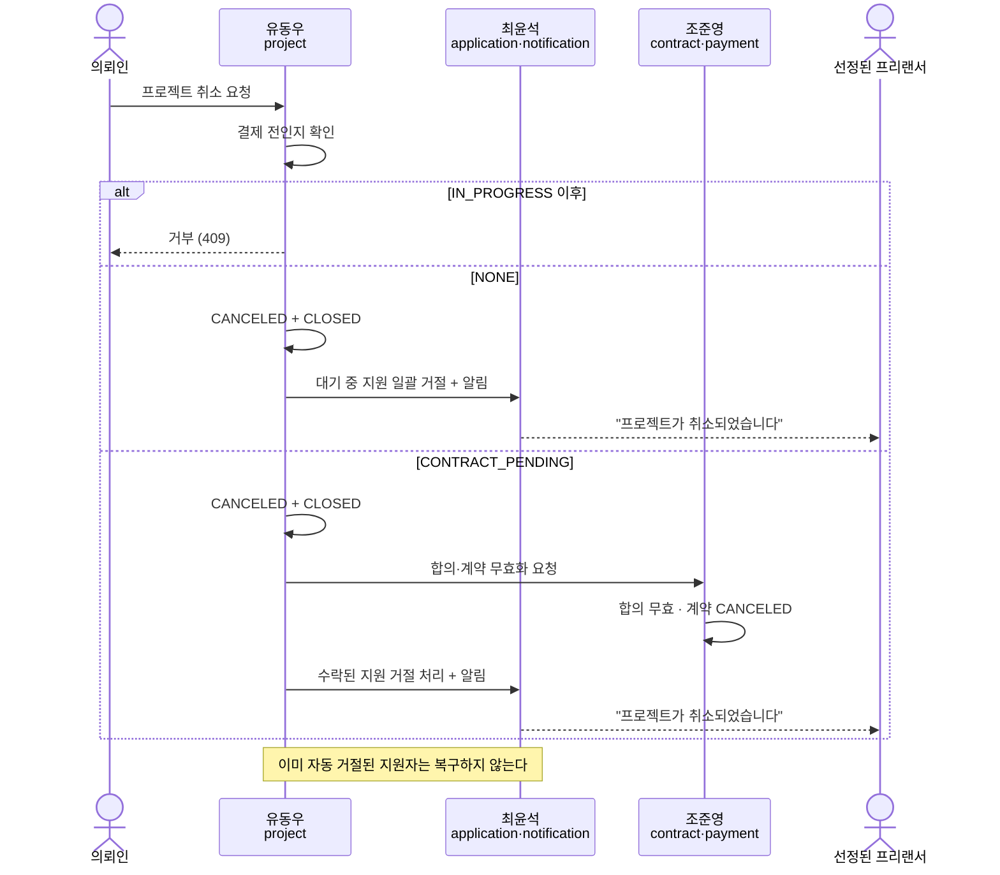

| 취소 시점 | 프로젝트 | 지원서 | 합의·계약 | 알림 |
|---|---|---|---|---|
| `NONE` (모집 중) | `CANCELED` + `CLOSED` | 대기 중 전부 거절 | — | 지원자 전원 |
| `CONTRACT_PENDING` | `CANCELED` + `CLOSED` | 수락된 건도 거절 | 합의 무효 · 계약 `CANCELED` (D-11) | **선정된 프리랜서** (D-10) |

**이미 자동 거절된 지원자는 복구하지 않습니다.** 합의 거절 정책과 일관됩니다. `CONFIRMED`

### 취소 후 상대방이 서명을 누르면 — 낙관적 취소 `DECIDED` (D-04)

의뢰인이 취소하는 순간 프로젝트는 바로 취소됩니다. **프리랜서의 서명을 기다리지 않습니다.**

```text
프리랜서가 계약서 화면에서 "서명" 또는 "확인"을 누른다
  ↓
서비스가 프로젝트 상태를 확인한다
  ↓
이미 CANCELED다
  ↓
"프로젝트가 취소되었습니다." 안내를 보여주고 진행을 멈춘다
```

**이 패턴을 택한 이유**: 취소하려는 사람이 상대방의 응답을 기다려야 한다면 취소가 아닙니다.
"취소했는데 상대가 서명해서 계약이 성립"하는 상황이 절대 생기면 안 됩니다.

> 계약 화면의 안내 문구와 이후 동선은 조준영 담당입니다. project-management는 **상태를 정확히 그 시점에 바꾸는 것**만 담당합니다.

### 합의 거절 후 모집 재개

```text
조건: 합의 거절  AND  recruitmentDeadlineAt > now  AND  삭제되지 않음
결과: transactionStatus = NONE,  recruitmentStatus = OPEN

마감일이 이미 지났으면: CLOSED + NONE 유지
```

`CONFIRMED` — RFP §2.3

**재개 후 예산·일정을 조정할 수 있습니다.** `DECIDED` (D-07)
재개 시점에는 대기 중인 지원이 0건이므로 §3.4의 잠금 규칙이 자동으로 풀립니다.

### 다른 도메인이 요청하는 상태 변경

| 요청자 | 동작 | 결과 |
|---|---|---|
| 최윤석 | 지원 수락 | `CLOSED` + `CONTRACT_PENDING` |
| 조준영 | 계약·결제 완료 | `IN_PROGRESS` |
| 조준영 | 납품 승인·정산 완료 | `COMPLETED` |
| 조준영 | 합의 거절 | `NONE` (+ 마감 전이면 `OPEN` 재개) |
| 오민혁 | AI 예산 반영 | `budgetAmount` 갱신 |

## 3.8 권한

| 동작 | 비로그인 | 프리랜서 | 의뢰인(타인) | 의뢰인(본인) |
|---|---|---|---|---|
| 목록 조회 | ✅ | ✅ | ✅ | ✅ |
| 상세 조회 (공개 필드) | ✅ | ✅ | ✅ | ✅ |
| 상세 조회 (거래 상태 포함) | ❌ | ❌ | ❌ | ✅ |
| 등록 | ❌ | ❌ | ✅ | — |
| 수정 | ❌ | ❌ | ❌ | ✅ |
| 삭제 | ❌ | ❌ | ❌ | ✅ |
| 모집 마감 | ❌ | ❌ | ❌ | ✅ |
| 취소 | ❌ | ❌ | ❌ | ✅ |
| 내 프로젝트 목록 | ❌ | ❌ | ❌ | ✅ |

`CONFIRMED`

**판정 3단계**

```text
1. 로그인했는가        →  아니면 401
2. 역할이 맞는가        →  아니면 403
3. 이 리소스의 주인인가  →  아니면 403
```

**프로젝트가 없으면 404가 먼저**입니다. 삭제된 프로젝트도 404입니다.

> 예외 하나: **삭제(A-05)의 반복 호출만 `204`**입니다. 요청자가 원한 상태(삭제됨)가 이미 이뤄져 있기 때문입니다.
> 조회·수정·마감·취소에서 삭제된 프로젝트는 전부 404입니다.

**응답 코드로 존재 여부가 드러나는 것에 대해** `권장안 확정` (D-47)

이 순서에서는 남의 프로젝트에 수정을 시도하면 `403`, 없는 식별자면 `404`가 옵니다.
따라서 **식별자를 순차로 훑으면 어떤 식별자가 실재하는지 알 수 있습니다.**

| | |
|---|---|
| 판단 | **MVP 범위에서 수용한다.** 프로젝트 목록 자체가 공개이므로 유출되는 정보의 가치가 낮다 |
| 완화 | 식별자를 ULID로 두어 순차 추측이 불가능하다 (ERD E-02) |
| 바꾸려면 | 쓰기 계열(수정·삭제·마감·취소)에서 권한 없음도 `404`로 통일한다. **임의로 바꿔도 된다** |

> 발표에서 보안 질문이 나오면 **"인지했고 MVP 범위에서 수용했다"**가 답이 됩니다. 모르고 지나간 것과 다릅니다.

## 3.9 API

| 동작 | 엔드포인트 | 인증 |
|---|---|---|
| 등록 | `POST /api/v1/projects` | 의뢰인 |
| 목록·검색 | `GET /api/v1/projects` | 불필요 |
| 상세 | `GET /api/v1/projects/:projectId` | 불필요 |
| 수정 | `PATCH /api/v1/projects/:projectId` | 등록 의뢰인 |
| 삭제 | `DELETE /api/v1/projects/:projectId` | 등록 의뢰인 |
| 모집 마감 | `POST /api/v1/projects/:projectId/close-recruitment` | 등록 의뢰인 |
| **취소** | `POST /api/v1/projects/:projectId/cancel` | 등록 의뢰인 · `DECIDED` (N-1, D-04) |
| 내 프로젝트 | `GET /api/v1/clients/:clientId/projects` | 본인 |

**반복 호출 시 기대 결과**

| 동작 | 두 번째 호출 |
|---|---|
| 등록 | 새 프로젝트가 하나 더 생김 (정상) |
| 수정 | 같은 결과 |
| 삭제 | 이미 삭제됨 → 성공 |
| 모집 마감 | 이미 마감됨 → **성공** |
| 취소 | 이미 취소됨 → **성공** |

## 3.10 오류 상황과 사용자 경험

| # | 상황 | 사용자가 겪는 것 | 응답 |
|---|---|---|---|
| E1 | 필수 항목 미입력 | 해당 입력란 아래 문제 표시. 단계 이동 안 됨 | 400/422 |
| E2 | 마감일을 과거로 입력 | "마감일은 현재 시각보다 뒤여야 합니다" | 422 |
| E3 | 마감일이 시작일보다 앞 | "마감일은 모집 시작일보다 뒤여야 합니다" | 422 |
| **E4** | **마감일이 1년을 초과** | **"모집 기간은 최대 1년까지 설정할 수 있습니다"** | **422** |
| E5 | 예산에 0 또는 음수 | "예산은 0보다 큰 금액이어야 합니다" | 422 |
| E6 | 목록에 없는 카테고리·기술 | "선택할 수 없는 항목입니다" (§8.1 · §8.2) | 422 |
| **E6b** | **모집 기간이 1일 미만** | **"모집 기간은 최소 1일 이상이어야 합니다"** | **422** |
| E7 | 비로그인 등록 시도 | 로그인 화면 → 로그인 후 등록 화면 복귀 | 401 |
| E8 | 프리랜서가 등록 시도 | "프로젝트 등록은 의뢰인만 가능합니다" | 403 |
| E9 | 프로필 미완성 의뢰인 | 프로필 화면으로 이동 후 복귀 (에러 아님) | — |
| E10 | 없는 프로젝트 조회 | "프로젝트를 찾을 수 없습니다" | 404 |
| E11 | 삭제된 프로젝트 조회 | E10과 동일 | 404 |
| E12 | 남의 프로젝트 수정 | "권한이 없습니다" | 403 |
| E13 | 대기 중 지원이 있는데 예산 수정 | "지원자가 있어 예산과 일정은 변경할 수 없습니다" | 409 |
| E14 | 마감된 프로젝트 수정 | "마감된 프로젝트는 수정할 수 없습니다" | 409 |
| E15 | 거래 중 프로젝트 삭제 | "진행 중인 거래가 있어 삭제할 수 없습니다" | 409 |
| **E15b** | **대기 중 지원이 있는데 삭제 시도** | **"지원자가 있어 삭제할 수 없습니다. 프로젝트 취소를 이용해 주세요."** | **409** |
| E16 | 이미 마감된 걸 또 마감 | **에러 아님. 성공** | 200 |
| **E17** | **결제 완료 이후 취소 시도** | **"이미 결제가 완료되어 취소할 수 없습니다"** | **409** |
| **E18** | **취소된 프로젝트에서 계약 진행 시도** | **"프로젝트가 취소되었습니다."** (조준영 화면) | **409** |

**오류 응답 형식** `RECOMMENDATION`

```json
{
  "error": {
    "code": "PROJECT_EDIT_LOCKED",
    "message": "지원자가 있어 예산과 일정은 변경할 수 없습니다.",
    "details": null
  }
}
```

**상태 코드 구분 기준**

| 코드 | 언제 |
|---|---|
| 400 | 요청 형식 자체가 잘못됨 |
| 401 | 로그인이 필요함 |
| 403 | 로그인은 했지만 할 수 없는 동작 |
| 404 | 없거나 삭제된 리소스 |
| 409 | **현재 상태 때문에** 할 수 없음 |
| 422 | 형식은 맞는데 값의 의미가 틀림 |

> **403과 409의 구분이 중요합니다.** 403은 "당신은 못 함", 409는 "지금은 못 함"입니다.

## 3.11 동시성이 문제가 되는 지점

| # | 상황 | 보장 |
|---|---|---|
| C1 | 두 지원자를 거의 동시에 수락 | 수락은 **최대 1건**. 두 번째는 실패 |
| C2 | 마감 처리와 새 지원이 동시 | 마감 확정 후 지원은 거부 |
| C3 | 수정과 지원이 동시 | 지원 접수 후의 예산 수정은 거부 |
| C4 | 같은 프로젝트를 두 번 삭제 | 결과는 한 번 삭제와 같음 |
| C5 | 마감 요청 2번 동시 | 둘 다 성공 응답. 상태는 `CLOSED` 하나 |
| **C6** | **취소와 계약 서명이 동시** | **한쪽만 성립. 취소가 확정되면 서명은 거부되고, 서명으로 결제까지 완료됐으면 취소가 거부됨** |

---

---

# 4. engagement

> ⚠️ **이 장은 위시켓 근거가 가장 약합니다.** 위시켓 리서치가 북마크 동작을 `NOT VERIFIED`로 남겼고,
> 추천은 위시켓의 "유사사례 검색 AI"와 성격이 달라 `REFERENCE ONLY`입니다.
> 여기 규칙은 대부분 RFP + 자체 설계입니다.

## 4.0 담당 경계

| engagement가 쓰는 것 | 읽기만 하는 것 |
|---|---|
| Bookmark | **Project 데이터** |
| 추천 결과 계산 로직 | |

engagement는 프로젝트를 **읽기만 합니다.** `CONFIRMED`

> **같은 사람이 두 도메인을 다 맡더라도 이 경계는 유지합니다.**
> 섞으면 "북마크 때문에 프로젝트 상태가 바뀌는" 결함이 생길 수 있고, 이후 분리가 어려워집니다.

## 4.1 북마크

RFP §3.4.1

### 데이터가 담는 것

```text
누가 (프리랜서)  ·  어떤 프로젝트를  ·  언제 저장했는가
```

같은 프리랜서가 같은 프로젝트를 두 번 저장할 수는 없습니다. `CONFIRMED`

### 토글 동작

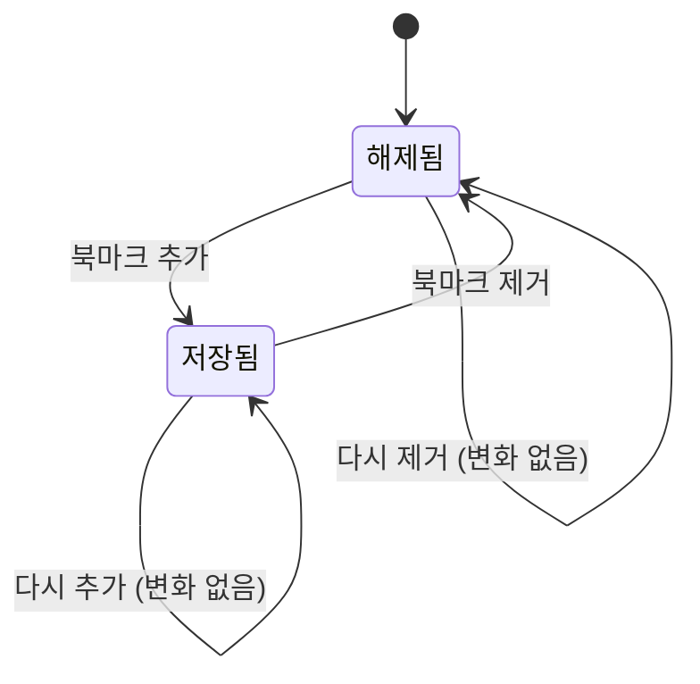

### 반복 호출 — 이 기능의 핵심

토글 UI는 **더블클릭과 네트워크 재시도가 특히 잦습니다.**

| 동작 | 현재 상태 | 결과 | 응답 |
|---|---|---|---|
| 추가 | 없음 | 1건 생김 | 성공 |
| 추가 | 이미 있음 | **여전히 1건.** 저장 시각도 안 바뀜 | 성공 |
| 제거 | 있음 | 없어짐 | 성공 |
| 제거 | 이미 없음 | **여전히 없음.** 에러 아님 | 성공 |

`CONFIRMED`

> "추가"는 "1건 만든다"가 아니라 **"1건 있는 상태로 만든다"**입니다.
> "제거"는 "1건 지운다"가 아니라 **"0건인 상태로 만든다"**입니다.

### 마감 · 삭제 · 취소된 프로젝트

| 프로젝트 상태 | 북마크 추가 | 기존 북마크 |
|---|---|---|
| 모집 예정 · 모집 중 | ✅ | 유지 |
| 모집 마감 | ✅ | **유지** |
| 거래 진행 중 | ✅ (외부에서는 마감으로 보임) | 유지 |
| **취소됨** | ✅ (외부에서는 마감으로 보임) | 유지 |
| 삭제됨 | ❌ (없는 프로젝트) | 데이터는 남지만 **목록에 안 보임** |

`CONFIRMED`

**마감된 프로젝트 북마크를 유지하는 이유**: 프리랜서가 "이런 조건의 프로젝트가 있었지"를 참고하려고 저장해둔 경우가 있습니다. 자동으로 지우면 의도하지 않은 데이터 소실입니다.

### 북마크 제거는 실제로 지웁니다 `ASSUMPTION`

프로젝트는 소프트 삭제지만 북마크는 그냥 지웁니다. 거래 이력이 아니고, 사용자가 "지웠는데 남아 있는" 걸 원하지 않습니다.

## 4.2 내 북마크 목록

| 항목 | 내용 |
|---|---|
| 대상 | **로그인한 본인이 저장한 것만** |
| 기본 정렬 | 최근에 저장한 것부터 |
| 페이지당 | 10개 |
| 각 항목 | 프로젝트 카드 (제목·카테고리·예산·기술·마감일·모집 상태) |

`CONFIRMED`

**남의 북마크 목록은 어떤 방법으로도 볼 수 없습니다.**

**목록에서 제외**: 삭제된 프로젝트 (북마크 데이터 자체는 남김)

**마감된 프로젝트의 표시**

| 요소 | 동작 |
|---|---|
| 카드 | 정상 표시 |
| 상태 배지 | `모집 마감` |
| 상세 보기 | 가능 |
| 지원하기 CTA | **비활성** |
| 북마크 해제 | 가능 |

> 목록에서는 마감된 것을 **유지**합니다 (§3.6의 공개 목록 정책과 다릅니다).
> 공개 목록은 "찾는 곳"이라 지원 가능한 것만 보여주고, 내 북마크는 "내가 담아둔 것"이라 내가 지우기 전엔 남습니다.

**목록이 비었을 때**: 에러가 아닙니다. "저장한 프로젝트가 없습니다 + 프로젝트 둘러보기"를 보여줍니다.

**목록에서 할 수 있는 것** (RFP §3.4.1)

```text
상세로 이동  ·  북마크 해제  ·  지원하기 (모집 중인 것만)
```

## 4.3 추천 프로젝트

RFP §3.4.2: *"동일 카테고리 및 유사 기술 스택 기반의 단순 추천 (정교한 추천 알고리즘은 범위 외, 랜덤 수준 허용)"*

**위치**: 프로젝트 상세 화면 하단 `CONFIRMED` — RFP §3.2.1

### 저장하지 않습니다

```text
recommendations 테이블을 만들지 않는다.
추천 결과를 캐시나 별도 저장소에 쌓지 않는다.
요청이 올 때마다 그 시점의 프로젝트 데이터로 계산한다.
```

`CONFIRMED`

**이유**: 프로젝트 상태는 시간에 따라 바뀝니다(모집 중 → 마감). 저장해두면 이미 마감된 프로젝트를 계속 추천하게 되고, 그걸 막으려면 동기화 로직이 또 필요합니다.

### 후보 조건 — 전부 만족

```text
삭제되지 않았다
모집 상태가 OPEN이다
지금 보고 있는 프로젝트가 아니다
```

`CONFIRMED`

> 모집 예정과 마감은 추천하지 않습니다. 추천의 목적이 "지금 지원할 수 있는 걸 발견하는 것"이기 때문입니다.
> §3.6의 목록 기본 노출 정책(D-08)과 같은 철학입니다.

### 우선순위

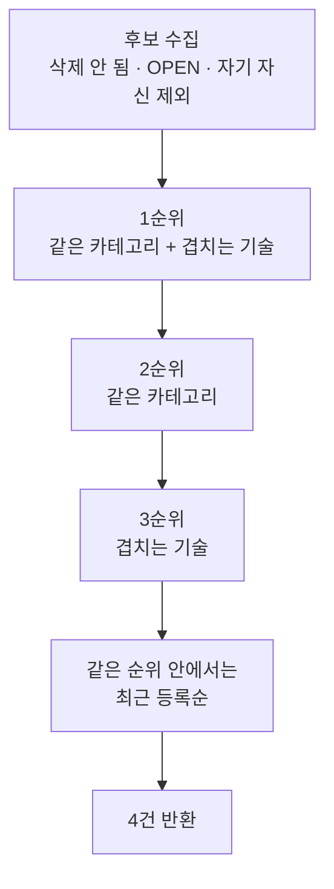

| 순위 | 조건 |
|---|---|
| 1 | 카테고리가 같고 **그리고** 기술이 하나 이상 겹침 |
| 2 | 카테고리만 같음 |
| 3 | 기술만 하나 이상 겹침 |
| 동점 | 최근에 등록된 것부터 |

`CONFIRMED`

### 하지 않는 것

```text
점수 기반 랭킹 · 벡터 검색 · 개인화 · 머신러닝 · 협업 필터링
```

`CONFIRMED` — RFP가 명시적으로 범위 외로 둡니다.

### 반환 건수 `DECIDED` (D-05)

```text
4건 고정
```

v1.0에서 "4건 vs 최대 10건" 불일치가 있었습니다. **4건으로 확정합니다.** 파라미터로 조정할 수 있게 만들지 않습니다.

**4건인 이유**: 상세 화면 하단의 보조 섹션입니다. 한 줄에 4개가 들어가는 카드 레이아웃이 가장 흔하고, 그 이상은 본문보다 추천이 길어집니다.

### 후보가 없을 때

에러가 아닙니다. 빈 목록을 정상 응답으로 돌려주고 **추천 섹션 자체를 감춥니다.** `RECOMMENDATION`

### 4건보다 적을 때

있는 만큼만 보여줍니다. 억지로 채우려고 조건을 완화하지 않습니다. `RECOMMENDATION`

### 추천 응답에 없어야 하는 것

```text
transactionStatus  ·  내부 점수 · 순위값  ·  deletedAt
```

`CONFIRMED`

## 4.4 권한

| 동작 | 비로그인 | 프리랜서 | 의뢰인 |
|---|---|---|---|
| 북마크 추가 | ❌ 401 | ✅ | ❌ 403 |
| 북마크 제거 | ❌ 401 | ✅ | ❌ 403 |
| 내 북마크 조회 | ❌ 401 | ✅ (본인 것만) | ❌ 403 |
| 추천 프로젝트 조회 | ✅ | ✅ | ✅ |

`CONFIRMED`

**북마크 상태 표시**

| 보는 사람 | 아이콘 |
|---|---|
| 비로그인 | 표시하되 누르면 로그인 유도 |
| 프리랜서 | 저장/해제 상태 반영 |
| 의뢰인 | 표시하지 않음 |

## 4.5 project-management에 대한 읽기 의존

| 필요한 것 | 어디에 쓰는가 |
|---|---|
| 프로젝트 존재 여부 · `deletedAt` | 북마크 추가 가능 판정 · 목록 제외 |
| `recruitmentStatus` | 추천 후보 판정 · 상태 배지 · 지원 CTA 활성화 |
| `category` · `skills` | 추천 우선순위 계산 |
| 프로젝트 카드 표시 필드 | 북마크 목록 · 추천 목록 |
| `createdAt` | 동점 정렬 |

**쓰지 않습니다.**

## 4.6 API

| 동작 | 엔드포인트 | 인증 |
|---|---|---|
| 북마크 추가 | `PUT /api/v1/projects/:projectId/bookmarks` | 프리랜서 |
| 북마크 제거 | `DELETE /api/v1/projects/:projectId/bookmarks` | 프리랜서 |
| 내 북마크 목록 | `GET /api/v1/bookmarks` | 프리랜서 |
| 추천 프로젝트 | `GET /api/v1/projects/:projectId/recommendations` | 불필요 |

`CONFIRMED`

**추가에 `POST`가 아니라 `PUT`을 쓰는 이유**: `POST`는 "새로 만든다"라서 반복 호출하면 여러 개가 생기는 게 자연스럽습니다. `PUT`은 "이 상태로 만든다"라서 반복 호출해도 결과가 같은 게 자연스럽습니다. `RECOMMENDATION`

## 4.7 오류 상황과 사용자 경험

| # | 상황 | 사용자가 겪는 것 | 응답 |
|---|---|---|---|
| E1 | 비로그인 북마크 시도 | 로그인 유도 → 로그인 후 원래 프로젝트로 복귀 | 401 |
| E2 | 의뢰인이 북마크 시도 | UI 자체를 노출하지 않음. 직접 요청 시 권한 없음 | 403 |
| E3 | 없거나 삭제된 프로젝트 북마크 | "프로젝트를 찾을 수 없습니다" | 404 |
| E4 | 이미 북마크한 걸 또 추가 | **에러 아님.** 아이콘 켜진 상태 유지 | 성공 |
| E5 | 없는 북마크 제거 | **에러 아님.** 아이콘 꺼진 상태 유지 | 성공 |
| E6 | 북마크 목록이 빔 | 빈 상태 안내 + 프로젝트 둘러보기 | 200 |
| E7 | 추천 후보 없음 | 추천 섹션을 감춤 | 200 |
| E8 | 없는 프로젝트의 추천 요청 | "프로젝트를 찾을 수 없습니다" | 404 |

**토글 실패 시 UI 되돌리기** `RECOMMENDATION`

아이콘을 먼저 바꾸고 요청을 보내는 방식을 쓴다면, **실패했을 때 반드시 원래 상태로 되돌려야 합니다.**

## 4.8 동시성

| # | 상황 | 보장 |
|---|---|---|
| C1 | 같은 프리랜서·프로젝트를 거의 동시에 두 번 추가 | 북마크는 **1건**. 둘 다 성공 응답 |
| C2 | 추가와 제거가 거의 동시 | 나중 요청의 의도가 최종 상태. 중간에 2건이 생기면 안 됨 |
| C3 | 목록 보는 중에 프로젝트 삭제됨 | 다음 조회부터 안 보이면 됨 |
| C4 | 추천 계산 중에 후보 하나가 마감됨 | 다음 요청에서 빠지면 됨 |

---

---

# 5. 도메인 통합 계약

도메인 사이에 오가는 호출의 정본입니다. 조준영·최윤석·오민혁의 구현이 이 장을 전제로 합니다.

## 5.1 원칙

한 도메인이 다른 도메인의 테이블을 직접 UPDATE하면, 통합 시점에 상태가 어긋났을 때 원인을 특정할 수 없습니다.
따라서 쓰기는 반드시 담당 도메인이 제공하는 함수를 통합니다.

### 원칙 3개

```text
1. 상태에는 주인이 있다
   바꾸고 싶으면 주인이 제공하는 함수를 호출한다.

2. 읽기는 자유, 쓰기는 계약

3. 계약은 결과를 보장하고, 방법은 묻지 않는다
```

## 5.2 전체 흐름

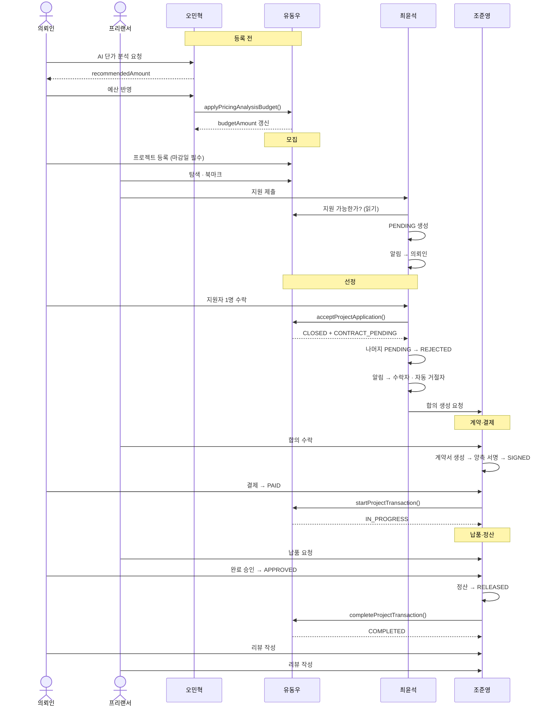

## 5.3 실패 경로 — 합의 거절

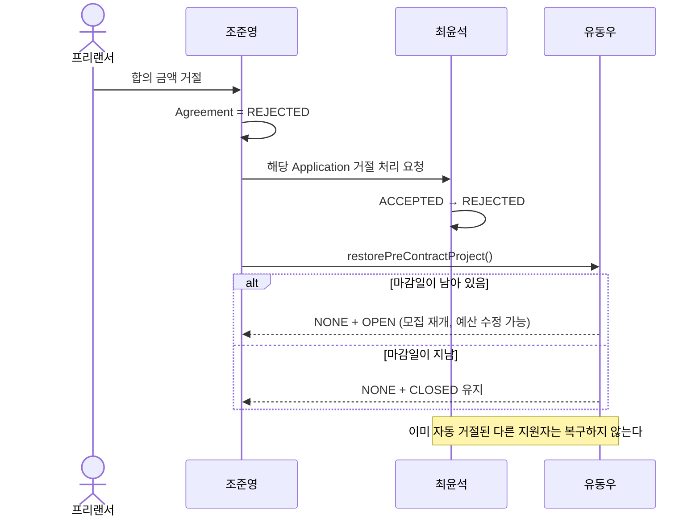

## 5.4 프로젝트 상태 변경 계약 7종

`projects`의 상태를 바꾸려면 아래 7개 함수를 호출합니다. 테이블 직접 변경은 허용하지 않습니다.

### 모든 계약이 공유하는 요청·응답 규약 `CONFIRMED` (D-54)

금액합의 2차 설계 §6.1과 맞췄습니다. **아래 필드는 계약 7종 전부에 들어갑니다.**

| 구분 | 필드 | 용도 |
|---|---|---|
| 요청 | `requestId` | 호출 추적 |
| 요청 | **`idempotencyKey`** | **같은 작업의 중복 처리 방지** |
| 요청 | `occurredAt` | 원본 사건 발생 시각 |
| 요청 | `expectedProjectVersion` (선택) | 넣으면 조건부 갱신 |
| 응답 | **`alreadyProcessed`** | **이전에 같은 요청이 처리됐는가** |
| 응답 | `processedAt` | 최초 처리 완료 시각 |
| 응답 | `changed` | 이번 호출로 상태가 실제로 바뀌었는가 |
| 응답 | `projectVersion` | 처리 후 버전 |

**`changed`와 `alreadyProcessed`를 나눈 이유**

```text
changed: true,  alreadyProcessed: false   →  이번에 바꿨다
changed: false, alreadyProcessed: true    →  전에 이미 처리됐다 (정상)
changed: false, alreadyProcessed: false   →  바꿀 것이 없었다 (정상)
```

세 번째가 없으면 "할 일이 없었다"와 "실패했다"를 구분할 수 없습니다.

**멱등 키 규칙**

| 계약 | 키 |
|---|---|
| `acceptProjectApplication` | `application-accept-{applicationId}` |
| `restorePreContractProject` | `negotiation-reject-{negotiationId}` |
| `cancelProject` | `project-cancel-{cancellationId}` |
| `markPaymentPending` | `payment-pending-{contractId}` |
| `applyPricingAnalysisBudget` | `pricing-apply-{pricingAnalysisId}` |

### 계약을 부르는 이름 `CONFIRMED` (D-48)

> 🔑 **문서 사이에서 계약을 지칭할 때는 반드시 함수명을 씁니다. 번호로 부르지 않습니다.**

`C-01` 같은 번호는 **이 문서 안에서만 유효한 목차 번호**입니다. 각 담당자가 자기 설계서에서 자기 순서대로 번호를 매기면 같은 번호가 서로 다른 함수를 가리킵니다.

| 실제로 벌어진 일 | |
|---|---|
| 이 문서 `C-02` | `startProjectTransaction` |
| 조준영 「금액합의 프로세스 설계서」 `C-02` | `restorePreContractProject` |
| 이 문서 `C-04` | `restorePreContractProject` |
| 조준영 설계서 `C-04` | `createAgreementNotification` |

**같은 회의에서 "C-02"라고 말하면 두 사람이 다른 함수를 떠올립니다.**

### 전역 계약 카탈로그

**함수명이 정본입니다.** 아래는 프로젝트 상태에 관여하는 계약 전체이며, 이 문서의 번호는 참고용입니다.

| 함수명 (정본) | 방향 | 무엇을 | 이 문서 |
|---|---|---|---|
| **`acceptProjectApplication`** | 최윤석 → 유동우 | 지원 수락 → 모집 마감 + 계약 대기 | C-01 |
| **`startProjectTransaction`** | 조준영 → 유동우 | 서명+결제 완료 → 작업 중 | C-02 |
| **`completeProjectTransaction`** | 조준영 → 유동우 | 납품+정산 완료 → 완료 | C-03 |
| **`restorePreContractProject`** | 조준영 → 유동우 | 합의 거절 → 모집 복귀 | C-04 |
| **`applyPricingAnalysisBudget`** | 오민혁 → 유동우 | AI 추천 예산 반영 | C-05 |
| **`cancelProject`** | 의뢰인 → 유동우 | 프로젝트 취소 | C-06 |
| **`markPaymentPending`** | 조준영 → 유동우 | 결제 시작 통보 | C-07 |

**외부 도메인으로 호출하는 계약** (제공자가 다른 담당자)

| 함수명 (정본) | 방향 | 무엇을 |
|---|---|---|
| **`rejectPendingApplications`** | 유동우 → 최윤석 | 마감·취소 시 대기 지원 일괄 거절 + 알림 |
| **`invalidateAgreementAndContract`** | 유동우 → 조준영 | 취소 시 합의·계약 무효화 |

> 뒤의 두 개는 v5.0에서 **정식 계약으로 승격**했습니다. 이전에는 "후처리 요청"이라는 서술로만 있어서 시그니처가 없었습니다.
> 함수명은 조준영 「금액합의 프로세스 설계서」의 표기를 따랐습니다.
> **시그니처는 §5.5에 있고, 요청·응답 필드 정본은 다음 개정에서 조준영·최윤석 설계서와 맞춰 확정합니다.**

### 다른 문서의 번호와 맞추는 법

각자 설계서의 번호는 그대로 두고, **참조할 때만 함수명으로 바꿔 부릅니다.** 번호를 통일하려 들면 문서 전체를 매번 다시 매겨야 합니다.

| 조준영 설계서 | 함수명 | 이 문서 |
|---|---|---|
| C-01 | `acceptProjectApplication` | C-01 |
| C-02 | `restorePreContractProject` | C-04 |
| C-03 | `invalidateAgreementAndContract` | (유동우 → 조준영) |
| C-04 | `createAgreementNotification` | (조준영 → 최윤석 · 이 문서 범위 밖) |

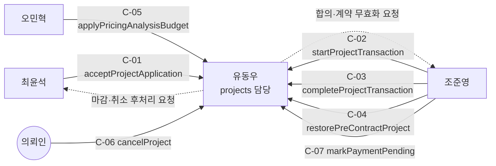

**실선은 외부에서 들어오는 호출, 점선은 밖으로 나가는 후처리 요청입니다.**


### C-01 `acceptProjectApplication(projectId, applicationId)`

| | |
|---|---|
| 호출자 | 최윤석 |
| 언제 | 의뢰인이 지원자 1명을 수락한 직후 |

**성공 시**: `recruitmentStatus → CLOSED`, `transactionStatus → CONTRACT_PENDING`

| 실패 조건 | 결과 |
|---|---|
| 프로젝트가 없거나 삭제됨 | 404 |
| **같은 `applicationId`로 이미 수락됨** | **200 — 멱등 성공** `DECIDED` (D-41) |
| `transactionStatus`가 `NONE`이 아님 | 409 — 이미 **다른** 지원자가 수락됨 또는 취소됨 |
| **`recruitmentStatus`가 `OPEN`이 아님** | **409** — `DECIDED` (D-29) · 감사 발견 #2 |

**동시성**: 두 요청이 거의 동시에 와도 성공은 **최대 1건**입니다.

> 🔑 **판정 순서가 중요합니다.** "같은 지원자인가"를 먼저 보고, 그 다음에 상태 조건을 봅니다.
> 순서가 반대면 첫 호출이 성공한 뒤의 재시도가 무조건 409가 되고,
> §0.2 #11에 따라 최윤석 화면이 **정상 수락 건에 "다른 지원자가 먼저 수락되었습니다"라는 거짓 안내**를 띄웁니다.
>
> 판정 근거로 `projects.acceptedApplicationId`를 둡니다 (D-41). 이 값이 없으면 "같은 지원자인지"를 판별할 방법이 없습니다.

> ⚠️ **호출 순서**: 최윤석는 이 호출이 성공한 **뒤에** 나머지 지원자를 거절 처리하고 알림을 보냅니다.
> 순서가 반대면, 프로젝트 상태 변경이 실패했을 때 이미 거절된 지원자를 되살릴 수 없습니다.

### C-02 `startProjectTransaction(projectId)`

> ⚠️ **이 함수를 호출하기 전에 프로젝트 상태를 조회하는 것은 호출자의 의무입니다** `DECIDED` (D-44)
> §3.7의 낙관적 취소는 "조준영이 서명·결제 시점마다 프로젝트가 살아 있는지 확인한다"를 전제로 합니다.
> 확인 없이 진행하면 이미 취소된 프로젝트에 결제가 걸려 환불 상황이 만들어집니다. C-07이 그 확인 지점입니다.

| | |
|---|---|
| 호출자 | 조준영 |
| 언제 | 계약이 `SIGNED`가 **되고** 결제가 `PAID`가 된 시점 |

**성공 시**: `transactionStatus → IN_PROGRESS`

| 실패 조건 | 결과 |
|---|---|
| 프로젝트 없음 | 404 |
| 현재 상태가 `CONTRACT_PENDING`이 아님 | 409 |
| **현재 상태가 `CANCELED`** | **409 — 의뢰인이 이미 취소함** |
| 이미 `IN_PROGRESS` | **성공으로 처리** |

> ⚠️ **계약 SIGNED만으로 부르지 마세요. 결제 PAID만으로도 부르지 마세요.**
> 두 조건이 **모두** 충족된 뒤 한 번 부릅니다.
>
> 🔴 **v1.1 신설**: 취소가 `CONTRACT_PENDING`까지 확대됐으므로, 이 호출은 **취소된 프로젝트를 만날 수 있습니다.**
> 그때는 409를 받고, 조준영는 "프로젝트가 취소되었습니다"를 안내해야 합니다.

### C-03 `completeProjectTransaction(projectId)`

| | |
|---|---|
| 호출자 | 조준영 |
| 언제 | 납품이 `APPROVED`가 **되고** 정산이 `RELEASED`가 된 시점 |

**성공 시**: `transactionStatus → COMPLETED`

| 실패 조건 | 결과 |
|---|---|
| 프로젝트 없음 | 404 |
| 현재 상태가 `IN_PROGRESS`가 아님 | 409 |
| **현재 상태가 `CANCELED`** | **409** — `DECIDED` (D-30) |
| 이미 `COMPLETED` | **성공으로 처리** |

> 이 호출이 성공해야 리뷰 작성이 열립니다.

### C-04 `restorePreContractProject(projectId)`

| | |
|---|---|
| 호출자 | 조준영 |
| 언제 | 프리랜서가 합의 금액을 거절한 직후 |

**성공 시**

```text
transactionStatus  →  NONE

마감일 > 현재 서버 시간이면   recruitmentStatus → OPEN  (모집 재개)
마감일이 이미 지났으면        recruitmentStatus → CLOSED 유지
```

**응답에 재개 여부를 담아 돌려줍니다.**

| 실패 조건 | 결과 |
|---|---|
| 프로젝트 없음 | 404 |
| 현재 상태가 `CONTRACT_PENDING`이 아님 | 409 |
| **현재 상태가 `CANCELED`** | **409** — `DECIDED` (D-30) |
| **다른 `negotiationId`로 이미 복원됨** | **409 `PROJECT_ALREADY_RESTORED`** — `DECIDED` (D-42) |
| `expectedProjectVersion` 불일치 | **409 `PROJECT_VERSION_CONFLICT`** (D-53) |

**하지 않는 일**: 이미 자동 거절된 다른 지원자를 복구하지 않습니다. `CONFIRMED`

**시그니처** `DECIDED` (D-42 · D-55 · 금액합의 2차 §8.1)

```text
restorePreContractProject(projectId, negotiationId, offerId, actorUserId, reason,
                          requestId, idempotencyKey, occurredAt, expectedProjectVersion?)
```

| 필드 | 필수 | 비고 |
|---|---|---|
| `negotiationId` | ✅ | **멱등 판정 기준.** 1차의 `agreementId`를 대체 |
| `offerId` | ⬜ | 어느 제안에서 최종 거절이 났는가 (감사) |
| `reason` | ✅ | **`FREELANCER_REJECTED` · `CLIENT_REJECTED`** |

> `reason`에 `CLIENT_REJECTED`를 추가했습니다. 2차 설계에서 **양측 재제안**이 허용되므로
> 의뢰인도 최종 거절 주체가 될 수 있습니다. 1차의 단일 값으로는 표현되지 않습니다.

**응답**

```json
{
  "projectId": "prj_123",
  "negotiationId": "ngt_123",
  "recruitmentStatus": "OPEN",
  "transactionStatus": "NONE",
  "reopened": true,
  "restoredFields": ["recruitmentStatus", "transactionStatus"],
  "projectVersion": 9,
  "changed": true,
  "alreadyProcessed": false
}
```

> 🔑 **`restoredFields`는 언제나 이 두 개입니다.**
> 계약 상태·합의 금액·계약 상대방 같은 값은 **`projects`에 존재하지 않습니다.** 계약 도메인의 데이터입니다.
> 따라서 이 함수는 프로젝트를 통째로 되돌리지 않고, **협상 중 수정된 제목·설명·첨부는 그대로 보존됩니다.**

**호출 시점이 2차에서 좁아졌습니다**

| | 1차 | 2차 |
|---|---|---|
| 호출 시점 | 프리랜서 거절 즉시 | **최신 제안 수신자의 최종 거절만** |
| 재제안 시 | — | **호출하지 않음** (협상 지속) |
| 제안 철회 시 | — | **호출하지 않음** |
| 프로젝트 취소 시 | 호출 안 함 | **호출 안 함** (동일) |

**`negotiationId`가 들어가는 이유**

인자가 `projectId` 하나뿐이면 **어느 협상에 대한 복구인지 식별할 수 없습니다.**

```text
1. 프리랜서 A의 최종 거절 → 복원 호출 → 성공했으나 응답이 유실
2. 재시도 큐가 60초 뒤 같은 요청을 재발송
3. 그 사이 프리랜서 B가 지원 → 수락 → 다시 CLOSED + CONTRACT_PENDING
4. 지연된 재시도 도착 → "CONTRACT_PENDING이 아님" 조건에 안 걸림 → 성공
   → B의 계약 대기가 근거 없이 되돌아감. B는 이미 수락 알림을 받은 상태
```

| 재호출 상황 | 결과 |
|---|---|
| **같은 `negotiationId`** | **200 — 최초 결과 그대로 반환** |
| **다른 `negotiationId`로 이미 복원됨** | **409 `PROJECT_ALREADY_RESTORED`** |

**재개 전 대기 지원 건수를 다시 확인합니다** `DECIDED` (D-43)

C-01의 일괄 거절이 부분 실패해 대기 중 지원이 남아 있을 수 있습니다. 그대로 `OPEN`으로 되돌리면 아래가 깨집니다.

| 깨지는 것 | 결과 |
|---|---|
| "재개된 프로젝트는 대기 중 지원 0건" (D-07) | 의뢰인이 예산을 조정할 수 없음 |
| §3.5 삭제 조건 "대기 중 지원 0건" | 프로젝트를 **영원히 삭제할 수 없음** |

따라서 `OPEN` 전환 전에 `pendingApplicationCount`를 확인하고, **0이 아니면 전환을 보류한 채 일괄 거절을 재요청**합니다.

**재개 후의 상태** `DECIDED` (D-07)

```text
재개된 프로젝트는 대기 중인 지원이 0건이다.
따라서 의뢰인은 예산과 일정을 다시 조정할 수 있다.
```

이건 별도 처리가 아니라 §3.4 잠금 규칙의 **자연스러운 결과**입니다.

### C-05 `applyPricingAnalysisBudget(projectId, pricingAnalysisId)` — **기존 프로젝트 전용** `DECIDED` (D-59)

| | |
|---|---|
| 호출자 | 오민혁 |
| 언제 | 의뢰인이 **이미 등록된 프로젝트**의 AI 분석 리포트에서 "예산 반영"을 누른 시점 |
| 멱등 키 | `pricing-apply-{pricingAnalysisId}` |

**성공 시**: `budgetAmount → 해당 분석의 recommendedAmount`

| 실패 조건 | 결과 |
|---|---|
| 프로젝트 없거나 삭제됨 | 404 |
| 요청자가 등록 의뢰인이 아님 | 403 |
| **대기 중인 지원이 1건 이상** | **409** |
| 프로젝트가 마감·거래 단계 | 409 |
| 해당 분석이 `APPROVED`가 아님 | 409 |
| 같은 분석이 이미 적용됨 | **200 — 멱등 성공** |

> 🔴 **"대기 중인 지원이 있으면 거부"는 §3.4와 같은 규칙입니다** (N-2)
> 직접 수정과 AI 경유가 다른 규칙을 따르면 안 됩니다.

**시그니처에서 `amount`를 뺐습니다** `DECIDED` (D-59 · 오민혁 검토의견 §4.3)

클라이언트가 보낸 금액을 그대로 믿으면, **AI가 추천하지 않은 금액을 "AI 추천"으로 반영**할 수 있습니다.
`pricingAnalysisId`만 받고 **금액은 DB의 `recommendedAmount`에서 읽습니다.**

### 등록 시점의 AI 분석 연결 — 별도 경로 `DECIDED` (D-60)

**등록 2단계에는 아직 프로젝트가 없습니다.** 그런데 위 함수는 `projectId`를 요구합니다.
등록 퍼널에서 AI 분석을 쓰는 경로가 계약과 맞지 않았습니다.

**해결: `POST /api/v1/projects`에 선택 필드를 추가합니다.**

| 필드 | 타입 | 필수 | 규칙 |
|---|---|---|---|
| `pricingAnalysisId` | string | ⬜ | **추천 금액을 그대로 쓸 때만 전달.** 사용자가 금액을 고쳤으면 전달하지 않는다 |

| 처리 | |
|---|---|
| 프로젝트 생성과 분석 연결(연결 대상·적용 시각 기록) | **같은 트랜잭션** |
| 분석이 `APPROVED`가 아니거나 이미 적용됨 | `409` — 프로젝트도 생성되지 않음 |
| 필드를 안 보냄 | 정상 등록. 분석 연결만 없음 |

> 이렇게 하면 "AI 추천을 그대로 받아 등록한 프로젝트"와 "추천을 참고만 하고 직접 정한 프로젝트"가 데이터로 구분됩니다.
> §0.4 Step 3 후보 B3-1(예산 분포 표시)의 근거 데이터가 되기도 합니다.

> **별도 계약 함수를 만드는 안**(`claimPricingAnalysisForCreatedProject`)도 검토했으나 미채택했습니다.
> 등록 API가 이미 트랜잭션 경계를 갖고 있어 필드 하나로 충분하고, 계약을 하나 더 늘리면 호출 순서 문제가 생깁니다.
> **오민혁 판단으로 별도 계약 방식으로 바꿔도 무방합니다.**

**ERD v1.2가 같은 결함에 다른 해법을 냈습니다** `DECIDED` (D-67 · ERD E-21)

ERD v1.2 E-21은 동일한 순서 모순을 지적하고 **신규 계약 함수 신설**로 풀었습니다. 문제 인식은 같고 해법만 다릅니다.

| | 해법 | 판정 |
|---|---|---|
| **이 문서 (D-60)** | 등록 API의 선택 필드 `pricingAnalysisId` | ✅ **채택 유지** |
| ERD v1.2 (E-21) | 신규 계약 함수 `claimPricingAnalysisForCreatedProject` | 미채택 |

**둘 다 구현하면 등록 경로가 두 개가 되므로 하나로 모읍니다.**

```text
등록 API 안에서 끝내면
  "프로젝트는 생겼는데 분석 연결은 실패한" 중간 상태가 아예 생기지 않는다.

계약 함수를 따로 두면 그 사이 구간이 열리고,
실패 시 되돌릴 대상(방금 만든 프로젝트)이 이미 공개돼 있다.
```

**다만 E-21의 동시성 방어는 그대로 채택합니다.** 재적용 방지(I-26)를 `CHECK` 제약이 아니라 **조건부 `UPDATE`** 로 처리합니다.

**PRD가 요구하는 것은 결과이고, 어떤 SQL로 만들지는 구현이 정합니다** (D-50 · §6.11).

| PRD가 요구 | 이유 |
|---|---|
| 적용 처리는 **"아직 적용되지 않았고 승인된 분석"이라는 조건을 갱신문 자체에 실어** 한 번에 수행한다 | 조회 후 갱신으로 나누면 두 요청이 같은 분석을 각각 다른 프로젝트에 적용할 수 있다 |
| 갱신 대상이 **없었으면 `409`** 로 응답한다 | 이미 적용됐거나 승인되지 않은 분석 |
| 갱신에 성공하면 그 분석의 **추천 금액을 `budgetAmount`에 반영**한다 | 클라이언트가 보낸 금액을 믿지 않는다 (D-59) |

**읽고 나서 쓰는 두 단계로 나누지 않는 것**이 핵심입니다. 조건 검사와 갱신 사이에 다른 요청이 끼어들 틈을 없애야 합니다.
같은 요구를 `applyPricingAnalysisBudget`(C-05)에도 적용합니다.

> 조건부 갱신문의 실제 형태와 컬럼명은 **ERD와 오민혁 구현이 정합니다.** 이 문서는 사본을 두지 않습니다.

> 연결 경로는 D-60, 동시성 방어는 E-21입니다. 두 문서에서 각각 강한 쪽을 취한 것입니다.
> **`pricing_analyses`는 오민혁 담당이므로, 이견이 있으면 그쪽 판단을 우선합니다.**

### C-06 `cancelProject(projectId)` — v1.1 신설 `DECIDED` (D-04)

| | |
|---|---|
| 호출자 | 의뢰인 (직접 API) |
| 언제 | 프로젝트를 중단하려 할 때 |

**성공 시**: `transactionStatus → CANCELED`, `recruitmentStatus → CLOSED`

| 실패 조건 | 결과 |
|---|---|
| 프로젝트 없거나 삭제됨 | 404 |
| 요청자가 등록 의뢰인이 아님 | 403 |
| 현재 상태가 `IN_PROGRESS` 이상 | **409 — 결제가 완료되어 환불 절차 필요** |
| **결제가 진행 중임** (`paymentPendingAt`이 있음) | **409 — 같은 코드** `CONFIRMED` (D-40) |
| 이미 `CANCELED` | **성공으로 처리** |

**"결제가 진행 중"을 판정해야 하는 이유** `CONFIRMED` (D-40)

`transactionStatus`가 `IN_PROGRESS`가 되는 것은 조준영이 C-02를 호출한 **뒤**입니다.
결제가 `PAID`로 확정된 시점과 그 호출이 도착하는 시점 사이에 프로젝트는 아직 `CONTRACT_PENDING`입니다.

```text
1. 의뢰인 결제 완료  →  payments.status = PAID   (금액이 빠져나감)
2. C-02 도착 전       →  프로젝트는 아직 CONTRACT_PENDING
3. 의뢰인이 취소       →  위 실패 조건 어디에도 안 걸림 → 취소 성공
4. C-02 도착          →  409
5. I-29에 따라 CANCELED는 되돌릴 수 없음
   →  금액은 들어와 있고, 프로젝트는 취소됐고, 환불은 MVP 범위 밖
```

**요구사항**: 결제가 시작된 이후의 취소 요청은 반드시 거부된다. 판정 근거를 프로젝트가 알 수 있어야 한다.

**채택: A안** `권장안 확정`

| 안 | 방법 | 비용 | 판단 |
|---|---|---|---|
| **A ✅** | `projects.paymentPendingAt` 신설. 조준영이 결제 요청 직전 **`markPaymentPending(projectId)`(C-07)** 호출 | 컬럼 1 + 계약 함수 1 | **채택.** 경계가 명시적이고 §0.2 #21 원칙을 유지 |
| B | 취소 시점에 결제 상태를 **읽어서** 확인 (§5.1 "읽기는 자유") | 0 | 미채택. 취소 로직이 다른 두 도메인 스키마에 결합되고 3-join이 필요 |
| C | 취소 불가 경계를 **계약 진입** 시점으로 앞당김 | 0 | 미채택. D-04를 뒤집어 제품 의미가 바뀜 (§0.5 T11) |

> **일단 A안으로 정해두고 진행합니다.** 조준영 판단으로 **B안으로 바꿔도 됩니다** — 결함 자체는 어느 쪽이든 닫힙니다.
> 바꿀 경우 C-07을 삭제하고 §5.5의 해당 항목을 "읽기 의존"으로 옮긴 뒤, 변경 사유를 부록 E에 기록하고 진행하면 됩니다.
> **회신을 기다릴 필요는 없습니다.** 이 문서는 A안 기준으로 쓰여 있습니다.

### 조회 계약 `getProjectNegotiationContext(projectId)` `DECIDED` (D-56)

**계약이 아니라 읽기지만, 여기 적어두는 이유**는 조준영이 금액합의 진입 조건을 검증할 때 매번 쓰기 때문입니다.
공개 상세(A-03)로는 `transactionStatus`가 내려가지 않아 진입 판정을 할 수 없습니다.

```json
{
  "projectId": "prj_123",
  "clientId": "usr_client_a",
  "recruitmentStatus": "CLOSED",
  "transactionStatus": "CONTRACT_PENDING",
  "acceptedApplicationId": "app_123",
  "recruitmentDeadlineAt": "2026-09-16T14:59:59Z",
  "canceledAt": null,
  "paymentPendingAt": null,
  "projectVersion": 7
}
```

| 왜 이 필드들인가 | |
|---|---|
| `recruitmentStatus` · `transactionStatus` | 진입 조건 2개 (`CLOSED` + `CONTRACT_PENDING`) |
| `acceptedApplicationId` | 합의 대상 프리랜서가 **실제로 수락된 지원자인지** 대조 |
| `recruitmentDeadlineAt` | 최종 거절 시 재모집 가능 여부를 미리 예측 |
| `projectVersion` | 조건부 갱신에 넣을 값 |

> 진입 조건 3개 중 `ApplicationStatus == ACCEPTED`는 최윤석 도메인입니다.
> 다만 `acceptedApplicationId`를 함께 주므로 **"그 지원서가 이 프로젝트의 것인가"는 여기서 확인됩니다.**

### 재모집 가능 여부와 마감일 `CONFIRMED` (D-57 · 2026-08-20 조준영 수용)

재제안이 여러 차례 오가는 사이에 마감일이 지나갈 수 있습니다.

```text
1. 마감일 오늘 18:00
2. 17:00부터 재제안 3회 왕복 → 19:00
3. 최종 거절 → 복원 → 마감일이 지났으므로 CLOSED + NONE
4. 의뢰인: 협상하느라 시간이 갔는데 재모집도 안 되는 상태
```

| 안 | 내용 | 대가 |
|---|---|---|
| A | 기존 마감일 그대로 | 협상이 길면 재모집 불가 |
| B | 협상 소요 시간만큼 자동 연장 | **서버가 마감일을 임의로 변경.** 프리랜서가 지원 시점에 본 조건이 사후에 바뀜 |
| **C ✅** | **최종 거절 후 의뢰인에게 "마감일을 연장하고 다시 모집할까요?" 확인** | 화면 1개 추가 |

> **C안이 바람직하다고 권장합니다.**
>
> B안은 §3.4가 세운 원칙 — **"지원이 들어온 뒤에는 조건을 바꿀 수 없다"** — 와 정면으로 어긋납니다.
> 서버가 마감일을 늘리면 프리랜서가 확인하고 지원한 조건이 사후에 달라집니다.
>
> A안은 규칙이 단순하지만 사용자가 손해를 봅니다. 협상은 정상적인 활동인데 그 결과로 재모집 기회를 잃습니다.
>
> **C안은 마감일 변경을 의뢰인의 명시적 결정으로 남깁니다.** 복원 응답의 `reopened: false`를 받아
> 화면에서 안내와 마감일 재설정을 제안하면 됩니다. 이때의 마감일 변경은 §3.4 잠금 규칙을 그대로 따릅니다
> (대기 중 지원이 0건이므로 허용됩니다).
>
> **이 항목은 각 담당자가 판단해 A 또는 B로 바꿔도 됩니다.** 프로젝트 상태 규칙 자체는 세 안 모두에서 동일합니다.

### C-07 `markPaymentPending(projectId)` `CONFIRMED` (D-40 · 2026-08-20 조준영 수용)

| | |
|---|---|
| 호출자 | 조준영 |
| 언제 | **PG 결제 요청을 보내기 직전** |

**성공 시**: `paymentPendingAt`에 현재 시각 기록. 다른 상태는 바뀌지 않음

| 실패 조건 | 결과 |
|---|---|
| 프로젝트 없거나 삭제됨 | 404 |
| 현재 상태가 `CONTRACT_PENDING`이 아님 | 409 |
| **이미 `CANCELED`** | **409 — 결제를 시작하면 안 됩니다** |
| 이미 `paymentPendingAt`이 있음 | **성공으로 처리** (같은 계약이면 멱등) |

> 🔑 **이 함수의 실제 효용은 마지막 실패 조건입니다.**
> 결제를 시작하기 전에 프로젝트가 살아 있는지를 **한 번 확인하게 만드는 것**이 목적이고,
> 취소 차단은 그 부수 효과입니다. 이미 취소된 프로젝트에 결제를 걸어 환불 상황을 만드는 것을 막습니다.

**취소 후 밖으로 나가는 후처리 요청** (호출 방향이 반대)

| 대상 | 요청 | 상태 |
|---|---|---|
| 최윤석 | 대기 중 지원 일괄 거절 + 지원자 알림 | 기존 계약 재사용 |
| 최윤석 | 수락된 지원이 있으면 그것도 거절 처리 | `DECIDED` (D-10) |
| 조준영 | **합의 `REJECTED` + 계약서 `CANCELED` + 서명 기록 보존** | `DECIDED` (D-11) |

## 5.5 외부 도메인에 요구하는 항목

project-management · engagement가 동작하기 위해 다른 도메인이 제공해야 하는 것입니다.

### 인증 컨텍스트 (오민혁) 🔴 최우선

```text
모든 인증 요청에서 다음을 알 수 있어야 한다.
userId : 요청한 사용자 식별자
role   : CLIENT 또는 FREELANCER
```

**인증 컨텍스트가 없으면 권한 판정이 전부 막힙니다. 가장 먼저 필요합니다.**

**임시 대안** (저장소 구조 발표 2-1의 완화책) `RECOMMENDATION`

```text
역할별 고정 테스트 토큰 2~3개를 먼저 정하고
그 토큰으로 userId·role을 얻을 수 있게 한다.
실제 로그인 구현은 그 뒤에 붙인다.
```

### 프로필 게이트 (오민혁) `DECIDED` (D-58)

```text
getProfileCompletion(userId)
  → { status, completedAt, missingFields }
```

| 값 | 의미 |
|---|---|
| `status` | `COMPLETE` · `INCOMPLETE` |
| `completedAt` | 완성 시각. 미완성이면 `null` |
| `missingFields` | 무엇이 비었는가 (예: `["FREELANCER_SKILLS"]`) |

안 채워져 있으면 오민혁의 프로필 화면으로 보내고, **저장이 끝나면 원래 있던 등록 화면으로 되돌려줍니다.**
`CONFIRMED` — RFP §3.1.3. 전달 방식은 구현자 판단 (D-03).

> 🔑 **프로필 완성 시각을 담은 컬럼을 직접 읽지 않고 계약을 호출합니다.** (오민혁 검토의견 §3.1)
> 완성 여부는 필수 항목들로부터 **서버가 계산하는 파생 상태**이고, 필수 항목 목록은 오민혁 도메인이 정합니다.
> 컬럼을 직접 읽으면 그 판정 규칙이 두 도메인에 나뉘어 반드시 어긋납니다.
>
> `missingFields`를 받으면 화면에서 **"무엇이 비었는지"까지 안내**할 수 있습니다.
> 지금은 "프로필을 완성해 주세요"만 띄우는데, 어느 칸인지 모르면 사용자가 프로필 화면에서 다시 헤맵니다.

### 대기 중 지원 존재 여부 (최윤석)

```text
projectId  →  현재 대기 중인(PENDING) 지원이 있는가
              그리고 전체 지원 건수는 몇 건인가
```

| 용도 | 어디에 |
|---|---|
| 상세의 "지원자 N명" 표시 | 화면 |
| **예산·일정 수정 가능 여부 판정** | 비즈니스 규칙 |

**요구사항**: 판정이 실제 상태보다 **느슨해서는 안 됩니다.** 방식은 구현자 판단 (D-02).

### 모집 마감 · 취소 시 후처리 (최윤석)

모집이 닫히면 (수동 마감 · 마감일 경과 · **취소**) 최윤석 도메인이 해야 하는 일:

```text
1. 대기 중인 지원을 전부 REJECTED로 바꾼다
2. 지원자 전원에게 알림을 보낸다
   - 마감의 경우: 모집 마감 알림
   - 취소의 경우: 프로젝트 취소 알림   (D-10)
```

`CONFIRMED` (마감) + `DECIDED` (취소)

**요청에는 사건 식별자가 함께 갑니다** `DECIDED` (D-39)

| 인자 | 값 | 왜 |
|---|---|---|
| `closureEventId` | `projectId` + 상태 전이 시각 | 같은 마감 사건에 대한 요청이 여러 번 도착해도 **같은 사건임을 판정할 수 있게** |

같은 프로젝트를 여러 사용자가 동시에 조회하면 후처리 요청이 중복 발생할 수 있습니다.
식별자가 없으면 I-22("같은 사건에 대한 알림은 한 번만")를 판정할 근거가 없어 **지원자가 같은 알림을 여러 번 받습니다.**

> 알림 도메인의 **중복 방지 키**(개념명 `dedupeKey`)가 이 값을 재료로 씁니다. 컬럼 대응은 최윤석 담당입니다.
> 생성 규칙은 최윤석 판단이되, **`closureEventId`가 포함돼야 중복이 DB에서 막힙니다.**

### 지원 접수 시점의 모집 상태 확인 (최윤석) `DECIDED` (D-46)

```text
지원을 생성하기 직전에 프로젝트의 모집 상태가 OPEN인지 확인한다.
확인과 생성 사이에 마감이 끼어들지 않아야 한다.
```

`applications`는 최윤석 담당이므로 **project-management가 이 규칙을 강제할 수단이 없습니다.**
§3.11 C2("마감 확정 후 지원은 거부")는 이 확인이 있어야만 성립합니다.

```text
1. 최윤석이 공개 상세를 읽어 OPEN 확인
2. 그 사이 의뢰인이 수동 마감 → 유동우는 이미 일괄 거절 후처리를 발사한 뒤
3. 새로 들어온 이 지원은 거절 대상에 없음 → 영구 PENDING
   → 그 프로젝트는 예산 조정도, 삭제도 영원히 불가능해짐 (§3.4 · §3.5)
```

> 확인을 원자적으로 할지(잠금·조건부 INSERT), 마감 후처리를 한 번 더 돌릴지는 **구현 방식이므로 정하지 않습니다.**
> PRD가 요구하는 것은 **"마감된 프로젝트에 `PENDING` 지원이 남지 않는다"** 하나입니다.

### 결제 시작 통보 (조준영) `CONFIRMED` (D-40)

```text
PG 결제 요청을 보내기 직전에 markPaymentPending(projectId)를 호출한다.   §5.4 C-07
```

이 호출이 없으면 결제가 확정된 뒤에도 취소가 성공하는 구간이 남습니다. (§5.4 C-06)

> **B안(취소 시점에 결제 상태를 읽어 확인)으로 바꿔도 됩니다.** 그 경우 이 항목을 §4.5 형태의 읽기 의존으로 옮기면 됩니다.
> 변경 사유만 부록 E에 남기고 진행하면 되고, 별도 합의는 필요하지 않습니다.

## 5.6 알림 — 필수 5종 + 신설 1종

RFP §3.3.1. 알림은 전부 **최윤석이 만듭니다.**

| # | 사건 | 받는 사람 | 사건 발생처 | 상태 |
|---|---|---|---|---|
| 1 | 프리랜서가 지원함 | 의뢰인 | 최윤석 | `CONFIRMED` |
| 2 | 의뢰인이 지원을 수락함 | 수락된 프리랜서 | 최윤석 | `CONFIRMED` |
| 3 | 다른 사람이 수락되어 자동 거절됨 | 나머지 프리랜서들 | 최윤석 | `CONFIRMED` |
| 4 | 의뢰인이 직접 거절함 | 해당 프리랜서 | 최윤석 | `CONFIRMED` |
| 5 | **모집이 마감됨** | 지원자 전원 | **유동우** | `CONFIRMED` |
| **6** | **프로젝트가 취소됨** | **대기 중 지원자 전원 + 선정된 프리랜서** | **유동우** | **`DECIDED` (D-10)** |

### 알림 종류 정본 — 13값 `CONFIRMED` (D-76 · D-86)

**ERD v1.4의 `Enum notification_type`과 네이밍 컨벤션 v1.4 §10을 같은 목록으로 맞췄습니다.**

| 구분 | 값 | 비고 |
|---|---|---|
| 지원 | `APPLICATION_SUBMITTED` · `APPLICATION_ACCEPTED` · `APPLICATION_REJECTED` · `APPLICATION_AUTO_REJECTED` | 직접 거절과 자동 거절을 구분 |
| **프로젝트** | **`PROJECT_RECRUITMENT_CLOSED` · `PROJECT_CANCELED`** | **마감과 취소는 다른 사건** |
| 합의 · 계약 | `AGREEMENT_ACCEPTED` · `AGREEMENT_REJECTED` · `CONTRACT_SIGNED` | `AGREEMENT_RESPONDED`는 쓰지 않는다 |
| 결제 · 납품 · 리뷰 | `PAYMENT_COMPLETED` · `DELIVERY_REQUESTED` · `DELIVERY_APPROVED` · `REVIEW_REQUESTED` | `PAYMENT_PAID`는 알림명으로 쓰지 않는다 |

**이 도메인이 발생시키는 것은 `PROJECT_RECRUITMENT_CLOSED`(5번)와 `PROJECT_CANCELED`(6번) 둘입니다.**

`PROJECT_CANCELED`는 v1.4에서 신설됐습니다. 없으면 프로젝트가 취소됐을 때 대기 중 지원자와 선정된 프리랜서에게 보낼 알림 종류가 존재하지 않고, `PROJECT_RECRUITMENT_CLOSED`로 대신 보내면 "모집이 마감되었습니다"라는 사실과 다른 문구가 나갑니다.

> **v1.4에서 정리된 표기 3건** — 마감 알림은 `RECRUITMENT_CLOSED`가 아니라 `PROJECT_RECRUITMENT_CLOSED`,
> `AGREEMENT_RESPONDED`는 `AGREEMENT_ACCEPTED`/`AGREEMENT_REJECTED`로, `PAYMENT_PAID`는 `PAYMENT_COMPLETED`로 맞췄습니다.
> **세 문서(PRD · ERD v1.4 · 네이밍 컨벤션 v1.4)가 같은 13값을 씁니다.**

### 6번이 왜 필요해졌나

D-04로 **계약 대기 중에도 취소가 가능해졌습니다.** 그러면 이런 일이 생깁니다.

```text
프리랜서가 수락 알림을 받고 합의 금액을 검토하고 있다.
의뢰인이 취소한다.
프리랜서는 아무것도 모른 채 계속 기다린다.
나중에 서명 버튼을 눌러서야 "취소되었습니다"를 본다.
```

**취소는 선정된 프리랜서에게 직접 영향을 주는 사건입니다.** 알림 없이 두면 안 됩니다.

RFP 필수 5종에는 없고 §3.3.3 선택 트리거(도전 과제)에도 없습니다. **우리가 신설하는 것입니다.**
취소 기능을 넣기로 한 이상 이건 도전 과제가 아니라 **필수**입니다. (§0.2 #10에서 확정)

### 알림 실패가 본 작업을 되돌리면 안 됩니다 `CONFIRMED`

```text
알림 생성이 실패해도 지원 수락 · 상태 전이 · 결제 · 취소는 되돌리지 않는다.
```

### 마감 알림 지연 요구 `DECIDED` (D-01)

```text
마감 시각과 알림 발송 사이의 지연은 최대 10분을 넘지 않는다.   RECOMMENDATION
```

## 5.7 반복 호출 시 기대 결과

| 동작 | 담당 | 두 번째 호출 |
|---|---|---|
| 북마크 추가 | 유동우 | 여전히 1건. 성공 |
| 북마크 제거 | 유동우 | 여전히 0건. 성공 |
| 모집 마감 | 유동우 | 이미 `CLOSED`. 성공 |
| 프로젝트 삭제 | 유동우 | 이미 삭제됨. 성공 |
| **프로젝트 취소** | **유동우** | **이미 `CANCELED`. 성공** |
| `startProjectTransaction` | 유동우 | 이미 `IN_PROGRESS`. 성공 / **취소됐으면 409** |
| `completeProjectTransaction` | 유동우 | 이미 `COMPLETED`. 성공 |
| `acceptProjectApplication` | 유동우 | **같은 `applicationId`면 200 성공.** 다른 지원자면 409 (D-41) |
| **`restorePreContractProject`** | **유동우** | **같은 `agreementId`면 성공. 다른 합의면 409** (D-42) |
| **`applyPricingAnalysisBudget`** | **유동우** | **같은 분석·같은 금액이면 성공. 잠금 중이면 409** (I-26) |
| **`markPaymentPending`** | **유동우** | **이미 기록돼 있으면 성공. 취소됐으면 409** (D-40) |
| 지원 제출 | 최윤석 | 중복 지원은 거부 |
| 알림 읽음 처리 | 최윤석 | 성공 |
| 결제 확인 | 조준영 | 같은 주문·키·금액이면 기존 결과 반환 |
| 결제 확인 (금액 불일치) | 조준영 | **상태를 바꾸지 않고 409** |
| 계약 서명 | 조준영 | 같은 서명자면 기존 서명 시각 유지 |
| 리뷰 작성 | 조준영 | 같은 쌍의 두 번째 리뷰는 거부 |

> 🔑 **계약 함수 7개가 전부 이 표에 있습니다.** 하나라도 빠지면 그 함수는 "재시도하면 어떻게 되는가"가 정의되지 않은 채 구현됩니다.
> 네트워크 지연·타임아웃·큐 재발송은 예외 상황이 아니라 **정상 동작 중에 반드시 일어나는 일**입니다.

## 5.8 실패했을 때의 원칙

**외부 결제는 되돌리지 않습니다** `CONFIRMED`

```text
PG에서 결제가 이미 확정된 뒤 프로젝트 상태 전이가 실패했다면
→ 결제를 되돌리지 않고, 상태 전이를 다시 시도한다
```

**순서 원칙**: 되돌리기 어려운 것을 나중에 한다.

| 먼저 | 나중에 |
|---|---|
| 상태 검증 | 상태 변경 |
| 프로젝트 상태 전이 (C-01) | 나머지 지원자 거절 |
| 프로젝트 취소 (C-06) | 합의·계약 무효화, 지원 거절, 알림 |
| 핵심 상태 변경 | 알림 생성 |

## 5.9 담당자별 반영 항목

§0.2의 결정을 담당자별로 다시 정리한 것입니다. 각자 코드에 반영할 항목입니다.

| # | 항목 | 대상 | 결정 |
|---|---|---|---|
| 1 | `req.user`(`userId`, `role`) 형태와 전달 방식 | 오민혁 | ✅ |
| 2 | 역할별 임시 테스트 토큰 발급 | 오민혁 | ✅ |
| 3 | 프로필 게이트 복귀 (검사는 진입 시 1회) | 오민혁 | ✅ |
| 4 | `applyPricingAnalysisBudget`에 **대기 중 지원 시 거부** 규칙 | 오민혁 | ✅ |
| 5 | **카테고리 · 기술 스택 실제 목록 확정**  (D-12) | 오민혁 | ✅ |
| 6 | `acceptProjectApplication` 호출 순서 (상태 전이 → 나머지 거절) | 최윤석 | ✅ |
| 7 | 대기 중 지원 존재 여부 전달 (정확성 보장) | 최윤석 | ✅ |
| 8 | 모집 마감 시 후처리 호출 방식 | 최윤석 | ✅ |
| 9 | 마감 알림 지연 10분 이내 보장 | 최윤석 | ✅ |
| 10 | **프로젝트 취소 알림 신설**  (D-10) | 최윤석 | ✅ |
| 11 | `startProjectTransaction`은 SIGNED **그리고** PAID일 때만 | 조준영 | ✅ |
| 12 | **`startProjectTransaction`이 409(취소됨)를 받을 수 있음** | 조준영 | ✅ |
| 13 | `completeProjectTransaction`은 APPROVED **그리고** RELEASED일 때만 | 조준영 | ✅ |
| 14 | `restorePreContractProject` 응답의 재개 여부 활용 | 조준영 | ✅ |
| 15 | **취소 시 합의·계약 무효화 처리**  (D-11) | 조준영 | ✅ |
| 16 | **계약 화면에 "프로젝트가 취소되었습니다" 안내 추가** | 조준영 | ✅ |
| 17 | 리뷰 가능 판정을 `transactionStatus == COMPLETED`로 통일 | 조준영 | ✅ |
| 18 | 어떤 도메인도 남의 테이블을 직접 UPDATE하지 않는다 | 전원 | ✅ |
| **19** | **집계 캐시 컬럼 3개는 예외 — 담당 도메인이 직접 갱신** | 전원 | ✅ (§0.2 #22) |
| **20** | **PG 결제 요청 직전 `markPaymentPending` 호출** | 조준영 | ✅ **수용됨** (2026-08-20) |
| **21** | **C-02·C-03 호출 전 프로젝트 상태 조회** | 조준영 | ✅ |
| **22** | **지원 생성 직전 모집 상태 `OPEN` 확인** | 최윤석 | ✅ |
| **23** | **후처리 요청의 `closureEventId`를 알림 중복 방지 키에 반영** | 최윤석 | ✅ |
| ~~**24**~~ | ~~`projects` 컬럼 4종 ERD 반영~~ | 김락원 | ✅ **ERD v1.3 반영 완료** (E-23) |
| **25** | **`pendingApplicationCount` 갱신** — 지원 생성·거절·수락 시 함께 증감 | 최윤석 | ✅ **ERD v1.3 반영 완료** |
| **26** 🆕 | **분석 적용을 조건부 `UPDATE`로** — 영향 행 0건이면 `409` | 오민혁 | ✅ (D-67) |
| **27** 🆕 | **계약 지칭은 함수명으로.** `C-nn` 번호는 각 문서 안에서만 유효 | 전원 | ✅ (D-48 · D-69) |

### 블로커는 없습니다

유일한 블로커였던 24번(컬럼 4종)은 **ERD v1.3에서 종결**됐습니다. 나머지 항목은 값이 이미 정해져 있어, 상대가 다르게 판단하면 그때 고치면 됩니다.

---

---

# 6. 데이터 모델

**팀 공통 산출물입니다.** ERD는 RFP 제출물이며, 확정 절차는 §6.9(D-06)에 있습니다.

**정하는 것**: 어떤 데이터가 있고 · 무슨 뜻이고 · 어떻게 연결되며 · 무엇이 깨지면 안 되는가
**정하지 않는 것**: 컬럼 타입 · 인덱스 전략 · 제약 구현 방식 · 마이그레이션 순서

## 6.1 엔티티 19종

| # | 엔티티 | 무엇인가 | 담당 |
|---|---|---|---|
| 1 | `users` | 서비스 사용자. 의뢰인/프리랜서를 역할로 구분 | 오민혁 |
| 2 | `client_profiles` | 의뢰인 추가 정보 | 오민혁 |
| 3 | `freelancer_profiles` | 프리랜서 추가 정보 | 오민혁 |
| 4 | `skills` | 공통 기술 스택 목록 | 오민혁 |
| 5 | `freelancer_skills` | 프리랜서 보유 기술 | 오민혁 |
| 6 | **`projects`** | 의뢰인이 등록한 외주 프로젝트 | **유동우** |
| 7 | **`project_skills`** | 프로젝트 요구 기술 | **유동우** |
| 8 | **`bookmarks`** | 프리랜서가 저장한 프로젝트 | **유동우** |
| 9 | `applications` | 프리랜서의 지원서 | 최윤석 |
| 10 | `notifications` | 인앱 알림 | 최윤석 |
| 11 | `agreements` | 금액 합의 | 조준영 |
| 12 | `contracts` | 계약서 | 조준영 |
| 13 | `contract_signature_audits` | 서명 기록 | 조준영 |
| 14 | `payments` | 결제·정산 | 조준영 |
| 15 | `deliveries` | 납품 | 조준영 |
| 16 | `reviews` | 상호 평가 | 조준영 |
| 17 | `pricing_analyses` | AI 단가 분석 | 오민혁 |
| **18** 🆕 | **`auth_sessions`** | 기기별 로그인 세션 | 오민혁 |
| **19** 🆕 | **`negotiation_offer`** | 재제안 이력 (다회차 협상) | 조준영 |

**`recommendations` 테이블은 만들지 않습니다.** `CONFIRMED`

> 18·19는 ERD v1.3에서 신설됐습니다. **project-management 담당 3종(6·7·8)은 변동 없습니다.**

### 엔티티 수 고정 원칙 — 종결 `CONFIRMED` (D-62 · D-70 종결)

ERD가 세웠던 "엔티티 17종 고정"(E-01) 원칙은 **ERD v1.3에서 철회됐습니다.**

| 신설된 것 | 담당 | 근거 | ERD v1.3 |
|---|---|---|---|
| `auth_sessions` | 오민혁 | 다중기기 로그인 (검토의견 §2.1) | ✅ **반영** (E-22) |
| `negotiation_offer` | 조준영 | 금액합의 2차 — 재제안 이력 보존 | ✅ **반영** (E-25 · `[A]` 잠정) |
| 계약 전 스냅샷 | 조준영 | 금액합의 2차 §8.3 | ⬜ **미반영** — 근거 부족으로 보류 |

**엔티티 17종 → 19종.**

> **테이블 수를 지키려고 기능을 줄이는 것은 순서가 바뀐 것입니다.**
> 재제안과 다중기기 로그인은 둘 다 팀이 실제로 결정한 요구에서 나왔습니다.
>
> 원래 원칙이 지키려던 것 — **"자기 담당 밖의 테이블을 떠안지 않는다"** — 는 유효하고, 그대로 살아 있습니다.
> **새 엔티티는 반드시 담당자를 명시하고, §6.10 담당별 검증 범위에 추가합니다.**
>
> **`projects` · `project_skills` · `bookmarks` 3종은 그대로입니다.** project-management 범위는 늘지 않았습니다.

> **계약 전 스냅샷이 미반영으로 남은 것은 타당합니다.** 이 문서는 조준영 회신에서
> **"`projects`에 계약 필드가 없으므로 스냅샷 대상이 존재하지 않는다"**고 답했고,
> 계약 필드 스냅샷이 필요하다면 `contracts` 도메인 안에서 관리하는 것을 권장했습니다.

## 6.2 관계도

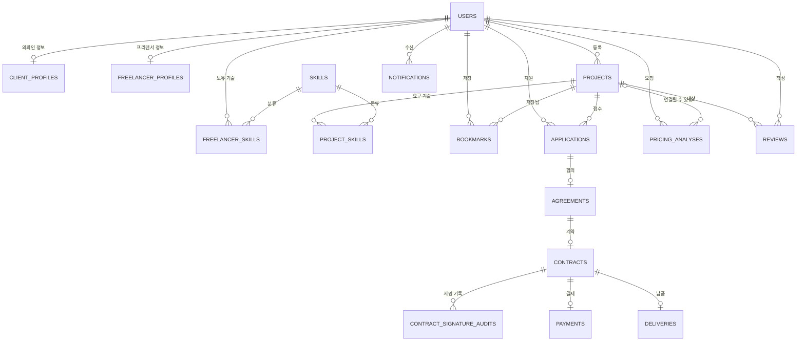

> 🔧 **`FREELANCER_SKILLS`를 추가했습니다** (N-5). 기존 ERD 그림에서 빠져 있었습니다.

### 세 축

```text
사람 축   users ─┬─ client_profiles / freelancer_profiles / freelancer_skills
모집 축   projects ─┬─ project_skills · applications · bookmarks      ★ 유동우
거래 축   applications → agreements → contracts ─┬─ signature_audits · payments · deliveries
```

## 6.3 비즈니스 불변식 30개

**강제** 열은 이 규칙을 **무엇이 막아주는가**입니다. ERD v1.4 §4 전수 대조 결과이며, 제약 수단은 §6.12에 정리했습니다.

| 표기 | 의미 |
|---|---|
| `DB` | 데이터베이스가 막는다. 코드에서 실수해도 들어가지 않는다 |
| **`App`** | **데이터베이스가 막지 못한다. 코드에서 빠뜨리면 조용히 잘못된 데이터가 쌓인다** |

> ⚠️ **v5.1에서 분류를 정정했습니다** (D-61 · 오민혁 검토의견 §5.1)
>
> v4.1의 분류에 오류가 있었습니다. **"컬럼이 없으면 그 동작이 막힌다"고 잘못 적었습니다.**
>
> ```text
> updated_at 컬럼이 없어도  →  UPDATE는 실행된다
> deleted_at 컬럼이 없어도  →  DELETE는 실행된다
> ```
>
> 컬럼의 부재는 **설계 의도의 표현**이지 강제 수단이 아닙니다. 해당 항목을 `DB` → `App`으로 옮겼습니다.
> 진짜로 막으려면 **애플리케이션 DB 역할에서 해당 테이블의 `UPDATE`/`DELETE` 권한을 회수**하거나 guard 트리거를 걸어야 합니다.

### 사용자

| # | 규칙 | 강제 |
|---|---|---|
| I-01 | 이메일은 중복될 수 없다 | `DB` |
| I-02 | 한 사용자는 한 역할만 갖는다 | `DB` |

### 프로젝트 ★ 유동우

| # | 규칙 | 강제 |
|---|---|---|
| I-03 | **`projects`에 `status`라는 단일 필드는 없다** | `DB` |
| I-04 | 거래 상태가 `NONE`이 아니면 모집 상태는 반드시 `CLOSED`다 | `DB` |
| **I-05** | **프로젝트는 물리 삭제하지 않는다** | **`App`** |
| **I-06** | **삭제된 프로젝트는 공개 목록·상세·추천·북마크 목록에 나타나지 않는다** | **`App`** |
| **I-07** | **프로젝트는 반드시 기술을 하나 이상 요구한다** | **`App`** |
| I-08 | 마감 시각은 시작 시각보다 뒤다 | `DB` |
| **I-27** | **마감 시각은 반드시 존재한다** (D-01) | `DB` |
| **I-28** | **마감 시각은 등록 시점 + 365일을 넘지 않는다** (D-01) | `DB` |
| **I-29** | **`CANCELED`가 된 프로젝트는 다른 거래 상태로 되돌아가지 않는다** (D-04) | **`App`** |
| **I-30** 🆕 | **`COMPLETED`는 납품 `APPROVED`와 정산 `RELEASED`가 모두 충족된 경우에만 된다** (D-68) | **`App`** |

**I-30은 이미 §5.4 `completeProjectTransaction`의 호출 조건으로 적혀 있던 규칙입니다.** 불변식으로 승격합니다.

계약의 "호출 조건"은 **호출자가 지키기로 한 약속**이고, 불변식은 **어겼을 때 데이터가 잘못됐다고 판정하는 기준**입니다. 조건으로만 두면 호출자가 어겼을 때 이쪽에서 그것을 오류로 부를 근거가 없습니다.

> ERD v1.4가 이 규칙을 교차 테이블 무결성 I-38로 별도 정리했습니다. **같은 규칙이며, 번호만 다릅니다.**
> 이 문서에서는 `I-30`, ERD에서는 `I-38`입니다. 다른 규칙이 아닙니다.
>
> 판정에 필요한 값(`deliveries.status` · `payments.status`)이 전부 조준영 담당 테이블에 있으므로,
> **강제 주체는 호출 시점의 애플리케이션 검증**입니다. DB가 막아줄 수 있는 형태가 아닙니다.

> 마감 기간 **하한**(등록 + 1일 · D-09)은 DB 제약이 아니라 애플리케이션 검증입니다.
> §9.4의 시연 시드(P12, 마감 1일)가 이 제약을 우회해야 하기 때문입니다.
> **DB가 막지 않으므로 §13의 API 검증이 유일한 방어선입니다.**

### 지원

| # | 규칙 | 강제 |
|---|---|---|
| I-09 | 같은 프리랜서는 같은 프로젝트에 **한 번만** 지원할 수 있다 | `DB` |
| I-10 | 한 프로젝트에서 수락된 지원은 **최대 1건**이다 | `DB` |
| I-11 | 지원 이력은 프로젝트가 삭제돼도 남는다 | `DB` |

### 북마크 ★ 유동우

| # | 규칙 | 강제 |
|---|---|---|
| I-12 | 같은 프리랜서·같은 프로젝트 조합은 **최대 1건**이다 | `DB` |
| **I-13** | **북마크는 프리랜서만 가질 수 있다** | **`App`** |
| **I-14** | **북마크 해제는 실제로 지운다** | **`App`** ← 정정 |

### 거래

| # | 규칙 | 강제 |
|---|---|---|
| I-15 | 한 지원서에 합의는 최대 1건 | `DB` |
| I-16 | 한 합의에 계약은 최대 1건 | `DB` |
| I-17 | 한 계약에 결제는 최대 1건 | `DB` |
| I-18 | 한 계약에 납품은 최대 1건 (MVP) | `DB` |
| **I-19** | 같은 계약·같은 서명자의 서명 기록은 최대 1건. **재서명해도 처음 시각을 덮어쓰지 않는다** | `DB` + **`App`** |
| I-20 | 결제는 주문 식별자와 결제 키로 중복이 막힌다 | `DB` |
| **I-21** | **거래 이력은 물리 삭제하지 않는다** | **`App`** ← 정정 |

### 알림 · 리뷰 · AI 분석

| # | 규칙 | 강제 |
|---|---|---|
| I-22 | 같은 사건에 대한 알림은 한 번만 생성된다 | `DB` |
| **I-23** | 같은 프로젝트·같은 방향의 리뷰는 1건 (`DB`). **수정 불가는 `App`** | `DB` + **`App`** ← 정정 |
| **I-24** | **리뷰는 거래 상태가 `COMPLETED`일 때만 작성 가능** | **`App`** |
| I-25 | AI 분석의 프로젝트 연결은 비어 있을 수 있다 | `DB` |
| **I-26** | **같은 AI 분석을 예산에 두 번 적용하지 않는다** | `DB` + **`App`** ← 정정 |

### 강제 주체 집계 `DECIDED` (D-61)

| 구분 | 건수 |
|---|---|
| `DB`만으로 막힘 | **17** |
| **`App`이 지켜야 함** | **9** |
| 둘 다 필요 | **3** (I-19 · I-23 · I-26) |

> v4.1에 적힌 `DB 20 / App 8 / 혼합 1`은 오류였습니다. ERD 문서의 집계를 검증 없이 옮겨 적은 것입니다.

**I-26을 `DB` + `App`으로 올린 이유**: **"아직 적용되지 않았고 승인된 분석"이라는 조건을 갱신문 자체에 실으면** DB가 중복 적용을 막습니다. 조회와 갱신을 두 단계로 나누면 그 사이에 다른 요청이 끼어듭니다.

갱신 대상이 없었으면 `409`로 응답합니다. 실제 문장과 컬럼명은 ERD와 오민혁 구현이 정합니다 (D-50 · D-80).

영향 행이 0이면 이미 적용됐거나 승인되지 않은 분석입니다. **앱이 별도로 검사하지 않아도 경합이 막힙니다.**

### 🔴 DB가 막지 못하는 9건 — 테스트 필수

| # | 규칙 | 어기면 |
|---|---|---|
| I-05 | 물리 삭제 금지 | 지원 이력이 참조하던 프로젝트가 사라짐 |
| I-06 | 삭제된 프로젝트 미노출 | 지원할 수 없는 프로젝트가 목록·추천에 나타남 |
| I-07 | 기술 1개 이상 | 추천 로직의 기술 겹침 계산이 무의미해짐 |
| I-13 | 북마크는 프리랜서만 | 의뢰인이 자기 프로젝트를 북마크할 수 있게 됨 |
| I-19 | 재서명 시각 덮어쓰기 금지 | 서명 시각이 바뀌어 계약 증거로서 의미를 잃음 |
| **I-14** | **북마크 해제는 실제 삭제** | 삭제 컬럼이 없어도 소프트 삭제 코드를 짜면 규칙이 깨짐 |
| **I-21** | **거래 이력 물리 삭제 금지** | 컬럼이 없어도 `DELETE`는 실행됨. 권한 회수 또는 트리거 필요 |
| I-24 | 리뷰는 `COMPLETED`일 때만 | 거래가 끝나지 않았는데 평가가 남음 |
| I-26 | 같은 분석 두 번 적용 금지 | 예산이 중복 반영됨 |
| I-29 | `CANCELED` 되돌리기 금지 | 취소된 프로젝트가 다시 진행됨 |

**이 9건은 §10 Acceptance Criteria의 필수 검증 대상입니다.** 어겨도 오류가 나지 않고 데이터만 조용히 오염되므로, 증상이 화면에 보일 때쯤이면 이미 되돌리기 어렵습니다.

## 6.4 금액 6종

| 필드 | 어디에 | 무슨 뜻 | 누가 정함 |
|---|---|---|---|
| `recommendedAmount` | `pricing_analyses` | AI가 추천한 금액 | AI |
| `budgetAmount` | `projects` | 의뢰인이 책정한 예산 | 의뢰인 |
| `agreedAmount` | `agreements` · `contracts` | 실제 합의 금액 | 양측 |
| `paymentAmount` | `payments` | 실제 결제 금액 | 시스템 |
| `platformFeeAmount` | `payments` | 플랫폼 수수료 | 시스템 |
| `settlementAmount` | `payments` | 프리랜서 지급액 | 시스템 |

```text
paymentAmount     = agreedAmount
platformFeeAmount = paymentAmount × 10%
settlementAmount  = paymentAmount − platformFeeAmount

통화: KRW 고정 (MVP)    단위: 원 단위 정수. 소수점 없음
```

`CONFIRMED` — RFP §3.6.3

**1원 미만 처리: 버림** `DECIDED` (D-14)

```text
platformFeeAmount = floor(paymentAmount × 0.1)
settlementAmount  = paymentAmount − platformFeeAmount
```

수수료를 버리면 남는 1원은 프리랜서에게 갑니다. **플랫폼이 손해를 감수하는 방향**이 분쟁 소지가 적습니다.

## 6.5 시각 필드

| 필드 | 무슨 뜻 |
|---|---|
| `recruitmentStartAt` | 모집이 시작되는 시각. 비어 있으면 즉시 시작 |
| **`recruitmentDeadlineAt`** | 모집이 끝나는 시각. **필수. 등록 시점 + 365일 이내** |
| `clientSignedAt` / `freelancerSignedAt` | 각각이 서명한 시각. 둘 다 있어야 계약 체결 |
| `readAt` | 알림을 읽은 시각 |
| `reviewedAt` / `appliedAt` | AI 분석 검토 / 예산 반영 시각 |
| `deletedAt` | 소프트 삭제 시각 |
| `createdAt` / `updatedAt` | 생성·수정 시각 |

```text
저장·판단: UTC 기준    API 표현: ISO 8601
상태 판단의 기준 시각은 언제나 서버 시간
```

## 6.6 삭제와 보존 정책

| 대상 | 방식 | 이유 |
|---|---|---|
| `projects` | **소프트 삭제** | 계약·결제·지원 이력이 참조 중 |
| `applications` | 삭제하지 않음 | 프리랜서의 지원 이력 |
| `agreements` · `contracts` · `payments` · `deliveries` | 삭제하지 않음 | 거래·정산 이력 |
| `reviews` | 삭제하지 않음 | 평판 데이터 |
| `bookmarks` | **실제 삭제** | 사용자 편의 데이터 |
| `notifications` | **MVP에서 삭제하지 않음** | 22일 시연 범위에서 문제되지 않음 (D-13) |

## 6.7 공개 응답과 내부 응답

| 필드 | 공개 | 내부 |
|---|---|---|
| `projectId` · `title` · `description` · `category` | ✅ | ✅ |
| `budgetAmount` · `skills` | ✅ | ✅ |
| `recruitmentStartAt` · `recruitmentDeadlineAt` | ✅ | ✅ |
| `recruitmentStatus` | ✅ | ✅ |
| 의뢰인 공개 정보 · 지원자 수 | ✅ | ✅ |
| **`transactionStatus`** | ❌ | ✅ |
| **`deletedAt`** | ❌ | ❌ |

`CONFIRMED` — RFP §3.2.3

## 6.8 MVP에 넣지 않는 것

```text
tenant              organization        freelancer_team     project_party
proposal            scope_pack          scope_item          milestone
acceptance_criterion (제품 테이블로서)   evidence            change_request
qa_review           defect              handover            warranty
dispute             project_outcome prediction
```

`CONFIRMED`

**Assurance에서 채택한 원칙**: 상태 명시 관리 · 시각 기록 · 서명자 추적 · AI 검토 상태 보존 · 금액 의미 분리 · 소프트 삭제

> **Acceptance Criteria는 QA 문서의 검증 기준입니다.** `acceptance_criterion` 제품 테이블을 만드는 게 아닙니다.

## 6.9 알림 보관 정책 `DECIDED` (D-13)

```text
MVP에서는 알림을 삭제하지 않는다.
알림 목록 조회는 최근 100건까지만 반환한다.
```

**이유**: 22일 시연 범위에서 알림이 수백 건 쌓일 일이 없습니다. 삭제 정책을 만드는 비용이 이득보다 큽니다.
다만 목록 조회에 상한을 두지 않으면 계정 하나가 오래 쓰였을 때 응답이 무한정 커집니다. 조회 상한만 겁니다.

> 운영 단계에서는 보관 기간 정책이 필요합니다. **MVP 범위 밖**으로 명시합니다.

---

## 6.10 ERD 확정 절차 `DECIDED` (D-06)

### 작성 주체

저장소 구조 발표(2-1)에서 팀은 **대안 A(팀장이 ERD·RFP 해석·디자인 시스템을 전부 작성)를 기각했었습니다.**

> 기각 사유: *"RFP가 ERD 설계를 팀 학습 목표로 명시하고 있어, 팀원이 데이터 모델링 경험을 놓치게 됩니다."*

RFP §2도 "핵심 엔티티 도출 및 관계 정의, ERD 작성"을 학습 목표로 명시합니다.
**그러나 기각된 것은 대안 A 패키지 전체였고, 리뷰 절차를 포함한 새 안은 다른 제안입니다.**
2026-08-17 재검토를 거쳐 **김락원이 ERD를 작성하는 것으로 확정**됐습니다.

### 진행 순서

| 순서 | 누가 | 무엇을 | 상태 |
|---|---|---|---|
| 1 | 유동우 | 엔티티 19종 · 관계 · 불변식 30개 초안 제공 | ✅ 완료 |
| 2 | **김락원** | 엔티티 · 관계 · 키 · 카디널리티 · 명명 전체 작도 | ✅ **완료 — ERD v1.4** |
| 3 | **전원** | 자기 담당 엔티티의 필드·관계 확인 및 수정 요청 (병렬) | 🟡 **~2026-08-21(금) 24:00** |
| 4 | **김락원** | 수정 반영 → `REVOKE` 적용 결정 → PNG/PDF 산출 → 제출 | ⬜ 대기 |

3단계 응답 현황입니다. **오민혁·조준영은 반영 완료, 최윤석은 대기 중입니다.**

| 담당 | 상태 |
|---|---|
| 오민혁 | ✅ 검토의견 제출 · v1.2에 반영 (E-13~E-16 · E-20 · E-21) |
| 조준영 | ✅ 승인요청서 제출 · v1.2에 반영 (E-17~E-19) |
| **유동우** | ✅ **2026-08-20 회신** — `PactFive_ERD_v1.2_회신_유동우` |
| 최윤석 | ⬜ 대기 |

**3단계는 기한부 무응답 승인으로 진행합니다** `CONFIRMED` (ERD E-09)

금요일까지 의견이 없는 항목은 ERD v1.3에 적힌 안대로 확정되고, 이후 변경은 결정 이력에 기록하고 진행합니다.
값 자체가 존재하지 않는 두 항목(리뷰 태그 코드 목록 · PG사)은 예외이며 조준영의 직접 답변이 필요합니다.

> 이 방식은 3단계가 응답을 기다리며 4단계를 무기한 막는 구조를 끊기 위한 것입니다.
> 22일 일정에서 Step 1 착수를 더 미룰 수 없으므로, **검토 창은 열어두되 끝나는 시점을 명시**합니다.

> ✅ **2026-08-17 확정: 김락원이 ERD를 작성합니다.**
> §6.1~§6.3의 엔티티 · 관계 · 불변식 30개가 ERD 작성 재료입니다. 리뷰 단계에서 `projects` · `project_skills` · `bookmarks`를 확인합니다.

**각자 자기 엔티티를 확정하므로 학습 목표가 유지되고, 김락원은 전체 정합성과 산출물 품질을 책임집니다.**

### 도구 제안 `RECOMMENDATION`

| 도구 | 이유 |
|---|---|
| **dbdiagram.io** | 텍스트 기반이라 Git으로 버전 관리 가능 · PNG/PDF export 지원 · 무료 |
| draw.io | 자유도 높지만 텍스트 diff가 안 됨 |

RFP §4가 두 도구를 예시로 들고 있습니다. **dbdiagram.io를 권합니다** — 스펙이 바뀔 때마다 다시 그리는 비용이 낮습니다.

### 담당별 검증 범위

| 담당자 | 확인할 엔티티 |
|---|---|
| 오민혁 | `users` · **`auth_sessions`** · `client_profiles` · `freelancer_profiles` · `skills` · `freelancer_skills` · `pricing_analyses` |
| **유동우** | **`projects` · `project_skills` · `bookmarks`** |
| 최윤석 | `applications` · `notifications` |
| 조준영 | `agreements` · **`negotiation_offer`** · `contracts` · `contract_signature_audits` · `payments` · `deliveries` · `reviews` |

## 6.11 PRD와 ERD의 경계 `CONFIRMED` (D-49)

**이 절이 v5.0에서 신설된 이유**

ERD는 앞으로 계속 바뀝니다. v1.1 → v1.2가 하루 만에 나왔고, 컬럼명 5개가 한 번에 바뀌었습니다.
PRD 본문 여기저기에 컬럼명이 박혀 있으면 **ERD가 바뀔 때마다 PRD 전체를 훑어야 합니다.**

그래서 경계를 이렇게 긋습니다.

| PRD가 정본인 것 | ERD가 정본인 것 |
|---|---|
| **불변식** — 무엇이 깨지면 안 되는가 (§6.3) | 테이블명 · 컬럼명 · 타입 |
| **API 요청·응답 필드명** (§13) | 인덱스 · 제약의 구현 형태 |
| **상태값 이름과 전이 규칙** (§2) | 마이그레이션 순서 |
| **화면 문구** (§14) | 물리 스키마 |

### 세 가지 규칙

```text
1. PRD 본문은 DB 컬럼명을 쓰지 않는다.
   개념명(camelCase)으로 쓰고, §6.12 매핑표에서만 실제 컬럼과 연결한다.

2. PRD는 "무엇을 보장해야 하는가"를 정하고,
   그것을 CHECK로 막을지 · 인덱스로 막을지 · 코드로 막을지는 ERD와 구현이 정한다.

3. ERD가 바뀌면 §6.12 한 절만 고친다. 본문은 그대로 둔다.
```

> 🔑 **이 규칙의 실효를 판정하는 방법**: ERD에서 컬럼 이름을 하나 바꿨을 때, PRD에서 고쳐야 하는 곳이 **§6.12 한 칸**이면 성공입니다. 두 곳 이상이면 그 항목이 본문으로 새어 나온 것입니다.

## 6.12 ERD 매핑표 — **ERD가 바뀌면 여기만 고칩니다**

PRD가 요구하는 개념이 ERD v1.4에서 어디에 담기는지입니다. **왼쪽은 PRD가 정하고, 오른쪽은 ERD가 정합니다.**

**대조 기준**: `PactFive_ERD_v1.4.dbml` · `Table projects` · `Table bookmarks` (2026-08-25 원본 확인)

> ⚠️ **오른쪽 칸은 "ERD에 실제로 있는 것"만 적습니다.** 요청했으나 아직 반영되지 않은 것은
> `🔺 요청 중`으로 구분합니다. 있다고 적어두고 없으면, 구현 단계에서 스키마를 짜다가 그 자리에서 멈춥니다.
>
> **현재 `🔺 요청 중` 항목은 0건입니다.**

### 프로젝트 ★ 유동우

| PRD 개념 (본문 표기) | 무엇을 보장하는가 | ERD v1.4 컬럼 |
|---|---|---|
| `title` · `description` · `category` · `budgetAmount` | 등록 필수 입력 | `title` · `description` · `category` · `budget_amount` |
| `recruitmentStartAt` · `recruitmentDeadlineAt` | 모집 기간 | `recruitment_start_at` · `recruitment_deadline_at` |
| `recruitmentStatus` · `transactionStatus` | 이중 상태 (§2) | `recruitment_status` · `transaction_status` |
| **`applicationCount`** | 누적 지원 수 · **표시 전용** | `application_count` |
| `recruitmentClosedAt` · `canceledAt` | 마감·취소 이력 | `recruitment_closed_at` · `canceled_at` |
| **`deadlineNotifiedAt`** | 마감 알림 발송 사실 (§2.3) | `deadline_notified_at` |
| `deletedAt` | 소프트 삭제 (I-05) | `deleted_at` |
| **`pendingApplicationCount`** | 대기 중 지원 수 · **잠금 판정용** | `pending_application_count` |
| **`acceptedApplicationId`** | 수락 멱등 판정 (D-41) | `accepted_application_id` |
| **`paymentPendingAt`** | 결제 시작 통보 (D-40) | `payment_pending_at` |
| **`projectVersion`** | 낙관적 잠금 (D-53) | `project_version` |

### 컬럼 4종 — ERD v1.3에서 반영 완료 `CONFIRMED` (D-65 종결 · D-79 정정)

**구현 착수의 유일한 블로커였던 항목입니다.** ERD v1.3(E-23)에서 네 개 전부 반영됐습니다.

| 컬럼 | 없으면 무엇이 막혔는가 | 상태 |
|---|---|---|
| `pending_application_count` | 예산·일정 잠금 판정 자체가 불가능 (§3.4 핵심 규칙) | ✅ **ERD v1.3 반영** |
| `payment_pending_at` | 결제 확정 후 취소가 성공하는 구간이 열림 | ✅ **ERD v1.3 반영** |
| `accepted_application_id` | 정상 재시도가 `409`를 받고 화면에 사실과 다른 안내 | ✅ **ERD v1.3 반영** |
| `project_version` | 재제안·수락·취소 동시 발생 시 경합 판정 불가 | ✅ **ERD v1.3 반영** |

**ERD v1.3 반영 결과를 원본에서 직접 확인했습니다.** (`PactFive_ERD_v1.3.dbml` · `Table projects`)

> 이 표가 한때 틀렸던 원인은 §4.7 감사 규칙을 어긴 것이었습니다 — "있다"고 적기 전에 원본을 열어 확인하지 않았습니다.
> **이번에는 확인하고 적었습니다.** 앞으로도 이 표를 고칠 때는 ERD 원본에서 컬럼명을 검색한 뒤에 적습니다.

> ⚠️ **`project_version` 증가 경계는 구현 시 반드시 지켜야 합니다.**
> ERD v1.3이 같은 주의를 달았습니다 — **상태 전이 계약 호출 시에만 +1**입니다.
> 협상 중 설명 한 줄 고치는 것 같은 일반 수정에도 증가시키면 상대 요청이 불필요하게 `409`로 튕깁니다. (D-53)

### 북마크 ★ 유동우

| PRD 개념 | 무엇을 보장하는가 | ERD v1.4 |
|---|---|---|
| 프리랜서·프로젝트 조합 1건 | I-12 | `UNIQUE (freelancer_id, project_id)` |
| 해제는 실제 삭제 | I-14 | 삭제 컬럼을 두지 않음 |
| 목록 정렬 안정성 | 페이지네이션 중복·누락 방지 | 대리키 `id` |

### 불변식의 구현 위임

**§6.3이 규칙을 정하고, ERD가 그것을 어디에 새길지 정합니다.** PRD는 SQL 원문을 복사해 두지 않습니다.

| PRD가 요구 | ERD v1.4가 택한 수단 |
|---|---|
| I-04 거래≠NONE ⇒ 모집=CLOSED | `CHECK` 제약 |
| I-08 마감 > 시작 | `CHECK` 제약 |
| I-28 마감 ≤ 등록+365일 | `CHECK` 제약 |
| I-10 수락 지원 최대 1건 | 부분 유니크 인덱스 |
| I-12 북마크 조합 1건 | `UNIQUE` |
| 제목 5~100자 · 설명 20~5000자 (D-19) | `CHECK` 제약 |
| 예산 > 0 | `CHECK` 제약 |
| 마감 기간 하한 1일 (D-09) | **애플리케이션 검증** — 시연 시드가 우회해야 함 |

> **수단이 바뀌어도 PRD는 안 바뀝니다.** 예를 들어 I-10을 부분 인덱스 대신 트리거로 막기로 해도,
> PRD가 요구하는 것은 여전히 "한 프로젝트에서 수락된 지원은 최대 1건"입니다.

### 다만 이것만은 PRD가 못박습니다

수단은 위임하되, **"코드로만 막는 항목은 반드시 테스트로 검증한다"**는 요구는 PRD가 유지합니다.
`CHECK` 제약이 빠지면 **"모집 중인데 이미 계약이 진행 중인 프로젝트"** 같은 데이터가 조용히 들어가고,
화면에서 증상이 보일 때쯤이면 이미 오염된 뒤입니다. 해당 항목은 §6.3의 🔴 목록과 §10 AC에 있습니다.

| 알아둘 것 | 내용 |
|---|---|
| ORM 한계 | Prisma 스키마 파일에 `CHECK` 제약을 적을 수 없습니다. 마이그레이션 SQL을 직접 손봐야 합니다 |
| 동기화 | 스키마를 바꾸는 PR에 ERD 원본 수정을 함께 포함합니다 (§0.5 T10) |
| 제약 원문 | **ERD 문서가 정본입니다.** PRD는 사본을 두지 않습니다 — 두면 반드시 어긋납니다 |

---

---

# 7. 화면 목록

**유동우 담당 화면만** 다룹니다. 다른 담당자 화면은 진입·이탈 지점만 표시합니다.
화면 배치·디자인은 자유이며, 여기 적힌 **진입 조건 · 표시 데이터 · CTA · 상태 변화 · 오류 처리**만 보장하면 됩니다.

## 7.1 화면 목록

| ID | 화면 | Actor | 담당 |
|---|---|---|---|
| SCR-B01 | 프로젝트 목록 | 전원 | **유동우** |
| SCR-B02 | 프로젝트 상세 | 전원 | **유동우** |
| SCR-B03 | 프로젝트 등록 — Step 1 기본 정보 | 의뢰인 | **유동우** |
| SCR-B04 | 프로젝트 등록 — Step 2 일정·예산 | 의뢰인 | **유동우** |
| SCR-B05 | 프로젝트 등록 — Step 3 필요 기술 + 확인 | 의뢰인 | **유동우** |
| SCR-B06 | 프로젝트 수정 | 의뢰인(등록자) | **유동우** |
| SCR-B07 | 내 프로젝트 | 의뢰인 | **유동우** |
| SCR-B08 | 내 북마크 | 프리랜서 | **유동우** |
| SCR-B09 | 추천 프로젝트 (SCR-B02 하단 섹션) | 전원 | **유동우** |
| **SCR-B10** 🆕 | **재모집 확인** — 협상 중 마감일이 지난 프로젝트 | 의뢰인(등록자) | **유동우** |
| — | 홈/랜딩 · 로그인 · 프로필 | — | 오민혁 |
| — | 지원 관리 · 내 지원 현황 · 알림 | — | 최윤석 |
| — | 합의 · 계약서 · 결제 · 납품 · 리뷰 | — | 조준영 |

## 7.2 화면 상세

### SCR-B01 프로젝트 목록

| 항목 | 내용 |
|---|---|
| **진입** | 헤더 메뉴 · 홈 검색창 · 홈 카테고리 버튼 · 빈 북마크 안내 |
| **권한** | 누구나 (비로그인 포함) |
| **표시** | 프로젝트 카드 (제목 · 카테고리 · 예산 · 기술 · 마감일 · 모집 상태 배지 · 지원자 수) · 전체 건수 · 페이지 |
| **기본 조회** | **모집 예정 + 모집 중만.** 마감·삭제 제외 (D-08) |
| **검색·필터** | 키워드 · 카테고리 · 기술(다중) · 예산 범위 · 모집 상태 · 마감일 |
| **정렬** | 최신순(기본) · 마감임박순 · 예산 높은순 |
| **CTA** | 카드 클릭 → SCR-B02 · 필터 초기화 |
| **API** | `GET /api/v1/projects` |
| **빈 상태** | "조건에 맞는 프로젝트가 없습니다" + 필터 초기화 버튼 |
| **오류** | 없음 (빈 결과는 정상) |
| **AC** | PM-17~26 |

### SCR-B02 프로젝트 상세

| 항목 | 내용 |
|---|---|
| **진입** | 목록 · 북마크 목록 · 추천 섹션 · 내 프로젝트 · 알림 클릭 · 직접 URL |
| **권한** | 누구나. **거래 상태는 등록 의뢰인에게만** |
| **표시** | 제목 · 설명 · 카테고리 · 예산 · 필요 기술 · 모집 기간 · 모집 상태 배지 · 의뢰인 공개 정보 · 지원자 수 · 하단 추천 4건 |
| **미표시** | `transactionStatus` (등록 의뢰인 제외) · 지원서 내용 · 계약/결제 정보 |
| **CTA** | 역할별 — §3.3 CTA 표 참조 |
| **API** | `GET /api/v1/projects/:projectId` + `GET .../recommendations` + 북마크 API |
| **오류** | 없거나 삭제됨 → "프로젝트를 찾을 수 없습니다" (404) |
| **AC** | PM-14~16, EN-16~21 |

### SCR-B03 등록 Step 1 — 기본 정보

| 항목 | 내용 |
|---|---|
| **진입** | 헤더 "프로젝트 등록" · 내 프로젝트의 "새 프로젝트" |
| **진입 검사** | 비로그인 → 로그인 / 프리랜서 → 차단 / **프로필 미완성 → 프로필 화면 후 복귀** |
| **검사 시점** | **여기서 1회만.** Step 2·3에서 다시 검사하지 않음 (D-03) |
| **입력** | 제목 · 설명 · 카테고리(선택형 6종) |
| **CTA** | 다음 → SCR-B04 · 취소 → 목록 |
| **오류** | 필수 누락 · 길이 위반 · 정의되지 않은 카테고리 |
| **AC** | PM-01~05, PM-11 |

### SCR-B04 등록 Step 2 — 일정 · 예산

| 항목 | 내용 |
|---|---|
| **진입** | Step 1 통과 |
| **입력** | 모집 시작일(선택) · **모집 마감일(필수, 기본값 오늘+30일 미리 채워짐)** · 예산 |
| **제약** | 마감일 > 현재 · 마감일 ≤ 현재+365일 · 마감일 > 시작일 · 예산 > 0 정수 |
| **보조 안내** | "모집 기간은 7일 이상을 권장합니다" (D-09) |
| **분기** | **AI 단가 분석** 진입 → 결과 반영 시 예산이 채워진 채로 복귀 |
| **CTA** | 이전 → SCR-B03 · 다음 → SCR-B05 · AI 분석 |
| **오류** | 과거 마감일 · 1년 초과 · 순서 위반 · 예산 0 이하 |
| **AC** | PM-06~09 |

### SCR-B05 등록 Step 3 — 필요 기술 + 최종 확인

| 항목 | 내용 |
|---|---|
| **진입** | Step 2 통과 |
| **입력** | 필요 기술 다중 선택 (32종 중, 최소 1개) |
| **표시** | 1~3단계 입력값 전체 요약 |
| **CTA** | 이전 → SCR-B04 · 각 단계로 이동 · **등록** |
| **성공** | 프로젝트 생성 (`SCHEDULED` 또는 `OPEN` + `NONE`) → SCR-B02로 이동 |
| **실패** | 이 화면에 머무름. 입력값 유지 |
| **AC** | PM-01, PM-10, PM-12, PM-13 |

### SCR-B06 프로젝트 수정

| 항목 | 내용 |
|---|---|
| **진입** | SCR-B02 · SCR-B07의 수정 버튼 |
| **권한** | 등록 의뢰인만 |
| **표시** | 기존 값이 채워진 폼 |
| **잠금** | **대기 중 지원 ≥ 1건이면 예산·시작일·마감일 입력란 비활성** + 사유 안내 |
| **완전 차단** | 마감·거래 단계 프로젝트는 수정 버튼 자체 미노출 |
| **재모집 시** | **예산·일정 입력란 재활성** + "조건을 조정해 다시 모집할 수 있습니다" (D-07) |
| **API** | `PATCH /api/v1/projects/:projectId` |
| **오류** | 403 권한 · 409 잠금/상태충돌 · 422 값 검증 |
| **AC** | PM-27~34 |

### SCR-B07 내 프로젝트 (의뢰인)

| 항목 | 내용 |
|---|---|
| **진입** | 헤더 메뉴 |
| **권한** | 의뢰인 본인 |
| **표시** | 내 프로젝트 카드 + **모집 상태 + 거래 상태 둘 다** · 지원자 수 |
| **CTA** | 상세 · 수정 · **모집 마감** · **취소** · 삭제 · 지원자 관리(최윤석 화면으로) |
| **버튼 노출** | `삭제`는 **대기 지원 0건일 때만** (D-28) · `취소`는 결제 전까지만 · `CLOSED+NONE`에서는 취소 미노출 (D-34) |
| **API** | `GET /api/v1/clients/:clientId/projects` + 마감/취소/삭제 API |
| **확인** | 마감·취소·삭제는 되돌릴 수 없으므로 확인 단계 필요 `RECOMMENDATION` |
| **빈 상태** | "등록한 프로젝트가 없습니다" + 등록 버튼 |
| **AC** | PM-16, PM-35~37, PM-41~47 |

### SCR-B08 내 북마크 (프리랜서)

| 항목 | 내용 |
|---|---|
| **진입** | 헤더 메뉴 |
| **권한** | 프리랜서 본인. **남의 것은 조회 불가** |
| **표시** | 저장한 프로젝트 카드. 최근 저장순. 10개/페이지 |
| **제외** | 삭제된 프로젝트 |
| **유지** | **마감된 프로젝트는 남김.** 마감 배지 + 지원 CTA 비활성 |
| **CTA** | 상세 이동 · 북마크 해제 · 지원하기(모집 중만) |
| **API** | `GET /api/v1/bookmarks` · `DELETE .../bookmarks` |
| **빈 상태** | "저장한 프로젝트가 없습니다" + 프로젝트 둘러보기 |
| **AC** | EN-10~15 |

### SCR-B09 추천 프로젝트 (SCR-B02 하단)

| 항목 | 내용 |
|---|---|
| **진입** | SCR-B02 진입 시 자동 로드 |
| **권한** | 누구나 |
| **표시** | **정확히 4건.** 후보가 적으면 있는 만큼 |
| **후보** | 삭제 안 됨 + 모집 중 + 현재 프로젝트 제외 |
| **순서** | 카테고리+기술 → 카테고리 → 기술 → 최신순 |
| **미표시** | `transactionStatus` · 내부 점수 |
| **CTA** | 카드 클릭 → 해당 프로젝트 SCR-B02 |
| **빈 상태** | **섹션 자체를 감춤** |
| **AC** | EN-16~21 |

### SCR-B10 재모집 확인 🆕 `DECIDED` (D-71)

**협상이 오가는 사이에 마감일이 지나면, 복원 후 프로젝트가 `CLOSED + NONE`이 됩니다.**
의뢰인은 협상하느라 시간을 보냈는데 재모집도 불가능한 상태가 되므로, 마감일 연장 여부를 직접 결정하게 합니다.

| 항목 | 내용 |
|---|---|
| **진입** | SCR-B07(내 프로젝트)에서 `재모집 가능` 배지가 붙은 항목 클릭 |
| **조건** | `recruitmentStatus = CLOSED` · `transactionStatus = NONE` · 취소·삭제 아님 · 대기 중 지원 0건 |
| **권한** | 등록 의뢰인만 |
| **표시** | 이전 마감일 · 협상 종료 사유(최종 거절) · 새 마감일 입력 |
| **입력 검증** | 새 마감일 > 현재 시각 · 등록 시점 + 365일 이내 (I-28) |
| **CTA** | **다시 모집하기** → `A-13` 호출 · **그만두기** → 마감 유지 |
| **성공** | `recruitmentStatus → OPEN` · `projectVersion` +1 |
| **미표시** | `transactionStatus` · 협상 상대 정보 |
| **API** | **A-13** `POST /projects/:projectId/reopen-recruitment` |
| **AC** | PM-59 · PM-60 |

> **서버가 마감일을 자동으로 늘리지 않습니다.** 프리랜서가 지원 시점에 확인한 조건이 사후에 바뀌면
> §3.4의 "지원이 들어온 뒤에는 조건을 바꿀 수 없다"는 원칙과 어긋납니다.
> **마감일 변경을 의뢰인의 명시적 결정으로 남기는 것**이 이 화면의 목적입니다 (D-57).

> 이 화면은 `restorePreContractProject` 응답의 `reopened: false`에서 출발합니다.
> **조준영 도메인에서 추가로 할 일은 없습니다.** 응답에 `reopened`를 담는 것으로 충분합니다.

## 7.3 화면 간 이동

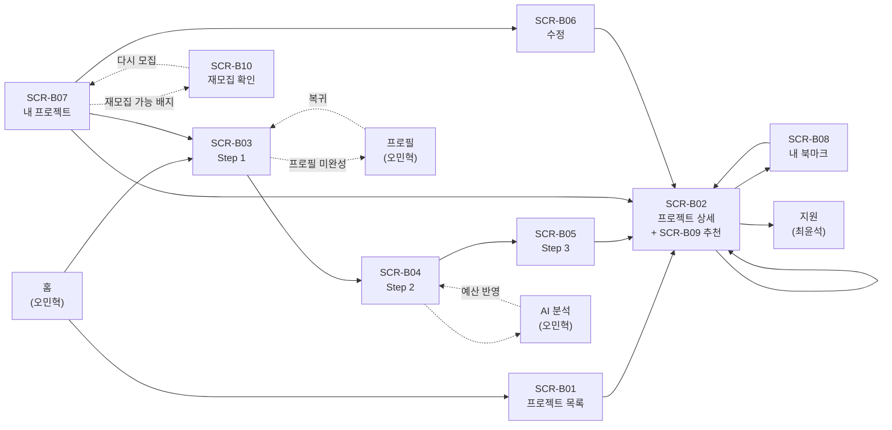

## 7.4 공통 UX 원칙

| 원칙 | 내용 | 근거 |
|---|---|---|
| 주요 액션 후 다음 단계로 유도 | 등록 성공 → 상세 / 지원 성공 → 내 지원 현황 | RFP §7.3 |
| 차단형 흐름은 원래 자리로 복귀 | 프로필 게이트 · 로그인 유도 | RFP §7.3 |
| 못 하는 건 처음부터 비활성 | 잠긴 입력란 · 마감 프로젝트의 지원 버튼 | `RECOMMENDATION` |
| 되돌릴 수 없는 액션은 확인 | 마감 · 취소 · 삭제 | `RECOMMENDATION` |
| 빈 상태에 다음 행동을 제시 | "프로젝트 둘러보기" · "필터 초기화" | `RECOMMENDATION` |
| 서버는 화면과 무관하게 항상 재검증 | 비활성화는 UX, 검증은 서버 | `CONFIRMED` |

---

# 8. 공통 코드

**전 팀 공통입니다.** 카테고리와 기술 스택은 `skills` 테이블 담당인 오민혁이 최종 확정하지만,
등록·필터·추천이 직접 의존하므로 이 문서에서 목록안을 제시합니다. (§0.2 #5에서 확정)

## 8.1 카테고리 6종 `DECIDED` (D-12, 2026-09-04 D-91로 값 정정)

| 코드 | 표시명 | 포함 예시 |
|---|---|---|
| `WEB_DEVELOPMENT` | 웹 개발 | 웹사이트 · 웹 서비스 · 관리자 페이지 · 쇼핑몰 |
| `MOBILE_APP` | 모바일 앱 | iOS · Android · 크로스플랫폼 앱 |
| `DESIGN` | 디자인 | UI/UX · 그래픽 · 브랜딩 · 영상 |
| `DATA_AI` | 데이터·AI | 데이터 분석 · 데이터 엔지니어링 · AI/ML |
| `PLANNING` | 기획 | 서비스 기획 · 데이터 기획 · PM |
| `MARKETING` | 마케팅 | 퍼포먼스 · 콘텐츠 · SEO · SNS |

**D-91 (2026-09-04)**: 원래 `APP_DEVELOPMENT`·`ETC`였다. 실제 구현이 이미 `MOBILE_APP`·
`DATA_AI`로 일관되게 굳어 있어 문서를 코드에 맞춰 정정했다 — 상세 경위는 §14.3 참고.

**왜 6종인가**

RFP §3.1.3: *"너무 세분화된 옵션은 피하고 유사한 기술은 통합하여 관리합니다."*

| 판단 | 내용 |
|---|---|
| 하한 | RFP §1.2가 "개발/디자인/마케팅"을 예시로 듭니다. 최소 3종은 필요 |
| 분리 근거 | 웹과 앱은 필요 기술이 거의 겹치지 않아 분리 |
| 기획 추가 | RFP §3.1.3 프리랜서 프로필에 "주요 활동 카테고리"가 있고, 기획 직군이 실재 |
| 기타 | RFP §3.1.3이 의뢰인 사업 분야에 "'기타' 자유 입력"을 명시. 같은 원칙 적용 |
| 상한 | 6종이면 필터 UI가 한 줄에 들어가고, 추천의 "같은 카테고리" 조건이 의미를 가짐 |

> ⚠️ 카테고리를 20종으로 늘리면 **추천이 망가집니다.** "같은 카테고리"에 해당하는 후보가 거의 없어지기 때문입니다.
> 6종은 추천 로직이 동작하기 위한 하한이기도 합니다.

**구현 형태** `CONFIRMED` (ERD v1.3 §1.1 원칙 3)

| | |
|---|---|
| 형태 | **enum (`project_category`)** — 별도 테이블을 만들지 않습니다 |
| 표시명 출처 | **공통 코드 상수.** 특정 담당자에게 의존하지 않습니다 |
| 기술 스택(§8.2)과 다른 이유 | 기술은 운영 중 늘어나고 프리랜서 커스텀 추가를 받아야 하므로 **테이블**(`skills`). 카테고리는 6종 고정 |

> 카테고리를 테이블로 만들면 엔티티가 하나 늘고, §6.10의 담당자별 검증 범위가 넓어집니다.
> **표시명이 코드 상수이므로, 카테고리 이름을 받기 위해 다른 담당자를 기다릴 필요가 없습니다.**

**ERD v1.3이 이 목록을 그대로 채택했습니다** `CONFIRMED` (ERD `Enum business_field`)

**같은 목록을 세 곳이 공유합니다** `DECIDED` (D-63 · 오민혁 검토의견 §3.2)

| 쓰는 곳 | 담당 | 의미 |
|---|---|---|
| `projects.category` | 유동우 | 이 프로젝트의 분야 |
| `freelancer_profiles.primary_category` | 오민혁 | 이 프리랜서의 주력 분야 |
| `client_profiles.business_field` | 오민혁 | 이 의뢰인의 **주요 의뢰 분야** |

> 세 곳이 같은 6종을 쓰면 **"내 주력 분야의 프로젝트만 보기"** 같은 기능이 조인 한 번으로 됩니다.
> 각자 다른 목록을 쓰면 매핑 표가 하나 더 생기고, 그 표가 어긋나면 추천이 조용히 잘못됩니다.
>
> `business_field`는 "회사의 산업군"이 아니라 **"주로 의뢰하는 분야"**로 의미를 고정합니다.
> 실제 산업군(제조·유통 등)을 저장하려면 이 필드를 재사용하지 말고 별도 분류를 두는 것이 바람직합니다.

## 8.2 기술 스택 32종 `DECIDED` (D-12)

RFP §3.1.3 예시: *"SQL로 통합하고 MySQL, PostgreSQL 개별 옵션 제거"* — 이 원칙을 그대로 적용했습니다.

**그룹 구분 8종** `CONFIRMED` (ERD v1.3 `Enum skill_group` · 오민혁 검토의견 §3.3)

```text
FRONTEND · BACKEND · MOBILE · DATA_INFRA · DESIGN · MARKETING · PLANNING · ETC
```

> 초안은 기획과 기타를 `PLANNING_ETC` 하나로 묶었으나, **필터 UI에서 서로 다른 두 그룹이 섞여 구분되지 않는다**는 지적을 받아 분리했습니다.
> 이 그룹은 **필터 화면의 묶음 표시용**입니다. 기술 32종 자체는 그대로입니다.

### 프론트엔드 (6)

| 코드 | 표시명 | 통합한 것 |
|---|---|---|
| `HTML_CSS` | HTML/CSS | SCSS · Tailwind 등 |
| `JAVASCRIPT` | JavaScript | ES6+ · Vanilla JS |
| `TYPESCRIPT` | TypeScript | — |
| `REACT` | React | Next.js 포함 |
| `VUE` | Vue | Nuxt 포함 |
| `FRONTEND_ETC` | 프론트엔드 기타 | Angular · Svelte 등 |

### 백엔드 (6)

| 코드 | 표시명 | 통합한 것 |
|---|---|---|
| `NODEJS` | Node.js | Express · NestJS 포함 |
| `JAVA` | Java | Spring · Spring Boot 포함 |
| `PYTHON` | Python | Django · FastAPI 포함 |
| `PHP` | PHP | Laravel 포함 |
| `GO` | Go | — |
| `BACKEND_ETC` | 백엔드 기타 | Ruby · C# 등 |

### 모바일 (3)

| 코드 | 표시명 | 통합한 것 |
|---|---|---|
| `IOS` | iOS | Swift · Objective-C |
| `ANDROID` | Android | Kotlin · Java |
| `CROSS_PLATFORM` | 크로스플랫폼 | React Native · Flutter |

### 데이터 · 인프라 (5)

| 코드 | 표시명 | 통합한 것 |
|---|---|---|
| `SQL` | SQL | **MySQL · PostgreSQL · Oracle 통합** ← RFP 명시 예시 |
| `NOSQL` | NoSQL | MongoDB · Redis · Firebase |
| `CLOUD` | 클라우드 | AWS · GCP · Azure |
| `DEVOPS` | DevOps | Docker · Kubernetes · CI/CD |
| `DATA_ANALYSIS` | 데이터 분석 | 데이터 엔지니어링 · BI |

### 디자인 (5)

| 코드 | 표시명 | 통합한 것 |
|---|---|---|
| `UI_UX_DESIGN` | UI/UX 디자인 | Figma · 프로토타이핑 |
| `GRAPHIC_DESIGN` | 그래픽 디자인 | 편집 · 일러스트 |
| `BRANDING` | 브랜딩 | 로고 · BI/CI |
| `VIDEO_MOTION` | 영상/모션 | 편집 · 모션그래픽 |
| `DESIGN_ETC` | 디자인 기타 | 3D · 일러스트 등 |

### 마케팅 (4)

| 코드 | 표시명 | 통합한 것 |
|---|---|---|
| `PERFORMANCE_MARKETING` | 퍼포먼스 마케팅 | 광고 운영 · 그로스 |
| `CONTENT_MARKETING` | 콘텐츠 마케팅 | 카피 · 블로그 |
| `SEO` | SEO | 검색 최적화 |
| `SNS_MARKETING` | SNS 마케팅 | 인스타 · 유튜브 운영 |

### 기획 · 기타 (3)

| 코드 | 표시명 | 통합한 것 |
|---|---|---|
| `SERVICE_PLANNING` | 서비스 기획 | PM · PO |
| `QA_TEST` | QA/테스트 | 테스트 설계 · 자동화 |
| `ETC_SKILL` | 기타 | 위에 없는 것 |

**합계 32종**

### 목록 설계 근거

| 판단 | 내용 |
|---|---|
| 왜 32종인가 | 필터 UI에서 스크롤 없이 훑을 수 있는 상한. 10종이면 매칭이 너무 거칠고, 60종이면 추천의 "겹치는 기술" 조건이 거의 안 걸림 |
| 프레임워크를 언어에 흡수 | React를 고른 사람은 Next.js도 합니다. 따로 두면 같은 사람이 두 개를 골라야 하고 매칭 정확도가 떨어집니다 |
| 각 그룹에 "기타" | 커버 못 한 기술 때문에 등록을 못 하는 상황을 막습니다 |
| 자유 입력 미허용 | RFP §3.1.3은 프리랜서 **프로필**에만 "커스텀 추가 허용"을 둡니다. **프로젝트 요구 기술은 선택형만** — 자유 입력을 허용하면 필터와 추천이 동작하지 않습니다 |

> ⚠️ **프로젝트의 `skills`와 프리랜서 프로필의 `skills`는 같은 목록을 쓰되 규칙이 다릅니다.**
> 프로필은 커스텀 추가 허용(RFP 명시), 프로젝트는 선택형만. 이 차이를 오민혁와 맞춰야 합니다.

## 8.3 오류 코드 — project-management · engagement

프론트엔드가 이 코드로 분기합니다. **메시지 문구는 바뀔 수 있지만 코드는 계약입니다.**

### 프로젝트

| 코드 | HTTP | 사용자 메시지 |
|---|---|---|
| `PROJECT_NOT_FOUND` | 404 | 프로젝트를 찾을 수 없습니다. |
| `PROJECT_FORBIDDEN` | 403 | 이 프로젝트에 대한 권한이 없습니다. |
| `PROJECT_CREATE_ROLE_REQUIRED` | 403 | 프로젝트 등록은 의뢰인만 가능합니다. |
| `PROJECT_PROFILE_REQUIRED` | 403 | 프로젝트를 등록하려면 프로필을 먼저 완성해 주세요. |
| `PROJECT_EDIT_LOCKED` | 409 | 지원자가 있어 예산과 일정은 변경할 수 없습니다. |
| `PROJECT_EDIT_CLOSED` | 409 | 마감된 프로젝트는 수정할 수 없습니다. |
| `PROJECT_DELETE_IN_TRANSACTION` | 409 | 진행 중인 거래가 있어 삭제할 수 없습니다. |
| **`PROJECT_DELETE_HAS_APPLICATIONS`** | **409** | **지원자가 있어 삭제할 수 없습니다. 프로젝트 취소를 이용해 주세요.** 🆕 D-28 |
| `PROJECT_CANCEL_AFTER_PAYMENT` | 409 | 이미 결제가 완료되어 취소할 수 없습니다. |
| `PROJECT_TRANSITION_CONFLICT` | 409 | 프로젝트 상태가 변경되어 처리할 수 없습니다. |
| **`PROJECT_VERSION_CONFLICT`** | **409** | **프로젝트 정보가 변경되었습니다. 새로고침 후 다시 시도해 주세요.** 🆕 D-53 |
| **`PROJECT_ALREADY_RESTORED`** | **409** | **이미 다른 협상으로 복원된 프로젝트입니다.** 🆕 D-42 |

### 입력 검증

| 코드 | HTTP | 사용자 메시지 |
|---|---|---|
| `VALIDATION_ERROR` | 422 | 입력값을 확인해 주세요. (`details`에 필드별 사유) |
| `DEADLINE_MUST_BE_FUTURE` | 422 | 마감일은 현재 시각보다 뒤여야 합니다. |
| `DEADLINE_EXCEEDS_LIMIT` | 422 | 모집 기간은 최대 1년까지 설정할 수 있습니다. |
| **`DEADLINE_BELOW_MINIMUM`** | **422** | **모집 기간은 최소 1일 이상이어야 합니다.** 🆕 감사 발견 |
| `DEADLINE_BEFORE_START` | 422 | 마감일은 모집 시작일보다 뒤여야 합니다. |
| `BUDGET_MUST_BE_POSITIVE` | 422 | 예산은 0보다 큰 금액이어야 합니다. |
| `INVALID_CATEGORY` | 422 | 선택할 수 없는 카테고리입니다. |
| `INVALID_SKILL` | 422 | 선택할 수 없는 기술입니다. |
| **`CUSTOM_SKILL_NOT_ALLOWED`** | **422** | **프로젝트에는 공통 기술 목록의 기술만 선택할 수 있습니다.** 🆕 D-64 |
| `SKILL_REQUIRED` | 422 | 필요 기술을 하나 이상 선택해 주세요. |

### 북마크

| 코드 | HTTP | 사용자 메시지 |
|---|---|---|
| `BOOKMARK_ROLE_REQUIRED` | 403 | 북마크는 프리랜서만 사용할 수 있습니다. |
| `AUTH_REQUIRED` | 401 | 로그인이 필요합니다. |

### 공통 형식

```json
{
  "error": {
    "code": "PROJECT_EDIT_LOCKED",
    "message": "지원자가 있어 예산과 일정은 변경할 수 없습니다.",
    "details": null
  }
}
```

```json
{
  "error": {
    "code": "VALIDATION_ERROR",
    "message": "입력값을 확인해 주세요.",
    "details": [
      { "field": "budgetAmount", "reason": "must be greater than zero" },
      { "field": "recruitmentDeadlineAt", "reason": "must be within 365 days" }
    ]
  }
}
```

`RECOMMENDATION` — 형식은 팀 공통 규약을 따르되, **코드 문자열은 이 표를 정본으로 씁니다.**

---

# 9. 시드 데이터 설계

RFP §7.2: *"**시연 가능한 시드 데이터 확보** (배포된 서비스에서 즉시 동작을 확인할 수 있어야 함)"* — **필수 요구사항입니다.**
RFP §05 발표 가이드도 "배포 환경에서의 시나리오 기반 시연"을 요구합니다.

## 9.1 왜 필요한가

발표에서 배포된 URL로 전체 흐름을 시연해야 합니다. 데이터가 없으면 그 자리에서 회원가입부터 시작해야 하고,
**"마감 임박"이나 "작업 중" 같은 상태는 즉석에서 만들 수 없습니다.**

## 9.2 시드 계정 6개 `DECIDED` (N-9)

| 역할 | 식별 | 용도 |
|---|---|---|
| 의뢰인 A | `client-a` | **시연 주인공.** 프로젝트 등록 → 수락 → 계약 → 결제 → 승인 |
| 의뢰인 B | `client-b` | 다른 의뢰인의 프로젝트 (목록 다양성 · 권한 테스트) |
| 프리랜서 A | `freelancer-a` | **시연 주인공.** 지원 → 수락됨 → 계약 → 납품 |
| 프리랜서 B | `freelancer-b` | 자동 거절 대상 |
| 프리랜서 C | `freelancer-c` | 북마크 · 추천 시연 |
| 의뢰인 C (프로필 미완성) | `client-c` | **프로필 게이트 시연용** |

> `client-c`가 중요합니다. 프로필 게이트는 **프로필이 비어 있어야만** 시연됩니다.
> 다른 계정으로는 그 화면을 보여줄 수 없습니다.

## 9.3 시드 프로젝트 12건 `DECIDED` (N-9)

**모든 상태를 최소 1건씩 덮습니다.**

| # | 제목(예) | 카테고리 | 모집 | 거래 | 지원 | 시연 목적 |
|---|---|---|---|---|---|---|
| P01 | 쇼핑몰 웹사이트 구축 | 웹 개발 | `OPEN` | `NONE` | 0건 | **주 시연 대상.** 지원부터 완료까지 |
| P02 | 사내 관리자 페이지 | 웹 개발 | `OPEN` | `NONE` | 2건 | 지원자 있는 상태 · **예산 잠금 시연** |
| P03 | 브랜드 리뉴얼 디자인 | 디자인 | `OPEN` | `NONE` | 1건 | 목록·필터 다양성 |
| P04 | 배달앱 MVP 개발 | 모바일 앱 | `OPEN` | `NONE` | 0건 | **P01의 추천 대상** (같은 기술 겹침) |
| P05 | 신제품 런칭 마케팅 | 마케팅 | `OPEN` | `NONE` | 0건 | 카테고리 필터 시연 |
| P06 | 데이터 대시보드 구축 | 웹 개발 | `OPEN` | `NONE` | 0건 | **P01의 추천 대상** (같은 카테고리) |
| P07 | 리서치 기반 서비스 기획 | 기획 | **`SCHEDULED`** | `NONE` | 0건 | **모집 예정 상태 시연** |
| P08 | 랜딩 페이지 제작 | 웹 개발 | **`CLOSED`** | `NONE` | 3건 | **마감 + 일괄 거절 결과 시연** |
| P09 | 사내 인트라넷 개편 | 웹 개발 | `CLOSED` | **`CONTRACT_PENDING`** | 1건 수락 | **계약 대기 · 취소 시연** |
| P10 | 커머스 앱 리뉴얼 | 모바일 앱 | `CLOSED` | **`IN_PROGRESS`** | 1건 수락 | **작업 중 · 납품 시연** |
| P11 | 홍보 영상 제작 | 디자인 | `CLOSED` | **`COMPLETED`** | 1건 수락 | **완료 · 리뷰 시연** |
| P12 | 이벤트 페이지 제작 | 웹 개발 | `OPEN` | `NONE` | 0건 | **마감 임박** (마감일 = 배포일 + 1일) |

### 상태 커버리지

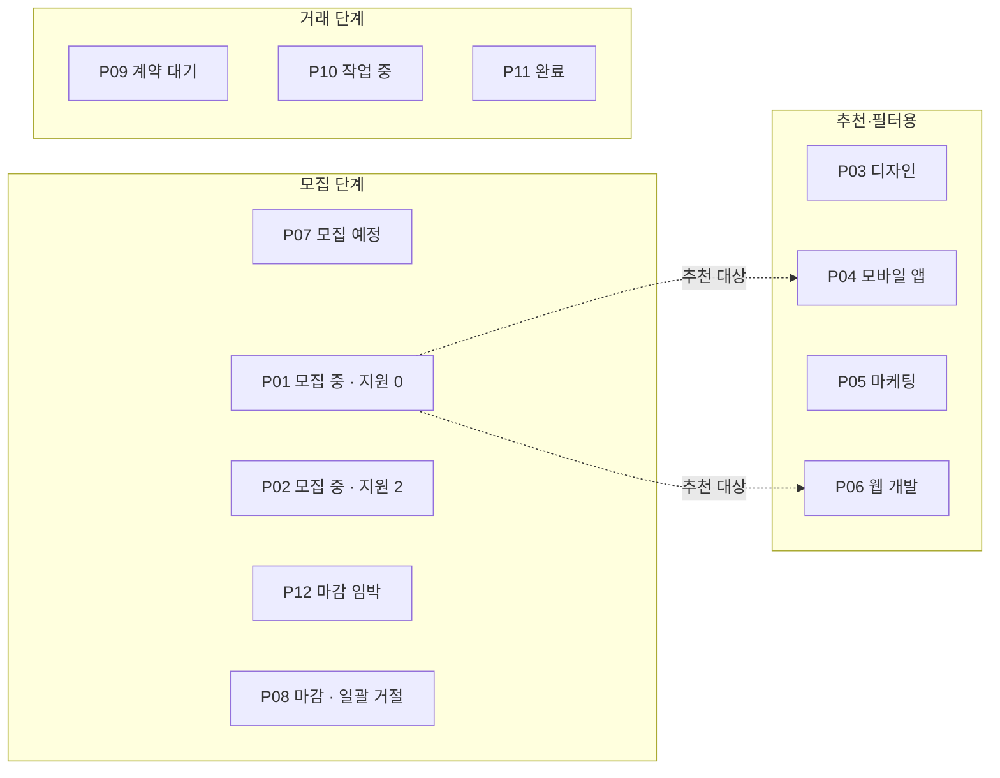

**12건이 모든 상태를 최소 1건씩 덮습니다.** 시연 중 "그 상태는 지금 없네요"가 나오지 않게 하기 위해서입니다.

## 9.4 시드 설계 원칙

| # | 원칙 | 이유 |
|---|---|---|
| 1 | **모든 상태 조합을 최소 1건씩 덮는다** | 시연 중 "그 상태는 지금 없네요"가 나오면 안 됨 |
| 2 | **P12는 마감일을 배포일 기준 상대 시각으로 넣는다** | 절대 시각을 박으면 며칠 뒤 시연할 때 이미 지나 있음 |
| 3 | **P01·P04·P06은 카테고리·기술이 겹치게 만든다** | 추천 4건이 실제로 채워져야 시연됨 |
| 4 | 프리랜서 C는 P03·P08을 북마크해둔다 | 내 북마크 화면이 비어 있으면 안 됨. **마감된 P08 포함** |
| 5 | 목록이 최소 2페이지가 되도록 한다 | 페이지네이션 시연. 12건 ≥ 10건 |
| 6 | **시드는 마감 기간 하한 제약을 우회한다** | P12는 1일짜리. 시드는 직접 주입이므로 등록 검증을 거치지 않음 |
| 7 | 예산을 다양하게 분포시킨다 | 예산 범위 필터·정렬 시연 |
| 8 | **개인정보처럼 보이는 실명·연락처를 넣지 않는다** | 배포 URL은 공개됨 |

## 9.5 담당

| 항목 | 누가 |
|---|---|
| **프로젝트·북마크 시드** | **유동우** |
| 사용자·프로필·기술 시드 | 오민혁 |
| 지원서·알림 시드 | 최윤석 |
| 합의·계약·결제·납품·리뷰 시드 | 조준영 |
| 시드 스크립트 통합·실행 순서 | 김락원 |

> 시드는 **의존 순서**가 있습니다. 사용자 → 기술 → 프로젝트 → 지원 → 합의 → 계약 → 결제 → 납품 → 리뷰.
> 각자 만든 시드를 아무 순서로나 실행하면 외래 키가 깨집니다. 실행 순서는 김락원이 고정해야 합니다.

---

# 10. Acceptance Criteria — 81개

각 항목: **Given / When / Then · 검증 방법 · 근거**
v1.1에서 11개 신설, 6개 수정됐습니다. (v1.0: 57개 → v1.1: 69개)

## 10.1 project-management — 60개

### 등록

| ID | Given | When | Then | 검증 | 근거 |
|---|---|---|---|---|---|
| PM-01 | 프로필이 완성된 의뢰인 | 3단계를 모두 유효하게 채워 제출 | 프로젝트가 생성되고 상세 화면으로 이동한다 | E2E | RFP 3.2.1 |
| PM-02 | 프리랜서로 로그인 | 프로젝트 등록을 시도 | 등록되지 않고 권한 없음 안내를 받는다 | 권한 | RFP 3.1.3 |
| PM-03 | 필수 프로필이 비어 있는 의뢰인 | 등록 화면 진입 | 프로필 입력 화면으로 이동한다 | E2E | RFP 3.1.3 |
| PM-04 | PM-03 상태에서 프로필 입력 완료 | 저장 | **원래 등록 흐름으로 되돌아온다** | E2E | RFP 3.1.3 |
| **PM-05** | 프로필이 완성된 의뢰인이 1·2단계를 채움 | 3단계로 이동 | **프로필 검사가 다시 일어나지 않는다** (진입 시 1회만) | E2E | **D-03 신설** |
| **PM-06** | 등록 2단계 진입 | 화면 확인 | **마감일 칸에 "오늘 + 30일"이 미리 채워져 있다** | 단위 | **D-01 신설** |
| PM-07 | Step 2에서 마감일을 과거로 입력 | 다음 단계 시도 | 이동하지 않고 마감일 오류를 표시한다 | 단위 | §3.2 |
| **PM-08** | **Step 2에서 마감일을 2년 뒤로 입력** | 다음 단계 시도 | **"모집 기간은 최대 1년까지" 오류를 표시한다** | 단위 | **D-01 신설** |
| PM-09 | Step 2에서 예산을 0으로 입력 | 다음 단계 시도 | 이동하지 않고 예산 오류를 표시한다 | 단위 | §3.2 |
| PM-10 | Step 3에서 기술을 하나도 선택 안 함 | 제출 | 제출되지 않고 안내를 표시한다 | 단위 | §3.2 |
| PM-11 | 목록에 없는 카테고리 값으로 요청 | 제출 | 거부되고 선택 불가 안내를 받는다 | API | §3.2 |
| PM-12 | 모집 시작일을 미래로 지정해 등록 | 등록 완료 | 모집 상태가 `SCHEDULED`다 | 단위 | §2.2 R1 |
| PM-13 | 모집 시작일을 비우고 등록 | 등록 완료 | 모집 상태가 `OPEN`이다 | 단위 | §2.2 R2 |

### 조회 · 탐색

| ID | Given | When | Then | 검증 | 근거 |
|---|---|---|---|---|---|
| PM-14 | 비로그인 방문자 | 프로젝트 상세 조회 | 응답에 `transactionStatus`가 **존재하지 않는다** | 계약 | RFP 3.2.3 |
| PM-15 | 거래 진행 중인 프로젝트 | 공개 목록 조회 | `모집 마감`으로만 보이고 거래 세부 상태는 안 보인다 | 계약 | RFP 3.2.3 |
| PM-16 | 의뢰인 본인 | 내 프로젝트 조회 | `transactionStatus`가 보인다 | API | §3.3 |
| PM-17 | 제목·설명에 특정 단어가 있는 프로젝트 | 그 단어로 검색 | 해당 프로젝트가 결과에 포함된다 | 쿼리 | RFP 3.2.2 |
| PM-18 | 카테고리·예산·기술 필터를 동시에 적용 | 목록 조회 | 세 조건을 **모두** 만족하는 것만 나온다 | 쿼리 | RFP 3.2.2 |
| PM-19 | 여러 기술을 선택 | 목록 조회 | 선택한 기술을 **하나라도** 가진 프로젝트가 나온다 | 쿼리 | §3.6 |
| **PM-20** | **모집 중 12건 · 마감 8건이 있음** | **필터 없이 목록 조회** | **모집 중 12건만 나온다. 마감 8건은 나오지 않는다** | 쿼리 | **D-08 수정** |
| **PM-21** | 같은 상황 | **모집 상태를 "마감"으로 필터** | **마감 8건이 나온다** | 쿼리 | **D-08 신설** |
| PM-22 | 정렬을 마감임박순으로 선택 | 목록 조회 | 마감일이 가까운 순서로 정렬된다 | 쿼리 | RFP 3.2.2 |
| PM-23 | 정렬을 예산 높은순으로 선택 | 목록 조회 | 예산이 큰 순서로 정렬된다 | 쿼리 | RFP 3.2.2 |
| PM-24 | 마감일이 같은 프로젝트가 여러 건 | 마감임박순으로 1·2페이지 연속 조회 | **같은 프로젝트가 두 번 나오거나 빠지지 않는다** | 쿼리 | §3.6 정렬 안정성 |
| PM-25 | 모집 중인 프로젝트가 15건 | 페이지당 10개로 조회 | 1페이지 10건, 2페이지 5건, 전체 건수 15가 온다 | API | RFP 3.2.2 |
| PM-26 | 조건에 맞는 프로젝트가 0건 | 목록 조회 | 에러가 아니라 빈 목록이 온다 | API | §3.6 |

### 수정 · 삭제

| ID | Given | When | Then | 검증 | 근거 |
|---|---|---|---|---|---|
| PM-27 | 대기 중 지원 0건인 본인 프로젝트 | 예산 수정 | 수정된다 | 통합 | RFP 3.2.1 |
| PM-28 | 대기 중 지원 1건 이상인 본인 프로젝트 | 예산 수정 | **거부되고** 이유를 안내한다 | 부정 | RFP 3.2.1 |
| PM-29 | 대기 중 지원 1건 이상인 본인 프로젝트 | 마감일 수정 | **거부되고** 이유를 안내한다 | 부정 | RFP 3.2.1 |
| PM-30 | 대기 중 지원 1건 이상인 본인 프로젝트 | 설명 수정 | 수정된다 | 통합 | §3.4 |
| PM-31 | 대기 중 지원 1건 이상인 본인 프로젝트 | **AI 분석 결과 예산 반영** | **거부된다** | 통합 | §3.4 (N-2) |
| **PM-32** | **지원 3건이 모두 거절 처리된 모집 중 프로젝트** (누적 3 · 대기 중 0) | **예산 수정** | **수정된다.** 누적 수가 아니라 대기 중 수로 판정한다 | 통합 | **D-02 · D-38** |
| PM-33 | 다른 의뢰인의 프로젝트 | 수정 시도 | 권한 없음으로 거부된다 | 권한 | RFP 7.1 |
| PM-34 | 마감된 본인 프로젝트 | 수정 시도 | 상태 충돌로 거부된다 | 부정 | §3.4 |
| PM-35 | 거래가 진행 중인 본인 프로젝트 | 삭제 시도 | 거부된다 | 부정 | §3.5 |
| PM-36 | 대기 중 지원 0건, 거래 없음인 본인 프로젝트 | 삭제 | 삭제 처리되고 공개 목록·상세에서 사라진다. 물리 삭제는 되지 않는다 | 통합 | RFP 3.2.1 |
| PM-37 | 프로젝트를 삭제 | 그 프로젝트에 지원했던 프리랜서가 내 지원 현황 조회 | 지원 이력은 남아 있고 삭제된 프로젝트임을 알 수 있다 | 통합 | §3.5 |

### 상태 · 마감 · 취소

| ID | Given | When | Then | 검증 | 근거 |
|---|---|---|---|---|---|
| PM-38 | `SCHEDULED` 프로젝트의 시작일이 지남 | 목록·상세 조회 | `모집 중`으로 보인다 | 통합 | §2.2 R3 |
| PM-39 | `OPEN` 프로젝트의 마감일이 지남 | 목록·상세 조회 | `모집 마감`으로 보인다 | 통합 | §2.2 R4 |
| **PM-40** | **지원자 3명이 있는 프로젝트의 마감 시각이 지남** | **10분 대기 후 확인** | **지원자 3명 전원이 마감 알림을 받았다** | E2E | **D-01 신설** |
| PM-41 | `OPEN` 본인 프로젝트 | 모집 마감 실행 | `CLOSED`가 되고 대기 중 지원이 일괄 거절되며 지원자 전원에게 알림이 간다 | E2E | RFP 3.2.4 |
| PM-42 | 이미 마감된 프로젝트 | 다시 마감 요청 | **성공으로 처리되고** 상태는 그대로 `CLOSED`다 | 멱등 | §3.7 |
| PM-43 | `transactionStatus`가 `NONE`인 본인 프로젝트 | 취소 실행 | `CANCELED` + `CLOSED`가 된다 | API | §3.7 |
| **PM-44** | **`CONTRACT_PENDING`인 본인 프로젝트** | **취소 실행** | **`CANCELED` + `CLOSED`가 되고 선정된 프리랜서에게 알림이 간다** | E2E | **D-04 수정** |
| **PM-45** | **PM-44 직후, 프리랜서가 계약서 화면에서 서명을 누름** | **서명 요청** | **"프로젝트가 취소되었습니다" 안내가 뜨고 계약이 진행되지 않는다** | E2E | **D-04 신설** |
| **PM-46** | **`IN_PROGRESS`인 본인 프로젝트 (결제 완료됨)** | **취소 시도** | **거부되고 "이미 결제가 완료되어 취소할 수 없습니다"** | 부정 | **D-04 수정** |
| PM-47 | 이미 취소된 프로젝트 | 다시 취소 요청 | **성공으로 처리된다** | 멱등 | §3.9 |
| **PM-48** | **합의가 거절되어 재모집된 프로젝트 (마감일 유효)** | **예산 수정** | **수정된다** | E2E | **D-07 신설** |
| **PM-49** | **대기 중 지원 2건이 있는 본인 프로젝트** | **삭제 시도** | **거부되고 "지원자가 있어 삭제할 수 없습니다. 프로젝트 취소를 이용해 주세요."** | 부정 | **D-28 · 감사 발견 #1** |

### v4.1 신설 — 불변식 검증

| ID | Given | When | Then | 검증 | 근거 |
|---|---|---|---|---|---|
| **PM-50** | **대기 중 지원 수를 조회할 수 없는 상태** (`applications` 응답 실패) | **예산 수정 시도** | **잠금이 유지된 채 실패한다.** `0`으로 간주해 수정을 허용하지 않는다 | 부정 | **D-38** |
| **PM-51** | **마감 알림이 이미 발송된 프로젝트** | **같은 마감 사건으로 후처리가 다시 요청됨** | **알림이 다시 생성되지 않는다** (`deadlineNotifiedAt` · `closureEventId`) | 멱등 | **D-36 · D-39** |
| **PM-52** | **`CANCELED` 상태의 프로젝트** | **`completeProjectTransaction` 또는 `restorePreContractProject` 호출** | **409로 거부된다.** 거래 상태가 바뀌지 않는다 | 부정 | **D-30 · I-29** |
| **PM-53** | **AI 분석 결과를 예산에 이미 반영한 프로젝트** | **같은 분석으로 다시 반영 시도** | **거부된다** | 부정 | **I-26 · §5.4 C-05** |
| **PM-54** | **지원자 A를 수락한 직후** | **같은 `applicationId`로 수락 요청 재발송** | **200 성공.** "다른 지원자가 먼저 수락되었습니다"가 뜨지 않는다 | 멱등 | **D-41** |
| **PM-55** | **합의 거절로 재개된 프로젝트에 새 지원자가 수락됨** | **지연된 이전 `restorePreContractProject` 재시도 도착** | **409로 거부되고** 새 계약 대기가 유지된다 | 부정 | **D-42** |
| **PM-56** | **일괄 거절이 부분 실패해 대기 중 지원 1건이 남은 상태** | **`restorePreContractProject` 호출** | **`OPEN` 전환이 보류되고 일괄 거절이 재요청된다** | 부정 | **D-43** |
| **PM-57** | **결제 요청 직전 `markPaymentPending`이 호출된 프로젝트** | **의뢰인이 취소 시도** | **거부된다** | 부정 | **D-40** |
| **PM-58** | **취소 시 계약 무효화가 실패함** | **취소 응답 확인** | **`202`가 오고 `postActions.contractInvalidation`이 `FAILED`다** | API | **D-45** |
| **PM-59** 🆕 | **협상 중 마감일이 지나 `CLOSED + NONE`으로 복원된 프로젝트** | **의뢰인이 SCR-B10에서 새 마감일 입력 후 다시 모집** | **`OPEN`으로 전환되고 `projectVersion`이 +1 된다** | 정상 | **D-71** |
| **PM-60** 🆕 | **같은 프로젝트에서 새 마감일을 현재 시각 이전으로 입력** | **재모집 시도** | **`422`로 거부된다. 상태가 바뀌지 않는다** | 부정 | **D-71 · I-08** |

### DB가 막지 못하는 9건의 검증 위치

§6.3에서 `App` 강제로 분류된 9건이 어느 AC로 확인되는지입니다. **빠진 칸이 곧 구멍입니다.**

| # | 규칙 | 검증 AC |
|---|---|---|
| I-05 | 프로젝트 물리 삭제 금지 | **PM-36** |
| I-06 | 삭제된 프로젝트 미노출 | **PM-36** (목록·상세) · **EN-14** (북마크) · **EN-17** (추천) |
| I-07 | 기술 1개 이상 | **PM-10** |
| I-13 | 북마크는 프리랜서만 | **EN-06** |
| **I-14** | **북마크 해제는 실제 삭제** | **EN-04** 🆕 강제 주체 정정 |
| **I-21** | **거래 이력 물리 삭제 금지** | 조준영 범위 — 유동우 AC 없음 |
| I-19 | 재서명 시각 덮어쓰기 금지 | 조준영 범위 — 유동우 AC 없음 |
| I-24 | 리뷰는 `COMPLETED`일 때만 | 조준영 범위 — 유동우 AC 없음 |
| I-26 | 같은 AI 분석 두 번 적용 금지 | **PM-53** 🆕 |
| I-29 | `CANCELED` 되돌리기 금지 | **PM-47** (멱등) · **PM-52** 🆕 (전이 거부) |

> I-19 · I-24는 조준영 도메인에서 검증합니다. 이 문서는 접점만 정의하고 AC는 두지 않습니다.

## 10.2 engagement — 21개

### 북마크

| ID | Given | When | Then | 검증 | 근거 |
|---|---|---|---|---|---|
| EN-01 | 로그인한 프리랜서, 북마크 안 한 프로젝트 | 북마크 추가 | 1건 저장되고 아이콘이 켜진다 | E2E | RFP 3.4.1 |
| EN-02 | 이미 북마크한 프로젝트 | 같은 요청을 다시 보냄 | **여전히 1건.** 성공 응답 | 멱등 | §4.1 |
| EN-03 | 같은 프리랜서·프로젝트 | 추가 요청 2건을 동시에 보냄 | 최종 1건만 존재한다 | 동시성 | §4.8 |
| EN-04 | 북마크한 프로젝트 | 북마크 제거 | 없어지고 아이콘이 꺼진다 | E2E | RFP 3.4.1 |
| EN-05 | 북마크하지 않은 프로젝트 | 제거 요청 | **에러 아님.** 성공 응답 | 멱등 | §4.1 |
| EN-06 | 의뢰인으로 로그인 | 북마크 추가 시도 | 권한 없음으로 거부된다 | 권한 | RFP 3.4.1 |
| EN-07 | 비로그인 | 북마크 추가 시도 | 인증 필요로 거부되고 로그인으로 유도된다 | 권한 | §4.4 |
| EN-08 | 삭제된 프로젝트 | 북마크 추가 시도 | 찾을 수 없음으로 거부된다 | 부정 | §4.1 |
| EN-09 | 모집 마감된 프로젝트 | 북마크 추가 | **성공한다** | 통합 | §4.1 |

### 내 북마크 목록

| ID | Given | When | Then | 검증 | 근거 |
|---|---|---|---|---|---|
| EN-10 | A와 B 두 프리랜서가 각각 북마크 | A가 내 북마크 조회 | **A의 것만** 나온다 | 보안 | §4.2 |
| EN-11 | 북마크 15건 | 페이지당 10개로 조회 | 1페이지 10건, 2페이지 5건 | API | §4.2 |
| EN-12 | 여러 시점에 저장한 북마크 | 목록 조회 | 최근에 저장한 것부터 나온다 | 쿼리 | §4.2 |
| EN-13 | 북마크한 프로젝트가 마감됨 | 목록 조회 | **목록에 남아 있고** 마감 배지가 보이며 지원 CTA는 비활성이다 | 통합 | §4.2 |
| EN-14 | 북마크한 프로젝트가 삭제됨 | 목록 조회 | **목록에서 빠진다** | 통합 | §4.2 |
| EN-15 | 북마크가 하나도 없음 | 목록 조회 | 에러가 아니라 빈 목록과 안내가 나온다 | API | §4.2 |

### 추천

| ID | Given | When | Then | 검증 | 근거 |
|---|---|---|---|---|---|
| EN-16 | 프로젝트 상세를 봄 | 추천 조회 | **보고 있는 프로젝트 자신은 포함되지 않는다** | 단위 | §4.3 |
| EN-17 | 후보 중 삭제된 프로젝트가 있음 | 추천 조회 | 삭제된 것은 나오지 않는다 | 단위 | §4.3 |
| EN-18 | 후보 중 마감·모집예정 프로젝트가 있음 | 추천 조회 | 모집 중인 것만 나온다 | 단위 | §4.3 |
| EN-19 | 카테고리+기술 모두 겹치는 것과 카테고리만 겹치는 것이 섞여 있음 | 추천 조회 | **둘 다 겹치는 것이 앞에** 나온다 | 단위 | §4.3 |
| EN-20 | 조건에 맞는 후보가 10건 있음 | 추천 조회 | **정확히 4건만** 나온다 | API | §4.3 (D-05) |
| EN-21 | 비로그인 방문자 | 추천 조회 | 응답에 `transactionStatus`와 내부 점수가 **없다** | 계약 | §4.3 |

---

---

# 11. RFP 요구사항 추적 매트릭스

RFP의 모든 요구사항이 **어디에 반영됐는지** 추적합니다.
RFP §05 발표 가이드가 요구하는 *"요구사항 이해 및 MVP 우선순위 결정"* 항목에 그대로 사용할 수 있습니다.

## 11.1 읽는 법

| 열 | 의미 |
|---|---|
| RFP | 원문 위치 |
| 우선순위 | 기본 필수 / 고급 필수 / 도전 과제 |
| 담당 | 누가 구현하는가 |
| PRD | 이 문서의 어느 절인가 |
| API | 어느 엔드포인트인가 |
| AC | 어느 수용 기준으로 검증하는가 |
| 상태 | ✅ 반영 · ➖ 다른 담당자 · ⬜ 미반영 |

## 11.2 직접 담당 — RFP §3.2 프로젝트 관리 [기본 필수]

| RFP | 요구사항 | 담당 | PRD | API | AC | 상태 |
|---|---|---|---|---|---|---|
| §3.2.1 | 등록 — 3단계 입력 퍼널 | **유동우** | §3.2 | `POST /projects` | PM-01 | ✅ |
| §3.2.1 | 1단계: 제목·설명·카테고리 | **유동우** | §3.2 Step 1 | " | PM-11 | ✅ |
| §3.2.1 | 2단계: 모집 시작일·마감일·예산 | **유동우** | §3.2 Step 2 | " | PM-06~09 | ✅ |
| §3.2.1 | 3단계: 필요 기술 스택 | **유동우** | §3.2 Step 3 | " | PM-10 | ✅ |
| §3.2.1 | 수정 — 본인 프로젝트만 | **유동우** | §3.8 | `PATCH /projects/:id` | PM-33 | ✅ |
| §3.2.1 | **지원자 있으면 예산/마감일 변경 제한** | **유동우** | §3.4 | " | PM-28·29·31·32 | ✅ |
| §3.2.1 | 삭제 — 소프트 딜리트만 | **유동우** | §3.5 | `DELETE /projects/:id` | PM-36 | ✅ |
| §3.2.1 | 상세 조회 — 정보 + 지원자 수 + 상태 + 하단 추천 | **유동우** | §3.3 · §7.2 | `GET /projects/:id` | PM-14~16 | ✅ |
| §3.2.2 | 다중 진입 경로 3종 | **유동우** | §3.6 · §7.3 | `GET /projects` | — | ✅ |
| §3.2.2 | 키워드 검색 (제목·설명) | **유동우** | §3.6 | " | PM-17 | ✅ |
| §3.2.2 | 필터: 카테고리·예산·기술·마감일·모집 상태 | **유동우** | §3.6 | " | PM-18~21 | ✅ |
| §3.2.2 | 정렬: 최신순·마감임박순·예산 높은순 | **유동우** | §3.6 | " | PM-22~24 | ✅ |
| §3.2.2 | 페이지네이션 — 페이지당 10개 | **유동우** | §3.6 | " | PM-25 | ✅ |
| §3.2.3 | 모집 단계 3상태 (예정/중/마감) | **유동우** | §2.2 | — | PM-12·13·38·39 | ✅ |
| §3.2.3 | 거래 단계 4상태 (계약대기/작업중/완료/취소) | **유동우** | §2.4 | — | PM-43~47 | ✅ |
| §3.2.3 | 시작일 도래 시 자동 전환 | **유동우** | §2.3 · §3.7 | — | PM-38 | ✅ |
| §3.2.3 | 마감일 초과 시 자동 마감 | **유동우** | §2.3 · §3.7 | — | PM-39·40 | ✅ |
| §3.2.3 | 의뢰인 수동 마감 | **유동우** | §3.7 | `POST .../close-recruitment` | PM-41·42 | ✅ |
| §3.2.3 | 수락 시 거래 단계 진입 | **유동우** ← 최윤석 | §5.4 C-01 | — | PM-43 | ✅ |
| §3.2.3 | **외부 목록엔 모집 단계만 노출** | **유동우** | §2.8 · §3.3 | — | PM-14·15 | ✅ |
| §3.2.4 | 자동 마감 처리 — 미처리 지원 일괄 거절 | **유동우** → 최윤석 | §5.5 | — | PM-41 | ✅ |
| §2.3 | 프로젝트 취소 — 계약 체결 이전만 | **유동우** | §2.4 · §3.7 | `POST .../cancel` | PM-43~47 | ✅ |
| §2.3 | 금액 합의 결렬 시 모집 복귀 | **유동우** ← 조준영 | §3.7 · §5.4 C-04 | — | PM-48 | ✅ |

## 11.3 직접 담당 — RFP §3.4 부가 기능 [기본 필수]

| RFP | 요구사항 | 담당 | PRD | API | AC | 상태 |
|---|---|---|---|---|---|---|
| §3.4.1 | 상세에서 북마크 토글 | **유동우** | §4.1 | `PUT/DELETE .../bookmarks` | EN-01~05 | ✅ |
| §3.4.1 | '내 북마크' 모아보기 | **유동우** | §4.2 | `GET /bookmarks` | EN-10~15 | ✅ |
| §3.4.1 | 북마크 목록에서 상세 진입 및 지원 | **유동우** | §4.2 · §7.2 | — | EN-13 | ✅ |
| §3.4.2 | 상세 하단 추천 섹션 | **유동우** | §4.3 · §7.2 | `GET .../recommendations` | EN-16~21 | ✅ |
| §3.4.2 | 동일 카테고리·유사 기술 기반 단순 추천 | **유동우** | §4.3 | " | EN-19 | ✅ |
| §3.4.2 | 정교한 추천 알고리즘은 범위 외 | **유동우** | §4.3 | — | — | ✅ 명시적 제외 |

## 11.4 계약으로 연결되는 항목 — 다른 담당자 담당

| RFP | 요구사항 | 담당 | 접점 | 상태 |
|---|---|---|---|---|
| §3.1.1 | 이메일 가입·로그인 · 토큰 | 오민혁 | 인증 컨텍스트 의존 (§5.5) | ➖ |
| §3.1.2 | 소셜 로그인 1종 이상 | 오민혁 | 동일 | ➖ |
| §3.1.3 | 역할 구분 (의뢰인/프리랜서) | 오민혁 | 모든 권한 판정의 전제 (§3.8) | ➖ |
| §3.1.3 | **프로필 완성 유도 + 원래 액션 복귀** | 오민혁 | 등록 진입 게이트 (§3.2) | ✅ 접점 정의 |
| §3.1.3 | 기술 스택 옵션 통합 관리 | 오민혁 | **§8.2에서 32종 제안** | ✅ 제안 |
| §3.2.4 | 지원서 제출 · 중복 방지 | 최윤석 | 프로젝트 읽기 제공 (§5.4) | ➖ |
| §3.2.4 | 수락/거절 처리 | 최윤석 | `acceptProjectApplication` (§5.4 C-01) | ✅ 계약 정의 |
| §3.2.4 | 자동 거절 (부수 효과) | 최윤석 | 상태 전이 후 호출 순서 (§5.4 C-01) | ✅ 계약 정의 |
| §3.2.4 | 지원 현황 잔존 | 최윤석 | 삭제된 프로젝트 표시 (§3.5) | ✅ 접점 정의 |
| §3.3.1 | 필수 알림 5종 | 최윤석 | **마감 알림은 project-management가 촉발** (§5.6) | ✅ 계약 정의 |
| §3.3.2 | 미확인 알림 표시 · 읽음 처리 | 최윤석 | — | ➖ |
| §3.5 | AI 단가 분석 · 리포트 | 오민혁 | 등록 2단계 분기 (§3.2) | ✅ 접점 정의 |
| §3.5.1 | **예산 반영 액션** | 오민혁 | `applyPricingAnalysisBudget` (§5.4 C-05) | ✅ 계약 정의 |
| §3.6.1 | 금액 조율 · 계약서 자동 생성 · 양측 서명 | 조준영 | `restorePreContractProject` (§5.4 C-04) | ✅ 계약 정의 |
| §3.6.2 | PG sandbox 결제 | 조준영 | `startProjectTransaction` (§5.4 C-02) | ✅ 계약 정의 |
| §3.6.3 | 에스크로 정산 · 수수료 10% | 조준영 | `completeProjectTransaction` (§5.4 C-03) | ✅ 계약 정의 |
| §3.7.1 | 상호 평가 · 1회만 · 평균 별점 | 조준영 | `COMPLETED` 상태 읽기 (§5.4) | ✅ 계약 정의 |

## 11.5 비기능 요구사항 — RFP §7

| RFP | 요구사항 | 담당 | PRD | 상태 |
|---|---|---|---|---|
| §7.1 | 비밀번호 해싱 | 오민혁 | — | ➖ |
| §7.1 | 민감 정보 환경 변수 분리 · `.env.example` | 전원 | — | ➖ (김락원) |
| §7.1 | 결제는 sandbox만 | 조준영 | — | ➖ |
| §7.1 | **본인이 등록한 리소스만 수정/조회** | **유동우** 포함 | §3.8 권한 | ✅ |
| §7.2 | 배포 URL에서 전체 시나리오 동작 | 전원 | — | ➖ (김락원) |
| §7.2 | 자동 배포 환경 | 전원 | — | ➖ (김락원) |
| §7.2 | **시연 가능한 시드 데이터** | 전원 | **§9** | ✅ 담당 범위 설계 완료 |
| §7.3 | 주요 액션 후 다음 단계 유도 | **유동우** 포함 | §7.4 | ✅ |
| §7.3 | 미확인 알림 즉시 식별 | 최윤석 | — | ➖ |
| §7.3 | 로그인 상태별 헤더 구분 | 오민혁 | — | ➖ |
| §7.3 | **차단형 흐름의 원래 액션 복귀** | **유동우** + 오민혁 | §3.2 · §7.4 | ✅ |
| §7.4 | Git 협업 · 브랜치 · PR | 전원 | — | ➖ (김락원) |
| §7.4 | 칸반 보드 · 스프린트 계획서 · 회고록 | 전원 | — | ➖ (김락원) |

## 11.6 수용 기준 대응 — RFP §8

### §8.1 스프린트 1·2 종료 기준 [기본 필수]

| RFP 체크 | 담당 | 우리 AC | 상태 |
|---|---|---|---|
| 이메일·소셜 로그인 정상 동작 | 오민혁 | — | ➖ |
| **의뢰인 역할로 프로젝트 등록·수정·삭제·상세 조회** | **유동우** | PM-01, PM-27, PM-36, PM-14 | ✅ |
| **프리랜서 역할로 프로젝트 검색·필터·지원** | **B** + C | PM-17~21 (검색·필터) | ✅ 부분 |
| 수락 시 타 지원 일괄 자동 거절 + 양측 알림 | 최윤석 | PM-43 (프로젝트 측) | ✅ 접점 |
| **프로젝트 상태가 시간 경과·의뢰인 액션에 따라 전환** | **유동우** | PM-38~42 | ✅ |
| 5가지 알림 트리거 + 헤더 미확인 표시 | 최윤석 | PM-40 (마감 알림) | ✅ 부분 |
| 가입~지원~알림 전체 플로우 | 전원 | — | ➖ |

### §8.2 스프린트 3·4 종료 기준 [고급 필수]

| RFP 체크 | 담당 | 접점 |
|---|---|---|
| AI 단가 분석 → 리포트 → **예산 반영** | 오민혁 | `applyPricingAnalysisBudget` |
| 금액 조율 → 계약서 → 양측 서명 | 조준영 | `restorePreContractProject` |
| PG sandbox 결제 → 콜백 → 검증 | 조준영 | `startProjectTransaction` |
| 에스크로 정산 흐름 | 조준영 | `completeProjectTransaction` |
| 상호 평가 + 평균 별점 | 조준영 | `COMPLETED` 상태 제공 |
| 배포 환경에서 전체 시나리오 동작 | 전원 | **시드 데이터 §9** |

### §8.3 도전 과제 [선택]

| RFP 항목 | 우리 판단 |
|---|---|
| 선택 알림 트리거 확장 | 팀 결정 (T7) — 단, **취소 알림(D-10)은 도전 과제가 아니라 필수로 승격** |
| 환불 흐름 | **미구현.** `REFUNDED` enum만 유지 (D-16) |
| 다회차 금액 협상 | **미구현.** 1회 합의만 |
| 팀 자체 추가 기능 | **프로젝트 취소 API (N-1)** — RFP §2.3에 근거가 있으므로 자체 추가라기보다 누락 보완 |

## 11.7 제출 산출물 대응 — RFP §04

| 산출물 | 형식 | 담당 범위 기여 | 상태 |
|---|---|---|---|
| 최종 발표 자료 | PPT/PDF | §11 추적 매트릭스 · §2 상태 모델 도식 | 🟡 김락원 |
| 배포된 서비스 | URL | 프로젝트·북마크·추천 기능 | 🟡 진행 |
| 소스 코드 저장소 | URL | — | ⬜ **T5 미해결** |
| **ERD** | PNG/PDF + 원본 링크 | §6 엔티티·관계·불변식 초안 제공 | 🟡 **T9 재검토 요청 중** |
| **API 명세서** | PDF + 원본 링크 | 담당 API 13종 + 오류 코드 §8.3 | ⬜ **팀 공통 미착수** |
| 프로젝트 관리 워크스페이스 | URL | — | ⬜ 김락원 |

> 🔴 **API 명세서가 가장 큰 공백입니다.** 엔드포인트 목록은 있지만 요청/응답 스키마가 없습니다.
> Swagger 또는 Postman으로 만들어야 하며, 각 담당자가 자기 API를 채워야 완성됩니다.

## 11.8 커버리지 요약

| 구분 | 요구사항 수 | 반영 | 다른 담당자 | 미반영 |
|---|---|---|---|---|
| 직접 담당 (§3.2 · §3.4 · §2.3) | 29 | **29** | — | 0 |
| 계약으로 연결 (§3.1 · §3.3 · §3.5~3.7) | 17 | 접점 9 정의 | 8 | 0 |
| 비기능 (§7) | 13 | 4 | 9 | 0 |
| 수용 기준 (§8.1) | 7 | 3 완전 · 2 부분 | 2 | 0 |
| 제출 산출물 (§04) | 6 | 2 기여 | — | **2 미착수** |

**담당 범위의 RFP 요구사항 커버리지: 29/29 (100%)**
미착수 2건은 팀 공통 산출물(API 명세서 · 저장소)입니다.

---

---

# 13. API 스키마

**담당 API 13종의 요청·응답 정본입니다.**
경로·권한·오류 코드는 §3.9 · §4.6 · §8.3에 있고, 여기서는 **무엇을 보내고 무엇을 받는가**를 정합니다.

> RFP §04 제출 산출물인 **API 명세서**에 해당합니다. 팀 전체 API가 모이면 OpenAPI(Swagger)로 옮겨 제출합니다.

---

## 13.1 공통 규약

### 기본

```text
Base URL     /api/v1
인증 헤더     Authorization: Bearer <accessToken>
Content-Type application/json; charset=utf-8
문자 인코딩   UTF-8
```

### 값 표기

| 대상 | 규칙 | 예 |
|---|---|---|
| 시각 | ISO 8601 · UTC · `Z` 접미 | `"2026-08-31T14:59:59Z"` |
| 금액 | **정수** (원 단위). 문자열 아님 | `5000000` |
| 식별자 | 문자열 | `"prj_01H8X..."` |
| 상태값 | `UPPER_SNAKE_CASE` 문자열 | `"OPEN"` |
| 필드명 | `camelCase` | `budgetAmount` |
| 없는 값 | `null` (키는 유지) | `"recruitmentStartAt": null` |
| 노출 금지 필드 | **키 자체를 넣지 않음** | `transactionStatus` 없음 |

> ⚠️ 마지막 두 줄의 차이가 중요합니다.
> `null`은 "값이 없다", **키 없음**은 "당신에게 보여줄 수 없다"입니다.
> 공개 응답에서 `transactionStatus`는 `null`이 아니라 **아예 없어야** 합니다 (§2.8).

### 목록 응답 껍데기 `DECIDED` (D-17)

**모든 목록 응답은 같은 모양입니다.** 팀 전체가 이 형식을 씁니다. (§0.2 #20에서 확정)

```json
{
  "items": [ ... ],
  "page": 1,
  "pageSize": 10,
  "totalCount": 37,
  "totalPages": 4
}
```

| 필드 | 타입 | 설명 |
|---|---|---|
| `items` | 배열 | 현재 페이지의 항목. 없으면 `[]` |
| `page` | 정수 | 현재 페이지 (1부터) |
| `pageSize` | 정수 | 페이지당 항목 수 |
| `totalCount` | 정수 | 조건에 맞는 전체 건수 |
| `totalPages` | 정수 | `ceil(totalCount / pageSize)`. 0건이면 `0` |

**빈 결과는 오류가 아닙니다.** `200` + `items: []` + `totalCount: 0`입니다.

### 페이지 파라미터 제한 `DECIDED` (D-18)

| 파라미터 | 기본값 | 허용 범위 | 초과 시 |
|---|---|---|---|
| `page` | `1` | `1` ~ `1000` | `422` |
| `pageSize` | `10` | `1` ~ `50` | `422` |

**상한을 두는 이유**: 없으면 `pageSize=100000` 요청 하나로 응답이 폭발합니다. RFP §7.1 보안 요구의 연장입니다.

### 오류 응답

```json
{
  "error": {
    "code": "PROJECT_EDIT_LOCKED",
    "message": "지원자가 있어 예산과 일정은 변경할 수 없습니다.",
    "details": null
  }
}
```

검증 오류일 때만 `details`가 채워집니다.

```json
{
  "error": {
    "code": "VALIDATION_ERROR",
    "message": "입력값을 확인해 주세요.",
    "details": [
      { "field": "budgetAmount", "reason": "must be greater than zero" },
      { "field": "recruitmentDeadlineAt", "reason": "must be within 365 days" }
    ]
  }
}
```

전체 코드 목록은 §8.3.

### 요청과 응답의 필드명이 다른 경우 `RECOMMENDATION`

| 요청 | 응답 | 이유 |
|---|---|---|
| `skillIds: ["REACT", "SQL"]` | `skills: [{ id, name }]` | 요청은 **참조**, 응답은 **표시용 객체** |
| `category: "WEB_DEVELOPMENT"` | `category: { code, name }` | 동일 |

프론트가 응답만으로 화면을 그릴 수 있어야 합니다. 코드만 주면 이름 표를 따로 들고 있어야 합니다.

---

### API 13종 한눈에

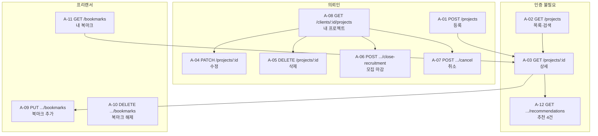

## 13.2 공통 스키마

### `SkillRef`

```json
{ "id": "REACT", "name": "React" }
```

### `CategoryRef`

```json
{ "code": "WEB_DEVELOPMENT", "name": "웹 개발" }
```

### `ClientPublicProfile`

```json
{
  "userId": "usr_client_a",
  "name": "김의뢰",
  "companyName": "브릿지컴퍼니",
  "profileImageUrl": "https://.../a.png",
  "averageRating": 4.6,
  "reviewCount": 12
}
```

> `averageRating` · `reviewCount`는 **조준영(reviews)이 제공**합니다. 값을 가공하지 않고 그대로 실어 보냅니다.
> 리뷰가 없으면 `averageRating: null`, `reviewCount: 0`.

### `PublicProjectSummary` — 목록 카드

```json
{
  "projectId": "prj_p01",
  "title": "쇼핑몰 웹사이트 구축",
  "category": { "code": "WEB_DEVELOPMENT", "name": "웹 개발" },
  "budgetAmount": 5000000,
  "skills": [
    { "id": "REACT", "name": "React" },
    { "id": "NODEJS", "name": "Node.js" }
  ],
  "recruitmentStartAt": null,
  "recruitmentDeadlineAt": "2026-09-16T14:59:59Z",
  "recruitmentStatus": "OPEN",
  "applicationCount": 3,
  "client": { "userId": "usr_client_a", "name": "김의뢰", "companyName": "브릿지컴퍼니", "profileImageUrl": null, "averageRating": 4.6, "reviewCount": 12 },
  "isBookmarked": true,
  "createdAt": "2026-08-17T02:00:00Z"
}
```

| 필드 | 비고 |
|---|---|
| `applicationCount` | **누적** 지원 수 (거절된 것 포함). **표시 전용.** 최윤석(applications)이 제공 |
| `isBookmarked` | **로그인한 프리랜서일 때만** 포함. 비로그인·의뢰인에게는 키 없음 |
| `transactionStatus` | **없음** |
| `pendingApplicationCount` | **없음.** 잠금 판정용 값이라 `ClientProjectDetail`에만 들어갑니다 |

> ⚠️ **`applicationCount`를 잠금 판정에 쓰면 안 됩니다.** 누적 수라서 거절된 지원까지 셉니다. (§3.4)

> `description`은 목록 카드에 넣지 않습니다. 길어서 응답이 무거워집니다. 상세에서만 줍니다.

### `PublicProjectDetail` — 상세

`PublicProjectSummary` + `description`

```json
{
  "projectId": "prj_p01",
  "title": "쇼핑몰 웹사이트 구축",
  "description": "자사 브랜드 온라인 스토어를 새로 만들려고 합니다. ...",
  "category": { "code": "WEB_DEVELOPMENT", "name": "웹 개발" },
  "budgetAmount": 5000000,
  "skills": [{ "id": "REACT", "name": "React" }, { "id": "NODEJS", "name": "Node.js" }],
  "recruitmentStartAt": null,
  "recruitmentDeadlineAt": "2026-09-16T14:59:59Z",
  "recruitmentStatus": "OPEN",
  "applicationCount": 3,
  "client": { "...": "..." },
  "isBookmarked": true,
  "createdAt": "2026-08-17T02:00:00Z",
  "updatedAt": "2026-08-17T02:00:00Z"
}
```

### `ClientProjectDetail` — 등록 의뢰인 전용

`PublicProjectDetail` + 아래 6개

```json
{
  "transactionStatus": "NONE",
  "pendingApplicationCount": 3,
  "recruitmentClosedAt": null,
  "canceledAt": null,
  "editableFields": ["title", "description", "category", "skillIds", "budgetAmount", "recruitmentStartAt", "recruitmentDeadlineAt"],
  "availableActions": ["EDIT", "CLOSE_RECRUITMENT", "CANCEL", "DELETE"]
}
```

| 필드 | 왜 필요한가 |
|---|---|
| `transactionStatus` | 등록 의뢰인에게만 노출 (§2.8) |
| **`pendingApplicationCount`** | **대기 중 지원 수.** 잠금이 왜 걸렸는지 화면이 설명할 수 있어야 합니다. `applicationCount`(누적)와 다른 숫자입니다 |
| `recruitmentClosedAt` · `canceledAt` | 마감·취소 시각. 내 프로젝트 화면의 이력 표시용. 값이 없으면 `null` |
| **`editableFields`** | **프론트가 §3.4 잠금 규칙을 다시 구현하지 않아도 됩니다.** 서버가 판정해서 알려줍니다 |
| **`availableActions`** | 마감·취소·삭제 버튼을 켤지 끌지 서버가 알려줍니다 |

> `editableFields`와 `availableActions`의 판정 근거는 **`pendingApplicationCount`**입니다. `applicationCount`가 아닙니다. (§3.4)

> 🔑 **`editableFields`와 `availableActions`는 이 명세의 핵심 설계입니다.**
> 이게 없으면 프론트가 "대기 중 지원이 있으면 예산 잠금", "결제 후엔 취소 불가" 같은 규칙을 **다시 구현**해야 합니다.
> 규칙이 두 곳에 있으면 반드시 어긋납니다. **판정은 서버 한 곳에서만** 합니다.
> 프론트는 서버가 준 목록대로 입력란과 버튼을 켜고 끄면 됩니다. (서버는 실제 요청도 항상 재검증합니다.)

`availableActions` 값

| 값 | 의미 |
|---|---|
| `EDIT` | 수정 가능 (어느 필드인지는 `editableFields`) |
| `CLOSE_RECRUITMENT` | 모집 마감 가능 |
| `CANCEL` | 취소 가능 |
| `DELETE` | 삭제 가능 |

---

## 13.3 프로젝트 API

### A-01 `POST /api/v1/projects` — 등록

| | |
|---|---|
| 권한 | 의뢰인 · 프로필 완성 |
| 성공 | `201 Created` |

**요청**

```json
{
  "title": "쇼핑몰 웹사이트 구축",
  "description": "자사 브랜드 온라인 스토어를 새로 만들려고 합니다. 상품 등록과 결제 연동이 필요합니다.",
  "category": "WEB_DEVELOPMENT",
  "recruitmentStartAt": null,
  "recruitmentDeadlineAt": "2026-09-16T14:59:59Z",
  "budgetAmount": 5000000,
  "skillIds": ["REACT", "NODEJS", "SQL"]
}
```

| 필드 | 타입 | 필수 | 제약 |
|---|---|---|---|
| `title` | string | ✅ | 5~100자 |
| `description` | string | ✅ | 20~5000자 |
| `category` | string | ✅ | §8.1의 6종 중 하나 |
| `recruitmentStartAt` | string·null | ⬜ | ISO 8601. `null`이면 즉시 모집 |
| `recruitmentDeadlineAt` | string | ✅ | ISO 8601. `now+1일` ~ `now+365일` |
| `budgetAmount` | integer | ✅ | `1` 이상 |
| `skillIds` | string[] | ✅ | 1~10개. §8.2의 32종 중 |

> `title` 5~100자 · `description` 20~5000자 · `skillIds` 최대 10개는 이 문서에서 정합니다. `DECIDED` (D-19)
> `description` 하한 20자는 **AI 단가 분석의 입력**이 되기 때문입니다. 한 줄짜리 설명으로는 분석이 안 됩니다.

**응답 `201`** — `ClientProjectDetail`

**오류**

| 코드 | HTTP | 언제 |
|---|---|---|
| `AUTH_REQUIRED` | 401 | 비로그인 |
| `PROJECT_CREATE_ROLE_REQUIRED` | 403 | 프리랜서 |
| `PROJECT_PROFILE_REQUIRED` | 403 | 프로필 미완성 |
| `VALIDATION_ERROR` | 422 | 필드 검증 실패 |
| `DEADLINE_MUST_BE_FUTURE` | 422 | 마감일이 과거 |
| `DEADLINE_EXCEEDS_LIMIT` | 422 | 365일 초과 |
| **`DEADLINE_BELOW_MINIMUM`** | **422** | **모집 기간이 1일 미만** (D-09) |
| `DEADLINE_BEFORE_START` | 422 | 마감일 < 시작일 |
| `BUDGET_MUST_BE_POSITIVE` | 422 | 예산 ≤ 0 |
| `INVALID_CATEGORY` · `INVALID_SKILL` · `SKILL_REQUIRED` | 422 | 목록 밖 값 |
| **`CUSTOM_SKILL_NOT_ALLOWED`** | **422** | **`skillIds`에 커스텀 기술이 포함됨** (D-64) |

> ⚠️ **`DEADLINE_BELOW_MINIMUM`은 DB가 막지 않습니다.** 시연 시드(P12, 마감 1일)가 제약을 우회해야 해서 `CHECK`에서 뺐습니다(§6.3).
> **이 API 검증이 유일한 방어선입니다.**

---

### A-02 `GET /api/v1/projects` — 목록 · 검색

| | |
|---|---|
| 권한 | 불필요 |
| 성공 | `200 OK` |

**쿼리 파라미터**

| 이름 | 타입 | 기본값 | 제약 | 설명 |
|---|---|---|---|---|
| `keyword` | string | — | 1~100자 | 제목·설명에서 검색 |
| `category` | string | — | 6종 중 | 카테고리 일치 |
| `skillIds` | string[] | — | 최대 10개 | 반복 지정. **하나라도 포함(OR)** |
| `minBudget` | integer | — | 0 이상 | 예산 하한 |
| `maxBudget` | integer | — | `minBudget` 이상 | 예산 상한 |
| `recruitmentStatus` | string[] | **`SCHEDULED,OPEN`** | 3종 중 | 반복 지정. **미지정 시 마감 제외** (D-08) |
| `deadlineBefore` | string | — | ISO 8601 | 이 시각 이전 마감 |
| `sortBy` | string | `CREATED_AT` | `CREATED_AT` · `DEADLINE` · `BUDGET` | 정렬 기준 |
| `sortOrder` | string | `desc` | **`asc` · `desc`** (소문자) | 정렬 방향 |
| `page` | integer | `1` | 1~1000 | |
| `pageSize` | integer | `10` | 1~50 | |

**예시**

```text
GET /api/v1/projects?keyword=쇼핑몰&category=WEB_DEVELOPMENT
    &skillIds=REACT&skillIds=NODEJS&minBudget=3000000
    &sortBy=DEADLINE&sortOrder=asc&page=1&pageSize=10
```

**기본 정렬 조합**

| `sortBy` | 1차 | 2차 | 3차 |
|---|---|---|---|
| `CREATED_AT` | `createdAt` | `projectId` | — |
| `DEADLINE` | `recruitmentDeadlineAt` | `createdAt DESC` | `projectId` |
| `BUDGET` | `budgetAmount` | `createdAt DESC` | `projectId` |

**2차·3차 기준은 생략할 수 없습니다.** 없으면 페이지를 넘길 때 같은 프로젝트가 두 번 나오거나 빠집니다 (§3.6 정렬 안정성).

**응답 `200`**

```json
{
  "items": [ { "...PublicProjectSummary..." } ],
  "page": 1,
  "pageSize": 10,
  "totalCount": 37,
  "totalPages": 4
}
```

**오류**: `VALIDATION_ERROR` (422) — 범위 밖 `page`·`pageSize`, 잘못된 `sortBy`, `maxBudget < minBudget`

---

### A-03 `GET /api/v1/projects/:projectId` — 상세

| | |
|---|---|
| 권한 | 불필요 |
| 성공 | `200 OK` |

**응답이 보는 사람에 따라 다릅니다.**

| 요청자 | 응답 스키마 |
|---|---|
| 비로그인 · 타인 | `PublicProjectDetail` |
| 프리랜서 (로그인) | `PublicProjectDetail` + `isBookmarked` |
| **등록 의뢰인** | **`ClientProjectDetail`** |

**오류**

| 코드 | HTTP | 언제 |
|---|---|---|
| `PROJECT_NOT_FOUND` | 404 | 없거나 `deletedAt`이 있음 |

---

### A-04 `PATCH /api/v1/projects/:projectId` — 수정

| | |
|---|---|
| 권한 | 등록 의뢰인 |
| 성공 | `200 OK` |

**요청** — 바꿀 필드만 보냅니다.

```json
{
  "description": "요구사항을 조금 더 구체적으로 정리했습니다. ...",
  "skillIds": ["REACT", "NODEJS", "SQL", "TYPESCRIPT"]
}
```

필드 제약은 A-01과 같습니다. **보내지 않은 필드는 변경되지 않습니다.**

> `null`을 명시적으로 보내는 것과 필드를 생략하는 것은 다릅니다.
> `"recruitmentStartAt": null` → 시작일 제거 / 생략 → 그대로 유지.

**응답 `200`** — `ClientProjectDetail` (갱신된 `editableFields` 포함)

**오류**

| 코드 | HTTP | 언제 |
|---|---|---|
| `PROJECT_NOT_FOUND` | 404 | |
| `PROJECT_FORBIDDEN` | 403 | 등록 의뢰인이 아님 |
| `PROJECT_EDIT_LOCKED` | 409 | **대기 중 지원이 있는데 예산·일정 수정** |
| `PROJECT_EDIT_CLOSED` | 409 | 마감·거래 단계 |
| 검증 오류 전체 | 422 | A-01과 동일 |

---

### A-05 `DELETE /api/v1/projects/:projectId` — 삭제

| | |
|---|---|
| 권한 | 등록 의뢰인 |
| 성공 | `204 No Content` (본문 없음) |
| 반복 호출 | 이미 삭제됨 → **`204`** |

**오류**

| 코드 | HTTP | 언제 |
|---|---|---|
| `PROJECT_NOT_FOUND` | 404 | 애초에 없는 식별자 |
| `PROJECT_FORBIDDEN` | 403 | 등록 의뢰인이 아님 |
| `PROJECT_DELETE_IN_TRANSACTION` | 409 | `transactionStatus != NONE` |
| **`PROJECT_DELETE_HAS_APPLICATIONS`** | **409** | **`pendingApplicationCount > 0`** (D-28) |

> 🔴 **두 조건은 서로 다릅니다.** 거래가 시작되지 않았어도(`transactionStatus == NONE`) 대기 중인 지원자가 있으면 삭제할 수 없습니다.
> 이걸 빠뜨리면 지원 3건이 대기 중인 프로젝트가 삭제되고, **그 지원들은 영원히 `PENDING`으로 남아 지원자가 결과를 받지 못합니다.**
> 이 경우 삭제 대신 **취소**를 안내합니다. 취소에는 일괄 거절과 알림이 붙어 있습니다. (§14.10)

> **이미 삭제된 프로젝트를 다시 삭제하면 `404`가 아니라 `204`입니다.**
> 요청자가 원한 상태(삭제됨)가 이미 이뤄져 있기 때문입니다. 조회(A-03)에서는 `404`가 맞습니다.

---

### A-06 `POST /api/v1/projects/:projectId/close-recruitment` — 모집 마감

| | |
|---|---|
| 권한 | 등록 의뢰인 |
| 요청 본문 | 없음 |
| 성공 | `200 OK` |
| 반복 호출 | 이미 마감 → **`200`** (상태 그대로) |

**응답 `200`**

```json
{
  "projectId": "prj_p01",
  "recruitmentStatus": "CLOSED",
  "transactionStatus": "NONE",
  "rejectedApplicationCount": 3,
  "closedAt": "2026-08-20T05:12:00Z"
}
```

| 필드 | 설명 |
|---|---|
| `rejectedApplicationCount` | 이번 마감으로 일괄 거절된 건수. **최윤석이 처리한 결과** |
| `closedAt` | 마감 처리 시각 |

> 이미 마감된 상태에서 다시 호출하면 `rejectedApplicationCount: 0`입니다.

**오류**

| 코드 | HTTP | 언제 |
|---|---|---|
| `PROJECT_NOT_FOUND` | 404 | |
| `PROJECT_FORBIDDEN` | 403 | 등록 의뢰인이 아님 |
| `PROJECT_TRANSITION_CONFLICT` | 409 | 취소된 프로젝트 |

---

### A-07 `POST /api/v1/projects/:projectId/cancel` — 취소

| | |
|---|---|
| 권한 | 등록 의뢰인 |
| 성공 | `200 OK` |
| 반복 호출 | 이미 취소 → **`200`** |

**요청** (선택)

```json
{ "reason": "내부 사정으로 프로젝트를 진행하지 않게 되었습니다." }
```

| 필드 | 타입 | 필수 | 제약 |
|---|---|---|---|
| `reason` | string | ⬜ | 0~500자. 취소 알림에 함께 전달 |

> `reason`은 선택입니다. 다만 **계약 대기 중 취소**라면 선정된 프리랜서가 이유를 알 자격이 있습니다.
> UI에서 그 경우에만 입력을 권장합니다. `RECOMMENDATION`

**응답 `200`**

```json
{
  "projectId": "prj_p09",
  "recruitmentStatus": "CLOSED",
  "transactionStatus": "CANCELED",
  "canceledAt": "2026-08-22T07:40:00Z",
  "rejectedApplicationCount": 1,
  "canceledContract": true,
  "postActions": {
    "applicationRejection": "DONE",
    "contractInvalidation": "DONE",
    "notification": "DONE"
  }
}
```

| 필드 | 설명 |
|---|---|
| `rejectedApplicationCount` | 거절 처리된 지원 건수. 재호출 시 `0` (D-33) |
| `canceledContract` | 무효화된 합의·계약이 있었는가 (**조준영이 처리한 결과**) |
| **`postActions`** | **후처리 3종의 결과.** 값은 `DONE` · `NOT_NEEDED` · `FAILED` |

**후처리가 실패해도 취소는 되돌리지 않습니다. 대신 응답이 그 사실을 말합니다** `DECIDED` (D-45)

| 상황 | HTTP | `postActions` |
|---|---|---|
| 전부 성공 | **`200`** | 전부 `DONE` 또는 `NOT_NEEDED` |
| 하나라도 실패 | **`202 Accepted`** | 해당 항목이 `FAILED` |

> 🔴 **이 필드가 없으면 실패가 아무에게도 보이지 않습니다.**
> `canceledContract: false`는 "무효화할 계약이 없었다"와 "무효화를 시도했는데 실패했다"를 구분하지 못합니다.
> 둘 다 `200`이면 화면은 "취소가 완료되었습니다"를 띄우고, **실패를 인지한 주체가 없어 재시도도 일어나지 않습니다.**
>
> `202`를 받으면 화면은 "취소되었습니다. 일부 후속 처리가 진행 중입니다"로 안내합니다. (§14.9)

**오류**

| 코드 | HTTP | 언제 |
|---|---|---|
| `PROJECT_NOT_FOUND` | 404 | |
| `PROJECT_FORBIDDEN` | 403 | 등록 의뢰인이 아님 |
| `PROJECT_CANCEL_AFTER_PAYMENT` | 409 | `IN_PROGRESS` 이상 **또는 결제 진행 중** (D-40) |

---

### A-08 `GET /api/v1/clients/:clientId/projects` — 내 프로젝트

| | |
|---|---|
| 권한 | 본인만 (`clientId` == 로그인 사용자) |
| 성공 | `200 OK` |

**쿼리**

| 이름 | 타입 | 기본값 | 설명 |
|---|---|---|---|
| `recruitmentStatus` | string[] | **전체** | 내 프로젝트는 마감된 것도 기본 노출 |
| `transactionStatus` | string[] | 전체 | 거래 단계 필터 |
| `page` · `pageSize` | integer | `1` · `10` | |

> 🔑 **공개 목록(A-02)과 기본값이 다릅니다.**
> A-02는 "지원할 곳을 찾는" 화면이라 마감을 뺍니다.
> A-08은 "내가 올린 것을 관리하는" 화면이라 **전부 보여야** 합니다.

**응답 `200`** — `items`는 `ClientProjectDetail`에서 `description`을 뺀 요약형

```json
{
  "items": [
    {
      "projectId": "prj_p09",
      "title": "사내 인트라넷 개편",
      "category": { "code": "WEB_DEVELOPMENT", "name": "웹 개발" },
      "budgetAmount": 8000000,
      "recruitmentDeadlineAt": "2026-09-10T14:59:59Z",
      "recruitmentStatus": "CLOSED",
      "transactionStatus": "CONTRACT_PENDING",
      "applicationCount": 1,
      "availableActions": ["CANCEL"],
      "createdAt": "2026-08-15T01:00:00Z"
    }
  ],
  "page": 1, "pageSize": 10, "totalCount": 4, "totalPages": 1
}
```

**오류**: `AUTH_REQUIRED` (401) · `PROJECT_FORBIDDEN` (403 — 남의 `clientId`)

---

## 13.4 북마크 · 추천 API

### A-09 `PUT /api/v1/projects/:projectId/bookmarks` — 북마크 추가

| | |
|---|---|
| 권한 | 프리랜서 |
| 요청 본문 | 없음 |
| 성공 | `200 OK` |
| 반복 호출 | **`200`.** 여전히 1건, `bookmarkedAt` 불변 |

**응답 `200`**

```json
{ "projectId": "prj_p01", "isBookmarked": true, "bookmarkedAt": "2026-08-18T03:20:00Z" }
```

> **`204`가 아니라 `200` + 본문입니다.** 토글 UI가 결과 상태를 받아서 아이콘을 그려야 하기 때문입니다.
> 본문이 없으면 프론트가 자기 추측으로 아이콘을 켜고, 그게 §4.7의 "실패 시 되돌리기" 문제로 이어집니다.

**오류**

| 코드 | HTTP | 언제 |
|---|---|---|
| `AUTH_REQUIRED` | 401 | 비로그인 |
| `BOOKMARK_ROLE_REQUIRED` | 403 | 의뢰인 |
| `PROJECT_NOT_FOUND` | 404 | 없거나 삭제됨 |

---

### A-10 `DELETE /api/v1/projects/:projectId/bookmarks` — 북마크 해제

| | |
|---|---|
| 권한 | 프리랜서 |
| 성공 | `200 OK` |
| 반복 호출 | **`200`.** 여전히 0건 |

**응답 `200`**

```json
{ "projectId": "prj_p01", "isBookmarked": false }
```

**오류**: A-09와 동일

---

### A-11 `GET /api/v1/bookmarks` — 내 북마크

| | |
|---|---|
| 권한 | 프리랜서 (본인 것만) |
| 성공 | `200 OK` |

**쿼리**

| 이름 | 기본값 | 설명 |
|---|---|---|
| `page` · `pageSize` | `1` · `10` | |

> **`freelancerId` 파라미터가 없습니다.** 토큰의 사용자 것만 반환합니다.
> 파라미터로 받으면 남의 것을 조회하려는 시도가 가능해집니다 (§4.2).

**응답 `200`** — `items`는 `PublicProjectSummary` + `bookmarkedAt` + `canApply`

```json
{
  "items": [
    {
      "projectId": "prj_p08",
      "title": "랜딩 페이지 제작",
      "category": { "code": "WEB_DEVELOPMENT", "name": "웹 개발" },
      "budgetAmount": 1500000,
      "skills": [{ "id": "HTML_CSS", "name": "HTML/CSS" }],
      "recruitmentDeadlineAt": "2026-08-19T14:59:59Z",
      "recruitmentStatus": "CLOSED",
      "applicationCount": 3,
      "client": { "...": "..." },
      "isBookmarked": true,
      "bookmarkedAt": "2026-08-18T04:00:00Z",
      "canApply": false,
      "createdAt": "2026-08-10T01:00:00Z"
    }
  ],
  "page": 1, "pageSize": 10, "totalCount": 2, "totalPages": 1
}
```

| 필드 | 설명 |
|---|---|
| `bookmarkedAt` | 저장 시각. 기본 정렬 기준 (최신순) |
| **`canApply`** | **지원 버튼을 켤지 서버가 판정.** 마감·이미 지원함 등을 종합 |

> `canApply`도 `editableFields`와 같은 원칙입니다. 프론트가 "모집 중인가 && 아직 지원 안 했나"를 다시 계산하지 않게 합니다.
> "이미 지원했는가"는 **최윤석 담당 데이터**라 프론트가 알기도 어렵습니다.

**삭제된 프로젝트는 `items`에 없습니다.** `totalCount`에도 포함되지 않습니다.

**오류**: `AUTH_REQUIRED` (401) · `BOOKMARK_ROLE_REQUIRED` (403)

---

### A-12 `GET /api/v1/projects/:projectId/recommendations` — 추천

| | |
|---|---|
| 권한 | 불필요 |
| 성공 | `200 OK` |
| 개수 | **항상 최대 4건.** 페이지네이션 없음 |

**쿼리**: 없음

**응답 `200`**

```json
{
  "items": [
    { "...PublicProjectSummary..." },
    { "...PublicProjectSummary..." }
  ]
}
```

> **목록 껍데기(`page`·`totalCount`)를 쓰지 않습니다.** 페이지를 넘길 수 없는 고정 4건이라 의미가 없습니다.
> 후보가 없으면 `{ "items": [] }`이고, 프론트는 섹션을 감춥니다 (§4.3).

**응답에 절대 없어야 하는 것**

```text
transactionStatus  ·  내부 점수 · 순위값  ·  deletedAt
```

**오류**: `PROJECT_NOT_FOUND` (404) — 기준 프로젝트가 없거나 삭제됨

---


---

### A-13 `POST /api/v1/projects/:projectId/reopen-recruitment` — 재모집 `권장안 확정` (D-83)

**협상이 오가는 사이에 마감일이 지나 `CLOSED + NONE`으로 복원된 프로젝트를 다시 모집 상태로 되돌립니다.**
SCR-B10의 **다시 모집하기**가 호출하는 엔드포인트입니다 (D-57 · D-71).

| | |
|---|---|
| 권한 | 등록 의뢰인 |
| 선행조건 | `recruitmentStatus = CLOSED` · `transactionStatus = NONE` · 미취소 · 미삭제 |
| 반복 호출 | 이미 `OPEN` → **`200`** (상태 그대로 · `reopened: false`) |

**요청**

| 필드 | 타입 | 필수 | 규칙 |
|---|---|---|---|
| `recruitmentDeadlineAt` | string (ISO 8601) | ✅ | 현재 시각보다 뒤 · **갱신된 `recruitmentStartAt` + 365일 이내** (I-28 · D-85) · 최소 1일 (D-09) |
| `expectedProjectVersion` | integer | ⬜ | 넣으면 조건부 갱신 |

> ⚠️ **`recruitmentStartAt`은 요청 필드가 아닙니다.** 재모집이 성공하면 **서버가 현재 시각으로 갱신**합니다 (D-85).
> 마감일 상한은 등록 시점이 아니라 **이번 모집 회차의 시작 시각**에서 셉니다.

**처리 순서** `CONFIRMED` (D-85)

```text
1. 선행조건 검사         CLOSED + NONE · 미취소 · 미삭제 · 대기 지원 0건
2. recruitmentStartAt    →  현재 시각으로 갱신
3. 마감일 검증           →  2에서 갱신한 값 + 365일 이내인가
4. recruitmentStatus     →  OPEN
5. projectVersion        →  +1
```

**3번이 2번 뒤에 오는 것이 중요합니다.** 순서가 반대면 옛 시작 시각으로 상한을 계산해, 등록한 지 오래된 프로젝트가 재모집되지 않습니다. D-85가 닫으려던 상황이 그대로 재현됩니다.

**응답 `200`**

```json
{
  "projectId": "prj_p01",
  "recruitmentStatus": "OPEN",
  "transactionStatus": "NONE",
  "recruitmentStartAt": "2026-08-25T09:00:00Z",
  "recruitmentDeadlineAt": "2026-09-20T14:59:59Z",
  "projectVersion": 10,
  "reopened": true
}
```

| 필드 | 설명 |
|---|---|
| **`recruitmentStartAt`** | **이번 모집 회차의 시작 시각.** 서버가 갱신한 값 (D-85) |
| `reopened` | 이번 호출로 실제 전환됐는가. 이미 `OPEN`이었으면 `false` |
| `projectVersion` | 상태 전이이므로 **+1 됩니다** (D-53) |

> `reopened: false`(이미 `OPEN`)일 때는 `recruitmentStartAt`도 **갱신하지 않고 현재 값을 그대로 반환**합니다.
> 멱등 재호출이 모집 기간을 매번 늘리면 안 됩니다 (§5.7).

**오류**

| 코드 | HTTP | 언제 |
|---|---|---|
| `PROJECT_NOT_FOUND` | 404 | 없거나 삭제됨 |
| `PROJECT_FORBIDDEN` | 403 | 등록 의뢰인이 아님 |
| `PROJECT_TRANSITION_CONFLICT` | 409 | 취소됨 · 거래 단계 진행 중(`transactionStatus != NONE`) |
| `PROJECT_EDIT_LOCKED` | 409 | **대기 중 지원이 남아 있음** — 일괄 거절이 부분 실패한 경우 (D-43) |
| `DEADLINE_MUST_BE_FUTURE` | 422 | 새 마감일이 현재 시각 이전 |
| `DEADLINE_BELOW_MINIMUM` | 422 | 최소 1일 미만 |
| `DEADLINE_EXCEEDS_LIMIT` | 422 | **갱신된 `recruitmentStartAt` + 365일 초과** (D-85) |
| `PROJECT_VERSION_CONFLICT` | 409 | `expectedProjectVersion` 불일치 |

### 왜 A-04(수정)로 처리하지 않는가 `DECIDED` (D-83)

**A-04는 이 동작을 거부합니다.** 마감·거래 단계에서 `PROJECT_EDIT_CLOSED`(409)를 반환하는데, 재모집의 대상이 정확히 그 상태입니다.

| | A-04 수정 | A-13 재모집 |
|---|---|---|
| 대상 상태 | `OPEN` · `SCHEDULED` | **`CLOSED`** |
| 성격 | 내용 변경 | **상태 전이** |
| `projectVersion` | 증가하지 않음 | **+1** |
| 잠금 규칙 | 대기 지원 있으면 예산·일정 잠금 | 대기 지원 있으면 **전환 자체를 거부** |

**두 규칙이 정반대라 한 엔드포인트에 담을 수 없습니다.** A-06(모집 마감)의 대칭으로 두는 것이 §3.7 상태 관리 동작과도 맞습니다.

### I-28 기준점 — 현재 모집 회차 시작 기준 `CONFIRMED` (D-85)

**마감일 상한을 등록 시각이 아니라 이번 모집 회차 시작 시각에서 셉니다.**

```text
등록 시      recruitmentStartAt 이 비어 있으면 createdAt 을 기준으로 삼는다
재모집 시    recruitmentStartAt 을 현재 시각으로 갱신하고 그 값을 기준으로 삼는다
```

**왜 바꿨는가** — `createdAt` 기준을 유지하면 오래된 프로젝트일수록 잡을 수 있는 기간이 짧아지고, 등록 366일째부터는 재모집 자체가 불가능해집니다. 협상은 정상적인 활동인데 그 결과로 재모집 기회를 잃습니다.

> ERD v1.4가 같은 기준으로 제약을 맞췄습니다. 제약 원문은 ERD가 정본이며, 이 문서는 사본을 두지 않습니다 (D-50).
> **PRD가 요구하는 것은 "이번 모집 회차 시작으로부터 365일"이고, 그것을 어떤 식으로 막을지는 ERD와 구현이 정합니다.**
---

## 13.5 다른 담당자에게 받아야 하는 값

응답에 들어가지만 **다른 도메인이 만드는 값**입니다.

| 값 | 어디에 | 누가 제공 | 조회 실패 시 |
|---|---|---|---|
| `applicationCount` | 목록 · 상세 · 내 프로젝트 | **최윤석** | `0`으로 표시 (표시 전용이므로 허용) |
| **`pendingApplicationCount`** | **내 프로젝트 · 잠금 판정** | **최윤석** | 🔴 **폴백 금지.** 잠금을 유지한 채 실패 응답 |
| `canApply`의 "이미 지원함" 판정 | 내 북마크 | **최윤석** | 지원 버튼이 잘못 켜짐 |
| `rejectedApplicationCount` | 마감 · 취소 응답 | **최윤석** | 응답에서 생략 |
| `client.averageRating` · `reviewCount` | 목록 · 상세 | **조준영** (`reviews` 원본 집계) | `null` · `0` |
| `canceledContract` | 취소 응답 | **조준영** | `false` |
| `client.name` · `companyName` · `profileImageUrl` | 목록 · 상세 | **오민혁** | 필수. 없으면 화면이 안 됨 |
| `skills[].name` | 전부 | **오민혁** (`skills` 담당) | 코드만 표시됨 |
| `category.name` | 전부 | **공통 코드 상수** (§8.1) | — 의존 없음 |

> 🔴 **폴백 규칙은 값마다 다릅니다.** 표시용 값은 비어도 화면만 덜 예쁠 뿐이지만,
> **판정용 값을 `0`으로 폴백하면 잠금이 통째로 열립니다.** 두 카운트를 나눈 이유가 이것입니다. (§3.4)

> ⚠️ **`client` 정보와 `skills` 이름은 오민혁 의존이 필수입니다.** 없으면 목록 카드를 그릴 수 없습니다.
> 인증 컨텍스트(`req.user`)와 함께 **가장 먼저 맞춰야 할 항목**입니다.
>
> **카테고리 표시명은 오민혁 의존이 아닙니다.** enum이라 `categories` 테이블이 없고, 표시명은 공통 코드 상수입니다.
> 기다릴 대상이 없으므로 착수를 막지 않습니다.

---

## 13.6 §13에서 확정한 항목

| ID | 결정 | 근거 |
|---|---|---|
| **D-17** | 목록 응답 껍데기 `{ items, page, pageSize, totalCount, totalPages }` | 팀 전체가 같은 모양을 써야 프론트가 공통 컴포넌트를 만든다 (§0.2 #20에서 확정) |
| **D-18** | `pageSize` 1~50 · `page` 1~1000 상한 | 상한이 없으면 요청 하나로 응답이 폭발한다 |
| **D-19** | `title` 5~100 · `description` 20~5000 · `skillIds` 최대 10 | `description` 하한 20자는 AI 단가 분석의 입력이기 때문 |
| **D-20** | **`editableFields` · `availableActions` · `canApply`를 서버가 계산해 응답에 포함** | 잠금·권한 규칙이 프론트와 서버 두 곳에 있으면 반드시 어긋난다. 판정은 한 곳에서 |
| **D-21** | 북마크 추가·해제는 `204`가 아니라 `200` + 상태 본문 | 토글 UI가 결과를 받아 아이콘을 그려야 한다 |
| **D-22** | 추천은 목록 껍데기를 쓰지 않고 `{ items }`만 | 고정 4건이라 페이지 메타가 의미 없다 |
| **D-23** | 삭제 반복 호출은 `404`가 아니라 `204` | 요청자가 원한 상태가 이미 이뤄져 있다 |

---

# 14. 문구 정본

**화면에 실제로 들어가는 모든 문장의 정본입니다.**

## 14.0 범위

성공 · 빈 상태 · 확인 · 상태 배지 · 안내 문구를 포함합니다. 오류 메시지는 §8.3이 정본이며 §14.10에 화면 표기를 다시 정리했습니다.

문구를 정해두지 않으면 화면마다 다른 표현이 생깁니다.

```text
목록 화면      "모집 마감"
상세 화면      "마감됨"
내 프로젝트    "종료"
```

**상태값에 유사 동의어를 금지한 것과 같은 이유입니다.** (§2.1 · 부록 A.1)

---

## 14.1 톤 규칙

| # | 규칙 | ❌ | ✅ |
|---|---|---|---|
| 1 | **사용자를 탓하지 않는다** | "잘못 입력했습니다" | "마감일은 현재 시각보다 뒤여야 합니다" |
| 2 | **무엇을 하면 되는지 알려준다** | "권한이 없습니다" | "프로젝트 등록은 의뢰인만 가능합니다" |
| 3 | **기술 용어를 노출하지 않는다** | "409 Conflict" · "null" · "validation" | "지원자가 있어 변경할 수 없습니다" |
| 4 | **존댓말 · 평서형 종결** | "등록 완료!" | "프로젝트가 등록되었습니다." |
| 5 | **되돌릴 수 없으면 그렇게 말한다** | "마감하시겠습니까?" | "마감하면 되돌릴 수 없습니다. 계속하시겠습니까?" |
| 6 | **숫자를 넣을 수 있으면 넣는다** | "지원자가 있습니다" | "지원자 3명이 있습니다" |
| 7 | 느낌표·이모지를 쓰지 않는다 | "저장했어요! 🎉" | "저장되었습니다." |
| 8 | 안내 문장은 마침표, 라벨·버튼은 마침표 없음 | "등록." | 버튼: `등록` / 안내: `등록되었습니다.` |

**금액·날짜 표기**

```text
금액   5,000,000원          (세 자리 쉼표 + "원")
날짜   2026년 9월 16일       (본문)
       2026.09.16           (카드·표 등 좁은 곳)
남은일  마감 3일 전           (마감 7일 이내일 때만 강조)
```

---

## 14.2 상태 배지 — 8종

| 값 | 표시 문구 | 어디에 | 색 계열 `RECOMMENDATION` |
|---|---|---|---|
| `SCHEDULED` | **모집 예정** | 공개 전체 | 회색 |
| `OPEN` | **모집 중** | 공개 전체 | 초록 |
| `CLOSED` | **모집 마감** | 공개 전체 | 회색 (흐리게) |
| `NONE` | *(표시 안 함)* | — | — |
| `CONTRACT_PENDING` | **계약 대기** | 내 프로젝트 · 내 지원 현황 | 노랑 |
| `IN_PROGRESS` | **작업 중** | 내 프로젝트 · 내 지원 현황 | 파랑 |
| `COMPLETED` | **완료** | 내 프로젝트 · 내 지원 현황 | 초록 (진하게) |
| `CANCELED` | **취소됨** | 내 프로젝트 · 내 지원 현황 | 빨강 (흐리게) |

**규칙 3가지**

```text
1. 공개 화면에는 위 3종(모집 예정/중/마감)만 나온다.
2. 거래 단계 프로젝트도 공개 화면에서는 "모집 마감"으로만 보인다.
3. 내 프로젝트에서는 배지가 두 개 나란히 붙는다.   예: [모집 마감] [작업 중]
```

---

## 14.3 카테고리 · 기술 표시명

### 카테고리 6종

> **D-91 (2026-09-04 정정)** — 아래 표는 원래 `APP_DEVELOPMENT`·`ETC`였다. 실제 구현
> (project-management 전 layer — 서버·프로토타입·디자인 시안·시드 데이터)이 v6.4 확정
> 이후 어느 시점부터 `MOBILE_APP`·`DATA_AI`를 일관되게 써 왔다는 걸 발견해 이 표를
> 코드에 맞춰 정정했다. 담당자(유동우)는 그때마다 "ERD·PRD와 일치한다"고 기록해
> 뒀었지만 실제로는 달랐다 — 의도적 변경이 아니라 발견되지 않은 드리프트였다. 이미
> 코드 전체에 퍼져 있어 되돌리는 비용이 더 커서 문서 쪽을 정정하는 방향을 택했다
> (D-63 — project_category·business_field·primary_category 세 곳이 같은 목록을
> 공유해야 하므로 세 곳 모두 이 값으로 통일했다). RFP 원문이 이 레포에 없어
> "앱 개발"이 클라이언트 요구 문구였는지는 확인하지 못했다 — 남은 리스크로 기록한다.
> 근거: `docs/domain/reference/erd-v1.4.dbml` E-27, `feedback_loop/2026-09-04/
> project-management.md` 항목 3.

| 코드 | 표시명 |
|---|---|
| `WEB_DEVELOPMENT` | 웹 개발 |
| `MOBILE_APP` | 모바일 앱 |
| `DESIGN` | 디자인 |
| `DATA_AI` | 데이터·AI |
| `PLANNING` | 기획 |
| `MARKETING` | 마케팅 |

### 기술 32종

| 그룹 | 코드 → 표시명 |
|---|---|
| 프론트엔드 | `HTML_CSS`→HTML/CSS · `JAVASCRIPT`→JavaScript · `TYPESCRIPT`→TypeScript · `REACT`→React · `VUE`→Vue · `FRONTEND_ETC`→프론트엔드 기타 |
| 백엔드 | `NODEJS`→Node.js · `JAVA`→Java · `PYTHON`→Python · `PHP`→PHP · `GO`→Go · `BACKEND_ETC`→백엔드 기타 |
| 모바일 | `IOS`→iOS · `ANDROID`→Android · `CROSS_PLATFORM`→크로스플랫폼 |
| 데이터·인프라 | `SQL`→SQL · `NOSQL`→NoSQL · `CLOUD`→클라우드 · `DEVOPS`→DevOps · `DATA_ANALYSIS`→데이터 분석 |
| 디자인 | `UI_UX_DESIGN`→UI/UX 디자인 · `GRAPHIC_DESIGN`→그래픽 디자인 · `BRANDING`→브랜딩 · `VIDEO_MOTION`→영상/모션 · `DESIGN_ETC`→디자인 기타 |
| 마케팅 | `PERFORMANCE_MARKETING`→퍼포먼스 마케팅 · `CONTENT_MARKETING`→콘텐츠 마케팅 · `SEO`→SEO · `SNS_MARKETING`→SNS 마케팅 |
| 기획·기타 | `SERVICE_PLANNING`→서비스 기획 · `QA_TEST`→QA/테스트 · `ETC_SKILL`→기타 |

> 영문 고유명사(React · Node.js · SQL)는 **한글로 옮기지 않습니다.** 업계 표준 표기를 그대로 씁니다.

---

## 14.4 버튼 · CTA

**SCR-B10 재모집 확인** 🆕 — `다시 모집하기` (주 버튼) · `그만두기` (보조 · D-24 규칙 준수)


### 프로젝트

| 위치 | 문구 | 비활성 시 |
|---|---|---|
| 헤더 · 내 프로젝트 | `프로젝트 등록` | — |
| 등록 1·2단계 | `다음` | — |
| 등록 2·3단계 | `이전` | — |
| 등록 3단계 | `등록하기` | — |
| 등록 2단계 | `AI로 예산 알아보기` | — |
| 상세 (등록 의뢰인) | `수정` | — |
| 상세 (등록 의뢰인) | `모집 마감` | 이미 마감 시 숨김 |
| 상세 (등록 의뢰인) | `프로젝트 취소` | 결제 후 숨김 |
| 상세 (등록 의뢰인) | `삭제` | 거래 시작 후 숨김 |
| 상세 (등록 의뢰인) | `지원자 관리` | 최윤석 화면으로 |
| 수정 화면 | `저장` / `취소` | — |

### 지원 · 북마크

| 위치 | 문구 | 상태별 |
|---|---|---|
| 상세 (프리랜서) | `지원하기` | 마감 시 → `모집이 마감되었습니다` (비활성) |
| 상세 (이미 지원) | `내 지원 현황 보기` | — |
| 상세 (비로그인) | `로그인하고 지원하기` | — |
| 상세 (프리랜서) | 북마크 아이콘 | 저장됨 / 저장 안 됨 두 상태 |
| 내 북마크 | `북마크 해제` | — |

### 목록

| 위치 | 문구 |
|---|---|
| 검색창 placeholder | `프로젝트를 검색해 보세요` |
| 필터 | `필터` · `필터 초기화` · `적용` |
| 정렬 | `최신순` · `마감임박순` · `예산 높은순` |
| 빈 결과 | `필터 초기화` |

---

## 14.5 입력 라벨 · 도움말 — 3단계 등록

### Step 1 — 기본 정보

| 필드 | 라벨 | placeholder | 도움말 |
|---|---|---|---|
| `title` | `프로젝트 제목` | `예) 쇼핑몰 웹사이트 구축` | `5자 이상 100자 이하로 입력해 주세요.` |
| `description` | `프로젝트 설명` | `어떤 작업이 필요한지 구체적으로 적어 주세요.` | `20자 이상 적어 주시면 AI 단가 분석을 더 정확하게 받을 수 있습니다.` |
| `category` | `카테고리` | `선택해 주세요` | — |

> `description` 도움말이 **왜 길게 써야 하는지**를 알려줍니다. 그냥 "20자 이상"이라고만 하면 사용자는 20자를 채웁니다.

### Step 2 — 일정 · 예산

| 필드 | 라벨 | placeholder | 도움말 |
|---|---|---|---|
| `recruitmentStartAt` | `모집 시작일 (선택)` | `비워두면 바로 모집을 시작합니다` | — |
| `recruitmentDeadlineAt` | `모집 마감일` | — | `모집 기간은 7일 이상을 권장합니다. 최대 1년까지 설정할 수 있습니다.` |
| `budgetAmount` | `예산` | `예) 5,000,000` | `단위는 원입니다. 나중에 지원자가 생기면 변경할 수 없습니다.` |

> 예산 도움말이 **잠금 규칙을 미리 알려줍니다.** 나중에 막혔을 때 "왜 안 되지?"가 되지 않습니다.

### Step 3 — 필요 기술

| 필드 | 라벨 | 도움말 |
|---|---|---|
| `skillIds` | `필요한 기술` | `최소 1개, 최대 10개까지 선택할 수 있습니다.` |

### 최종 확인

| 요소 | 문구 |
|---|---|
| 제목 | `입력한 내용을 확인해 주세요` |
| 각 섹션 수정 링크 | `수정` |
| 제출 | `등록하기` |

---

## 14.6 성공 메시지

| 상황 | 문구 | 형태 `RECOMMENDATION` |
|---|---|---|
| 프로젝트 등록 | `프로젝트가 등록되었습니다.` | 상세 이동 후 토스트 |
| 프로젝트 수정 | `변경 사항이 저장되었습니다.` | 토스트 |
| 프로젝트 삭제 | `프로젝트가 삭제되었습니다.` | 목록 이동 후 토스트 |
| 모집 마감 | `모집을 마감했습니다. 대기 중이던 지원 {N}건이 거절 처리되었습니다.` | 토스트 |
| 모집 마감 (지원 0건) | `모집을 마감했습니다.` | 토스트 |
| 프로젝트 취소 | `프로젝트가 취소되었습니다.` | 토스트 |
| 북마크 추가 | `북마크에 저장했습니다.` | 짧은 토스트 |
| 북마크 해제 | `북마크를 해제했습니다.` | 짧은 토스트 |
| **재모집** 🆕 | **`{월/일}까지 다시 모집합니다.`** | **토스트** |

> 북마크는 토스트 없이 아이콘 변화만으로도 충분합니다. 자주 누르는 동작이라 매번 토스트가 뜨면 방해가 됩니다. `RECOMMENDATION`

---

## 14.7 확인 다이얼로그

되돌릴 수 없는 동작에만 넣습니다.

| 동작 | 제목 | 본문 | 확인 | 취소 |
|---|---|---|---|---|
| 모집 마감 | `모집을 마감할까요?` | `마감하면 다시 모집할 수 없습니다.{지원자문구}` | `마감하기` | `그만두기` |
| 프로젝트 취소 | `프로젝트를 취소할까요?` | `취소하면 되돌릴 수 없습니다.{계약문구}` | `취소하기` | `그만두기` |
| 프로젝트 삭제 | `프로젝트를 삭제할까요?` | `삭제하면 목록에서 사라집니다. 되돌릴 수 없습니다.` | `삭제하기` | `그만두기` |

**동적 문구**

| 조건 | `{지원자문구}` |
|---|---|
| 대기 중 지원 ≥ 1 | ` 대기 중인 지원 {N}건이 거절 처리됩니다.` |
| 대기 중 지원 = 0 | *(빈 문자열)* |

| 조건 | `{계약문구}` |
|---|---|
| `CONTRACT_PENDING` | ` 선정된 프리랜서에게 취소 알림이 전송되고, 진행 중이던 계약이 무효 처리됩니다.` |
| `NONE` + 지원 ≥ 1 | ` 대기 중인 지원 {N}건이 거절 처리됩니다.` |
| `NONE` + 지원 0 | *(빈 문자열)* |

> ⚠️ **취소·마감 버튼의 문구와 다이얼로그의 "그만두기"가 헷갈리지 않게 합니다.**
> "프로젝트 취소" 다이얼로그에서 `취소` 버튼을 누르면 무엇이 취소되는지 모호합니다.
> 그래서 닫기 버튼은 **`그만두기`**로 통일합니다. `DECIDED` (D-24)

---

## 14.8 빈 상태

| 화면 | 제목 | 본문 | 행동 버튼 |
|---|---|---|---|
| 프로젝트 목록 (검색 결과 없음) | `조건에 맞는 프로젝트가 없습니다` | `검색어나 필터를 조정해 보세요.` | `필터 초기화` |
| 프로젝트 목록 (전체 0건) | `아직 등록된 프로젝트가 없습니다` | — | — |
| 내 프로젝트 | `등록한 프로젝트가 없습니다` | `첫 프로젝트를 등록하고 프리랜서를 만나보세요.` | `프로젝트 등록` |
| 내 북마크 | `저장한 프로젝트가 없습니다` | `관심 있는 프로젝트를 북마크해 두면 여기에 모여요.` | `프로젝트 둘러보기` |
| 추천 섹션 | *(섹션 자체를 감춤)* | — | — |

---

## 14.9 안내 · 상태 문구

### SCR-B10 재모집 확인 🆕 `권장안 확정` (D-83)

| 위치 | 문구 |
|---|---|
| 화면 안내 | `협상이 마무리되는 사이에 모집 마감일이 지났습니다. 마감일을 새로 정하면 다시 모집할 수 있습니다.` |
| 이전 마감일 표시 | `이전 마감일 {월/일}` |
| 내 프로젝트 배지 | `재모집 가능` |

> 취소된 것이 아니라 **마감일이 지났을 뿐**이라는 점이 읽혀야 합니다.
> "협상이 결렬되었습니다" 같은 표현은 쓰지 않습니다. 프리랜서 쪽 사정을 의뢰인 화면에 옮기지 않습니다.


| 위치 | 조건 | 문구 |
|---|---|---|
| 수정 화면 | 대기 중 지원 ≥ 1 | `지원자 {N}명이 있어 예산과 일정은 변경할 수 없습니다.` |
| 수정 화면 | 재모집된 프로젝트 | `조건을 조정해 다시 모집할 수 있습니다.` |
| 상세 | 마감된 프로젝트 (프리랜서) | `모집이 마감되어 지원할 수 없습니다.` |
| 상세 | 모집 예정 (프리랜서) | `{날짜}부터 지원할 수 있습니다.` |
| 상세 | 마감 7일 이내 | `마감 {N}일 전` |
| 상세 | 마감 당일 | `오늘 마감` |
| 등록 진입 | 프로필 미완성 | `프로젝트를 등록하려면 프로필을 먼저 완성해 주세요.` |
| 등록 진입 | 프리랜서 | `프로젝트 등록은 의뢰인만 가능합니다.` |
| 내 지원 현황 | 삭제된 프로젝트 | `의뢰인이 삭제한 프로젝트입니다.` (최윤석 화면 · 문구만 여기서 정함) |
| 계약 화면 | 취소된 프로젝트 | `프로젝트가 취소되었습니다.` (조준영 화면 · 문구만 여기서 정함) |
| **취소 직후** | **후처리 일부 실패 (`202`)** | **`프로젝트가 취소되었습니다. 일부 후속 처리가 진행 중입니다.`** (D-45) |
| **수정 화면** | **지원 수 조회 실패** | **`지원 현황을 확인할 수 없어 예산과 일정을 변경할 수 없습니다. 잠시 후 다시 시도해 주세요.`** (D-38) |

---

## 14.10 오류 메시지

§8.3의 26종이 정본입니다. 여기서 반복하지 않습니다.

**형식 규칙만 다시 확인합니다.**

```text
문장으로 쓴다             "권한 없음" ❌  →  "이 프로젝트에 대한 권한이 없습니다." ✅
마침표를 붙인다
코드를 노출하지 않는다     사용자에게 PROJECT_EDIT_LOCKED를 보여주지 않는다
필드 오류는 해당 입력란 아래에 붙인다
전역 오류는 토스트 또는 상단 배너
```

---

## 14.11 문구 개수

| 분류 | 개수 |
|---|---|
| 상태 배지 | 8 |
| 카테고리 표시명 | 6 |
| 기술 표시명 | 32 |
| 버튼 · CTA | **28** (SCR-B10 2종 추가) |
| 입력 라벨 · placeholder · 도움말 | 21 |
| 성공 메시지 | **9** (재모집 1종 추가) |
| 확인 다이얼로그 (동적 문구 포함) | 11 |
| 빈 상태 | 12 |
| 안내 · 상태 문구 | **13** (SCR-B10 3종 추가) |
| 오류 메시지 (§8.3) | **24** — §8.3 표와 일치 |
| **합계** | **164** |

> ⚠️ **v6.2 재계산 (D-83 · D-84)** — 오류 메시지를 26으로 세었으나 §8.3 실제 코드는 24종이었고,
> SCR-B10 문구 6종이 빠져 있었습니다. **§8.3 표를 세어 맞추고 누락분을 채웠습니다.**

## 14.12 §14에서 확정한 항목

| ID | 결정 | 근거 |
|---|---|---|
| **D-24** | 확인 다이얼로그의 닫기 버튼은 `그만두기`로 통일 | "프로젝트 취소" 다이얼로그에서 `취소` 버튼이 무엇을 취소하는지 모호하다 |
| **D-25** | 예산 입력 도움말에 잠금 규칙을 미리 안내 | 나중에 막혔을 때 "왜 안 되지?"가 되지 않게 한다 |
| **D-26** | `description` 도움말에 **왜** 길게 써야 하는지 명시 | "20자 이상"만 쓰면 사용자는 정확히 20자를 채운다 |
| **D-27** | 북마크는 토스트 없이 아이콘 변화만 | 자주 누르는 동작이라 매번 토스트가 뜨면 방해가 된다 |

---

# 15. 문서 정합성 감사

문서 내부의 규칙이 서로 어긋나는 지점을 찾아 고친 기록입니다.

| | |
|---|---|
| 감사일 | 2026-08-17 |
| 대상 | §0 ~ §14 |
| 검사 항목 | 7종 |
| 발견 | **7건** (심각 1 · 보통 3 · 경미 3) |
| 조치 | 7건 전부 반영 완료 |

---

## 15.1 검사 1 — 상태 × 액션 완전성 (84칸)

**가장 중요한 검사입니다.** 상태 조합 7개 × 액션 12개 = 84칸.
**빈칸이 곧 버그입니다.** 문서에 답이 없으면 구현자가 각자 다르게 만듭니다.

### 자체 액션 (project-management가 직접 처리)

| 상태 조합 | 내용 수정 | 예산·일정 수정 | 삭제 | 모집 마감 | 취소 |
|---|---|---|---|---|---|
| `SCHEDULED` + `NONE` | ✅ | ✅ | ✅ | ✅ | ✅ |
| `OPEN` + `NONE` (대기 지원 0) | ✅ | ✅ | ✅ | ✅ | ✅ |
| `OPEN` + `NONE` (대기 지원 ≥1) | ✅ | ❌ `409` | **❌ `409`** ⚠️ | ✅ | ✅ |
| `CLOSED` + `NONE` | ❌ `409` | ❌ `409` | ✅ | ✅ 멱등 `200` | ✅ |
| `CLOSED` + `CONTRACT_PENDING` | ❌ `409` | ❌ `409` | ❌ `409` | ✅ 멱등 `200` | ✅ |
| `CLOSED` + `IN_PROGRESS` | ❌ `409` | ❌ `409` | ❌ `409` | ✅ 멱등 `200` | ❌ `409` |
| `CLOSED` + `COMPLETED` | ❌ `409` | ❌ `409` | ❌ `409` | ✅ 멱등 `200` | ❌ `409` |
| `CLOSED` + `CANCELED` | ❌ `409` | ❌ `409` | ❌ `409` | ❌ `409` | ✅ 멱등 `200` |

⚠️ 표시 칸이 **이번 감사로 새로 정해진 것**입니다. → 발견 #1

### 외부 계약 (다른 담당자가 호출)

| 상태 조합 | `accept` (최윤석) | `start` (조준영) | `complete` (조준영) | `restore` (조준영) | `applyBudget` (오민혁) |
|---|---|---|---|---|---|
| `SCHEDULED` + `NONE` | **❌ `409`** ⚠️ | ❌ `409` | ❌ `409` | ❌ `409` | ✅ |
| `OPEN` + `NONE` (대기 0) | ❌ 대상 없음 | ❌ `409` | ❌ `409` | ❌ `409` | ✅ |
| `OPEN` + `NONE` (대기 ≥1) | ✅ | ❌ `409` | ❌ `409` | ❌ `409` | ❌ `409` |
| `CLOSED` + `NONE` | **❌ `409`** ⚠️ | ❌ `409` | ❌ `409` | ❌ `409` | ❌ `409` |
| `CLOSED` + `CONTRACT_PENDING` | ❌ `409` | ✅ | ❌ `409` | ✅ | ❌ `409` |
| `CLOSED` + `IN_PROGRESS` | ❌ `409` | ✅ 멱등 `200` | ✅ | ❌ `409` | ❌ `409` |
| `CLOSED` + `COMPLETED` | ❌ `409` | ❌ `409` | ✅ 멱등 `200` | ❌ `409` | ❌ `409` |
| `CLOSED` + `CANCELED` | ❌ `409` | ❌ `409` | **❌ `409`** ⚠️ | **❌ `409`** ⚠️ | ❌ `409` |

### 읽기 액션

| 상태 조합 | 공개 조회 | 북마크 추가 | 지원 가능 | 추천 후보 |
|---|---|---|---|---|
| `SCHEDULED` + `NONE` | ✅ | ✅ | ❌ | ❌ |
| `OPEN` + `NONE` | ✅ | ✅ | ✅ | ✅ |
| `CLOSED` + 무엇이든 | ✅ (마감으로 표시) | ✅ | ❌ | ❌ |
| 삭제됨 (`deletedAt`) | ❌ `404` | ❌ `404` | ❌ | ❌ |

**84칸 전부 채워졌습니다.** 빈칸 0.

---

## 15.2 발견 사항 7건

### 🔴 발견 #1 — 지원자가 있는 프로젝트를 삭제할 수 있었습니다 (심각)

**문제**

기존 삭제 조건은 `transactionStatus == NONE` 하나뿐이었습니다 (§3.5).
그러면 **대기 중인 지원자가 3명 있어도 삭제됩니다.**

그때 무슨 일이 일어나는지가 문서에 없었습니다.

```text
의뢰인이 삭제한다
  → 프로젝트가 목록에서 사라진다
  → 지원자 3명의 지원서는?          미정의
  → 상태가 PENDING으로 남는가?       미정의
  → 알림이 가는가?                   미정의
```

**PENDING으로 남으면 지원자는 영원히 "검토 중"입니다.** 결과를 영영 못 받습니다.

**결정** `DECIDED` (D-28)

```text
삭제 조건에 "대기 중인 지원 0건"을 추가한다.
대기 중 지원이 1건이라도 있으면 삭제 대신 취소를 안내한다.
```

| 변경 전 | 변경 후 |
|---|---|
| `transactionStatus == NONE` | `transactionStatus == NONE` **AND 대기 중 지원 0건** |

**근거**

| # | 이유 |
|---|---|
| 1 | **삭제는 "아무 일도 없었던 것처럼" 치우는 동작**입니다. 누군가 시간을 들여 지원했다면 없었던 일이 아닙니다 |
| 2 | 취소는 이미 그 상황을 위해 설계돼 있습니다. 대기 지원 일괄 거절 + 알림이 붙어 있습니다 (§3.7) |
| 3 | §3.4의 잠금 규칙과 **같은 철학**입니다 — "지원이 들어온 순간부터 의뢰인의 자유가 줄어든다" |
| 4 | 삭제에 별도의 후처리(거절·알림)를 또 만들 필요가 없어집니다. **취소 하나로 통일됩니다** |

**사용자 경험**

```text
대기 지원 0건  →  [삭제] 버튼 노출
대기 지원 ≥1건 →  [삭제] 버튼 숨김
                  대신 [프로젝트 취소]가 보임
                  직접 삭제 API를 호출하면 409 + "지원자가 있어 삭제할 수 없습니다.
                                                프로젝트 취소를 이용해 주세요."
```

**연쇄 반영**

| 위치 | 변경 |
|---|---|
| §3.5 삭제 조건 | 조건 추가 |
| §8.3 오류 코드 | `PROJECT_DELETE_HAS_APPLICATIONS` 신설 |
| §13 A-05 | 오류 목록 추가 |
| §13 `availableActions` | `DELETE` 판정에 반영 |
| §10 AC | **PM-49 신설** |
| §14.4 버튼 | 삭제 버튼 노출 조건 |

---

### 🟡 발견 #2 — `SCHEDULED` 상태의 외부 계약 호출이 정의되지 않았습니다 (보통)

**문제**

모집 예정 상태에서 `acceptProjectApplication`이 호출되면? 문서에 없었습니다.

실제로는 발생하지 않습니다. 지원은 `OPEN`일 때만 가능하므로(§5.5) `SCHEDULED`에는 지원 자체가 없습니다.
**하지만 "발생하지 않는다"와 "호출되면 어떻게 된다"는 다릅니다.**

버그나 경합으로 호출될 수 있고, 그때 조용히 성공하면 `SCHEDULED + CONTRACT_PENDING`이라는 **금지 조합**(§2.5)이 만들어집니다.

**결정** `DECIDED` (D-29)

```text
acceptProjectApplication은 recruitmentStatus가 OPEN일 때만 성공한다.
SCHEDULED · CLOSED에서 호출되면 409.
```

기존 C-01 실패 조건은 `transactionStatus != NONE`만 봤습니다. **모집 상태 조건이 빠져 있었습니다.**

---

### 🟡 발견 #3 — `CANCELED` 상태에서 `complete` · `restore` 호출 결과가 없었습니다 (보통)

**문제**

C-02(`start`)에는 "현재 상태가 `CANCELED` → 409"가 명시돼 있었는데(v1.1에서 추가),
**C-03(`complete`)과 C-04(`restore`)에는 없었습니다.**

취소가 `CONTRACT_PENDING`까지 확대되면서(D-04) 조준영이 이 두 함수를 호출할 때도 취소된 프로젝트를 만날 수 있습니다.

**결정** `DECIDED` (D-30)

```text
C-03 · C-04 모두 현재 상태가 CANCELED면 409를 반환한다.
오류 코드는 PROJECT_TRANSITION_CONFLICT를 공통으로 쓴다.
```

---

### 🟡 발견 #4 — 죽은 오류 코드가 있었습니다 (보통)

**문제**

§8.3에 `PROJECT_ALREADY_CANCELED` (409)가 정의돼 있는데, **어디서도 발생하지 않습니다.**

취소 반복 호출은 `200` 멱등 성공이기 때문입니다 (§3.9 · A-07).

**결정** `DECIDED` (D-31)

```text
PROJECT_ALREADY_CANCELED를 오류 코드 목록에서 제거한다.
```

발생하지 않는 코드가 목록에 있으면 프론트가 그걸 처리하는 분기를 만들고, 그 분기는 영원히 실행되지 않습니다.

---

### ⚪ 발견 #5 — 마감 요청의 상태별 결과가 흩어져 있었습니다 (경미)

**문제**

이미 `CLOSED`인 프로젝트에 마감을 다시 요청하면 `200` 멱등이라고 §3.7에 있습니다.
그런데 **거래 단계에 진입한 프로젝트**(`CLOSED + IN_PROGRESS` 등)에 대해서는 명시가 없었습니다.

**결정** `DECIDED` (D-32)

```text
모집 마감 요청은 recruitmentStatus만 본다.
이미 CLOSED면 거래 단계와 무관하게 200 멱등 성공.
단, transactionStatus가 CANCELED면 409.
```

§15.1 표에 반영했습니다.

---

### ⚪ 발견 #6 — 취소 반복 호출 응답의 숫자 필드가 모호했습니다 (경미)

**문제**

A-07 응답의 `rejectedApplicationCount`와 `canceledContract`가, 이미 취소된 프로젝트를 다시 취소했을 때 어떤 값인지 없었습니다.

**결정** `DECIDED` (D-33)

```text
이미 취소된 상태에서 재호출하면
rejectedApplicationCount: 0
canceledContract: false
```

**이번 호출로 처리된 건수**이지 누적이 아닙니다. 마감(A-06)도 같습니다.

---

### ⚪ 발견 #7 — `CLOSED + NONE`에서 취소의 의미가 모호했습니다 (경미)

**문제**

지원자 없이 마감된 프로젝트를 "취소"할 수 있습니다(표상 ✅). 그런데 그게 무슨 의미인지 불명확합니다.

**결정** `DECIDED` (D-34)

```text
허용은 유지한다. 다만 UI에서는 노출하지 않는다.
```

| | |
|---|---|
| API | 허용 (`availableActions`에 `CANCEL` 포함) |
| UI | `CLOSED + NONE`에서는 취소 버튼을 노출하지 않음 |

**이유**: 이미 마감된 프로젝트를 "취소됨"으로 바꾸는 건 의뢰인에게 실익이 없습니다.
다만 API에서 막을 이유도 없습니다(멱등적 상태 이동). **막지 말고 안 보여주면 됩니다.**

---

## 15.3 검사 2 — AC 역추적

**RFP 요구사항 중 AC가 하나도 걸리지 않은 것이 있는가?**

| 범위 | 요구사항 | AC 있음 | 없음 |
|---|---|---|---|
| RFP §3.2 프로젝트 관리 | 23 | 23 | **0** |
| RFP §3.4 부가 기능 | 6 | 6 | **0** |
| RFP §2.3 취소·합의 결렬 | 2 | 2 | **0** |
| RFP §7.1 권한 | 1 | 1 | **0** |
| RFP §7.3 UX 동선 | 2 | 2 | **0** |

**신규 AC 1건 추가** — 발견 #1에 대응. **정본은 §10.1의 `PM-49`입니다.**

```text
PM-49   대기 중 지원 2건이 있는 본인 프로젝트를 삭제 시도하면
        거부되고 "지원자가 있어 삭제할 수 없습니다. 프로젝트 취소를 이용해 주세요."
```

**AC 총계: 69 → 70** (PM 48 → 49 · EN 21)

### 새로 추가된 장(§13 API · §14 문구)의 검증

이 둘은 **AC가 아니라 다른 방식으로 검증합니다.**

| 대상 | 검증 방법 |
|---|---|
| §13 API 스키마 | **API 계약 테스트** — 응답 필드 존재/부재 검사. 특히 공개 응답에 `transactionStatus`가 없는지 (PM-14가 이미 커버) |
| §14 문구 | **화면 검수** — 자동화 대상 아님. 구현 후 눈으로 확인 |

---

## 15.4 검사 3 — 오류 코드 ↔ 발생처

**정의된 코드가 실제로 어디서 발생하는가?**

| 코드 | 발생 API | 발생 화면 | 상태 |
|---|---|---|---|
| `AUTH_REQUIRED` | A-01·09·10·11 | 전체 | ✅ |
| `PROJECT_NOT_FOUND` | A-03~12 | 상세·수정·북마크 | ✅ |
| `PROJECT_FORBIDDEN` | A-04·05·06·07·08 | 수정·내 프로젝트 | ✅ |
| `PROJECT_CREATE_ROLE_REQUIRED` | A-01 | 등록 진입 | ✅ |
| `PROJECT_PROFILE_REQUIRED` | A-01 | 등록 진입 | ✅ |
| `PROJECT_EDIT_LOCKED` | A-04 | 수정 | ✅ |
| `PROJECT_EDIT_CLOSED` | A-04 | 수정 | ✅ |
| `PROJECT_DELETE_IN_TRANSACTION` | A-05 | 내 프로젝트 | ✅ |
| **`PROJECT_DELETE_HAS_APPLICATIONS`** | **A-05** | **내 프로젝트** | **🆕 신설** |
| `PROJECT_CANCEL_AFTER_PAYMENT` | A-07 | 내 프로젝트 | ✅ |
| ~~`PROJECT_ALREADY_CANCELED`~~ | — | — | **❌ 제거** |
| `PROJECT_TRANSITION_CONFLICT` | A-06·07 · C-01~05 | 내 프로젝트 · 계약 화면 | ✅ |
| `VALIDATION_ERROR` | A-01·02·04·08 | 등록·수정·목록 | ✅ |
| `DEADLINE_MUST_BE_FUTURE` | A-01·04 | 등록 2단계 | ✅ |
| `DEADLINE_EXCEEDS_LIMIT` | A-01·04 | 등록 2단계 | ✅ |
| **`DEADLINE_BELOW_MINIMUM`** | **A-01·04** | **등록 2단계** | **🆕 명시** |
| `DEADLINE_BEFORE_START` | A-01·04 | 등록 2단계 | ✅ |
| `BUDGET_MUST_BE_POSITIVE` | A-01·04 | 등록 2단계 | ✅ |
| `INVALID_CATEGORY` | A-01·02·04 | 등록 1단계·필터 | ✅ |
| `INVALID_SKILL` | A-01·02·04 | 등록 3단계·필터 | ✅ |
| `SKILL_REQUIRED` | A-01·04 | 등록 3단계 | ✅ |
| `BOOKMARK_ROLE_REQUIRED` | A-09·10·11 | 상세·내 북마크 | ✅ |
| **`CUSTOM_SKILL_NOT_ALLOWED`** | **A-01·04** | **등록 3단계·수정** | **🆕 v6.2 추가** |
| **`PROJECT_VERSION_CONFLICT`** | **A-13 · C-01~07** | **재모집 · 계약 화면** | **🆕 v6.2 추가** |
| **`PROJECT_ALREADY_RESTORED`** | **`restorePreContractProject`** | **계약 화면 (조준영)** | **🆕 v6.2 추가** |

> `DEADLINE_BELOW_MINIMUM`은 §3.10 E6b에 오류 상황으로만 있고 §8.3 코드 표에 없었습니다. **추가했습니다.**

> ⚠️ **v6.2 재실행 (D-84)** — 이 표가 v4.2~v5.1에 추가된 코드 3종을 반영하지 못한 채 "21종"으로 멈춰 있었습니다.
> `PROJECT_VERSION_CONFLICT`(D-53) · `PROJECT_ALREADY_RESTORED`(D-42) · `CUSTOM_SKILL_NOT_ALLOWED`(D-64)가
> §8.3에는 있는데 발생처가 적혀 있지 않았습니다. **§8.3과 기계적으로 다시 대조해 채웠습니다.**

**최종 오류 코드: 24종** (§8.3 표와 일치)

---

## 15.5 검사 4 — 화면 ↔ API

**§7의 화면 10개가 호출하는 API가 §13에 전부 있는가?**

| 화면 | 호출 API | 있음 |
|---|---|---|
| SCR-B01 목록 | A-02 | ✅ |
| SCR-B02 상세 | A-03 · A-12 · A-09 · A-10 | ✅ |
| SCR-B03 등록 Step1 | *(로컬)* | — |
| SCR-B04 등록 Step2 | *(로컬 + 오민혁 AI 분석)* | — |
| SCR-B05 등록 Step3 | A-01 | ✅ |
| SCR-B06 수정 | A-03 · A-04 | ✅ |
| SCR-B07 내 프로젝트 | A-08 · A-05 · A-06 · A-07 | ✅ |
| SCR-B08 내 북마크 | A-11 · A-10 | ✅ |
| SCR-B09 추천 | A-12 | ✅ |
| **SCR-B10 재모집 확인** | **A-13** | **🆕 v6.2 신설** |

> ⚠️ **v6.2 재실행 (D-83)** — v5.2에서 SCR-B10을 신설하면서 이 표를 다시 돌리지 않아
> **호출할 API가 없는 화면**이 한 개 있었습니다. 이 검사가 잡아야 했던 항목입니다.
> A-13을 신설해 연결했습니다.

**반대 방향 — 아무 화면도 안 쓰는 API가 있는가?**

13종 전부 최소 1개 화면에서 쓰입니다. 죽은 API 없음. ✅

---

## 15.6 검사 5 — 계약 ↔ AC

**계약 7개의 실패 조건이 AC로 검증되는가?**

| 계약 | 실패 조건 | 검증 AC |
|---|---|---|
| C-01 `accept` | 이미 `CONTRACT_PENDING` | PM-43 (성공 케이스) · **간접** |
| C-02 `start` | `CONTRACT_PENDING` 아님 · `CANCELED` | PM-45 (취소 후 서명) |
| C-03 `complete` | `IN_PROGRESS` 아님 | — |
| C-04 `restore` | `CONTRACT_PENDING` 아님 | PM-48 (재모집 후 수정) |
| C-05 `applyBudget` | 대기 지원 존재 | PM-31 |
| C-06 `cancel` | 결제 후 | PM-46 |
| **C-07 `markPaymentPending`** | **이미 취소된 프로젝트** | **PM-57** 🆕 |

**C-01·C-03의 실패 케이스 AC가 없습니다.** 다만 이 둘은 **최윤석·조준영이 호출하는 쪽**이고, 그쪽 AC에서 커버되는 게 자연스럽습니다.

**조치**: AC를 늘리지 않고, §5.9 반영 항목에 **"실패 응답 처리"를 확인 항목으로 명시**합니다.

| # | 추가 확인 항목 | 확인 |
|---|---|---|
| 19 | `acceptProjectApplication`이 `409`를 반환할 때의 처리 (다른 지원자가 먼저 수락됨) | 최윤석 |
| 20 | `completeProjectTransaction`이 `409`를 반환할 때의 처리 | 조준영 |

---

## 15.7 검사 6 — 용어 일관성

**금지 용어가 본문에 섞여 있는가?**

| 금지 용어 | 본문 출현 | 판정 |
|---|---|---|
| `favorite` · `wishlist` | 1회 | ✅ 부록 A.1 금지 목록 자체 |
| `aiPrice` · `priceCheck` | 각 1회 | ✅ 동일 |
| `dealPrice` · `finalPrice` | 각 1회 | ✅ 동일 |
| `payout` · `commission` | 각 1회 | ✅ 동일 |
| `job` · `post` · `task` | — | ✅ |
| `proposal` | 1회 | ✅ Assurance 제외 목록 |
| `SUCCESS` · `DONE` | — | ✅ |

**오염 0건.** 금지 용어는 전부 "금지 목록" 문맥에서만 등장합니다.

---

## 15.8 검사 7 — 상호 참조

**`§3.4 참조` 같은 링크가 실제로 그 절을 가리키는가?**

v2.1에서 §0 하위 절 번호를 재배치하면서 참조 3건이 어긋나 있었고, 수정했습니다.

| 참조 | 상태 |
|---|---|
| `§0.3` (구현 3단계) · `§0.4` (Step 3) · `§0.5` (팀 운영) | ✅ 수정 완료 |
| `§2.x` · `§3.x` · `§4.x` · `§5.x` · `§6.x` 참조 | ✅ 전수 확인 |
| `§7` 화면 · `§8` 공통 코드 · `§9` 시드 | ✅ |
| **`§13` API · `§14` 문구** (신규) | ✅ |

---

## 15.9 감사 결과 요약

| 검사 | 항목 수 | 발견 | 조치 |
|---|---|---|---|
| 1. 상태 × 액션 완전성 | 84칸 | **5건** | 표로 전부 확정 |
| 2. AC 역추적 | 34 요구사항 | 1건 | AC 1개 신설 |
| 3. 오류 코드 ↔ 발생처 | **24 코드** | **2건 + v6.2 3건** | 1 제거 · 2 신설 · **3 발생처 보강** |
| 4. 화면 ↔ API | **10 화면 × 13 API** | **1건** | **A-13 신설** |
| 5. 계약 ↔ AC | **7 계약** | 1건 | 체크리스트 2항목 추가 |
| 6. 용어 일관성 | 12 금지어 | **0건** | — |
| 7. 상호 참조 | 전체 | 3건 | 수정 완료 |

### 가장 영향이 큰 발견

```text
"지원자가 3명 있는 프로젝트를 삭제할 수 있었고,
 그 지원자들이 어떻게 되는지가 문서에 없었다."
```

§3.5(삭제 조건)와 §3.4(잠금 규칙)를 나란히 놓아야 드러나는 항목입니다.

## 15.10 §15에서 확정한 항목

| ID | 결정 | 발견 |
|---|---|---|
| **D-28** | **삭제 조건에 "대기 중 지원 0건" 추가.** 지원자가 있으면 취소를 안내 | #1 |
| **D-29** | `acceptProjectApplication`은 `recruitmentStatus == OPEN`일 때만 성공 | #2 |
| **D-30** | `complete` · `restore`도 `CANCELED` 상태면 `409` | #3 |
| **D-31** | `PROJECT_ALREADY_CANCELED` 코드 제거 | #4 |
| **D-32** | 마감 요청은 모집 상태만 본다. 취소된 경우만 `409` | #5 |
| **D-33** | 마감·취소 응답의 건수는 **이번 호출로 처리된 수**. 재호출 시 `0` | #6 |
| **D-34** | `CLOSED + NONE` 취소는 API 허용 · UI 미노출 | #7 |

## 15.11 v4.1 후속 감사 — 전파 검사

§15.1~§15.9는 **규칙끼리 어긋나는 곳**을 찾았습니다. v4.1에서는 **결정이 API 스펙까지 전달됐는지**를 검사했습니다.

### 검사 방법

§8.3의 오류 코드(당시 21종)가 §13의 API 절에 실제로 등장하는지 **기계적으로 대조**했습니다.
설계 의도를 적은 표(§15.4)를 믿지 않고, 각 API의 오류 표를 직접 확인했습니다.

### 발견

| # | 내용 | 조치 |
|---|---|---|
| 🔴 **8** | **`PROJECT_DELETE_HAS_APPLICATIONS`가 §8.3·§10 PM-49·§15.4에는 있는데 §13 A-05 오류 표에 없었다** | A-05에 추가 |
| 🔴 **9** | `DEADLINE_BELOW_MINIMUM`이 §8.3에는 있는데 §13 A-01·A-04에 없었다 | A-01에 추가 |
| 🟡 **10** | §2.5 조합 매트릭스에 **`계약 대기 → 모집 중`(합의 거절 후 재개) 간선이 없었다.** R9·C-04·PM-48이 요구하는 전이 | 간선 추가 |
| 🟡 **11** | `applicationCount`가 누적인지 대기 중인지 정의되지 않은 채 잠금 판정의 유일한 근거였다 | 카운트 분리 (D-37·D-38) |
| ⚪ **12** | §3.8의 "삭제된 프로젝트도 404"가 A-05의 반복 삭제 `204`와 충돌하는 것처럼 읽혔다 | 예외를 명시 |
| 🟠 **13** | **계약 함수 7개 중 3개만 §5.7 멱등성 표에 있었다.** 나머지는 재시도 결과가 정의되지 않은 상태 | 7개 전부 등재 (D-40·41·42) |
| 🟠 **14** | **C-01 멱등 규정이 자기모순이었다.** "같은 지원자면 성공"인데 판정할 필드가 없고, 상태 조건에 먼저 걸림 | `acceptedApplicationId` 신설 + 판정 순서 명시 (D-41) |
| 🟠 **15** | **C-04가 어느 합의에 대한 복구인지 식별할 수 없었다.** 지연 재시도가 새 계약을 파괴 | `agreementId` 인자 추가 (D-42) |
| 🟠 **16** | **일괄 거절 부분 실패 시 프로젝트가 영구히 잠겼다.** 예산 조정도 삭제도 불가 | 재개 전 대기 건수 재확인 (D-43) |
| 🟠 **17** | **"지원은 `OPEN`일 때만"을 강제할 계약이 §5.5에 없었다.** §15.2 발견 #2의 논증이 존재하지 않는 규정에 기대고 있었다 | §5.5에 항목 신설 (D-46) |
| 🟡 **18** | **취소 후처리 실패를 응답이 표현하지 못했다.** `canceledContract: false`가 두 가지를 뜻함 | `postActions` + `202` (D-45) |
| 🟡 **19** | **C-02 호출 전 상태 조회 의무가 계약에 없었다.** §3.7 낙관적 취소가 명시되지 않은 전제 위에 있었다 | 호출자 의무로 명문화 (D-44) |
| ⚪ **20** | 403/404 구분으로 리소스 존재 여부가 드러남 | MVP 수용으로 기록 (D-47) |

**발견 #8이 가장 컸습니다.** §15가 잡아낸 최고 심각도 결함(발견 #1)의 수정이 API 스펙에 반영되지 않아,
§13만 보고 구현하면 **같은 결함이 그대로 재발**하는 상태였습니다.

**발견 #13~#19는 하나의 패턴입니다.** 계약 함수는 **"언제 호출하는가 / 성공하면 무엇이 되는가 / 실패 조건은 무엇인가"**를 잘 정의했지만,
**"부분적으로 성공하면 어떻게 되는가"**가 비어 있었습니다. §5.8이 "되돌리지 않는다"고만 정하고, **남는 불일치를 누가 수습하는지**를 정하지 않았습니다.

> 계약 절을 쓸 때는 성공 경로보다 **부분 실패 경로를 먼저 씁니다.** 성공 경로는 어차피 빠뜨리지 않습니다.

### 이 검사에서 배운 것

§15.4는 "`PROJECT_DELETE_HAS_APPLICATIONS` → A-05"라고 적혀 있었지만, **A-05를 열어보고 확인한 게 아니라 설계 의도를 적은 것**이었습니다.

> **앞으로 오류 코드 ↔ API 매핑은 의도가 아니라 양방향 대조로 검사합니다.**
> §8.3의 코드가 §13에 있는가, §13의 코드가 §8.3에 있는가 — 둘 다 확인합니다.

---

# 16. E2E 시연 시나리오

RFP §05 발표 필수: *"배포 환경에서의 시나리오 기반 시연"*
RFP §7.2: *"회원가입 → 지원 → 계약 → 결제 → 리뷰까지 중단 없이 시연 가능"*

§9의 시드 데이터로 **무엇을 어떤 순서로 보여줄지**를 정합니다.

> 전체 시연 대본은 김락원·QA 담당입니다. 이 장은 project-management · engagement 구간을 같은 형식으로 채운 것이고,
> 다른 담당자 구간이 채워지면 이어 붙여 전체 대본이 됩니다.

---

## 16.1 시연 원칙

| # | 원칙 | 이유 |
|---|---|---|
| 1 | **한 프로젝트를 끝까지 따라간다** | 여러 프로젝트를 오가면 관객이 흐름을 놓칩니다 |
| 2 | **로그인 전환을 최소화한다** | 계정을 자주 바꾸면 시간을 잡아먹습니다. 브라우저 2개(또는 시크릿 창)를 미리 띄워둡니다 |
| 3 | **예외는 별도 프로젝트로 미리 만들어둔다** | 시연 중에 예외 상황을 "만들면" 반드시 시간이 초과됩니다 |
| 4 | **막히면 넘어간다** | 각 단계에 우회 경로를 미리 정해둡니다 |
| 5 | **차별화 기능은 흐름 안에 녹인다** | AI 분석·추천·북마크를 따로 보여주지 않고 자연스러운 순서에 넣습니다 |

**사전 준비**

```text
브라우저 A (일반 창)     의뢰인 client-a 로그인 상태
브라우저 B (시크릿 창)   프리랜서 freelancer-a 로그인 상태
브라우저 C (탭)          비로그인 상태 — 공개 화면 시연용
```

---

## 16.2 메인 시나리오

**주인공 프로젝트: P01 "쇼핑몰 웹사이트 구축"**

### 【1】 비로그인 탐색 — 40초

| 항목 | 내용 |
|---|---|
| 창 | C (비로그인) |
| 화면 | SCR-B01 프로젝트 목록 |

| # | 행동 | 보여야 하는 것 |
|---|---|---|
| 1 | 홈 → `프로젝트 찾기` | 목록에 **모집 중 프로젝트만** 나옴. 마감된 P08은 **안 보임** |
| 2 | 검색창에 `쇼핑몰` | P01이 상단에 나옴 |
| 3 | 필터 → 카테고리 `웹 개발` + 기술 `React` | 결과가 좁혀짐 |
| 4 | 정렬 → `마감임박순` | P12(마감 1일 전)가 맨 위로 |
| 5 | 2페이지로 이동 | 페이지네이션 동작 |

**말할 것**

> "목록에는 지금 지원할 수 있는 프로젝트만 나옵니다. 마감된 건 필터에서 직접 선택해야 보입니다.
> 프리랜서가 지원할 곳을 찾는 화면이라 그렇게 정했습니다."

**우회**: 검색이 안 되면 필터만으로 진행

---

### 【2】 의뢰인 프로젝트 등록 — 90초 ⭐ 차별화

| 항목 | 내용 |
|---|---|
| 창 | A (`client-a`) |
| 화면 | SCR-B03 → B04 → B05 |

| # | 행동 | 보여야 하는 것 |
|---|---|---|
| 1 | 헤더 `프로젝트 등록` | Step 1 진입 |
| 2 | 제목·설명·카테고리 입력 → `다음` | Step 2 진입 |
| 3 | **마감일 칸을 가리킨다** | **`오늘 + 30일`이 이미 채워져 있음** |
| 4 | 마감일을 `2027년`으로 바꿔본다 | **"모집 기간은 최대 1년까지" 오류** |
| 5 | 되돌리고 → **`AI로 예산 알아보기`** | 오민혁 화면으로 이동 |
| 6 | *(오민혁 구간)* AI 분석 → `예산 반영` | **예산이 채워진 채로 Step 2로 복귀** |
| 7 | `다음` → 기술 선택 → `다음` | Step 3 → 최종 확인 |
| 8 | `등록하기` | 상세 화면 이동 + `프로젝트가 등록되었습니다.` |

**말할 것**

> "예산을 얼마로 잡아야 할지가 의뢰인이 가장 막히는 지점입니다. 그래서 예산 단계에서 AI 분석으로 빠졌다가
> **원래 하던 자리로 돌아오게** 만들었습니다. 마감일도 기본값을 미리 채워서 고민할 거리를 하나 줄였습니다."

**우회**: AI 분석이 안 되면 예산을 직접 입력하고 넘어감. **6번만 건너뛰면 나머지는 그대로 진행됩니다.**

---

### 【3】 프로필 게이트 — 40초 ⭐ RFP 필수

| 항목 | 내용 |
|---|---|
| 창 | 새 시크릿 창 (`client-c` — **프로필 미완성**) |
| 화면 | SCR-B03 진입 시도 |

| # | 행동 | 보여야 하는 것 |
|---|---|---|
| 1 | 헤더 `프로젝트 등록` | **프로필 입력 화면으로 이동** |
| 2 | 회사명 입력 → 저장 | **프로젝트 등록 화면으로 자동 복귀** |

**말할 것**

> "가입할 때 모든 걸 다 받지 않습니다. 필요해지는 순간에 받고, **끝나면 원래 하던 일로 돌려보냅니다.**
> 홈으로 던져버리면 사용자는 메뉴를 다시 찾아야 합니다."

**이 시연은 `client-c` 계정이 있어야만 됩니다.** 프로필이 이미 채워진 계정으로는 재현할 수 없습니다.

**우회**: 계정 상태가 오염됐으면 이 구간을 건너뜁니다. 40초 절약.

---

### 【4】 프리랜서 탐색 · 북마크 · 추천 — 60초

| 항목 | 내용 |
|---|---|
| 창 | B (`freelancer-a`) |
| 화면 | SCR-B02 상세 · SCR-B09 추천 · SCR-B08 내 북마크 |

| # | 행동 | 보여야 하는 것 |
|---|---|---|
| 1 | P01 상세 진입 | 제목·설명·예산·기술·**지원자 수**·마감일 |
| 2 | **화면 하단으로 스크롤** | **추천 프로젝트 4건** (P04·P06 등 — 기술·카테고리가 겹침) |
| 3 | 북마크 아이콘 클릭 | 아이콘 켜짐 |
| 4 | **아이콘을 빠르게 3번 더 클릭** | **여전히 1건. 에러 없음** |
| 5 | 헤더 → `내 북마크` | P01 + 미리 저장된 P03·P08 |
| 6 | **P08(마감된 것)을 가리킨다** | **목록에 남아 있고, 마감 배지 + 지원 버튼 비활성** |

**말할 것**

> "북마크는 여러 번 눌러도 하나만 저장됩니다. 엘리베이터 버튼처럼 이미 눌린 걸 또 눌러도 아무 일이 안 일어납니다.
> 그리고 **목록에서는 마감된 걸 빼지만, 내가 담아둔 북마크에서는 남깁니다.** 찾는 곳과 담아둔 곳은 다르니까요."

**우회**: 추천이 비어 있으면(시드 문제) 스크롤을 건너뛰고 북마크로 바로 갑니다.

---

### 【5】 지원 접수 후 예산 잠금 — 50초 ⭐ 핵심 규칙

| 항목 | 내용 |
|---|---|
| 창 | B → A |
| 화면 | SCR-B02 → SCR-B06 수정 |

| # | 행동 | 보여야 하는 것 |
|---|---|---|
| 1 | (창 B) P01에 `지원하기` | *(최윤석 구간)* 지원 완료 → 내 지원 현황 이동 |
| 2 | (창 A) P01 상세 → `수정` | 수정 화면 |
| 3 | **예산 입력란을 가리킨다** | **비활성 + "지원자 1명이 있어 예산과 일정은 변경할 수 없습니다."** |
| 4 | 설명을 고쳐서 저장 | **성공.** 내용 필드는 열려 있음 |

**말할 것**

> "프리랜서는 그 시점의 예산을 보고 지원합니다. 지원한 뒤에 의뢰인이 예산을 낮추면, 프리랜서는
> **자기가 동의한 적 없는 조건으로 심사받게 됩니다.** 그래서 잠급니다.
> 다만 설명을 더 자세히 쓰는 건 막을 이유가 없어서 열어뒀습니다."

**우회**: 지원이 안 들어가면 P02(시드에 지원 2건 있음)로 대체해서 잠금만 보여줍니다.

---

### 【6】 이후 흐름 — 다른 담당자 구간

```text
【7】  지원 수락 · 자동 거절 · 알림      최윤석
【8】  합의 → 계약서 → 양측 서명         조준영
【9】  결제 (PG sandbox)                조준영
【10】 납품 요청 → 완료 승인 → 정산      조준영
【11】 상호 리뷰                        조준영
```

**여기서 보장하는 것**: 【7】에서 수락이 일어나면 **P01이 즉시 `모집 마감` + `계약 대기`로 바뀝니다.**
이때 창 C(비로그인)에서 P01을 새로고침하면 **목록에서 사라지고, 상세에서는 "모집 마감"으로만 보입니다.**

> 🔑 **이 한 장면이 "외부에는 모집 상태만 노출한다"를 가장 잘 보여줍니다.**
> 【7】 직후에 **창 C로 3초만 전환**해 보여주는 것을 권장합니다.

---

## 16.3 예외 시연 — 선택

시간이 남을 때만 합니다. **각 30~40초.**

### 【E1】 프로젝트 취소 — P09 사용

| 창 | 행동 | 보여야 하는 것 |
|---|---|---|
| A | 내 프로젝트 → P09(계약 대기) → `프로젝트 취소` | 확인 다이얼로그: **"선정된 프리랜서에게 취소 알림이 전송되고, 진행 중이던 계약이 무효 처리됩니다."** |
| A | `취소하기` | `프로젝트가 취소되었습니다.` |
| B | 계약서 화면에서 서명 시도 | **"프로젝트가 취소되었습니다."** 진행 안 됨 |

**말할 것**

> "계약서를 쓰는 중이라도 **돈이 오가기 전이면** 취소할 수 있습니다.
> 취소하는 사람이 상대방의 응답을 기다려야 한다면 그건 취소가 아니니까요.
> 대신 결제가 끝난 뒤에는 못 합니다. 그때부턴 환불 절차가 필요한데, 그건 이번 범위 밖입니다."

### 【E2】 일괄 거절 결과 — P08 사용

| 창 | 행동 | 보여야 하는 것 |
|---|---|---|
| A | 내 프로젝트 → P08(마감됨) | 지원 3건이 전부 `거절` 상태 |
| B | 내 지원 현황 | 결과가 남아 있음 |

### 【E3】 마감 임박 — P12 사용

| 창 | 행동 | 보여야 하는 것 |
|---|---|---|
| C | 목록 → 정렬 `마감임박순` | P12가 맨 위 · **`마감 1일 전`** 강조 |

---

## 16.4 시간 배분

| 구간 | 담당 | 시간 |
|---|---|---|
| 【1】 비로그인 탐색 | 유동우 | 0:40 |
| 【2】 등록 + AI 분석 | 유동우 + 오민혁 | 1:30 |
| 【3】 프로필 게이트 | 유동우 + 오민혁 | 0:40 |
| 【4】 북마크 · 추천 | 유동우 | 1:00 |
| 【5】 예산 잠금 | 유동우 | 0:50 |
| **담당 구간 소계** | | **약 4분 40초** |
| 【7】~【11】 | 최윤석 · 조준영 | 김락원 배분 |
| 예외 3종 (선택) | 유동우 | 1:40 |

> 발표 전체가 질의응답 포함 20~25분입니다. **시연은 8~10분이 적당합니다.**
> 담당 구간 4분 40초는 그중 절반입니다. 시간이 부족하면 **【3】과 예외 시연부터 자릅니다.**

---

## 16.5 시연 전 체크리스트

시연 **당일 아침**에 확인합니다.

| # | 확인 | 왜 |
|---|---|---|
| 1 | **P12의 마감일이 아직 안 지났는가** | 절대 시각으로 넣었으면 이미 지나 있습니다 (§9.4 원칙 2) |
| 2 | P01·P04·P06의 카테고리·기술이 겹치는가 | 겹치지 않으면 **추천이 빈칸**입니다 |
| 3 | `client-c`의 프로필이 여전히 비어 있는가 | 리허설 중에 채워졌을 수 있습니다 |
| 4 | `freelancer-c`의 북마크 2건이 남아 있는가 | 리허설 중에 지워졌을 수 있습니다 |
| 5 | P01에 지원이 0건인가 | 리허설에서 지원했으면 【5】가 안 됩니다 |
| 6 | 목록이 2페이지 이상인가 | 페이지네이션 시연 |
| 7 | 브라우저 3개가 각각 올바른 계정으로 로그인돼 있는가 | 시연 중 로그인은 시간 낭비 |

> ⚠️ **1·3·4·5번은 리허설이 시드를 오염시킨 결과입니다.**
> **리허설 직후에 시드를 다시 넣는 절차**를 김락원이 정해두는 게 안전합니다.

---

## 16.6 다른 담당자에게 넘기는 것

| 항목 | 받는 사람 | 내용 |
|---|---|---|
| 【2】-6 AI 분석 → 예산 반영 복귀 | 오민혁 | 분석 화면에서 등록 2단계로 돌아오는 동선 |
| 【3】 프로필 입력 → 등록 복귀 | 오민혁 | 저장 후 복귀 |
| 【5】-1 지원하기 | 최윤석 | 지원 제출 → 내 지원 현황 이동 |
| 【7】 수락 · 자동 거절 · 알림 | 최윤석 | **수락 직후 창 C 전환 3초** 권장 |
| 【8】~【11】 | 조준영 | 계약 · 결제 · 납품 · 리뷰 |
| 【E1】 계약 화면 취소 안내 | 조준영 | "프로젝트가 취소되었습니다." 문구 (§14.9) |
| 전체 대본 통합 · 시간 배분 | 김락원 | |
| 리허설 후 시드 재주입 절차 | 김락원 | |

---

# 17. 확정 상태와 후속 개선

## 17.1 미확정 — **0건** · 후속 개선 열림 · 블로커 **0건**

이 문서 범위의 항목은 전부 확정됐습니다. §0.2의 도메인 경계 항목과 §0.5의 팀 운영 항목은 각 담당 라인에서 판단하며,
값을 바꾸면 바꾼 항목과 사유를 부록 E에 기록하고 진행합니다.

**공란도 0건입니다.** 값이 비어 있으면 그 자리에서 작업이 멈추므로, PRD 범위를 벗어나는 항목까지 전부 권장안으로 채웠습니다(`권장안 확정`).
**해당 항목은 각 담당자가 임의로 변경해도 되고,** 바꾼 항목과 사유만 부록 E에 남기면 됩니다.

> §15 정합성 감사에서 7건, v4.1 전파 검사에서 5건이 발견돼 전부 반영했습니다.
> 그중 2건(발견 #1 · #8)은 실제 결함이었고, **#8은 #1의 수정이 API 스펙까지 전달되지 않은 것**이었습니다.

### v6.0에서 닫힌 것 — 4건

| 대기했던 항목 | 결과 |
|---|---|
| **`projects` 컬럼 4종 ERD 반영** | ✅ **ERD v1.3 반영 완료** (E-23) — **블로커 해소** |
| 서비스명 (T12 · D-66) | ✅ **`PactFive`로 확정** (팀 회의) — 일괄 치환 완료 |
| 엔티티 수 원칙 (D-70) | ✅ **ERD가 E-01 철회.** 17종 → 19종 |
| 계약 번호 `C-07` 충돌 (D-69) | ✅ **ERD가 번호 라벨 제거.** 함수명만 사용 (E-24) |

### 구현 초안 확정으로 닫힌 것 — 7건

**v6.3 구현 초안 확정(2026-08-25)에서 대기 항목이 전부 닫혔습니다.**

| 대기했던 항목 | 결과 |
|---|---|
| `notification_type`에 `PROJECT_CANCELED` 추가 | ✅ **ERD v1.4 반영** — 13값 (D-86) |
| 마감 알림 값 표기 통일 | ✅ **`PROJECT_RECRUITMENT_CLOSED`로 확정** (D-86) |
| `AgreementStatus` 3값 (D-81) | ✅ **`PROPOSED` · `ACCEPTED` · `REJECTED` 확정** (D-88) |
| `NegotiationStatus` 처리 (D-82) | ✅ **저장 enum 아님 · API 파생값** (D-88) |
| `invalidateAgreementAndContract`의 `changed:false` | ✅ **`DONE` · `NOT_NEEDED` · `FAILED`** (D-89) |
| 기술 환경 JS/TS (T8 · D-74) | ✅ **TypeScript 확정** (D-87) |
| I-28 기준점 | ✅ **현재 모집 회차 시작 기준** (D-85) |

### 남은 것 — 1건

| 대기 항목 | 상대 | 없으면 |
|---|---|---|
| 상태 정본에 PRD §2 포함 (D-73) | 조준영 | 이 문서는 §2를 정본으로 유지. 구현에 영향 없음 |

> **구현을 막는 항목은 없습니다.** 세 문서(PRD v6.5 · ERD v1.5 · 네이밍 컨벤션 v1.4)가 같은 값을 가리킵니다.
>
> 이후 변경은 **세 문서를 함께 고치고 결정 이력에 남깁니다.** 하나의 enum · 상태 · API 이름이 바뀌면
> 나머지 두 문서도 같은 변경으로 따라갑니다. 작은 값 하나라도 문서마다 다르게 남기지 않는 것이 구현 단계의 원칙입니다.

## 17.2 확정 이력 요약

| 버전 | 미확정 | 확정한 것 |
|---|---|---|
| v1.0 | 13건 | — |
| v1.1 | 5건 | 8건 확정 (D-01~08) · 3건 신설 |
| **v2.0** | **0건** | **8건 확정 (D-09~16)** |
| v3.0 | 0건 | 11건 확정 (D-17~27) — API·문구 |
| v3.1 | 0건 | 7건 확정 (D-28~34) — 정합성 감사 |
| **v4.1** | **0건** | **5건 확정 (D-35~39)** — ERD v1.1 반영 |
| v4.2 | 0건 | 8건 확정 (D-40~47) — 계약 실패 경로 · 권장안 확정 |
| v5.0 | 0건 | 4건 확정 (D-48~51) — 구조 개편 |
| v5.1 | 0건 | 13건 확정 (D-52~64) — 외부 검토 반영 |
| v5.2 | 0건 | 10건 확정 (D-65~74) — ERD v1.2 · 흐름도 · 네이밍 컨벤션 대조 |
| v6.0 | 0건 | 4건 확정 (D-75~78) — ERD v1.3 반영. 블로커 1건 · 안건 3건 종결 |
| v6.1 | 0건 | 4건 확정 (D-79~82) — 느슨한 결합 자체 감사. 판정 기준 통과 |
| v6.2 | 0건 | 2건 확정 (D-83~84) — 레드팀 감사. 미연결 화면 1건 · 감사표 노후 5건 해소 |
| v6.3 | 0건 | 5건 확정 (D-85~89) — 구현 초안 확정. TypeScript · 알림 13값 · 재모집 기준 |
| **v6.4** | **0건** | **1건 확정 (D-90)** — v6.3 검토 반영. **A-13 갱신 규칙 · 번호·수량 표기 정리** |
| **v6.5** | **0건** | **1건 확정 (D-91)** — 2026-09-04, 팀장. **카테고리 6종 값 정정(§8.1·§14.3) — 실제 구현 대조 중 발견한 드리프트를 문서에 반영** |

## 17.3 초기 미확정 17건의 처리 결과

| ID | v1.0 질문 | 왜 닫혔나 |
|---|---|---|
| OQ-01 | 계약 대기 중 취소 가능한가 | D-04 (가능. 경계는 결제) |
| OQ-02 | 마감 알림을 누가 촉발하나 | **구현 질문.** D-01로 "지연 10분 이내" 요구사항으로 재작성 |
| OQ-03 | 추천 몇 건 | D-05 (4건) |
| OQ-04 | ERD를 누가 만드나 | D-06 + T9 재검토 요청 |
| OQ-05 | 목록 조회 중 상태 보정이 DB를 써도 되나 | **구현 질문.** 요구사항만 남기고 제거 |
| OQ-06 | 재모집 후 예산 수정 허용하나 | D-07 (허용). D-02 규칙에 흡수 |
| OQ-07 | 지원자 수를 어떻게 가져오나 | **구현 질문.** D-02로 요구사항만 남김 |
| OQ-08 | 프로필 복귀 지점 전달 방식 | **구현 질문.** D-03으로 요구사항만 남김 |
| OQ-09 | 알림 보관 기간 | D-13 (MVP 미삭제 · 조회 100건 상한) |
| OQ-10 | 수수료 1원 미만 | D-14 (버림) |
| OQ-11 | 납품 반려 | D-15 (MVP 제외) |
| OQ-12 | `REFUNDED` 상태 | D-16 (enum 유지 · 흐름 미구현) |
| OQ-13 | 목록에 마감 프로젝트 표시 | D-08 (미노출) |
| OQ-14 | 최소 모집 기간 | D-09 (1일 · 7일 권장) |
| OQ-15 | 프로젝트 취소 알림 | D-10 (6번째 알림 신설) |
| OQ-16 | 취소 시 계약 무효화 | D-11 (계약 `CANCELED` · 합의 `REJECTED` · 서명 보존) |
| OQ-17 | 카테고리 · 기술 목록 | D-12 (카테고리 6 · 기술 32 — §8) |

### 미확정 항목을 올리는 기준

17건 중 4건이 "어떻게 만드나"를 묻는 항목이었고, PRD 질문이 아니므로 요구사항으로 다시 썼습니다.

```text
❌ "지원자 수를 매번 조회할까요, 저장해둘까요?"      ← 만드는 방법
✅ "지원이 들어온 뒤의 예산 수정은 반드시 막힌다"      ← 나와야 할 결과
```

미확정 항목은 **결과에 대한 질문일 때만** 이 문서에 올립니다. 방법에 대한 질문은 요구사항으로 바꿔 쓰고 구현 판단에 맡깁니다.

---

---

# 부록 A. 용어 · 명명 규칙

## A.1 금지 용어 → 표준 용어

| 쓰지 않는 말 | 쓰는 말 |
|---|---|
| `job` · `post` · `task` | `project` |
| `proposal` | `application` (지원서) 또는 `agreement` (금액 합의) |
| `favorite` · `wish` · `wishlist` | `bookmark` |
| `notice` · `alarm` | `notification` |
| `aiPrice` · `priceCheck` | `pricingAnalysis` |
| `dealPrice` · `finalPrice` | `agreedAmount` |
| `billing` | `payment` |
| `commission` | `platformFee` |
| `payout` | `settlement` |
| `SUCCESS` · `DONE` · `NORMAL` · `ACTIVE` | §2.1의 정확한 상태값 |

`CONFIRMED`

## A.2 명명 규칙

```text
JS · API 필드/함수     camelCase
React 컴포넌트 · 타입   PascalCase
DB 테이블 · 컬럼        snake_case
상태값 · 상수           UPPER_SNAKE_CASE
REST 경로              복수 명사 + kebab-case
시각 필드              ...At  /  ..._at
금액 필드              ...Amount  /  ..._amount
소프트 삭제            deletedAt  /  deleted_at
```

## A.3 절대 어기면 안 되는 것

```text
projects에 status라는 단일 필드를 만들지 않는다
상태값을 새로 만들거나 유사 동의어를 추가하지 않는다
다른 도메인의 데이터를 직접 UPDATE하지 않는다 (계약 함수를 통한다)
recommendations 테이블을 만들지 않는다
Assurance 확장 엔티티를 만들지 않는다
공개 응답에 transactionStatus를 넣지 않는다
프로젝트를 물리 삭제하지 않는다
마감일 없는 프로젝트를 만들지 않는다            ← v1.1 추가
결제 완료 이후 프로젝트를 취소하지 않는다        ← v1.1 추가
```

---

---

---

# 부록 B. 이 문서가 다루지 않는 것

| 항목 | 어디로 |
|---|---|
| 지원서 · 알림 상세 스펙 | 최윤석 |
| 계약 · 결제 · 납품 · 리뷰 상세 스펙 | 조준영 |
| 인증 · 프로필 · AI 분석 상세 스펙 | 오민혁 |
| 전체 API 요청/응답 스키마 | 팀 `api-spec` (제출 산출물) |
| 화면 IA · 화면별 상세표 | **§7에 있음** |
| 요구사항 추적 매트릭스 | **§11에 있음** |
| 카테고리 · 기술 · 오류 코드 | **§8에 있음** |
| 시드 데이터 설계 | **§9에 있음** |
| 인덱스 · 컬럼 타입 · 트랜잭션 · 락 | 구현자 판단 |
| 브랜치 · 커밋 · PR · CODEOWNERS · CI | 김락원 영역 |

---

---

---

# 부록 C. 아직 만들지 않은 것

v3.0에서 **API 스키마 · 문구 정본 · 정합성 감사 · 시연 시나리오**를 추가하면서 목록이 크게 줄었습니다.

| 필요한 것 | 왜 | 누가 | 상태 |
|---|---|---|---|
| ~~API 요청/응답 스키마~~ | RFP 제출 산출물 | 유동우 | ✅ **§13 완료 (13종)** |
| ~~문구 정본~~ | 화면 구현에 필요 | 유동우 | ✅ **§14 완료 (160개)** |
| ~~정합성 감사~~ | 문서 신뢰도 | 유동우 | ✅ **§15 완료 (7건 발견·조치)** |
| ~~E2E 시연 시나리오~~ | RFP 발표 필수 | 유동우 | ✅ **§16 완료 (담당 구간)** |
| ~~시드 데이터 설계~~ | RFP §7.2 필수 | 유동우 | ✅ §9 완료 |
| ~~카테고리 · 기술 목록~~ | 등록·필터·추천 의존 | 오민혁 확인 | ✅ §8 제안 완료 |
| ~~화면 목록~~ | 구현 착수 | 유동우 | ✅ §7 완료 |
| ~~오류 코드 목록~~ | 프론트/백 공통 계약 | 팀 공통 | ✅ §8.3 완료 (24종) |
| ~~요구사항 추적 매트릭스~~ | 발표 필수 항목 | 유동우 | ✅ §11 완료 |
| **다른 담당자 API 스키마** | RFP 제출 산출물 완성 | 최윤석·오민혁·조준영 | ⬜ **미착수** |
| **OpenAPI 통합본** | 제출 형식 (PDF + 원본 링크) | 팀 공통 | ⬜ 미착수 |
| **ERD 이미지** (PNG/PDF) | RFP 제출 산출물 | **김락원** | 🟡 진행 중 |
| 전체 시연 대본 통합 | 발표 | 김락원 | 🟡 §16이 담당 구간 |
| 테스트 전략 | QA 계약 | QA 담당 | ⚪ QA 확정 후 |
| 루트 PRD (제품 개요) | 팀 온보딩 | **유동우** (RFP와 함께 진행 중) | 🟡 |

## 남은 것 중 가장 큰 것

**다른 담당자 3명의 API 스키마입니다.**

§13이 담당 13종을 채웠습니다. 팀 전체 API가 모여야 제출물이 완성됩니다.

```text
유동우    13종   ✅ §13
최윤석     ?종   ⬜  applications · notifications
오민혁     ?종   ⬜  auth · users · profiles · skills · pricing-analyses
조준영     ?종   ⬜  agreements · contracts · payments · deliveries · reviews
```

**§13을 형식 견본으로 쓸 수 있습니다.** 각자 자기 API를 같은 형식으로 채우고, 김락원이 OpenAPI로 통합합니다.

---

# 부록 D. 원본 자료

| 자료 | 경로 |
|---|---|
| 과제/RFP 정본 | `...\260811\조별과제\assignment_overview(1).md` |
| 기존 통합 PRD (기준선) | `...\2026-08-13\e\outputs\PACTFIVE_FINAL_PRD_PACKAGE_V1.0.md` |
| 위시켓 리서치 | `...\e\outputs\PACTFIVE_WISHKET_PROCESS_RESEARCH.md` |
| 기능 배분 v2 | `...\260812\WOBDAD_1.HTM` |
| 간트·마일스톤 | `...\260812\WO2ECC_1.HTM` |
| 저장소 구조 | `...\260812\2-1.workbridge_repo_structure_presentation.html` |
| 워크플로우 루프 | `...\260812\2-2.workbridge_workflow_loop.html` |

**원본은 수정하지 않았습니다.**

---

---

---

# 부록 E. 결정 이력 (Decision Log)

RFP §3 서두: *"어떤 근거와 논리로 그 선택을 했는지 회의록, PR 설명, 스프린트 회고 등에 **반드시 기록**해 주시기 바랍니다."*

이 부록은 그 요구를 충족하기 위한 것이며, **발표 자료의 "모호하거나 명세에 없던 부분에 대한 팀의 자율 결정과 그 근거" 항목에 그대로 사용할 수 있습니다.**

## v6.6 — 2026-09-04 (ai-pricing Step 2 CR 6건 채택)

오민혁이 ai-pricing Step 2(동기식 MVP) 구현을 마치며 제기한 CR 6건(`features/ai-pricing/
change-requests/0001~0006`) 중 카테고리 값(CR-AP-002)은 D-91로 이미 해결되어, 나머지 5건을 검토해
전부 채택한 개정입니다. 5건 중 4건은 오민혁의 프로토타입 코드가 이미 구현·테스트한 모양으로
ERD를 정정하는 것이고, CR-AP-003(교차 도메인 원자성)만 새 설계 판단이 필요했습니다.

| ID | 결정 | 근거 | 기각한 대안 |
|---|---|---|---|
| **D-92** | **`pricing_analyses` 결과 컬럼 nullable화(CR-AP-001), 실패 재생 스냅샷 신설(CR-AP-004), 멱등키 unique 범위를 요청자별 복합으로 변경(CR-AP-005), `input_fingerprint_schema_version` 신설 + `request_fingerprint` NOT NULL 정정(CR-AP-006)을 채택한다** | Step 2는 분석을 `PENDING`으로 먼저 예약한 뒤 결과를 검증하므로 처리 중·실패 행에는 결과가 없다. 오민혁의 `pricing-analysis.types.ts`·in-memory 저장소가 이미 이 4건이 요청하는 모양(nullable 결과 discriminated union, `failureSnapshot`/`failureHttpStatus`, 요청자별 복합 키 조회, `requestFingerprint`)으로 구현·테스트돼 있어, ERD가 코드를 뒤늦게 따라가는 정정이다 — D-91과 같은 성격 | 가짜 금액·빈 breakdown을 PENDING/REJECTED에 채워 NOT NULL 유지 → 기각. 아직 없는 결과를 실제 결과처럼 저장해 부정확 |
| **D-93** | **기존 프로젝트에 AI 추천 예산을 적용하는 교차 도메인 트랜잭션은 별도 `pricing_application_receipts` 테이블로 멱등 결과를 저장하고, 단일 DB 트랜잭션(Prisma `$transaction`)으로 `projects.budget_amount`와 `pricing_analyses.applied_at`/`project_id`를 함께 commit/rollback한다(CR-AP-003 단순화 채택)** | CR-AP-003 원안은 ai-pricing과 project-management가 미래에 서로 다른 DB로 분리될 가능성을 대비해 saga/outbox 보상 경계까지 요구했다. 그러나 두 도메인은 지금 같은 Postgres DB(`schema.prisma` 한 파일) 위에 있어, 표준 다중 테이블 트랜잭션으로 원자성을 충분히 보장할 수 있다 — 5인·22일 MVP 규모에 saga/outbox는 과한 설계라고 판단했다(팀장 판단, 배치 아키텍처 논의와 같은 원칙) | CR-AP-003 원안(saga/outbox 보상 경계 전제) 그대로 채택 → 기각. 실제로 여러 DB로 쪼개질 계획이 없는데 대비 설계부터 하는 것은 과설계. 원자적 포트가 없으면 `503 PRICING_APPLICATION_UNAVAILABLE`로 fail-closed하는 스펙 원안의 안전장치는 유지한다 |

## v6.5 — 2026-09-04 (실제 구현 대조 중 발견한 드리프트 정정)

Prisma 스키마를 처음 설계하면서(팀장, 2026-09-04) project-management 코드·프로토타입·디자인
시안 전체를 ERD·PRD와 대조하다 발견한 1건입니다. 기능 범위 변경은 없고, 문서를 이미 굳어진
구현에 맞추는 작업입니다.

| ID | 결정 | 근거 | 기각한 대안 |
|---|---|---|---|
| **D-91** | **카테고리 6종 값을 `MOBILE_APP`·`DATA_AI`로 정정한다(§8.1·§14.3). `business_field`·`primary_category`도 D-63에 따라 같은 값으로 맞춘다** | project-management의 서버(`in-memory-external.adapter.ts`)·프로토타입·디자인 시안(main.html·bundle.html 등)·시드 데이터가 v6.4 확정 이후 어느 시점부터 `MOBILE_APP`·`DATA_AI`를 일관되게 써 왔다. 담당자(유동우)는 매번 "ERD·PRD와 일치"라고 스스로 기록해 뒀지만(design/reference-proposal/README.md) 실제로는 달랐다 — 의도치 않은 드리프트였다. 이미 전 layer에 퍼져 있고(2026-09-04 머지된 대표 페이지 포함) 되돌리는 비용이 문서 정정 비용보다 훨씬 크다 | 코드를 `APP_DEVELOPMENT`·`ETC`로 되돌리는 안 → **기각.** 이미 머지된 대표 페이지를 포함해 5개 이상 파일을 되돌려야 하고 재검증 부담이 크다. RFP 원문이 레포에 없어 "앱 개발"이 클라이언트 요구 문구였는지 확인 못 한 채 결정한다 — 남은 리스크로 기록 |

## v6.4 — 2026-08-25 (v6.3 검토 반영)

v6.3 구현 초안을 ERD v1.4 · 네이밍 컨벤션 v1.4와 대조하는 과정에서 나온 3건입니다. 전부 값과 표기를 맞추는 작업이며 기능 범위 변경은 없습니다.

| ID | 결정 | 근거 | 기각한 대안 |
|---|---|---|---|
| **D-90** | **A-13 응답에 `recruitmentStartAt`을 넣고, 재모집 성공 시 서버가 현재 시각으로 갱신한다는 규칙을 A-13 절 안에 둔다** | D-85가 "재모집 시 시작 시각을 갱신한다"를 정했는데 그 지시가 **ERD 컬럼 주석에만 있고 A-13 스펙에는 없었다.** PRD만 읽고 구현하면 옛 시작 시각으로 상한을 계산해 **D-85가 닫으려던 상황이 그대로 재현된다.** §3.3(문서 자족성)에도 걸린다 | ERD 주석을 참조하라고 적는 안 → **기각.** PRD는 다른 문서로 독자를 보내지 않는다 |

**함께 정리한 표기 2건**

| 무엇 | 전 | 후 |
|---|---|---|
| I-28 결정 번호 | 목차 · §6.3 I-28 행 · §13 A-13 절 제목에서 `D-84` | **`D-85`로 통일.** `D-84`는 §15 감사 재실행 결정으로 유지 |
| API 수량 | 목차 · §11.7 · 부록 C 등 7곳에서 `12종` | **`13종`** (A-13 추가 반영) |

> 번호 혼선은 앞서 `C-02` · `C-07`이 문서마다 다른 함수를 가리켰던 것과 같은 종류입니다.
> 결정 번호도 함수명과 마찬가지로 **한 번호가 한 가지만 가리켜야** 회의에서 같은 것을 떠올립니다 (D-48).

## v6.3 — 2026-08-25 (구현 초안 확정)

개발 착수를 위해 문서 간 남은 충돌을 닫고 구현 기준을 고정한 개정입니다. 작성은 김락원이 진행했습니다.

| ID | 결정 | 근거 | 기각한 대안 |
|---|---|---|---|
| **D-85** | **I-28 마감일 상한을 현재 모집 회차 시작 기준으로 확정한다** | `createdAt + 365일`을 유지하면 오래된 프로젝트는 재모집 가능 기간이 줄고 366일째부터 재모집이 불가능하다. ERD v1.4가 같은 기준으로 제약을 맞췄다 | 현행 유지 → 재모집 정책과 충돌 · 재모집 예외 제약 → 검증이 어려워 기각 |
| **D-86** | `notification_type`을 **13값으로 통일**한다 | `PROJECT_CANCELED` 누락과 마감 알림 표기 불일치 외에도 `AGREEMENT_RESPONDED` · `PAYMENT_PAID`가 네이밍 컨벤션과 달랐다 | 누락된 값 하나만 추가 → 남은 충돌이 구현 중 재발하므로 기각 |
| **D-87** | **기술 환경을 TypeScript로 확정한다** (T8 · D-74 종결) | 네이밍 컨벤션 v1.4가 `.ts` · `.tsx` · `@typescript-eslint` 전제로 쓰여 있어, JavaScript를 유지하면 파일 확장자와 린트 기준부터 갈린다 | JavaScript 유지 → 문서 간 전제가 달라져 구현 착수 시 혼선 |
| **D-88** | `AgreementStatus`는 ERD 3값, **`NegotiationStatus`는 API 파생값**으로 둔다 (D-81 · D-82 종결) | 저장 enum의 정본은 ERD v1.4다. 협상 전체 상태는 `negotiation_offer` 최신 라운드와 최종 합의 상태에서 계산할 수 있다 | 별도 저장 enum 신설 → 저장 중복과 동기화 부담 |
| **D-89** | `invalidateAgreementAndContract` 결과를 **`DONE` · `NOT_NEEDED` · `FAILED`로 구분**한다 | `changed:false`만으로는 "무효화할 것이 없었음"과 "시도했으나 실패"를 구분할 수 없어 A-07 취소 응답의 `202` 판정 근거가 부족하다 | boolean 유지 → 실패를 성공·불필요와 구분하지 못한다 |

## v6.2 — 2026-08-24 (레드팀 감사 반영)

제출 전 적대적 검증에서 나온 항목입니다. **핵심은 하나입니다** — v5.2에서 화면(SCR-B10)과 오류 코드를 추가하면서 **§15 감사 절을 다시 돌리지 않았고, 그 결과 감사가 잡아야 할 결함을 감사가 놓쳤습니다.**

| ID | 결정 | 근거 | 기각한 대안 |
|---|---|---|---|
| **D-83** | **재모집 API `A-13 POST /projects/:projectId/reopen-recruitment`를 신설한다** `권장안 확정` | SCR-B10의 "다시 모집하기"가 호출할 엔드포인트가 §13에 없었다. 유일한 후보인 A-04는 `PROJECT_EDIT_CLOSED`(409)로 **재모집 대상 상태를 정확히 거부**한다. 화면과 AC(PM-59)만 있고 구현 경로가 없는 구간이었다 | A-04를 확장해 `CLOSED`를 허용 → **기각.** 수정은 대기 지원이 있으면 필드를 잠그고, 재모집은 대기 지원이 있으면 전환 자체를 거부한다. **잠금 규칙이 정반대라 한 엔드포인트에 담을 수 없다** |
| **D-84** | **§15 감사 5개 절을 §8.3 · §7.1 · §5.4와 기계적으로 다시 대조한다** | §15.4가 21종(실제 24종) · §15.5가 화면 9개(실제 10개) · §15.6이 계약 6개(실제 7개)로 멈춰 있었다. **§15.5가 갱신됐다면 D-83의 결함을 그 자리에서 잡았을 것이다** | 수치만 고치는 안 → 미채택. **누락된 행을 채워야 검사가 다시 성립한다** |

### I-28 기준점 — ERD 판단 대기 `권장안 확정`

`CHECK (recruitment_deadline_at <= created_at + INTERVAL '365 days')`가 **등록 시각 기준**이라, 재모집 시 오래된 프로젝트일수록 잡을 수 있는 기간이 짧아지고 366일째부터는 재모집이 불가능해집니다.

**현행 유지(A안)로 채워두었습니다.** 상한의 취지가 "무기한 열린 프로젝트를 막는다"(N-6)이고 A안이 그 취지를 가장 단순하게 지킵니다. 22일 시연 범위에서는 발생하지 않습니다.

> **제약의 구현 형태는 ERD가 정본이므로 이 판단은 김락원 담당입니다** (§6.11).
> **임의로 변경 가능하며, 변경 시 이 부록에 기록한다.** 선택지는 §13 A-13 절에 세 안으로 정리해 두었습니다.

### 감사가 감사를 놓친 것에 대하여

§4.7이 요구하는 것은 "적기 전에 열어서 확인한다"입니다. **이번 건은 그보다 한 단계 위였습니다** — 확인 장치(§15)는 있었는데 **문서를 고친 뒤 그 장치를 다시 돌리지 않았습니다.**

앞으로 화면·API·오류 코드·계약을 추가하면 **§15.4~15.6을 함께 갱신합니다.** 셋 다 개수를 명시하는 표라, 개수가 맞지 않으면 바로 드러납니다.

## v6.1 — 2026-08-24 (느슨한 결합 자체 감사)

**김락원 요청**(2026-08-19): *"PRD 개정하실 때 ERD 변경에 유연하게 느슨한 결합을 가지도록 설계해주실 수 있을까요? 구현 단계에서 PRD 수정이 빈번히 발생할 수 있어서요."*

이 요청에 대한 장치는 v5.0에서 D-49 · D-50 · §6.11 · §6.12로 넣었습니다.
**v6.1은 그 장치가 실제로 작동하는지를 §6.11의 판정 기준으로 측정하고, 새어 나온 곳을 되돌린 개정입니다.**

| ID | 결정 | 근거 | 기각한 대안 |
|---|---|---|---|
| **D-79** | **§6.12 본표의 컬럼 4행에서 `🔺 요청 중` 표기를 걷고, 대조 기준을 `PactFive_ERD_v1.3.dbml` 원본으로 교체한다** | 본표는 네 컬럼을 미반영으로, 바로 아래 절은 반영 완료로 적어 **같은 절이 자기 자신과 어긋나 있었다.** `.dbml` 원본을 열어 확인한 결과 네 개 전부 실재하므로 본표가 틀렸다. 대조 기준도 v1.2 검토 자료를 가리키고 있었다 | 아래 절만 남기고 본표를 지우는 안 → 기각. 본표가 매핑의 정본이다 |
| **D-80** | **§5.4의 SQL 원문 블록을 걷어내고 "무엇을 보장해야 하는가"로 바꾼다.** 본문에 남은 DB 컬럼명 13종을 개념명으로 치환한다 | **D-50이 "제약 SQL 원문을 PRD에 복사하지 않는다"고 정해둔 그 형태가 §5.4에 그대로 들어가 있었다.** 컬럼명을 세어보니 §6.12 밖에서 13종 26회가 참조되고 있었고, 그중 `pricing_analyses` 컬럼 4개는 이름이 바뀌면 본문을 고쳐야 했다 | 그대로 두는 안 → **기각.** §6.11이 스스로 정한 판정 기준을 이 문서가 통과하지 못하는 상태였다 |
| **D-81** | **`AgreementStatus`를 ERD·네이밍 컨벤션과 같은 3값(`PROPOSED`·`ACCEPTED`·`REJECTED`)으로 맞춘다** `권장안 확정` | 세 문서 중 둘이 3값으로 일치하고 이 문서만 5값이었다. 재제안으로 밀려난 제안은 `negotiation_offer`의 라운드 번호로 판정할 수 있어 별도 상태값이 필요 없다. 제안 철회는 2차 설계서에 흐름이 없다 | 5값 유지 → 미채택. 다수 문서를 이 문서에 맞추라고 요구하는 셈이 된다 |
| **D-82** | **`NegotiationStatus`를 "ERD 미선언" 표기와 함께 남긴다** `권장안 확정` | ERD v1.3에 이 enum 선언 자체가 없고, `negotiation_offer.status`가 `agreement_status`를 재사용하며 ERD가 그 테이블을 잠정안으로 표기해 두었다. **값을 지우면 2차 설계서와 어긋나고, 확정으로 적으면 없는 것을 있다고 적는 것이다** | 표에서 삭제 → 기각. 2차 설계서에 실재하는 개념이다 |

> **D-81 · D-82는 조준영 담당 도메인의 값입니다.** 확인이 어려운 상황이라 권장안으로 채워두었습니다.
> **임의로 변경 가능하며, 변경 시 이 부록에 기록한다.** 그쪽 판단이 이 문서보다 우선합니다.
>
> 두 항목 모두 **project-management·engagement 동작에는 영향이 없습니다.** 이 도메인이 필요로 하는 것은
> "최종 거절이 언제인가" 하나이고, 그 지점은 상태값을 무엇이라 부르든 같습니다 (§2.1).

### 측정 결과 — §6.11 판정 기준

```text
판정 기준   ERD 컬럼 이름 하나를 바꿨을 때 PRD에서 고칠 곳이 §6.12 한 칸이면 성공

v6.0        §6.12 밖에서 참조된 ERD 컬럼명   13종 / 26회      ❌
v6.1        §6.12 밖에서 참조된 ERD 컬럼명    4종 /  6회      ✅ 허용 예외만 남음
```

**남은 4종은 의도적으로 둔 것입니다.**

| 남은 것 | 어디 | 왜 두는가 |
|---|---|---|
| `updated_at` · `deleted_at` | §6.3 | **"컬럼이 없다고 UPDATE·DELETE가 막히는 것은 아니다"**를 논증하는 자리다(D-61). 컬럼명을 빼면 논증이 성립하지 않는다 |
| `business_field` · `primary_category` | §8.1 | 오민혁 도메인의 컬럼이고, 카테고리 6종을 세 곳이 공유한다는 D-63의 근거로 쓰인다 |

> 부록 E와 부록 A의 컬럼명 15회는 **지난 결정의 기록**이므로 세지 않습니다. 컬럼 이름이 바뀌어도 과거에 무엇을 왜 정했는지는 바뀌지 않습니다.

## v6.0 — 2026-08-20 (ERD v1.3 반영 · 열린 항목 종결)

| ID | 결정 | 근거 | 기각한 대안 |
|---|---|---|---|
| **D-75** | **서비스명을 `PactFive`로 확정하고 문서 전체를 일괄 치환한다.** T12 · D-66 종결 | 팀 회의에서 확정됐다. D-66이 "팀이 정할 자리"라고 열어둔 항목이고, 팀이 정했다 | 팀명·서비스명 분리 유지(D-51) → **철회.** 구분을 알린 뒤 팀이 같은 값으로 쓰기로 정했으므로 그 판단을 따른다 |
| **D-76** | **`notification_type`에 `PROJECT_CANCELED` 추가를 요청한다** | D-10이 필수 알림을 5종 → 6종으로 늘렸고 §5.9 #10에도 올라가 있는데, **ERD v1.3의 `notification_type` 11종에 이 값이 없다.** `RECRUITMENT_CLOSED`로 대신 보내면 "모집이 마감되었습니다"라는 사실과 다른 문구가 나간다 | 기존 값으로 대체 → **기각.** 취소와 마감은 다른 사건이다 |
| **D-77** | 기술 그룹 8종(`skill_group`)을 §8.2에 반영한다 | 초안의 `PLANNING_ETC`는 기획과 기타 두 그룹이 섞여 필터 UI에서 구분되지 않는다는 지적을 받았다 | 7종 유지 → 기각 |
| **D-78** | 엔티티 19종으로 갱신하고 `auth_sessions` · `negotiation_offer`를 §6.1에 등재한다 | ERD v1.3이 E-01(17종 고정)을 철회하고 두 엔티티를 신설했다. D-62 · D-70이 요구한 방향과 일치한다 | — |

> **v6.0에서 닫힌 것**: 구현 착수의 유일한 블로커였던 `projects` 컬럼 4종이 ERD v1.3에 반영됐습니다(E-23).
> 서비스명(D-66) · 엔티티 원칙(D-70) · 계약 번호 충돌(D-69)도 함께 닫혔습니다.
>
> **남은 5건은 전부 다른 담당자의 값**이며, 값이 정해져 있어 이 문서는 그대로 동작합니다.

## v5.2 — 2026-08-20 (ERD v1.2 대조 반영)

| ID | 결정 | 근거 | 기각한 대안 |
|---|---|---|---|
| **D-65** | **§6.12 매핑표의 4행을 `🔺 요청 중`으로 정정.** 앞으로 이 표를 고칠 때는 ERD 원본에서 컬럼명을 검색해 확인한 뒤에 적는다 | 매핑표가 `pending_application_count` · `accepted_application_id` · `payment_pending_at` · `project_version`을 **이미 반영된 것처럼** 적어두고 있었으나, ERD v1.1·v1.2 어디에도 존재하지 않았다. **§4.7 감사 규칙을 이 문서가 스스로 어긴 것** | 요청과 반영을 한 칸에 섞어 적는 방식 → **기각.** 구현 단계에서 스키마를 짜다가 그 자리에서 멈춘다 |
| **D-66** | 서비스명은 **팀 논의 안건으로 올리고, 결정 전까지 `PactFive`를 유지한다** (T12) | ERD v1.2 E-10이 서비스명을 `PactFive`로 전환했으나, 그 근거 중 파일명 규칙(`[팀명]_[산출물명]_[버전]`)은 **`[팀명]` 자리를 요구하는 것이라 서비스명 변경의 근거가 되지 않는다.** 남는 근거는 팀장 진술 하나이며, "팀명과 서비스명은 다른 것"이라는 구분이 팀에 공유되지 않은 상태에서 내려진 결정이다 | (a) 즉시 `PactFive`로 일괄 치환 → 미채택. 구분을 알리기 전에 굳히면 되돌리기 어렵다 (b) D-51을 근거로 반대 표명 → 미채택. 팀이 정할 자리다 |
| **D-67** | 등록 시점 AI 분석 연결은 **D-60 경로(등록 API 선택 필드)를 유지**하고, ERD E-21의 **조건부 `UPDATE` 동시성 방어만 채택**한다 | 같은 결함을 양쪽이 각각 발견해 다르게 풀었다. 둘 다 구현하면 등록 경로가 두 개가 된다. 등록 API는 이미 트랜잭션 경계를 갖고 있어 "프로젝트는 생겼는데 분석 연결은 실패한" 중간 상태가 생기지 않는다 | E-21의 계약 함수 신설안 → 미채택. **다만 `pricing_analyses`는 오민혁 담당이므로 그쪽 판단이 우선한다** |
| **D-68** | `completeProjectTransaction`의 호출 조건을 **불변식 I-30으로 승격**한다 | 계약의 호출 조건은 호출자의 약속이고, 불변식은 어겼을 때 데이터가 잘못됐다고 판정하는 기준이다. **조건으로만 두면 호출자가 어겼을 때 오류로 부를 근거가 없다.** ERD v1.2가 같은 규칙을 교차 무결성 I-38로 정리했다 | 호출 조건으로만 유지 → 기각. 판정 근거가 없다 |
| **D-69** | 계약 번호 충돌은 **번호를 통일하지 않고, 외부 문서 회신 시 D-48 규칙을 명시적으로 재안내**하는 것으로 대응한다 | `C-07`이 이 문서에서는 `markPaymentPending`, ERD v1.2에서는 `claimPricingAnalysisForCreatedProject`를 가리킨다. 조준영 설계서의 `C-02` 충돌에 이어 두 번째다. **D-48을 만들었지만 팀에 전파되지 않아 재발했다** | 전역 번호 통일 → **기각(D-48 재확인).** 문서가 하나 늘 때마다 전체를 다시 매겨야 한다 |
| **D-70** | 엔티티 수 고정 원칙 폐기(D-62)를 유지하고, **ERD E-01과의 불일치를 팀 안건으로 올린다** | ERD v1.2가 E-01(17종 고정)을 절대 규칙으로 유지하며 `auth_sessions` 반려의 근거로 쓰고 있다. "확장을 컬럼·제약으로 표현하라"는 취지는 옳으나, **그것이 숫자를 지키는 규칙으로 굳으면 신설이 정당한 요구까지 개수를 근거로 반려하게 된다** | 17종 고정으로 복귀 → 기각. 재제안 이력 보존이 실제 요구에서 나왔다 |

### 금액합의 흐름도 · 네이밍 컨벤션 v1.3 반영

| ID | 결정 | 근거 | 기각한 대안 |
|---|---|---|---|
| **D-71** | **재모집 확인 화면 `SCR-B10` 신설.** AC `PM-59` · `PM-60` 추가 | D-57(마감일 C안)이 조준영 흐름도 §5에서 수용됐는데, 그 화면이 §7 어디에도 없었다. **채택해놓고 만들 사람이 없는 구간이 생긴다.** 흐름도는 "UX 권장"이라고만 적고 담당을 지정하지 않았으며, 프로젝트 화면이므로 이쪽 몫이다 | 조준영 도메인에 두는 안 → 미채택. `projects`의 마감일을 바꾸는 화면이다 |
| **D-72** | `agreement` · `negotiation` · `offer`의 역할 구분을 **조준영에게 확인한 뒤 §2.1 상태표를 실제 모델에 맞춘다** | §2.1의 `AgreementStatus`(`PENDING`·`ACCEPTED`·`REJECTED`·`SUPERSEDED`·`CANCELED`)는 값 구성으로 보면 흐름도의 **`offer`** 다. v5.1 작성 시 2차 설계서를 `agreement` 기준으로 읽었으나 실제 모델은 `negotiation` + `offer` 2층이다 | 확인 없이 이쪽 판단으로 고치는 안 → **기각.** 조준영 담당 엔티티의 이름이다 |
| **D-73** | 네이밍 컨벤션 §9 정본 목록에 **PRD §2 추가를 요청**한다 | v1.3-updated §9가 정본을 ERD·`schema.prisma`·`docs/domain/api-spec/*.md` 셋으로 두고 §9.4에서 "**에만** 기록했는가"로 못박아, **D-52가 나눈 3층 중 "상태의 존재와 전이" 층이 사라졌다.** `CONTRACT_PENDING`에서 `OPEN`으로 갈 수 있다는 것은 제품이 정한다 | 이 문서에서 §2 정본 선언을 강화하는 것만으로 갈음 → 미채택. **두 문서가 서로 다른 말을 하는 상태가 남는다** |
| **D-74** | 기술 환경(T8)을 **TypeScript로 전환할지 팀에 확인**한다 | 네이밍 컨벤션 v1.3이 §17에서 "JS/TS 미확정"이라고 적어놓고 문서 전체를 `.ts`·`.tsx`·`@typescript-eslint`로 쓰고 있다. **팀은 이미 TypeScript를 전제하고 있는 것으로 읽힌다.** T8은 `권장안 확정` 자리이며 바꾸는 것이 원래 권장돼 있었다 | JavaScript 유지 → 미채택. 컨벤션 문서와 어긋난 채로 구현에 들어가면 파일 확장자부터 갈린다 |

> **D-72 · D-73 · D-74는 상대의 답이 있어야 닫힙니다.** 그때까지 이 문서는 현재 값으로 동작합니다.

> D-66 · D-70은 **결정이 아니라 "안건으로 올린다"는 결정**입니다. 팀이 정하면 그것이 정본이 되고, 이 표에는 결과를 다시 기록합니다.

### 확정으로 승격된 것 — 2026-08-20 조준영 흐름도 수용

| ID | 이전 | 현재 |
|---|---|---|
| **D-40** `markPaymentPending` | `권장안 확정` | ✅ **`CONFIRMED`** |
| **D-57** 마감일 C안 | `권장안 확정` | ✅ **`CONFIRMED`** |
| **T11** 취소 경계 = 결제(PAID) | `권장안 확정` | ✅ **확정** |

**권장안으로 채워두었던 값 3개가 팀 합의로 바뀌었습니다.** 흐름도 §4가 "복원 범위는 프로젝트 상태 2개만"으로 그려진 것도 8/20 회신 §1(스냅샷 불필요)이 그대로 수용된 결과입니다.

## v5.1 — 2026-08-20 (외부 검토 반영)

| ID | 결정 | 근거 | 기각한 대안 |
|---|---|---|---|
| **D-52** | 상태값 정본을 역할로 3분할 — 존재·전이는 PRD §2, 표기는 네이밍 컨벤션, 선언은 `schema.prisma` | 같은 목록이 세 문서에 있어 정본이 불분명했다. 팀장 피드백("enum 값 목록은 ERD 정본")과 §2 선언이 충돌 | 전부 ERD로 이관 → 미채택. **"어떤 상태가 존재하는가"는 제품 결정이지 스키마 결정이 아니다** |
| **D-53** | `projectVersion` 신설. **상태 전이 시에만** 증가 | 재제안·수락·거절·취소가 동시에 일어날 수 있게 되면서 "내가 본 시점" 지정 수단이 필요 | 모든 수정에 증가 → **기각.** 협상 중 설명 한 줄 고쳤다고 상대 요청이 409로 튕긴다 |
| **D-54** | 계약 7종 전부에 공통 추적 필드 적용 | 금액합의 2차 §6.1과 맞춤. 재시도·중복 판정에 필요 | 계약별 개별 규약 → 기각 |
| **D-55** | `restorePreContractProject` 인자를 `agreementId` → `negotiationId` + `offerId`, `reason`에 `CLIENT_REJECTED` 추가 | 2차에서 양측 재제안이 허용되어 의뢰인도 최종 거절 주체가 됨 | 1차 시그니처 유지 → 기각. 표현 불가 |
| **D-56** | 조회 계약 `getProjectNegotiationContext` 신설 | 공개 상세에는 `transactionStatus`가 없어 협상 진입 판정이 불가능 | 공개 상세 재사용 → 기각. §2.8 노출 규칙 위반 |
| **D-57** | 협상 중 마감일 경과 시 **의뢰인에게 재모집 여부를 확인** ✅ **2026-08-20 조준영 수용 → 확정** | 서버가 마감일을 자동 연장하면 프리랜서가 지원 시점에 본 조건이 사후에 바뀐다 | 자동 연장 → **기각** (§3.4 원칙 위반) · 현행 유지 → 미채택 (사용자 손해) |
| **D-58** | 프로필 완성 여부를 컬럼이 아니라 **계약 호출**로 판정 | 완성 판정 규칙은 오민혁 도메인이 정한다. 컬럼을 직접 읽으면 규칙이 두 곳에 나뉜다 | `completed_at` 직접 조회 → 기각 |
| **D-59** | `applyPricingAnalysisBudget`에서 `amount` 인자 제거. DB의 `recommendedAmount` 사용 | 클라이언트 금액을 믿으면 AI가 추천하지 않은 금액이 "AI 추천"으로 반영된다 | 클라이언트 금액 신뢰 → 기각 |
| **D-60** | 등록 시점 AI 분석 연결은 `POST /projects`의 선택 필드 `pricingAnalysisId`로 처리 | **등록 2단계에는 프로젝트가 없는데 C-05는 `projectId`를 요구했다.** 계약과 화면 흐름이 맞지 않았다 | 별도 계약 함수 신설 → 미채택. 등록 API가 이미 트랜잭션 경계를 가짐 |
| **D-61** | 불변식 강제 주체 재분류. **"컬럼이 없으면 막힌다"는 서술을 정정** | `updated_at`이 없어도 `UPDATE`는 실행되고, `deleted_at`이 없어도 `DELETE`는 실행된다. 컬럼의 부재는 의도의 표현이지 강제 수단이 아니다 | 기존 분류 유지 → **기각.** 사실이 아니다 |
| **D-62** | 엔티티 17종 고정 원칙 폐기 | 재제안·다중기기 로그인은 실제 요구에서 나왔다. 테이블 수를 지키려 기능을 줄이는 것은 순서가 바뀐 것 | 원칙 유지 → 기각. 단 **새 엔티티는 담당자 명시 필수** |
| **D-63** | 프로젝트 카테고리 · 프리랜서 주력 분야 · 의뢰인 의뢰 분야가 **같은 6종을 공유** | 각자 다른 목록을 쓰면 매핑 표가 생기고, 그 표가 어긋나면 추천이 조용히 잘못된다 | 각자 별도 목록 → 기각 |
| **D-64** | `project_skills`에는 **공식 기술만.** 커스텀 기술 포함 시 `422` | 커스텀 기술은 생성자 본인만 쓰는 값이다. 프로젝트 요구 기술에 들어가면 다른 사용자가 검색·매칭할 수 없다 | 허용 → 기각 |

## v5.0 — 2026-08-20 (구조 개편)

| ID | 결정 | 근거 | 기각한 대안 |
|---|---|---|---|
| **D-48** | **계약은 함수명으로 지칭한다. `C-nn` 번호는 이 문서 안의 목차 번호로 강등한다** | 담당자별 설계서가 각자 순서대로 번호를 매기면서 같은 번호가 다른 함수를 가리키게 됐다. 이 문서 `C-02`는 `startProjectTransaction`, 조준영 설계서 `C-02`는 `restorePreContractProject`다 | 전역 번호를 통일하는 안 → **기각.** 문서가 하나 늘어날 때마다 전체를 다시 매겨야 한다. 함수명은 애초에 유일하다 |
| **D-49** | **PRD 본문에서 DB 컬럼명을 걷어내고 §6.12 매핑표 한 곳으로 격리한다** | ERD가 하루 만에 v1.1 → v1.2로 가며 컬럼명 5개가 바뀌었다. 컬럼명이 본문에 흩어져 있으면 ERD가 바뀔 때마다 PRD 전체를 훑어야 한다 | 컬럼명을 본문에 유지 → **기각.** 구현 단계에서 PRD 수정이 빈번해진다 |
| **D-50** | 제약 SQL 원문을 PRD에 복사해 두지 않고 **수단만 표기**한다. 원문은 ERD가 정본 | 사본은 반드시 원본과 어긋난다. PRD가 정할 것은 "무엇을 보장하는가"이지 "어떤 SQL로 막는가"가 아니다 | 원문 유지 → **기각.** §15.11에서 이미 "사본이 원본과 어긋나는" 패턴을 잡았다 |
| **D-51** | 팀명(PactFive)과 서비스명(PactFive)을 분리하고, 서비스명은 임시로 표기한다 | 최근 산출물에서 팀명이 서비스명 자리에 들어가고 있다. 확정되지 않은 서비스명을 팀명으로 대체하면 되돌리기 어렵다 | 팀명을 그대로 서비스명으로 사용 → **기각.** 별개 개념이다 |

## v4.2 — 2026-08-19 (계약 실패 경로 · 권장안 확정)

| ID | 결정 | 근거 | 기각한 대안 |
|---|---|---|---|
| **D-40** | 결제 진행 중에는 취소를 거부한다. 판정 근거는 C-07 `markPaymentPending`이 남기는 `paymentPendingAt` ✅ **2026-08-20 조준영 수용 → 확정** | 결제 `PAID` 확정과 C-02 도착 사이에 취소가 성공하는 구간이 있다. 그 경우 금액은 들어와 있는데 프로젝트는 취소되고, 환불은 MVP 범위 밖이다 | B안(취소 시점 읽기) → 미채택. 3-join · 타 도메인 결합. **조준영 판단으로 바꿔도 무방** |
| **D-41** | `projects.acceptedApplicationId` 신설. C-01은 같은 `applicationId`면 `200` 멱등 성공 | 필드가 없으면 "같은 지원자인가"를 판별할 수 없어, 재시도가 무조건 `409`가 되고 화면에 거짓 안내가 뜬다 | `CONTRACT_PENDING`이면 무조건 성공 → **기각.** 다른 지원자의 중복 수락도 통과해 I-10이 깨진다 |
| **D-42** | C-04 시그니처에 `agreementId` 추가 | `projectId`만으로는 어느 합의에 대한 복구인지 알 수 없어, 지연 재시도가 새로 성립한 계약을 파괴한다 | 인자 없이 두는 안 → **기각.** 재시도는 정상 동작 중에 반드시 일어난다 |
| **D-43** | C-04는 `OPEN` 전환 전에 대기 지원 건수를 재확인한다 | 일괄 거절 부분 실패로 `PENDING`이 남으면 재개 후 예산 조정도 삭제도 영원히 불가능해진다 | 확인 없이 전환 → **기각.** 복구 수단이 없는 상태에 빠진다 |
| **D-44** | C-02·C-03 호출 전 프로젝트 상태 조회는 호출자 의무 | §3.7의 낙관적 취소가 이 조회를 전제하는데, 계약 어디에도 적혀 있지 않았다 | 암묵적 전제로 두는 안 → **기각.** 적히지 않은 전제는 지켜지지 않는다 |
| **D-45** | 취소 응답에 `postActions` 추가. 하나라도 실패면 `202` | `canceledContract: false`가 "없었다"와 "실패했다"를 구분하지 못해, 실패를 인지한 주체가 없었다 | `200` 고정 → **기각.** 무성 실패가 된다 |
| **D-46** | 지원 생성 직전 모집 상태 `OPEN` 확인을 최윤석 도메인 요구사항으로 명시 | §15.2 발견 #2가 "지원은 `OPEN`일 때만 가능(§5.5)"이라고 논증했는데 §5.5에 그 항목이 없었다 | 유동우 쓰기 계약으로 만드는 안 → 미채택. `applications`는 최윤석 담당이라 접수 시점 판정이 그쪽에 있어야 자연스럽다 |
| **D-47** | 403/404 구분으로 존재 여부가 드러나는 것을 MVP 범위에서 수용 `권장안 확정` | 프로젝트 목록 자체가 공개라 유출 가치가 낮고, ULID라 순차 추측이 불가능하다 | 쓰기 계열을 전부 `404`로 통일 → 미채택. **임의로 바꿔도 된다** |
| **T1~T11** | 팀 운영 항목 전부 권장안으로 채움 `권장안 확정` | 공란은 그 자리에서 작업을 멈춘다. 값이 있으면 최소한 진행은 된다 | 공란 유지 → **기각.** 22일 일정에서 대기 비용이 오판 비용보다 크다 |

## v4.1 — 2026-08-19 (ERD v1.1 반영)

| ID | 결정 | 근거 | 기각한 대안 |
|---|---|---|---|
| **D-35** | 마감 전이는 능동 주체가 수행한다. 조회 시점 계산은 표시 보정에만 쓴다 | 조회 시점 계산만으로 구현하면 아무도 안 본 프로젝트는 알림이 영영 안 간다. §2.3의 10분 요구와 §3.7의 구현 자유가 충돌했다 | "구현자 판단"으로 계속 열어두는 안 → **기각.** 요구사항을 만족하지 못하는 구현이 허용된다 |
| **D-36** | 마감 알림 발송 시각을 기록한다 (`deadlineNotifiedAt`) | 중복 방지 · 미발송 추적 · **10분 지연의 검증 가능성**. 없으면 "10분 이내"는 확인할 방법이 없는 약속 | 기록하지 않는 안 → **기각.** SLA를 측정할 수 없다 |
| **D-37** | 지원 카운트를 누적(`applicationCount`)과 대기 중(`pendingApplicationCount`) 둘로 나눈다 | 화면은 누적을 보여줘야 하고(RFP §3.2.1) 잠금은 대기 중으로 판정해야 한다(§3.4). 하나로는 둘 다 만족할 수 없다 | 하나로 두고 의미만 정하는 안 → **기각.** 어느 쪽으로 정해도 다른 쪽이 깨진다 |
| **D-38** | 잠금 판정은 `pendingApplicationCount`만 쓰고, 조회 실패 시 잠금을 유지한다 | 표시용 폴백(`0`)을 판정에 그대로 쓰면 장애 시 잠금이 통째로 열린다. §3.4의 "느슨해서는 안 된다"에 정면으로 어긋난다 | 판정에도 `0` 폴백 → **기각.** 실패가 곧 우회로가 된다 |
| **D-39** | 마감·취소 후처리 요청에 `closureEventId`를 함께 보낸다 | 동시 조회로 후처리 요청이 중복될 수 있는데, 식별자가 없으면 I-22를 판정할 근거가 없다. ERD `notifications.dedupe_key`가 이 값을 쓴다 | 식별자 없이 보내는 안 → **기각.** 지원자가 같은 알림을 여러 번 받는다 |
| **D-40** | 결제 진행 중에는 취소를 거부한다. 판정 근거는 `markPaymentPending`(C-07)이 남기는 `paymentPendingAt` | 결제 `PAID` 확정과 `startProjectTransaction` 도착 사이에 취소가 성공하는 구간이 있고, 그 경우 금액은 들어와 있는데 프로젝트는 취소된다 | B안(취소 시점 읽기) → 미채택. 취소 로직이 다른 두 도메인 스키마에 결합된다. **다만 조준영 판단으로 바꿔도 무방** |

## v3.0 — 2026-08-17

### API 스키마에서 (§13)

| ID | 결정 | 근거 | 대안과 기각 사유 |
|---|---|---|---|
| **D-17** | 목록 응답 껍데기 `{ items, page, pageSize, totalCount, totalPages }` | 팀 전체가 같은 모양을 써야 프론트가 공통 컴포넌트를 만든다 | 엔드포인트마다 다른 형식 → **기각.** 페이지네이션 컴포넌트를 네 번 만들게 된다 |
| **D-18** | `pageSize` 1~50 · `page` 1~1000 상한 | 상한이 없으면 요청 하나로 응답이 폭발한다. RFP §7.1 보안 요구의 연장 | 무제한 → **기각** |
| **D-19** | `title` 5~100 · `description` 20~5000 · `skillIds` 최대 10 | `description` 하한 20자는 **AI 단가 분석의 입력**이기 때문. 한 줄로는 분석이 안 된다 | 하한 없음 → **기각.** AI 분석 품질이 떨어진다 |
| **D-20** | **`editableFields` · `availableActions` · `canApply`를 서버가 계산해 응답에 포함** | 잠금·권한 규칙이 프론트와 서버 두 곳에 있으면 **반드시 어긋난다.** 판정은 한 곳에서 | 프론트가 상태를 보고 직접 판정 → **기각.** §3.4 잠금 규칙을 프론트가 다시 구현해야 하고, "이미 지원했는가"는 최윤석 데이터라 프론트가 알기도 어렵다 |
| **D-21** | 북마크 추가·해제는 `204`가 아니라 `200` + 상태 본문 | 토글 UI가 결과 상태를 받아 아이콘을 그려야 한다 | `204` → **기각.** 프론트가 자기 추측으로 아이콘을 켜게 되고, 그게 §4.7 "실패 시 되돌리기" 문제로 이어진다 |
| **D-22** | 추천은 `{ items }`만. 페이지 메타 없음 | 고정 4건이라 페이지 메타가 의미 없다 | 목록 껍데기 재사용 → **기각.** `totalPages: 1`이 늘 붙는 건 노이즈 |
| **D-23** | 삭제 반복 호출은 `404`가 아니라 `204` | 요청자가 원한 상태(삭제됨)가 이미 이뤄져 있다 | `404` → **기각.** 조회에서는 `404`가 맞지만 삭제에서는 아니다 |

### 문구 정본에서 (§14)

| ID | 결정 | 근거 |
|---|---|---|
| **D-24** | 확인 다이얼로그 닫기 버튼은 `그만두기`로 통일 | "프로젝트 취소" 다이얼로그에서 `취소` 버튼이 무엇을 취소하는지 모호하다 |
| **D-25** | 예산 입력 도움말에 잠금 규칙을 미리 안내 | 나중에 막혔을 때 "왜 안 되지?"가 되지 않게 한다 |
| **D-26** | `description` 도움말에 **왜** 길게 써야 하는지 명시 | "20자 이상"만 쓰면 사용자는 정확히 20자를 채운다 |
| **D-27** | 북마크는 토스트 없이 아이콘 변화만 | 자주 누르는 동작이라 매번 토스트가 뜨면 방해가 된다 |

### 정합성 감사에서 (§15)

| ID | 결정 | 발견 | 심각도 |
|---|---|---|---|
| **D-28** | **삭제 조건에 "대기 중 지원 0건" 추가.** 지원자가 있으면 취소를 안내 | **#1 — 지원자 3명이 있는 프로젝트를 삭제할 수 있었고, 그 지원들이 영원히 `PENDING`으로 남았다** | 🔴 **심각** |
| **D-29** | `acceptProjectApplication`은 `recruitmentStatus == OPEN`일 때만 성공 | #2 — `SCHEDULED`에서 호출되면 금지 조합이 만들어질 수 있었다 | 🟡 보통 |
| **D-30** | `complete` · `restore`도 `CANCELED`면 `409` | #3 — `start`에만 있고 나머지 둘에 없었다 | 🟡 보통 |
| **D-31** | `PROJECT_ALREADY_CANCELED` 코드 제거 | #4 — 어디서도 발생하지 않는 죽은 코드 | 🟡 보통 |
| **D-32** | 마감 요청은 모집 상태만 본다. 취소된 경우만 `409` | #5 | ⚪ 경미 |
| **D-33** | 마감·취소 응답의 건수는 **이번 호출로 처리된 수** | #6 | ⚪ 경미 |
| **D-34** | `CLOSED + NONE` 취소는 API 허용 · UI 미노출 | #7 | ⚪ 경미 |

> 🔑 **D-28은 개별 절만 읽으면 안 보였습니다.**
> §3.5(삭제 조건)와 §3.4(잠금 규칙)를 **나란히 놓는 표**를 만들어야 드러났습니다.
> 발표에서 "설계 검증을 어떻게 했는가"의 사례로 쓸 만합니다.

---

## v2.0 — 2026-08-17

| ID | 결정 | 근거 | 대안과 기각 사유 |
|---|---|---|---|
| **D-09** | 최소 모집 기간 1일. UI에서 7일 이상 권장 안내 | 너무 짧으면 프리랜서가 발견할 시간이 없다. 그렇다고 강제하면 급한 건을 막는다 | "최소 7일 강제" → **기각.** 급한 의뢰를 막고 시연 데이터 제작이 번거로워진다 / "하한 없음" → **기각.** 1분짜리 모집이 가능해진다 |
| **D-10** | 프로젝트 취소 알림을 필수 알림 6번째로 신설 | D-04로 계약 대기 중 취소가 가능해졌다. 선정된 프리랜서가 모르고 계속 기다리면 안 된다 | "도전 과제로 미룸" → **기각.** 취소를 허용한 이상 알림 없이는 기능이 불완전하다 |
| **D-11** | 취소 시 계약 `CANCELED` · 합의 `REJECTED` 재사용 · 서명 기록 보존 | `ContractStatus`에 `CANCELED`가 이미 있다. 새 상태값을 만들지 않는다 | "취소 전용 상태값 신설" → **기각.** 상태값을 늘리지 않는다는 원칙에 어긋난다 |
| **D-12** | 카테고리 6종 · 기술 32종 | RFP §3.1.3 "유사 기술 통합" 지침. SQL 통합은 RFP가 직접 든 예시 | "20종 이상 세분화" → **기각.** 추천의 "같은 카테고리·겹치는 기술" 조건이 거의 안 걸리게 된다 / "자유 입력 허용" → **기각.** 프로젝트 요구 기술에 자유 입력을 허용하면 필터와 추천이 동작하지 않는다 |
| **D-13** | 알림 MVP 미삭제 · 조회 100건 상한 | 22일 시연에서 알림이 수백 건 쌓이지 않는다. 삭제 정책 비용이 이득보다 크다 | "보관 기간 정책 수립" → **보류.** MVP 범위 밖으로 명시 |
| **D-14** | 수수료 1원 미만 버림 | 남는 1원이 프리랜서에게 간다. 플랫폼이 손해를 감수하는 방향이 분쟁 소지가 적다 | "반올림" → **기각.** 경우에 따라 프리랜서가 1원 손해를 본다 |
| **D-15** | 납품 반려 MVP 제외 | RFP §3.6.3은 "검토 후 완료 승인"만 요구한다 | "반려 흐름 추가" → **기각.** 반려 시 재납품·재승인 상태가 필요해지고 도전 과제 수준의 확장이 된다 |
| **D-16** | `REFUNDED` enum 유지 · 흐름 미구현 | RFP §3.6.4가 *"결제 상태에 '환불'을 두되 실제 처리는 운영자의 수동 변경 수준으로 단순화"*를 허용한다 | "enum에서 제거" → **기각.** RFP가 상태 존재를 명시적으로 허용했다 |
| **N-8** | 카테고리·기술 목록안 제시 | `skills`는 오민혁 담당이지만 등록·필터·추천이 직접 의존한다. 없으면 착수가 막힌다 | "오민혁이 정할 때까지 대기" → **기각.** 크리티컬 패스를 막는다 |
| **N-9** | 시드 데이터 12건 설계 | RFP §7.2 필수 요구인데 정의된 곳이 없었다. 프로젝트 데이터가 시드의 중심이다 | — |

## v1.1 — 2026-08-17

| ID | 결정 | 근거 | 대안과 기각 사유 |
|---|---|---|---|
| **D-01** | 마감일 필수 · 기본 30일 · 최대 365일. 알림 지연 10분 이내 | 마감 없는 프로젝트는 영원히 목록에 남고 지원이 계속 쌓인다. 상한이 없으면 감시 대상이 무한해진다 | "누가 알림을 촉발하나"를 PRD가 정하는 안 → **기각.** 그건 구현 방법이지 요구사항이 아니다 |
| **D-02** | 예산·일정 잠금 조건 = "대기 중인 지원 1건 이상" | 프리랜서가 본 조건이 지원 후에 바뀌면 안 된다 (RFP §3.2.1) | "지원자 수를 어떻게 조회하나"를 PRD가 정하는 안 → **기각.** 구현 방법 |
| **D-03** | 프로필 검사는 등록 화면 진입 시 1회. 저장 후 원래 화면 복귀 | RFP §3.1.3 · §7.3. 중간 검사를 하면 입력 손실 문제가 생긴다 | "복귀 지점 전달 방식"을 PRD가 정하는 안 → **기각.** 구현 방법 |
| **D-04** | 계약 대기 중에도 취소 가능. 경계는 **결제(PAID)** | RFP §2.3 "계약 체결 이전 단계에서만". 돈이 안 들어갔으면 되돌릴 게 없다 | "지원자 수락 이후 취소 불가" → **기각.** 계약서를 쓰는 중에 마음이 바뀌는 건 정상이고, 그때 돈은 아직 안 움직였다 |
| **D-05** | 추천 4건 고정 | 상세 하단 보조 섹션. 한 줄 4카드 레이아웃이 표준. 그 이상은 본문보다 추천이 길어진다 | "최대 10건까지 파라미터로" → **기각.** MVP에서 조정할 이유가 없다 |
| **D-06** | ERD는 **김락원** 단독 초안 + 전원 리뷰 | ERD는 엔티티가 서로를 제약해 나눌 수 없다. 크리티컬 패스에 있다 | "각 담당자가 자기 엔티티를 그리고 합침" → **기각** (T9 재검토 완료). 팀이 코드에 대해 기각한 빅뱅 통합과 같은 구조다 |
| **D-07** | 재모집 시 예산·일정 조정 가능 | 협상이 깨지는 이유는 대개 금액이다. 그리고 그 시점에 영향받을 지원자가 없다 | "지원 이력이 있으니 계속 잠금" → **기각.** D-02를 "대기 중"으로 정의하면 자동 해결된다 |
| **D-08** | 목록 기본 노출은 모집 예정 + 모집 중만 | 목록의 목적은 지원할 곳을 찾는 것. 첫 화면에 지원 불가한 것이 섞이면 목적에 어긋난다 | 위시켓 방식(전부 + 마감 제외 토글) → **기각.** UI 요소가 늘고 기본값이 덜 유용한 상태가 된다 |

## v1.0 — 2026-08-17

| ID | 결정 | 근거 |
|---|---|---|
| N-1 | 프로젝트 취소 API 신설 | RFP §2.3에 취소가 있는데 엔드포인트가 없었음 |
| N-2 | AI 예산 반영도 같은 잠금 규칙 | 안 걸면 예산 잠금이 AI 경유로 뚫림 |
| N-3 | 등록 중 서버 임시 저장 안 함 | RFP 미요구 + 상태 오염 + 위시켓 리서치 중 실제 사고 사례 |
| N-4 | 모집 예정 상태에서도 수동 마감 허용 | 별도 상태를 안 만들고 `CLOSED`로 흡수 |
| N-5 | ERD에 `freelancer_skills` 추가 | 기존 ERD 그림에서 누락 |
| N-6 | 모집 기간 상한 365일 | 무기한 열린 프로젝트 방지 |
| N-7 | 결제 완료를 취소 불가 경계로 | RFP "계약 체결 이후 환불 흐름"의 실질적 경계 |

## 상위 결정 (기존 팀 확정)

| ID | 결정 |
|---|---|
| DEC-01 | Project 상태를 모집/거래 둘로 분리. `projects.status` 없음 |
| DEC-02 | 계약 서명 순서 비강제. 양측 시각 각각 기록 |
| DEC-03 | PricingAnalysis 독립 record. `projectId` nullable |
| DEC-04 | 모든 공개 API `/api/v1` · 복수 명사 · kebab-case |

## 결정이 쌓인 과정

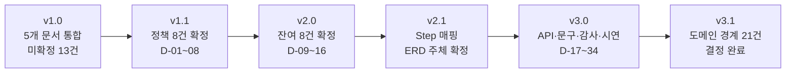

**미확정이 13건에서 0건으로 줄었고, 그 과정에서 결정 34건이 근거와 함께 기록됐습니다.**


## 발표에 쓸 만한 결정 5개

RFP §05는 *"모호하거나 명세에 없던 부분에 대한 팀의 자율 결정과 그 근거"*를 발표 필수 항목으로 둡니다.
아래 5개가 설명하기 좋습니다.

| 결정 | 왜 흥미로운가 |
|---|---|
| **DEC-01 상태 2분할** | RFP가 "단일 enum이든 분리든 팀 자율"이라고 명시적으로 열어둔 지점. 왜 분리했는지 설명할 수 있다 |
| **D-02 "대기 중"이라는 단어** | 규칙 하나로 네 가지 상황이 자동 처리된 사례. 설계 단순화의 좋은 예 |
| **D-04 취소 경계 = 결제** | RFP의 "계약 체결 이전"이라는 모호한 표현을 실행 가능한 기준으로 바꾼 사례 |
| **D-08 목록 기본 노출** | 레퍼런스(위시켓)와 **다르게** 결정한 사례. 근거를 대며 참고와 복제를 구분한 예 |
| **D-12 기술 32종** | "너무 세분화하지 말라"는 지침을 숫자로 옮긴 사례. 추천 로직이 동작하기 위한 하한이라는 논리 |
| **D-20 서버가 판정을 내려준다** | 같은 규칙이 두 곳에 있으면 어긋난다는 원칙을 API 설계에 적용한 사례 |
| **D-28 감사로 찾은 결함** | 문서를 다 쓴 뒤 **표로 교차 검증**해서 실제 결함을 찾아낸 사례. 설계 검증 방법론으로 설명 가능 |

---

*문서 끝 — v6.0 FINAL.*
*미확정 0건 · 공란 0건 · **구현 블로커 0건**. `권장안 확정` 항목은 임의 변경 가능하며, 변경 시 부록 E에 기록한다.*
*ERD가 바뀌면 §6.12만 고친다. 계약은 번호가 아니라 함수명으로 부른다.*
