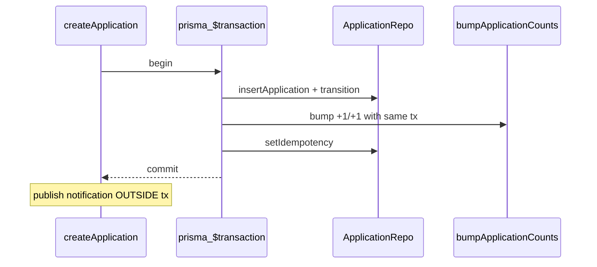

# R-001 합의 · 팀장 이식 지시서 — 지원 행↔건수 단일 트랜잭션 (2026-09-20)

| | |
|---|---|
| 받는 사람 | 팀장 (app 통합) |
| 보내는 사람 | 조준영 (applications) |
| 근거 | [ADR-0015 §4 R-001](../../../docs/decisions/0015-qa-improvement-and-risk-register.md) · [applications-r001.md](../../../feedback_loop/2026-09-11/applications-r001.md) |
| 목적 | INSERT(`applications`) + `bumpApplicationCounts`(`projects`)를 **하나의 Prisma `$transaction`**으로 묶어 중간 실패 시 건수 drift를 제거 |
| 상태 | **합의 요청** — ADR은 “운영 전환 시 app 통합”으로 이미 결정. 본 문서는 구현 범위·경계를 고정한다 |

---

## 1. ADR과의 관계 (합의)

ADR-0015:

> PRD QA에서는 허용. 운영 전환 시 repository가 transaction context를 받는 단일 유스케이스로 승격.  
> **기능 담당자에게 재작업을 요청하지 않고 app 통합 작업으로 추적.**

이번 착수는 **담당자 재구현이 아니라 팀장 app 통합 작업의 착수 스펙**이다.
원본 `features/applications/prototype` 계약·Mock 동작은 바꾸지 않는다.

## 2. 현재 호출 순서 (문제)

[`application.service.ts` `createApplication`](../../../app/server/src/features/applications/application.service.ts):

1. `repository.insertApplication(row)`
2. `recordTransition(...)`
3. `projectContext.bumpApplicationCounts(+1/+1)` — PM [`project-contract.service.ts`](../../../app/server/src/features/project-management/project-contract.service.ts)
4. `setIdempotency` · 알림 publish

각 단계가 **별도 DB 커밋**이다. bump 실패 시 행만 남고 `applicationCount`가 안 오른다
(9/11에 try/catch 삼킴은 제거했지만, 원자성은 아직 없다).

DIRECT 거절의 `pendingApplicationCount: -1`도 동일 패턴.

## 3. 권장 구현 (팀장)

1. **공유 클라이언트:** `getPrismaClient().$transaction(async (tx) => { ... })`
2. **포트 확장 (최소):**
   - `ApplicationRepository.insertApplication(row, tx?)`
   - `ProjectApplicationContextPort.bumpApplicationCounts(id, delta, tx?)`
   - PM `repo.update` / applications Prisma repo가 `tx`를 받으면 같은 커넥션 사용
3. **트랜잭션 밖:** `publish(APPLICATION_SUBMITTED)` — 알림 실패가 지원 커밋을 롤백하지 않는 기존 정책 유지 (ADR-0015 알림 절)
4. **거절 경로:** DIRECT reject의 pending −1도 같은 패턴으로 묶을지 — **create와 함께 1차로**, accept/마감은 PM 내부 트랜잭션이 이미 건수를 다루므로 이번 범위 밖

## 4. 비범위

- A-02 프로필 게이트 켜기
- 시드 orphan 행 일괄 삭제 (선택 정리)
- prototype Mock을 트랜잭션 API로 바꾸기

## 5. 완료 조건

- [ ] create: INSERT+bump(+idempotency) 동일 `$transaction`
- [ ] DIRECT reject: status 변경 + pending −1 동일 `$transaction` (1차 권장)
- [ ] bump 중간 throw 시 지원 행·건수 모두 롤백되는 단위 테스트 또는 격리 probe 1건
- [ ] `npx tsx features/applications/prototype/run.tsx` PASS 유지
- [ ] `node features/applications/review/applications-api-smoke.mjs` PASS

## 6. 담당자 후속

지시서 머지·팀장 반영 후 조준영은 prototype/계약 정합만 확인한다. app/ 직접 수정은 팀장.
