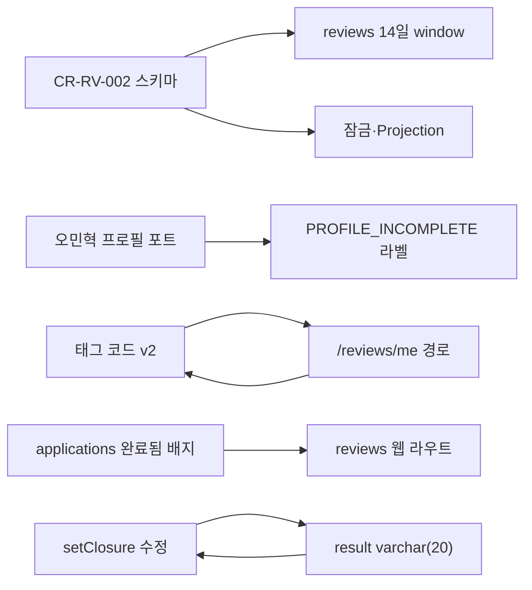

# 대기 현황판 — 2026-09-09

| | |
|---|---|
| 보내는 사람 | 조준영 · applications · contracts-payments · reviews |
| 범위 | 내 세 기능에서 **다른 사람 손을 기다리는 것 전부** |
| 정본 | 이 파일. Increment 밖 외부 대기는 [external-wait-2026-08-31.md](external-wait-2026-08-31.md) |

내 원본(`features/*/prototype/`)은 세 기능 모두 완성·검증까지 끝났습니다 — applications 97 ·
reviews 69 · contracts-payments 347 전부 통과. 아래는 **내가 더 만들 것이 없고 남의 손을
기다리는 항목**만 모았습니다. 흩어져 있어 누가 무엇을 막고 있는지 안 보였기에 한 곳에
둡니다.

세부 지시는 기능별 이식 지시서에 파일·줄 단위로 적어 두었습니다.
[applications](../../applications/review/teamlead-port-instructions-2026-09-09.md) ·
[contracts-payments](teamlead-port-instructions-2026-09-09.md) ·
[reviews](../../reviews/review/teamlead-port-instructions-2026-09-09.md)

---

## 지금 사용자에게 증상이 보이는 것 (먼저 봐 주세요)

| # | 증상 | 원인 | 담당 |
|---|---|---|---|
| 1 | 지원 건수가 **항상 0**. 지원자가 있어도 예산·일정 잠금이 안 걸림 | `application_count` 쓰기 포트 없음 (CR-AP-001) | 유동우 |
| 2 | 모집 중인 예약 프로젝트에 지원하면 **409 「모집이 마감되었습니다」** | 협상 컨텍스트가 저장값을 그대로 줌 (CR-AP-003) | 유동우 |
| 3 | 결제·정산·취소·합의 **4화면이 「프로젝트」로 표시** | `projectTitle`이 빈 문자열 (CR-CP-001) | 유동우 |
| 4 | **리뷰를 써도 평점이 갱신되지 않음** | `REVIEW_CREATED` 소비자 없음 | 오민혁 |
| 5 | 프로필 미완성인데 **지원이 통과**. 안내도 안 뜸 | `ProfileCompletionPort` 제공자 없음 | 오민혁 |
| 6 | 마감·취소 재진입에서 **깨진 값 반환** | `setClosure`가 스칼라 컬럼에 객체를 넣음 | 팀장 |
| 7 | 화면에 **폐기된 리뷰 태그**가 뜸. 새 코드는 422 | `app/`이 구 E-19 코드 | 팀장 |
| 8 | **프리랜서가 리뷰 화면에 갈 경로 없음** | 「완료됨」 배지·CTA 미이식 | 팀장 |
| 9 | 되돌릴 수 없는 **지원 제출·거절에 확인이 없음** | 시안의 확인 다이얼로그 미이식 | 팀장 |
| 10 | 납품 파일 정보가 **항상 `delivery.zip` · 0 bytes** | `prepareDeliveryUpload`가 파일 정보를 안 받음 | 팀장 |
| 11 | 승인된 납품 **「다운로드」가 404** | `downloadUrl` 경로가 라우터에 없음 | 팀장 |
| 12 | 프로젝트 취소가 **계약 무효화까지 안 감** | `ContractsPort`가 FAILED 스텁 | 팀장 |
| 13 | 평균 평점이 **`4.454545…`로 내려감** | `displayAverageRating` 미이식 | 팀장 |
| 14 | 리뷰 **작성 기한이 지나도 통과**. 공개일이 사람마다 다름 | 14일 판정이 리뷰 `createdAt` 기준 | 팀장 |

---

## 유동우 (project-management) — 3건

세 건 모두 CR을 올려 두었고 **전부 `제안` 상태**입니다. 확인 질문표가 비어 있습니다.

| CR | 요청 | 상태 |
|---|---|---|
| [CR-AP-001](../../applications/change-requests/0001-application-count-write-port.md) | `application_count`·`pending_application_count` 쓰기 포트 | `반영중` |
| [CR-AP-003](../../applications/change-requests/0003-negotiation-context-effective-recruitment-status.md) | `getProjectNegotiationContext`가 규칙 14 보정값 반환 · `updateProject` 재계산 · 시작일 KST 변환 | `제안` |
| [CR-CP-001](../change-requests/0001-negotiation-context-title.md) | 같은 함수 응답에 `title` 추가 | `제안` |

**CR-AP-003과 CR-CP-001은 같은 함수를 고칩니다.** 한 번에 처리하시는 편이 낫습니다.

---

## 오민혁 (user-management) — 3건

| 항목 | 내가 제공한 것 | 남은 것 |
|---|---|---|
| `REVIEW_CREATED` 소비 | 발행 + `getPublishedRatingAggregate` 집계 | `users` 평점 캐시 UPDATE |
| 프로필 완성도 | `ProfileCompletionPort` 인터페이스가 `app/`에 있음 | 제공자 구현 (`profileCompletion`이 `null` 고정) |
| `userExists` | — | 임시 캐시라 재시작 후 오판 가능. reviews 평점 조회가 `USER_NOT_FOUND`로 잘못 날 수 있음 |

프로필 항목은 **applications 화면의 `PROFILE_INCOMPLETE` 라벨을 막고 있습니다.** 포트가
붙기 전에는 라벨만 넣어도 사유가 내려오지 않습니다.

---

## 팀장 — `app/` 이식

`app/AGENTS.md`:5에 따라 제가 커밋하지 않는 영역입니다. 지시서에 교체 전후 코드까지
적었습니다.

### applications (10건)

우선순위 1 = `setClosure` 결함. 2 = 확인 다이얼로그 2건. 3 = 라벨·문구 4건. 4 = operation
폴링. 스키마 2건은 [CR-AP-004](../../applications/change-requests/0004-operation-step-uniqueness-closure-result-type.md).

`application_closures.result` 타입 변경은 `setClosure` 수정과 **같이 가야 합니다** — 컬럼만
바꾸면 컴파일되지 않습니다. `(operation_id, name)` 유니크는 코드 변경이 필요 없고 급하지
않습니다.

### reviews (한 건의 재이식)

**`app/`이 2026-09-05 이식본에서 멈춰 설계서 v2.0 계약이 반영되지 않았습니다.** 태그 코드 ·
필드(`content`·`visibility`·`editable`) · 에러 코드 7종 · 경로 3개 · 14일 window ·
`displayAverageRating` · 잠금·Projection · 웹 라우트 · 확인 모달. 개별로 쪼개면 15건이고
서로 물려 있습니다.

두 가지 순서만 지켜 주세요.

- **태그 코드와 `/reviews/me`는 같이** — 경로가 없으면 웹이 태그 10종을 전부 노출한 채라
  사용자가 자기 방향이 아닌 태그를 골랐다가 거부당합니다
- **웹 라우트 `/reviews`는 applications 「완료됨」 배지와 같이** — 한쪽만 고치면 링크가
  깨집니다

### contracts-payments (8건)

파일 메타 · 다운로드 404 · `retrievePayment` 호출부 · 웹훅 수신부 · 멱등 본문 비교 2경로 ·
멱등 캐시 영속화 · `ContractsPort` 배선. 스키마는
[CR-CP-002](../change-requests/0002-payment-fee-snapshot-columns.md).

### 회신만 필요한 것 (3건)

- **단독 공개 14일 확정** — reviews `spec.md:54` 규칙 6이 아직 `(ASSUMPTION)`.
  `external-wait` §2의 T1·T2가 8/26 요청 이후 빈칸. 다른 일수면 상수 1곳만 바꿉니다
- **알림 4종 발송** — `external-wait` §4의 Y1~Y5가 빈칸. 저는 `publish*`만 합니다
- **`REVIEW_REQUESTED` 발송** — 규칙 12대로 발행만 제 몫. 어댑터가 큐에 쌓기만 해 거래
  완료 후 리뷰 요청 알림이 가지 않습니다
- **멱등 키 길이** — 스키마는 `varchar(160)`, CR-CP-002는 120으로 제안. 한쪽으로 정해
  주시면 맞추겠습니다

---

## 차단 관계

양방향 화살표는 **같이 가야 하는 짝**입니다. 한쪽만 반영하면 그 사이에 깨집니다.

## 손대지 않는 것 (Increment 밖 합의)

정산 `RELEASED` 공개 트리거 · outbox worker·스케줄러 · `publishDueSoloReviews` 배치 ·
내부 합계 HTTP · PG 환불·`REFUNDED`·에스크로 · 실저장소·실AV · 제안 철회 · 납품 반려·재납품

## 닫힌 것

- **Toss sandbox 키** — 2026-09-09 수신 확인. `app/`은 실 연동
  (`express-app.ts:426~435`). 내 `prototype/`은 Mock이라 스텁 유지
- **feedback_loop 열린 항목 0건** — 2026-09-05·09-07·09-08 세 날짜의 내 항목 전부
  `반영완료`. `재이슈`·`미확인` 없음
