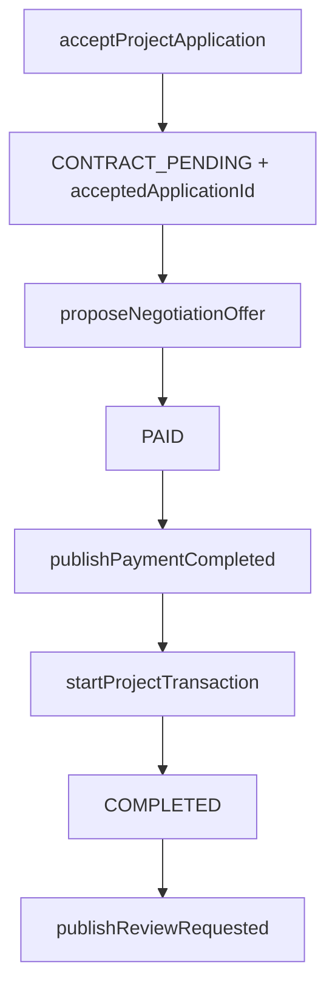

# 접점 계약 — 알림 포트 · 수락 손잡이

| | |
|---|---|
| 받는 사람 | 팀장 · notifications / 조준영 · applications |
| 보내는 사람 | 조준영 · contracts-payments |
| 날짜 | 2026-08-31 |
| 갱신 | 2026-09-03 알림=팀장, 지원=조준영 |
| 정본 | 이 파일. 타입은 `prototype/server/notification.port.ts` · `accepted-application-handoff.ts` |
| 목적 | **맞출 계약**. 구현 요청이 아니다. `features/notifications/`는 조준영이 채우지 않는다 |
| import | `prototype/index.ts` — `createPublicApiMock` · `AcceptedApplicationHandoff` · `NotificationTriggerPort` |

조준영은 `publish*`만 호출한다. 발송·Kakao·`create*Notification`은 **팀장**이다.
지원 수락은 **조준영** (`features/applications/`).
포트가 throw해도 `PAID`·`COMPLETED`는 되돌리지 않는다 (PRD §5.6).

---

## Discord

조준영(contracts-payments)입니다. 알림 발송은 팀장님 담당입니다. 구현 요청이 아니라 **맞출 계약**입니다. (1) 조준영은 `publishPaymentCompleted` · `publishReviewRequested`를 Mock에서 발행합니다. `publishDeliveryRequested` · `publishDeliveryApproved`는 시그니처만이고 납품 Increment 전엔 호출하지 않습니다. (2) 발송·Kakao·`create*Notification`은 팀장입니다. (3) 포트 throw여도 결제 `PAID`·거래 `COMPLETED`는 유지합니다. (4) 합의 진입은 `AcceptedApplicationHandoff` — `acceptedApplicationId`가 있고 `transactionStatus === CONTRACT_PENDING`일 때만. 지원 수락은 조준영입니다. 정본: `features/contracts-payments/review/yoonseok-ports-contract.md`.

---

## 1. NotificationTriggerPort

| 함수 | 시점 | 수신 | Increment 1 |
|---|---|---|---|
| `publishPaymentCompleted` | `payments.status → PAID` 직후 | 프리랜서 | Mock 발행 |
| `publishReviewRequested` | `transactionStatus → COMPLETED` 직후 양쪽 1회 | 당사자 | Mock 발행 |
| `publishDeliveryRequested` | `delivery_status → DELIVERY_REQUESTED` | 의뢰인 | 시그니처만 |
| `publishDeliveryApproved` | `delivery_status → APPROVED` | 프리랜서 | 시그니처만 |

`REVIEW_REQUESTED`는 작성 가능 시점이다. 리뷰 공개·`REVIEW_CREATED`(오민혁)와 다르다.

```ts
publishPaymentCompleted(event: {
  type: "PAYMENT_COMPLETED";
  projectId: string;
  paymentId: string;
  freelancerId: string;
  occurredAt: string;
}): Promise<void>;

publishReviewRequested(event: {
  type: "REVIEW_REQUESTED";
  projectId: string;
  clientId: string;
  freelancerId: string;
  occurredAt: string;
}): Promise<void>;
```

팀장 쪽 대응 이름은 naming §10: `createPaymentCompletedNotification` · `createReviewRequestedNotification`.
Kakao 키는 팀장(notifications) 범위다.

---

## 2. AcceptedApplicationHandoff

2026-08-26 회신 A1–A4 전부 예. 2026-09-03 조준영이 손잡이·S1·S2를 예로 닫았다.
`features/applications/` 원본은 조준영. `app/`은 팀장.

```ts
type AcceptedApplicationHandoff = {
  projectId: string;
  acceptedApplicationId: string;
  transactionStatus: "CONTRACT_PENDING";
};
```

`proposeNegotiationOffer`는 이 손잡이가 있을 때만 들어간다. start 본문에는 `acceptedApplicationId`를 다시 싣지 않는다 (A2). 수락 전 null이면 진입하지 않는다 (A3). 프로젝트당 수락 1건 (A4).

시드 `prj_alive`는 수락 → 잔여 거절 → 알림이 끝난 상태다 (A1).

---

## 3. 호출 순서 (수락 → 결제 → 리뷰)

알림 발송 구현 때 팀장이 이 순서를 따른다. 조준영은 `publish*`만 호출하고 `features/notifications/`는 채우지 않는다.
지원 수락(1~3)은 조준영. 납품 2종은 시그니처만 유지한다. Y1·Y3·Y4·Y5는 팀장 회신 전제.



| # | 누가 | 무엇 | 상태 |
|---|---|---|---|
| 1~3 | 조준영 | 수락 → 잔여 거절 → 알림 발행 | `AcceptedApplicationHandoff` |
| 4 | 조준영 | `proposeNegotiationOffer` | 손잡이 있을 때만 |
| 5 | 조준영 | `acceptNegotiationOffer` | 합의 `ACCEPTED` · 계약 `DRAFT` |
| 6 | 조준영 | `signContract` 양쪽 | 계약 `SIGNED` |
| 7 | 조준영 | `markPaymentPending` → confirm | 결제 `PAID` |
| 8 | 조준영 발행 / 팀장 발송 | `publishPaymentCompleted` | `PAID` 직후. throw여도 유지 |
| 9 | 조준영 → 유동우 | `startProjectTransaction` | `IN_PROGRESS` |
| 10 | Increment 밖 | `publishDeliveryRequested` · `publishDeliveryApproved` | **시그니처만. 호출하지 않음** |
| 11 | 조준영 → 유동우 | `completeProjectTransaction` (I-30: `APPROVED` ∧ `RELEASED`) | `COMPLETED` |
| 12 | 조준영 발행 / 팀장 발송 | `publishReviewRequested` 양쪽 1회 | `COMPLETED` 직후. 공개·`REVIEW_CREATED` 아님 |

`REVIEW_REQUESTED`는 작성 가능 시점이다. 리뷰 공개·오민혁 `REVIEW_CREATED`와 다르다.

import 예는 `review/mock-stub-import-guide.md` 알림·손잡이 절.

---

## 확인 (회신 후 spec 한 줄)

| # | 질문 | 예 | 아니오 | 메모 |
|---|---|---|---|---|
| Y1 | `PAYMENT_COMPLETED` = `PAID` 직후, 수신 프리랜서 | | | 팀장 |
| Y3 | `REVIEW_REQUESTED` = `COMPLETED` 직후 양쪽 1회. 공개 시점이 아님 | | | 팀장 |
| Y4 | 조준영 `publish*`, 팀장 `create*Notification` | | | 팀장 · 함수명 |
| Y5 | 알림 실패는 결제·완료를 되돌리지 않는가 | | | 팀장 · PRD 확정 |
| A1 | 수락 → 잔여 거절 → 알림 후에만 합의 진입 | 예 | | 조준영 2026-09-03. 2026-08-26 예 유지 |
